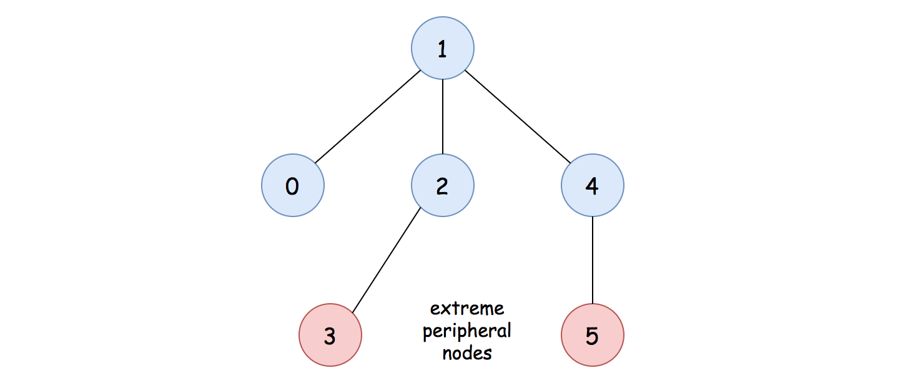
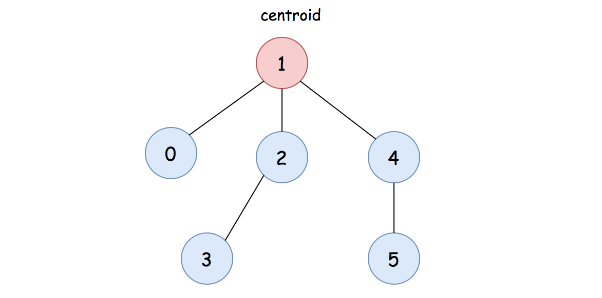
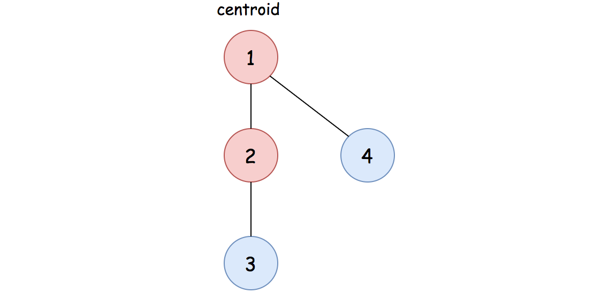
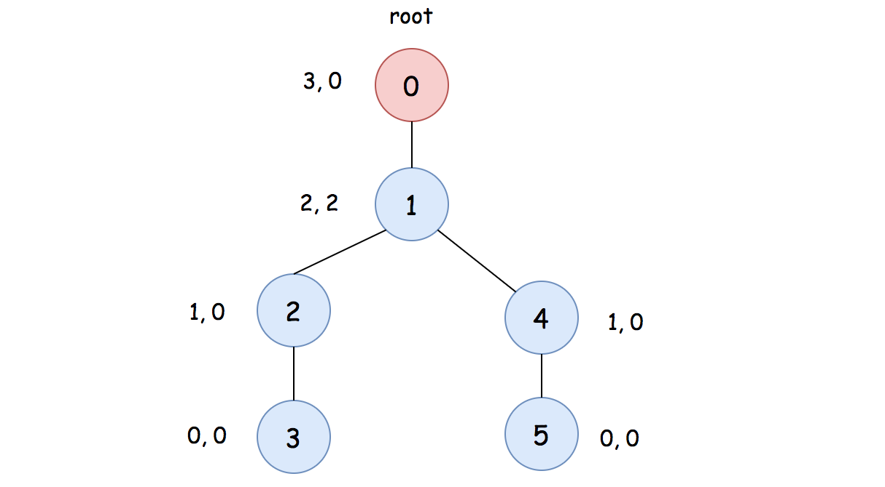

## Solution

---

### Overview

In this article, we will present three approaches: two are in BFS and one in DFS.

As a spoiler alert, if one has solved any of the following problems, one would have a head start to solve this problem.
On the other hand, solving this problem would also help one to solve the following problems.

- [Minium Height Tree](https://leetcode.com/problems/minimum-height-trees/)

- [Diameter of N-ary Tree](https://leetcode.com/problems/diameter-of-n-ary-tree/)

---

### Approach 1: Farthest Nodes via BFS

#### Intuition

In this first approach, let us follow the hints of the problem, which suggest us to run BFS _(Breadth-First Search)_ for two rounds.
For those of you who are not familiar with the concept of BFS, we would recommend one to check out our [Explore card](https://leetcode.com/explore/learn/card/queue-stack/231/practical-application-queue/) about BFS.

In the problem, we are asked to find the **_diameter_** of the graph, which by definition is the **distance** between two nodes that are the farthest apart.

>According to the definition, the problem could be solved if we could **identify** the two nodes that have the longest distance among all.
Let us refer to these two nodes as the **extreme peripheral** nodes.

First of all, we assert that starting from any node in the graph, if we run a BFS traversal, the **last** node that we visit would be one of the extreme nodes.
An intuition that supports the above assertion is that as an extreme peripheral node, it should be the one that is far away from any of the other nodes in the graph.
Given any node, the longest distance that starts from this node must end with one of the extreme peripheral nodes.



Once we identify one of the extreme peripheral nodes, we then could apply again the BFS traversal.
But this time, we would start from the identified extreme peripheral node.
At the end of the second BFS traversal, we would land on another extreme peripheral node.
The distance that we traverse would be the **diameter** of the graph, according to the definition.

#### Algorithm

Following the above intuition, the main algorithm is to find two _extreme peripheral_ nodes via **BFS** traversal.

Let us define a function called `bfs(start)` which returns two results: **1).** the farthest node starting from the `start` node; **2).** the distance between the start and the farthest nodes.

As the name suggests, we could apply the BFS (Breadth-First Search) traversal to implement the above function.

Once the `bfs(start)` is implemented, we simply invoke it **twice** to solve the problem.
In the first invocation, we would obtain one of the extreme peripheral nodes.
With the obtained peripheral node, we then invoke the function again to obtain the other extreme peripheral node and more importantly the distance between the two extreme peripheral nodes.

#### Implementation

```python
class Solution:
    def treeDiameter(self, edges: List[List[int]]) -> int:

        # build the adjacency list representation of the graph
        graph = [set() for i in range(len(edges)+1)]
        for edge in edges:
            u, v = edge
            graph[u].add(v)
            graph[v].add(u)

        def bfs(start):
            """
             return the farthest node from the 'start' node
               and the distance between them.
            """
            visited = [False] * len(graph)

            visited[start] = True
            queue = deque([start])
            distance = -1
            last_node = start
            while queue:
                next_queue = deque()
                while queue:
                    next_node = queue.popleft()
                    for neighbor in graph[next_node]:
                        if not visited[neighbor]:
                            visited[neighbor] = True
                            next_queue.append(neighbor)
                            last_node = neighbor
                distance += 1
                queue = next_queue

            return last_node, distance

        # 1). find one of the farthest nodes
        farthest_node, distance_1 = bfs(0)
        # 2). find the other farthest node
        #  and the distance between two farthest nodes
        another_farthest_node, distance_2 = bfs(farthest_node)

        return distance_2
```

#### Complexity Analysis

Let $N$ be the number of nodes in the graph, then the number of edges in the graph would be $N-1$ as specified in the problem.

- Time Complexity: $\mathcal{O}(N)$

- First we iterate through all edges to build an adjacency list representation of the graph.
    The time complexity of this step would be $\mathcal{O}(N)$.

- In the main algorithm, we perform the BFS traversal twice on the graph.
    Each traversal will take $\mathcal{O}(N)$ time, where we visit each node once and only once.

- To sum up, the overall time complexity of the algorithm is $\mathcal{O}(N) + 2 \cdot \mathcal{O}(N) = \mathcal{O}(N)$.

- Space Complexity: $\mathcal{O}(N)$

- We used an adjacency list representation for the graph, whose space would be proportional to the total number of nodes and edges in the graph.
    Since the graph is undirected (_i.e._ the edge is bi-directional), the number of neighbors in the adjacency list would be twice the number of edges.
    Therefore, the space needed for the graph would be $\mathcal{O}(N + 2 \cdot N) = \mathcal{O}(N)$.

- During the BFS traversal, we used an array to indicate the state of each node (whether it is visited or not).
    This array would consume $\mathcal{O}(N)$ space.

- During the BFS traversal, in addition, we used some queues to keep track of the nodes to be visited at each level (_i.e._ hop).
    At any given moment, we will keep no more than two levels of nodes in the queues.
    In the worst case, the queue could cover almost all nodes in the graph.
    As a result, the space complexity of the queues would be $\mathcal{O}(N)$.

- To sum up, the overall space complexity of the algorithm is $\mathcal{O}(N) + \mathcal{O}(N) + \mathcal{O}(N) = \mathcal{O}(N)$.

---

### Approach 2: Centroids of Graph via BFS

#### Intuition

Another concept that is closely related to the concept of diameter is called **centroid**.
Intuitively, the centroid nodes are the ones that are situated in the center of a graph.
More precisely, the distance from the centroid to other nodes in the graph should be _overall_ minimal, which is the opposite of the _extreme peripheral_ nodes that we defined before.

>Indeed, if we could identify the centroid of a graph, then the distance from this centroid to any of its extreme peripheral nodes would be **_half_** of the diameter of the graph.

By identifying the centroids nodes in a tree-alike graph, we could solve another similar problem called [Minimum Height Tree](https://leetcode.com/problems/minimum-height-trees/).

There would be either **one** or **two** centroids in a tree-alike graph, and one can find a detailed proof in the solution of the [Minimum Height Tree](https://leetcode.com/problems/minimum-height-trees/solution/).



- In the above example where there is only one centroid, the diameter would be exactly twice of the distance between the centroid and any of extreme peripheral nodes (_i.e._ node `3` and node `5`).



- In the above example where there are two centroids, the diameter would be one plus the distance between a pair of centroid and extreme peripheral node, by taking into account the distance between the two centroids.

#### Algorithm

In order to identify the centroids, we could apply the [topological sorting](https://en.wikipedia.org/wiki/Topological_sorting) algorithm here.
The main idea is that we start from the peripheral nodes (which are also known as leaf nodes), then we trim the nodes off layer by layer, as if we are peel an _"onion"_ till we reach its core (_i.e._ centroids).

Again, one can find more details in the [solution of Minium Height Tree](https://leetcode.com/problems/minimum-height-trees/solution/).
Here we present a sample implementation.

Note that, one particularity of our _topological sorting_ algorithm here is that while we trim off the nodes layer by layer, we count the number of steps for us to reach the centroids.
The number of steps is also the distance between the centroids and the peripheral nodes, which is essential for the calculation of diameter.

#### Implementation

```python
class Solution:
    def treeDiameter(self, edges: List[List[int]]) -> int:

        # build the adjacency list representation of the graph.
        graph = [set() for i in range(len(edges)+1)]
        for edge in edges:
            u, v = edge
            graph[u].add(v)
            graph[v].add(u)

        # find the outer most nodes, _i.e._ leaf nodes
        leaves = []
        for vertex, links in enumerate(graph):
            if len(links) == 1:
                leaves.append(vertex)

        # "peel" the graph layer by layer,
        #   until we have the centroids left.
        layers = 0
        vertex_left = len(edges) + 1
        while vertex_left > 2:
            vertex_left -= len(leaves)
            next_leaves = []
            for leaf in leaves:
                # the only neighbor left on the leaf node.
                neighbor = graph[leaf].pop()
                graph[neighbor].remove(leaf)
                if len(graph[neighbor]) == 1:
                    next_leaves.append(neighbor)
            layers += 1
            leaves = next_leaves

        return layers * 2 + (0 if vertex_left == 1 else 1)
```

In certain sense, we could also consider the above _topological sorting_ as a sort of **_BFS Traversal_**, where we traverse the graph from the outer most layer of the graph (_i.e._ leaf nodes), _level by level_, into its inner most layer (_i.e._ centroids).

#### Complexity Analysis

Let $N$ be the number of nodes in the graph, then the number of edges in the graph would be $N-1$ as specified in the problem.

- Time Complexity: $\mathcal{O}(N)$

- First we iterate through all edges to build an adjacency list representation of the graph.
    The time complexity of this step would be $\mathcal{O}(N)$.

- In the main algorithm, we peel the graph until there are only centroids left.
    During the traversal, we visit each node once and only once.
    As a result, it will take $\mathcal{O}(N)$ time.

- To sum up, the overall time complexity of the algorithm is $\mathcal{O}(N) + \mathcal{O}(N) = \mathcal{O}(N)$.

- Space Complexity: $\mathcal{O}(N)$

- Similar to the previous approach, we used an adjacency list to keep the graph, whose space complexity is $\mathcal{O}(N)$ as we discussed before.

- During the topological sorting, we used some queues to keep track of the leaf nodes to be visited at each layer.
    At any given moment, we will keep no more than two levels of nodes in the queues.
    In the worst case, the queue could cover almost all nodes in the graph.
    As a result, the space complexity of the queues would be $\mathcal{O}(N)$.

- To sum up, the overall space complexity of the algorithm is $\mathcal{O}(N) + \mathcal{O}(N) = \mathcal{O}(N)$.

---

### Approach 3: DFS (Depth-First Search)

#### Intuition

We applied the BFS strategy in the first approach to solve the problem.
As is often the case, we could also apply another common strategy called **DFS** ([Depth-First Search](https://leetcode.com/explore/learn/card/queue-stack/232/practical-application-stack/)).
This happens to be the case for this problem as well.

One can take the inspiration from another similar problem called [Diameter of N-ary Tree](https://leetcode.com/problems/diameter-of-n-ary-tree/).
At the first glance, one might even consider them as the same problem.

>Actually, the only difference between them lies in the **input**.
In this problem, our input is a list of bi-directional edges, which we could convert into a representation of **Graph**;
While for the problem of [Diameter of N-ary Tree](https://leetcode.com/problems/diameter-of-n-ary-tree/), the input is a **Tree** data structure, where the edges are uni-directional.

First of all, we will use the concepts of **_leaf nodes_** and **parent nodes** as in a Tree data structure.
For a parent node, if we could obtain **two longest distances** (denoted as `t1` and `t2`) starting from this parent node to any of its descendant leaf nodes, then the **_longest path_** that traverse this parent node would be $t1 + t2$.

Since any node in the graph has the potential to be part of the **path** that forms the diameter of the graph,
we can iterate through each node to obtain all the **_longest paths_** as we defined shortly before.
The **_diameter_** of the graph would be the maximum among all the longest paths that traverse each node.

Here we show an example where we assume the node `0` in the graph as the root node.



As shown in the above example, we also indicate two longest distances for each node.
Note that, if a parent node has only one child node, then it can only have one longest distance to the leaf nodes.
The second longest distance for this parent node would be zero.
By adding the two longest distances together for each node, we would know that the node `1` has the longest path (_i.e._ with distance of `4`) among all.

#### Algorithm

Given the above intuition, we could apply the DFS (Depth-First Search) strategy to obtain the **longest** path that traverse each node.

During the DFS traversal, we would also update the diameter with the longest path that we obtain at each node.

- First of all, we could convert the input edges into the adjacency list, which this time we would treat as Tree, rather than Graph.
We assume the node with the index of `0` as the root node.

- We then define a function named `dfs(curr, visited)` which returns the maximal distance starting from the `curr` node to any of its descendant leaf nodes.
The `visited` parameter is used to keep track of the nodes that we've visited so far.

- Within the function of `dfs(curr, visited)`, we will obtain the top two maximal distances starting from the `curr` node.
With these top two distances, we can then update the global `diameter` that we've seen so far.

- Once we traverse the entire tree once and only once, we will obtain the `diameter` of the tree/graph.

#### Implementation

```python
class Solution:
    def treeDiameter(self, edges: List[List[int]]) -> int:

        # build the adjacency list representation of the graph.
        graph = [set() for i in range(len(edges)+1)]
        for edge in edges:
            u, v = edge
            graph[u].add(v)
            graph[v].add(u)

        diameter = 0

        def dfs(curr, visited):
            """
                return the max distance
                  starting from the 'curr' node to its leaf nodes
            """
            nonlocal diameter

            # the top 2 distance starting from this node
            top_1_distance, top_2_distance = 0, 0

            distance = 0
            visited[curr] = True

            for neighbor in graph[curr]:
                if not visited[neighbor]:
                    distance = 1 + dfs(neighbor, visited)

                if distance > top_1_distance:
                    top_1_distance, top_2_distance = distance, top_1_distance
                elif distance > top_2_distance:
                    top_2_distance = distance

            # with the top 2 distance, we can update the current diameter
            diameter = max(diameter, top_1_distance + top_2_distance)

            return top_1_distance

        visited = [False for i in range(len(graph))]
        dfs(0, visited)

        return diameter
```

#### Complexity Analysis

Let $N$ be the number of nodes in the graph, then the number of edges in the graph would be $N-1$ as specified in the problem.

- Time Complexity: $\mathcal{O}(N)$

- First we iterate through all edges to build an adjacency list representation of the graph, which we will treat as a tree with node `0` as the root node.
    The time complexity of this step would be $\mathcal{O}(N)$.

- In the main algorithm, we traverse the tree/graph via DFS.
    During the traversal, we visit each node once and only once.
    As a result, it will take $\mathcal{O}(N)$ time.

- To sum up, the overall time complexity of the algorithm is $\mathcal{O}(N) + \mathcal{O}(N) = \mathcal{O}(N)$.

- Space Complexity: $\mathcal{O}(N)$

- Similar to the previous approach, we used an adjacency list to keep the graph, whose space complexity is $\mathcal{O}(N)$ as we discussed before.

- During the DFS traversal, we used an array (`visited`) to keep track of the nodes we visited so far.
    The space complexity of the array is $\mathcal{O}(N)$.

- Since we apply recursion in the DFS traversal, which will incur additional memory consumption in the function call stack.
    In the worst case where all the nodes are chained up as a line, starting from the root node, the memory consumption for the call stack would be $\mathcal{O}(N)$.

- To sum up, the overall space complexity of the algorithm is $\mathcal{O}(N) + \mathcal{O}(N) + \mathcal{O}(N) = \mathcal{O}(N)$.

---