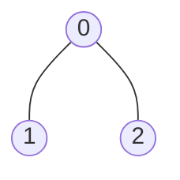
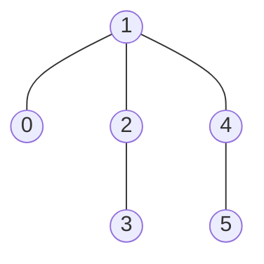

## Examples

**Example 1**

- Input: `edges = [[0,1],[0,2]]`
- Output: `2`
- Explanation: The longest path is `1 - 0 - 2`, which contains two edges.

**Example 2**

- Input: `edges = [[0,1],[1,2],[2,3],[1,4],[4,5]]`
- Output: `4`
- Explanation: The longest path is `3 - 2 - 1 - 4 - 5`, which contains four edges.
