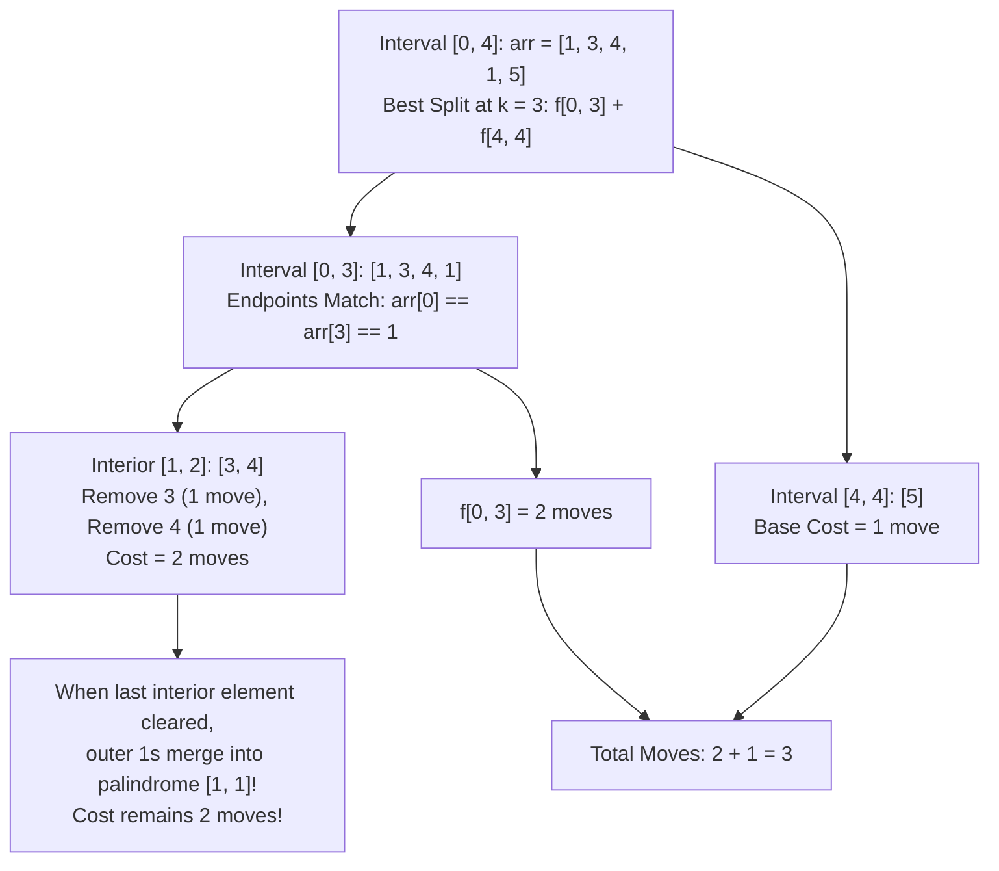

# Guided Example: Palindrome Removal

## 1. Problem Essence & Algorithmic Mental Model

Given an integer array `arr`, we may in a single move select any contiguous subarray that forms a palindrome and delete it. Upon deletion, the remaining elements to the left and right concatenate together seamlessly. We must determine the minimum number of moves required to completely eliminate all elements from the array.

The central challenge lies in the **post-deletion concatenation effect**:
Deleting an interior subarray brings previously separated outer elements into direct contact. If those outer elements match, they can merge to form new palindromic structures!

For example, consider `arr = [1, 3, 4, 3, 1]`:
- The interior `[3, 4, 3]` can be cleared.
- But notice the outer endpoints: both are `1`.
- When the interior reaches its final reduction step (the `4` is removed, leaving `[3, 3]`, which is deleted), the two outer `1`s meet and can be deleted *simultaneously* as part of the surrounding palindrome `[1, 3, 3, 1]`!
- In fact, the entire array `[1, 3, 4, 3, 1]` can be cleared in just **2 moves**:
  1. Remove `4`, leaving `[1, 3, 3, 1]`.
  2. Remove `[1, 3, 3, 1]` as a single palindrome.

```
Interval Deletion Topology:
Case A: Endpoints Match (arr[i] == arr[j])
        [ arr[i] , ... interior ... , arr[j] ]
           │                               │
           └────── Bundled Together ───────┘
Cost = f(i + 1, j - 1)  (The endpoints piggyback on the final interior move!)

Case B: Partition Split (k between i and j - 1)
        [ arr[i ... k] ] + [ arr[k+1 ... j] ]
Cost = f(i, k) + f(k + 1, j)
```

Because an optimal elimination sequence decomposes into nested or adjacent subproblems over contiguous intervals, this problem is governed by **Interval Dynamic Programming**.

---

## 2. Mathematical Formalism & Invariants

Let $A = [a_0, a_1, \dots, a_{n-1}]$ be the input sequence of length $n$.
Define $f(i, j)$ as the minimum number of moves required to completely remove all elements in the slice $A[i \dots j]$ for $0 \le i \le j < n$.

### Base Conditions (Interval Length 1 and 2):
1. **Length 1 ($i = j$):**
   A single element is trivially a palindrome of length 1:
   $$f(i, i) = 1$$
2. **Length 2 ($j = i + 1$):**
   $$f(i, i + 1) = \begin{cases} 1 & \text{if } a_i = a_{i+1} \\ 2 & \text{if } a_i \neq a_{i+1} \end{cases}$$

### General Recurrence ($j \ge i + 2$):
Two elimination mechanisms are available:
1. **Endpoint Piggybacking:** If $a_i = a_j$, the elements $a_i$ and $a_j$ can be removed concurrently with the very last palindromic deletion that clears the interior interval $A[i+1 \dots j-1]$:
   $$f_{\text{piggyback}}(i, j) = f(i + 1, j - 1)$$
   *(If $a_i \neq a_j$, this transition is unavailable, yielding $\infty$).*
2. **Independent Sub-Interval Partitioning:** The interval can be split into two independent sub-blocks at some boundary $k \in \{i, i+1, \dots, j-1\}$:
   $$f_{\text{split}}(i, j) = \min_{i \le k < j} \big( f(i, k) + f(k + 1, j) \big)$$

Unifying both mechanisms yields the complete recurrence:
$$f(i, j) = \min\left( \mathbb{I}(a_i = a_j) \cdot f(i + 1, j - 1), \; \min_{i \le k < j} (f(i, k) + f(k + 1, j)) \right)$$

---

## 3. Concrete Example Execution & State Evolution

Consider the representative input:
$$\text{arr} = [1, 3, 4, 1, 5]$$
Length $n = 5$. We compute the upper-triangular DP table $f(i, j)$ in order of increasing interval length $L = j - i + 1$.

### Step-by-Step Interval DP Table Evaluation

| Interval $[i, j]$ | Subarray Slice | Endpoints Match? | Endpoint Option $f(i+1, j-1)$ | Optimal Split $\min_k (f[i][k] + f[k+1][j])$ | Selected Minimum $f(i, j)$ |
|---|---|---|---|---|---|
| $[0, 0], [1, 1], \dots$ | Singletons | - | - | - | **1** (Base case) |
| $[0, 1]$ | `[1, 3]` | $1 \neq 3$ | - | $f[0][0] + f[1][1] = 1 + 1$ | **2** |
| $[1, 2]$ | `[3, 4]` | $3 \neq 4$ | - | $f[1][1] + f[2][2] = 1 + 1$ | **2** |
| $[2, 3]$ | `[4, 1]` | $4 \neq 1$ | - | $f[2][2] + f[3][3] = 1 + 1$ | **2** |
| $[3, 4]$ | `[1, 5]` | $1 \neq 5$ | - | $f[3][3] + f[4][4] = 1 + 1$ | **2** |
| $[0, 2]$ | `[1, 3, 4]` | $1 \neq 4$ | - | $\min(1+2, 2+1) = 3$ | **3** |
| $[1, 3]$ | `[3, 4, 1]` | $3 \neq 1$ | - | $\min(1+2, 2+1) = 3$ | **3** |
| $[2, 4]$ | `[4, 1, 5]` | $4 \neq 5$ | - | $\min(1+2, 2+1) = 3$ | **3** |
| $[0, 3]$ | `[1, 3, 4, 1]` | **$1 == 1$ (Match!)** | $f[1][2] = 2$ | Splits: $\min(1+3, 2+2, 3+1) = 4$ | **2** (Piggyback wins!) |
| $[1, 4]$ | `[3, 4, 1, 5]` | $3 \neq 5$ | - | Splits: $\min(1+3, 2+2, 3+1) = 4$ | **4** |
| $[0, 4]$ | `[1, 3, 4, 1, 5]`| $1 \neq 5$ | - | Splits: $k=3 \implies f[0][3] + f[4][4] = 2 + 1 = \mathbf{3}$ | **3** |



### Strategic Verification:
For the full array `[1, 3, 4, 1, 5]`:
- Step 1: Remove `[3]` $\implies$ array becomes `[1, 4, 1, 5]`.
- Step 2: Remove palindromic subarray `[1, 4, 1]` $\implies$ array becomes `[5]`.
- Step 3: Remove `[5]` $\implies$ array becomes empty.
Total moves $= \mathbf{3}$.

---

## 4. Multi-Approach Comparison & Trade-Offs

| Algorithmic Strategy | Greedy Longest Palindrome Stripping | Naive Backtracking Recursion | Bottom-Up Interval DP (Optimal) |
|---|---|---|---|
| **Mechanism** | Find and remove longest palindrome greedy | Explore all palindromic deletions recursively | Fill $f[i][j]$ table by increasing interval length |
| **Optimality** | **Fails** (misses future concatenation synergies) | Optimal, but redundant evaluations | **Guaranteed Optimal** |
| **Time Complexity** | $\mathcal{O}(n^3)$ | $\mathcal{O}(2^n)$ exponential | $\mathcal{O}(n^3)$ polynomial |
| **Auxiliary Memory** | $\mathcal{O}(n)$ | $\mathcal{O}(n)$ recursion depth | $\mathcal{O}(n^2)$ 2D matrix |
| **Execution on $n = 100$**| Fast (but generates wrong answers) | Severe TLE ($> 10^{20}$ years) | $\approx 25\text{ milliseconds}$ |

```
Why Greedy Fails:
Consider arr = [1, 4, 3, 4, 1]
Greedy might remove [4, 3, 4] (len 3) -> leaves [1, 1], then removes [1, 1] (total 2 moves).
Consider arr = [1, 2, 3, 2, 1, 3, 2, 3]
Greedy choice of [1, 2, 3, 2, 1] destroys potential longer concatenations with adjacent 3s and 2s!
Interval DP explores all valid subproblem combinations systematically.
```

---

## 5. Algorithmic Edge Cases & Boundary Analysis

| Boundary Scenario | Example Array | Expected Output | Behavioral Justification |
|---|---|---|---|
| **Array Already a Palindrome** | `[1, 2, 3, 2, 1]` | 1 | Entire array removed in 1 single move. |
| **All Elements Distinct** | `[1, 2, 3, 4, 5]` | 5 | No two elements match; each must be removed individually ($n$ moves). |
| **Length 1 Array** | `[7]` | 1 | Base case: $f[0][0] = 1$. |
| **Identical Elements** | `[2, 2, 2, 2, 2]` | 1 | Entire array forms an identical palindrome; removed in 1 move. |
| **Nested Brackets** | `[1, 2, 3, 3, 2, 1]` | 1 | Symmetric contraction clears all pairs outward from center in 1 move. |

---

## 6. Mathematical Verification & Complexity Derivation

Let $n = |\text{arr}|$ be the number of elements ($1 \le n \le 100$).

### Time Complexity Analysis:
1. **Subproblem Count:**
   - The number of sub-intervals $[i, j]$ with $0 \le i \le j < n$ is:
     $$\frac{n(n + 1)}{2} = \mathcal{O}(n^2) \text{ states}$$
2. **Transition Work per Subproblem:**
   - For an interval of length $L = j - i + 1$:
     - Endpoint check $a_i == a_j$: $\mathcal{O}(1)$.
     - Partition split loop: index $k$ iterates from $i$ to $j - 1$, performing $L - 1$ additions and comparisons.
3. **Total Operation Count:**
   $$\sum_{L=1}^n (n - L + 1) \cdot (L - 1) \approx \int_0^n (n - x) x \, dx = \frac{n^3}{6} = \mathcal{O}(n^3)$$
   For $n = 100$, $\frac{100^3}{6} \approx 166,666$ inner loop iterations, executing in approximately $20\text{ milliseconds}$.

### Space Complexity Analysis:
- The 2D table $f$ requires $n \times n$ integer cells.
- For $n = 100$: $100 \times 100 \times 4 \text{ bytes} \approx 40\text{ KB}$.
- Total auxiliary space is strictly $\mathcal{O}(n^2)$.

---

## 7. Synthesis & Strategic Takeaways

1. **Piggybacking on the Final Operation**: In problems where deleting interior elements brings outer elements together, matching endpoints $a_i = a_j$ do not require an additional move; they merge with the final move that clears the interior, giving $f(i, j) = f(i+1, j-1)$.
2. **Interval DP by Increasing Length**: Iterating outer intervals by increasing length guarantees that all smaller sub-intervals $f(i+1, j-1)$, $f(i, k)$, and $f(k+1, j)$ are fully solved and immutable before computing $f(i, j)$.
3. **Overcoming Greedy Myopia**: Greedy removal of currently visible palindromes ignores the latent value of future concatenations; interval DP retains all optimal sub-state choices, guaranteeing global optimality.
