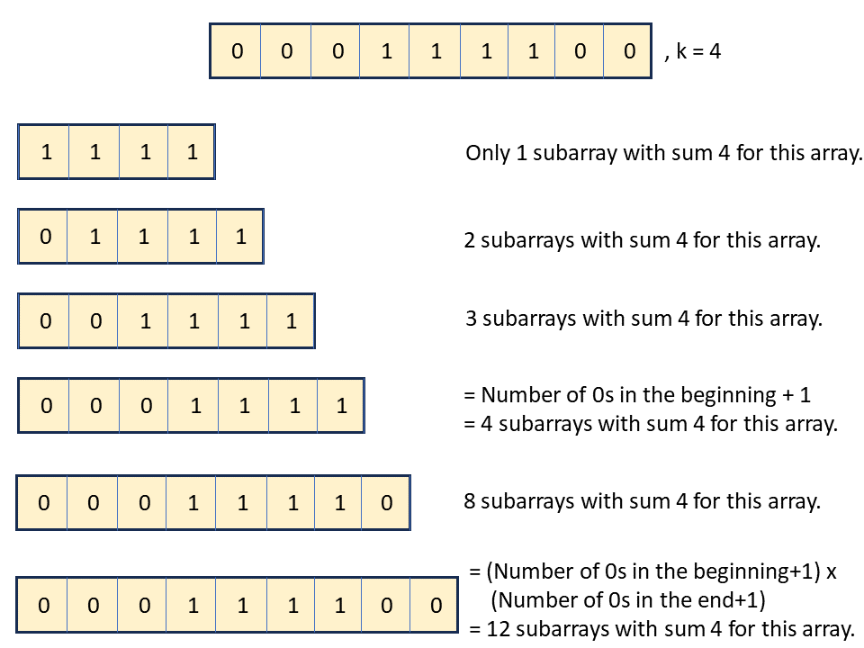

## Solution

---

### Approach 1: Hashing

#### Intuition

Since we only need to find the number of subarrays that contain a certain count of odd elements, we can ignore the numerical values of the elements and replace all odd values with `1` and even values with `0`.

Now, all we need to do is identify sequences of elements within the array whose sum equals the number of odd elements needed to make a nice array. Solutions that require sequences of elements to meet criteria often utilize prefix sums, also sometimes referred to as cumulative sums.

**Note:** If you aren't aware of this concept we recommend you first solve this problem [560. Subarray Sum Equals K](https://leetcode.com/problems/subarray-sum-equals-k/).

Utilizing prefix sums simplifies our approach and lets us avoid determining the sum of elements for every new subarray considered. Using the prefix sums approach, we can calculate the sum of elements between two indices, subtracting the prefix sum corresponding to the two indices to obtain the sum directly instead of iterating over the subarray to find the sum.

We'll use this approach to calculate how many odd numbers are between two indices in the array. Let's call the two indices `start` and `end`. If the number of odd numbers between `start` and `end` equals `k`, we have found a nice subarray. We will calculate this by finding the difference between the `end` and `start` indices.

Based on these thoughts, we use a hashmap to store the prefix sum of indices as keys and their frequency of occurrence as values. Instead of modifying nums, we can apply the modulo 2 operation when storing values in the hashmap.

We traverse the array `nums` to compute the prefix sum up to each element modulo 2. Each unique sum encountered is recorded in a hashmap. If a sum repeats, we increment its corresponding count in the hashmap. Also, for each sum encountered, we find the number of times $sum - k$ has appeared before, as this count indicates how many subarrays with sum `k` exist up to the current index. We increase the count by that same amount.

#### Algorithm

1. Initialize integers $currSum = 0$,$subarrays = 0$ and a hashmap `prefixSum`.
2. Initialize $\text{prefixSum}[0]$ with 1 to account for the initial value of `currSum`.
2. Iterate over all the elements of `nums`:
- Compute `currSum` as $currSum = currSum + \text{nums}[i] \% 2$.
- If $currSum - k$ exists in the hashmap:
- Increment the value of `subarrays` with $prefixSum[currSum - k]$.
- Increment $\text{prefixSum}[currSum]$ by 1.
3. Return `subarrays`.

#### Implementation

```python
class Solution:
    def numberOfSubarrays(self, nums: List[int], k: int) -> int:
        curr_sum = 0
        subarrays = 0
        prefix_sum = {curr_sum: 1}

        for i in range(len(nums)):
            curr_sum += nums[i] % 2
            # Find subarrays with sum k ending at i
            if curr_sum - k in prefix_sum:
                subarrays = subarrays + prefix_sum[curr_sum - k]
            # Increment the current prefix sum in hashmap
            prefix_sum[curr_sum] = prefix_sum.get(curr_sum, 0) + 1

        return subarrays
```

#### Complexity Analysis

Let $n$ be the number of elements in `nums`.

- Time complexity: $O(n)$

    We iterate through the array exactly once. In each iteration, we perform insertion and search operations in the hashmap that take $O(1)$ time. Therefore, the time complexity can be stated as $O(n)$.

- Space complexity: $O(n)$

    In each iteration, we insert a key-value pair in the hashmap. The space complexity is $O(n)$ because the size of the hashmap is proportional to the size of the list after $n$ iterations.

---

### Approach 2: Sliding Window using Queue

#### Intuition

Since all of the elements in the modified `nums` array in the previous approach are non-negative, we can also try to use the sliding window approach. This pattern is applicable in scenarios where achieving a goal involves using subarrays, and individual values cannot be selected independently.

The concept behind the sliding window pattern is to maintain a window that continuously expands from the right by adding elements until the conditions are not satisfied. Then, we adjust the window by shrinking it from the left until the condition is met again.

> If the `nums` array contains any negative numbers, the sliding window approach will not work effectively. This is because when negative numbers are included, extending the window by adding more elements can decrease the sum, complicating the process of determining the optimal subarray. With non-negative numbers, the sum of the elements in the window either increases or stays the same as the window expands, allowing for a straightforward evaluation of subarrays.

For this problem, we will simulate the process using a queue. A queue is suitable to simulate a sliding window because it efficiently adds and removes elements from both ends. The queue represents all unique windows that contain `k` odd elements and start and end with an odd element.

Do these windows account for all the subarrays possible in `nums`? No, because there might be some `0`s before and after the window that will increase the number of subarrays.

The number of subarrays for a fixed endpoint is given by the number of `0`s that could be inserted at the beginning of the window plus one (if no `0`s in the beginning). If we insert any additional `0`s at the end of this window, the subarrays would increase by this number. See the example below:



We iterate through the array `nums`. If we encounter an odd number, we push its index in the `oddIndices` queue. If the queue size exceeds `k`, we pop elements from it. If the queue has exactly `k` odd numbers, we can increment our answer by the number of `0`s at the beginning of the subarray.

#### Algorithm

1. Initialize integers $subarrays = 0$, $lastPopped = -1$, $initialGap = 0$ and a queue `oddIndices`.
2. Iterate over all the elements of `nums`:
- If the current element is odd:
- Push the current index in `oddIndices`.
- If the size of the queue is greater than `k`:
- Store the front of the queue in `lastPopped`.
- Pop the front of the queue.
- If size of the queue is `k`:
- Set `initialGap` as the difference between the front of the queue and `lastPopped`.
- Increment `subarrays` by `initialGap`.
3. Return `subarrays`.

!?!../Documents/1248/slideshow1.json:960,540!?!

#### Implementation

```python
class Solution:
    def numberOfSubarrays(self, nums: List[int], k: int) -> int:
        odd_indices = deque()
        subarrays = 0
        last_popped = -1
        initial_gap = 0

        for i in range(len(nums)):
            # If element is odd, append its index to the deque.
            if nums[i] % 2 == 1:
                odd_indices.append(i)
            # If the number of odd numbers exceeds k, remove the first odd index.
            if len(odd_indices) > k:
                last_popped = odd_indices.popleft()
            # If there are exactly k odd numbers, add the number of even numbers
            # in the beginning of the subarray to the result.
            if len(odd_indices) == k:
                initial_gap = odd_indices[0] - last_popped
                subarrays += initial_gap

        return subarrays
```

#### Complexity Analysis

Let $n$ be the number of elements in the array `nums`.

- Time complexity: $O(n)$

    We iterate through the array exactly once. In each iteration of the array, we perform queue operations such as push, pop, and accessing the front element that takes $O(1)$ time. Therefore, the time complexity can be stated as $O(n)$.

- Space complexity: $O(n)$

    In each iteration, we perform one push operation in the queue. The space complexity is $O(n)$ because the queue size is proportional to the size of the list after $n$ iterations.

---

### Approach 3: Sliding Window (Space Optimisation of queue-based approach)

#### Intuition

Is it possible to avoid the queue in the previous approach? We only need the frequency of `0`s at the start to calculate the answer, so we can optimize the algorithm by calculating this value without using an additional $O(n)$ memory.

While iterating through all possible endpoints of the windows, keep track of the count of odd values using an integer `qsize`. If `qsize` reaches `k`, adjust the `start` pointer to skip over even values at the beginning of the subarray until an odd value is encountered.

Now, we add the number of even values covered by the `start` pointer, given by `initialGap`, to the answer. We will add this value to the answer for every subsequent even value.

#### Algorithm

1. Initialize integers $subarrays = 0$, $qsize = 0$, $initialGap = 0$ and $start = 0$.
2. Iterate over all the elements of `nums`:
- If the current element is odd:
- Increment `qsize` by 1.
- If `qsize` is equal to `k`:
- Set `initialGap` as 0.
- While `qsize` is `k`:
- Decrease `qsize` by 1 if element at `start` is odd.
- Increment `initialGap` by 1.
- Increment `start` by 1.
- Increment `subarrays` by `initialGap`.
3. Return `subarrays`.

!?!../Documents/1248/slideshow2.json:960,540!?!

#### Implementation

```python
class Solution:
    def numberOfSubarrays(self, nums: List[int], k: int) -> int:
        subarrays = 0
        initial_gap = 0
        qsize = 0
        start = 0
        for end in range(len(nums)):
            # If current element is odd, increment qsize by 1.
            if nums[end] % 2 == 1:
                qsize += 1
            if qsize == k:
                initial_gap = 0
                # Calculate the number of even elements in the beginning of
                # subarray.
                while qsize == k:
                    qsize -= nums[start] % 2
                    initial_gap += 1
                    start += 1
            subarrays += initial_gap
        return subarrays
```

#### Complexity Analysis

Let $n$ be the number of elements in the array `nums`.

- Time complexity: $O(n)$

    We iterate through the array exactly once. The `start` pointer can move at most `n` steps through all iterations. Therefore, the time complexity can be stated as $O(n)$.

- Space complexity: $O(1)$

    We do not allocate any additional auxiliary memory in our algorithm. Therefore, overall space complexity is given by $O(1)$.

---

### Approach 4: Sliding Window (subarray sum at most k)

#### Intuition

Is it possible to find the number of subarrays with sum at most `k` for an array with non-negative elements? We can use the sliding window approach to do this. However, for this problem, we need to calculate the number of subarrays with a sum exactly `k` (from Approach 1), not at most `k`. Observe that if we calculate the number of subarrays with sum at most `k` and at most `k-1`, their difference would give us the number of subarrays with sum exactly `k`.

For a subarray with a fixed `end` index, let `start` be the first index where the subarray from `start` to `end` contains exactly `k` odd elements. Any subarray that starts at an index after `start` and ends at `end` will contain at most `k` odd elements.

We iterate over the array `nums` for all possible values of `end`. Once we find the `start` value, the number of subarrays with at most `k` odd elements is calculated as $end - start + 1$(window size). We accumulate this value to the final answer across all end values.

#### Algorithm

**Main Function**: `numberOfSubarrays(nums, k)`

1. Return the difference of `atMost(nums, k)` and $atMost(nums, k - 1)$

**Function**: `atMost(nums, k)`

1. Initialize integers $subarrays = 0$, $windowSize = 0$ and $start = 0$.
2. Iterate over all the elements of `nums`:
- If the current element is odd:
- Increment `windowSize` by 1.
- While `windowSize` is greater than `k`:
- Decrease `windowSize` by 1 if the current element is odd.
- Increment `start` by 1.
- Increment `subarrays` with $end - start + 1$, where `end` is the current index.
3. Return `subarrays`.

#### Implementation

```python
class Solution:
    def numberOfSubarrays(self, nums: List[int], k: int) -> int:
        return self.atMost(nums, k) - self.atMost(nums, k - 1)

    def atMost(self, nums: List[int], k: int) -> int:
        window_size, subarrays, start = 0, 0, 0
        for end in range(len(nums)):
            window_size += nums[end] % 2
            # Find the first index start where the window has exactly k odd elements.
            while window_size > k:
                window_size -= nums[start] % 2
                start += 1
            # Increment number of subarrays with end - start + 1.
            subarrays += end - start + 1
        return subarrays
```

#### Complexity Analysis

Let $n$ be the number of elements in the array `nums`.

- Time complexity: $O(n)$

    We call the `atMost` function 2 times. We iterate through the array exactly once in the function. The `start` pointer can move atmost `n` steps through all iterations. Therefore, the time complexity can be stated as $O(n)$.

- Space complexity: $O(1)$

    We do not allocate any additional auxiliary memory in our algorithm. Therefore, overall space complexity is given by $O(1)$.

---