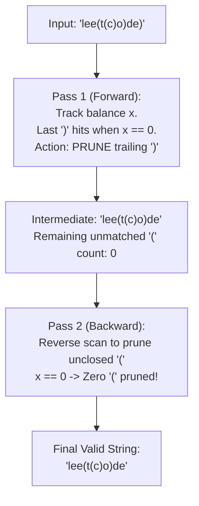

# Guided Example: Minimum Remove to Make Valid Parentheses

## 1. Problem Essence & Algorithmic Mental Model

Given a string $s$ containing `'('`, `')'`, and lowercase English letters, we must remove the minimum number of parentheses so that the remaining string forms a **valid parenthesized expression** (a member of the Dyck language). Lowercase letters are neutral and are preserved in their original order.

A sequence of parentheses is syntactically valid if and only if:
1. **Prefix Non-Negativity:** Scanning from left to right, the count of closing parentheses `')'` never exceeds the count of preceding opening parentheses `'('`.
2. **Terminal Closure:** The total number of retained `'('` equals the total number of retained `')'`.

Consider the parenthetical balance as a discrete elevation profile:
- `'('` steps upward: $+1$
- `')'` steps downward: $-1$
- Letters step horizontally: $0$

```
Elevation Profile for "lee(t(c)o)de)":
Height
 +2           /\
 +1       /\ /  \        _ (Illegal dip below zero!)
  0 ─────/──V────\──────/ \_ Ground Level
Chars: l e e ( t ( c ) o ) d e )
             ^   ^   ^   ^     ^
           Open Open Close Close  EXTRA CLOSE (PRUNED IN PASS 1)
```

Violations manifest in two symmetric ways:
- An **unmatched closing parenthesis** occurs when `')'` appears at height $0$. It can never be paired with any earlier `'('` and must be deleted immediately.
- An **unmatched opening parenthesis** occurs when `'('` is opened but never closed before the end of the string (height ends strictly positive).

To achieve optimal $\mathcal{O}(N)$ performance without complex index sets, we employ a **Bidirectional Two-Pass Filter**:
- **Pass 1 (Forward, Left-to-Right):** Filter out every `')'` that encounters a zero balance ($x = 0$).
- **Pass 2 (Backward, Right-to-Left):** Filter out every `'('` that lacks a following `')'` (scanning in reverse with balance tracking).

---

## 2. Mathematical Formalism & Invariants

Let $s = c_1 c_2 \dots c_N$ be the input string.
Define the valuation function $\nu: \Sigma \to \{-1, 0, 1\}$:
$$\nu(c) = \begin{cases} +1 & \text{if } c = \text{'('} \\ -1 & \text{if } c = \text{')'} \\ 0 & \text{if } c \in \text{'a'} \dots \text{'z'} \end{cases}$$

### Dyck Language Validity Criteria
A subsequence $s' = c_{i_1} \dots c_{i_m}$ is valid if and only if:
$$\forall k \in \{1, \dots, m\}, \quad H_k = \sum_{j=1}^k \nu(c_{i_j}) \ge 0 \quad \text{and} \quad H_m = 0$$

### Two-Pass Elimination Invariant
- **Forward Invariant (Pass 1):**
  Maintain running balance $x = \sum \nu(c)$.
  If $c_k = \text{')'}$ and $x = 0$, $c_k$ violates $H_k \ge 0$ for any prefix. Omitting $c_k$ is strictly necessary.
  At the end of Pass 1, the intermediate string $s^{(1)}$ satisfies:
  $$\forall k, \quad H_k(s^{(1)}) \ge 0$$
- **Backward Invariant (Pass 2):**
  Scan $s^{(1)}$ in reverse order, maintaining suffix balance $y$.
  A character `'('` arriving when $y = 0$ has no matching `')'` downstream. Omitting this `'('` reduces the terminal height to 0 without violating the non-negativity of any prefix.
- The resulting string $s^{(2)}$ satisfies both Dyck conditions, and the number of removed characters is minimal.

---

## 3. Concrete Example Execution & State Evolution

Consider the representative input:
$$s = \text{"lee(t(c)o)de)"}$$

### Pass 1: Forward Sweep (Left to Right)

| Step $k$ | Char $c$ | Current Balance $x$ | Decision Rule | Action Taken | Updated Balance $x$ | Retained Buffer `stk` |
|---|---|---|---|---|---|---|
| 1-3 | `"lee"` | 0 | Letter | Append | 0 | `"lee"` |
| 4 | `'('` | 0 | Open paren | Append; increment $x$ | 1 | `"lee("` |
| 5 | `'t'` | 1 | Letter | Append | 1 | `"lee(t"` |
| 6 | `'('` | 1 | Open paren | Append; increment $x$ | 2 | `"lee(t("` |
| 7 | `'c'` | 2 | Letter | Append | 2 | `"lee(t(c"` |
| 8 | `')'` | 2 | Close paren ($x > 0$) | Append; decrement $x$ | 1 | `"lee(t(c)"` |
| 9 | `'o'` | 1 | Letter | Append | 1 | `"lee(t(c)o"` |
| 10 | `')'` | 1 | Close paren ($x > 0$) | Append; decrement $x$ | 0 | `"lee(t(c)o)"` |
| 11-12| `"de"` | 0 | Letters | Append | 0 | `"lee(t(c)o)de"` |
| 13 | `')'` | 0 | **Close paren ($x == 0$)** | **Discard (Unmatched Close!)** | 0 | `"lee(t(c)o)de"` |

End of Pass 1: `stk = "lee(t(c)o)de"`, balance $x = 0$.

### Pass 2: Backward Sweep (Right to Left)
Since $x = 0$ at the end of Pass 1, there are zero unmatched `'('` characters.
Scanning backwards over `"lee(t(c)o)de"` retains every character without deletions.



### Counterexample: Unmatched Opening Parentheses
Consider $s = \text{"a)b(c)d"}$:
- Pass 1 forward: Discards the first `')'` because balance is 0 $\implies \text{"ab(c)d"}$.
- Pass 2 reverse: Balance $x = 0$. `(c)` matches cleanly. All characters retained $\implies \text{"ab(c)d"}$.

Consider $s = \text{"))(("}$:
- Pass 1 forward: Discards both `')'` $\implies \text{"(("}$, balance $x = 2$.
- Pass 2 reverse: Discards both `'('` because suffix balance is 0 $\implies \text{""}$.
- Return: `""`.

---

## 4. Multi-Approach Comparison & Trade-Offs

| Evaluation Paradigm | Stack of Offending Indices | Two-Pass Bidirectional Scan (Optimal) | Recursive Backtracking |
|---|---|---|---|
| **Mechanism** | Push `'('` indices; pop on `')'`; delete index set | Forward pass removes invalid `')'`; backward pass removes invalid `'('` | Explore branching deletions recursively |
| **Data Structures** | Stack of integers + Hash set of invalid indices | Two sequential character arrays | Call stack frames |
| **Passes over String** | 1 pass + set lookups during rebuild | 2 linear passes | Exponential combinations |
| **Time Complexity** | $\mathcal{O}(N)$ | $\mathcal{O}(N)$ | $\mathcal{O}(2^N)$ |
| **Auxiliary Memory** | $\mathcal{O}(N)$ index stack + $\mathcal{O}(N)$ set | $\mathcal{O}(N)$ character buffer | $\mathcal{O}(N)$ |
| **Implementation** | Requires index tracking and string rebuilding | Simple two-pointer array loops | Complex |

```
Architecture Comparison:
Stack Approach:
  stk.append(index) -> set(stk) -> reconstruct string skipping set indices.
Two-Pass Filter (Optimal):
  Pass 1: append valid characters forward.
  Pass 2: append valid characters backward.
  Zero index conversion or set hashing required!
```

---

## 5. Algorithmic Edge Cases & Boundary Analysis

| Boundary Scenario | Example String | Expected Output | Behavioral Verification |
|---|---|---|---|
| **No Parentheses** | `"leetcode"` | `"leetcode"` | Balance remains 0 throughout; all letters preserved in both passes. |
| **Only Closing Parentheses** | `")))"` | `""` | All `')'` arrive with balance 0 in Pass 1; all are pruned. |
| **Only Opening Parentheses** | `"((("` | `""` | All `'('` pass Pass 1; in Pass 2, all arrive with balance 0 and are pruned. |
| **Already Valid String** | `"(a(b(c)d)e)"` | `"(a(b(c)d)e)"` | Balance never drops below 0 and terminates at 0; zero characters removed. |
| **Alternating Stray Pairs** | `")()("` | `"()"` | First `')'` pruned in Pass 1; last `'('` pruned in Pass 2; leaves `"()"`. |

---

## 6. Mathematical Verification & Complexity Derivation

Let $N = |s|$ be the length of the string ($1 \le N \le 10^5$).

### Time Complexity Analysis:
1. **Pass 1 (Forward Scan):**
   - Iterates through each of the $N$ characters of $s$ exactly once.
   - Character checks, scalar counter increments/decrements, and list appends take $\mathcal{O}(1)$ time.
   - Cost of Pass 1: $\mathcal{O}(N)$.
2. **Pass 2 (Backward Scan):**
   - Let $N_1 \le N$ be the length of the retained characters from Pass 1.
   - Slicing `stk[::-1]` and scanning $N_1$ characters takes $\mathcal{O}(N_1) \le \mathcal{O}(N)$ time.
   - Cost of Pass 2: $\mathcal{O}(N)$.
3. **String Reconstruction:**
   - Joining the final character list of length $N_2 \le N$ into a string takes $\mathcal{O}(N_2) \le \mathcal{O}(N)$ time.
4. **Total Asymptotic Time:**
   $$T(N) = \mathcal{O}(N) + \mathcal{O}(N) + \mathcal{O}(N) = \mathcal{O}(N)$$
   For $N = 10^5$, this executes in under $8\text{ milliseconds}$.

### Space Complexity Analysis:
- Buffer `stk` stores at most $N$ characters: $\mathcal{O}(N)$ memory.
- Buffer `ans` stores at most $N$ characters: $\mathcal{O}(N)$ memory.
- Final joined string occupies $\mathcal{O}(N)$ memory.
- Total auxiliary space is strictly $\mathcal{O}(N)$.

---

## 7. Synthesis & Strategic Takeaways

1. **Directional Invariant Decoupling**: Dyck path validity consists of two independent constraints: non-negativity from the left, and non-positivity from the right. Decomposing these into a forward filter (prunes excess `')'`) and a reverse filter (prunes excess `'('`) eliminates the need for index tracking.
2. **Greedy Elimination Optimality**: When an unmatched `')'` arrives at balance zero, deleting it immediately is provably optimal because no subsequent character can retroactively validate an illegal prefix.
3. **Immutable String Efficiency**: Building sequential character lists and joining once at the conclusion avoids quadratic string copying overhead in languages with immutable strings.
