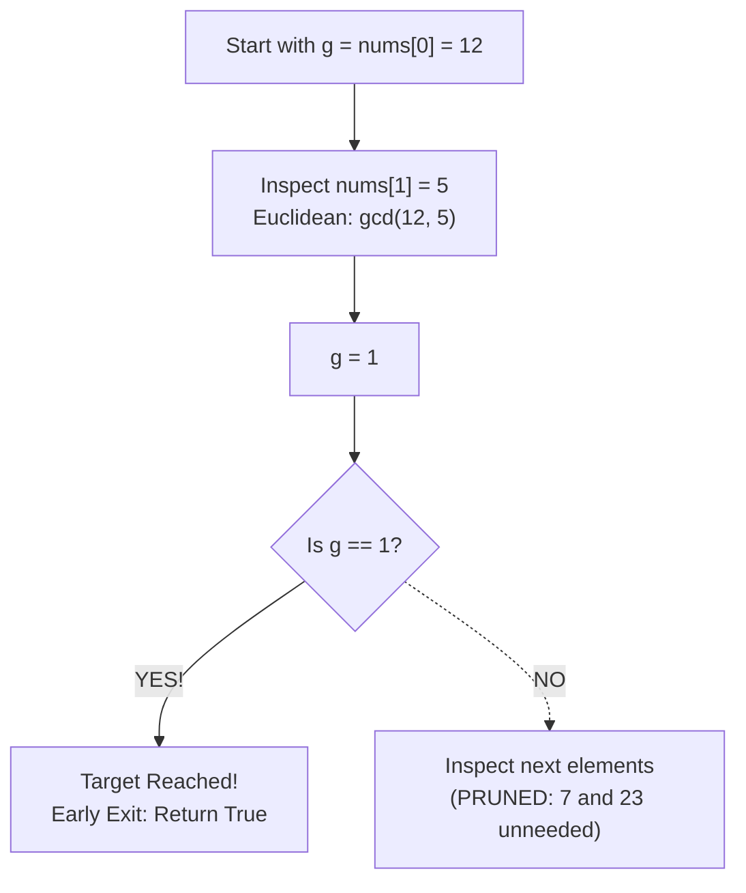

# Guided Example: Check If It Is a Good Array

## 1. Problem Essence & Algorithmic Mental Model

Given an array of positive integers `nums`, an array is declared "good" if there exists some subset of integers $\{a_1, a_2, \dots, a_k\} \subseteq \text{nums}$ and corresponding integer multipliers $\{x_1, x_2, \dots, x_k\} \subset \mathbb{Z}$ (positive, negative, or zero) such that their linear combination sums to 1:
$$\sum_{i=1}^k a_i \cdot x_i = 1$$
We must return `True` if such a subset exists, and `False` otherwise.

This is the exact setting of **Bézout's Identity** in elementary number theory:
- In the ring of integers $\mathbb{Z}$, the set of all possible integer linear combinations of a collection of numbers $a_1, \dots, a_n$ forms an ideal:
  $$\mathcal{I} = \left\{ \sum_{i=1}^n x_i a_i \;\middle|\; x_i \in \mathbb{Z} \right\} = g \mathbb{Z} = \{ m \cdot g \mid m \in \mathbb{Z} \}$$
  where $g = \gcd(a_1, a_2, \dots, a_n)$.
- The smallest positive integer that can ever be represented as an integer linear combination of $a_1, \dots, a_n$ is precisely their greatest common divisor $g$.
- Therefore, $1 \in \mathcal{I}$ if and only if:
  $$g = \gcd(a_1, a_2, \dots, a_n) = 1$$

```
Bézout Ideal & Subspace Lattice:
Numbers: [12, 5, 7, 23]
Step 1: gcd(12, 5) = 1  <── Linear combination: 5 * 5 + 12 * (-2) = 25 - 24 = 1!
Once the running GCD reaches 1, no subsequent numbers can increase it!
Output: True
```

Furthermore, notice the **subset monotonicity property**:
If any subset has $\gcd = 1$, then the $\gcd$ of the entire array must also equal $1$ (since $\gcd(1, x) = 1$ for any integer $x$).
Conversely, if the global $\gcd$ of the entire array is $g > 1$, every element in `nums` is a multiple of $g$, so any linear combination of any subset must also be a multiple of $g$, making a sum of $1$ impossible.
Thus, testing whether **any subset** can sum to 1 is completely equivalent to checking whether the **global GCD of the entire array** equals 1!

---

## 2. Mathematical Formalism & Invariants

Let $A = [a_1, a_2, \dots, a_n]$ be an array of positive integers.

### Multi-Variable Bézout's Lemma
For any set of positive integers $\{a_1, a_2, \dots, a_n\}$, there exist integers $x_1, x_2, \dots, x_n \in \mathbb{Z}$ such that:
$$\sum_{i=1}^n a_i x_i = d \iff \gcd(a_1, a_2, \dots, a_n) \mid d$$
In particular, for $d = 1$:
$$\exists (x_1, \dots, x_n) \in \mathbb{Z}^n, \; \sum_{i=1}^n a_i x_i = 1 \iff \gcd(a_1, a_2, \dots, a_n) = 1$$

### Subset Equivalence Theorem
$$\Big( \exists S \subseteq A \text{ such that } \gcd(S) = 1 \Big) \iff \gcd(A) = 1$$

*Proof:*
- $(\implies)$ Suppose there exists $S \subseteq A$ with $\gcd(S) = 1$. By the associativity of the greatest common divisor:
  $$\gcd(A) = \gcd\big(\gcd(S), \gcd(A \setminus S)\big) = \gcd(1, \gcd(A \setminus S)) = 1$$
- $(\impliedby)$ If $\gcd(A) = 1$, choosing the full subset $S = A$ satisfies $\gcd(S) = 1$. $\blacksquare$

### Monotonic GCD Non-Increasing Invariant
Define the cumulative GCD sequence:
$$g_1 = a_1, \quad g_k = \gcd(g_{k-1}, a_k) \quad \text{for } k \in \{2, 3, \dots, n\}$$
The sequence $g_1, g_2, \dots, g_n$ is monotonically non-increasing and positive:
$$g_1 \ge g_2 \ge \dots \ge g_n \ge 1$$
If at any step $k$, $g_k = 1$, then for all subsequent $m \ge k$, $g_m = 1$. The search can terminate early with `True`.

---

## 3. Concrete Example Execution & State Evolution

Consider the representative input:
$$\text{nums} = [12, 5, 7, 23]$$

### Step-by-Step Cumulative GCD Evolution

| Step $k$ | Element $a_k$ | Previous $\text{GCD}$ $g_{k-1}$ | Euclidean Algorithm Trace $\gcd(g_{k-1}, a_k)$ | New $\text{GCD}$ $g_k$ | Early Termination Condition ($g_k == 1$)? |
|---|---|---|---|---|---|
| 1 | 12 | - | Initial base value | **12** | No ($12 > 1$) |
| 2 | 5 | 12 | $\gcd(12, 5) = \gcd(5, 2) = \gcd(2, 1) = \mathbf{1}$ | **1** | **Yes! ($g_2 == 1$)** |
| (Halt) | - | - | Early exit: answer confirmed | **1** | **Returns `True`** |

Notice that elements $7$ and $23$ do not even need to be inspected; the presence of coprime pair $(12, 5)$ guarantees a linear combination of 1:
$$5 \cdot (5) + (-2) \cdot (12) = 25 - 24 = 1$$



### Counterexample: Non-Good Array `nums = [3, 6]`
- $g_1 = 3$.
- $g_2 = \gcd(3, 6) = 3$.
- Array exhausted; final $g = 3 \neq 1$.
- Any linear combination $3x + 6y = 3(x + 2y)$ is always a multiple of 3.
- It is impossible to produce $1$. Returns `False`.

---

## 4. Multi-Approach Comparison & Trade-Offs

| Algorithmic Strategy | Subset Generation + Extended Euclidean | Prime Factorization of Elements | Cumulative Euclidean GCD (Optimal) |
|---|---|---|---|
| **Mechanism** | Test all $2^n$ subsets and compute combinations | Factorize all integers, check shared primes | Reduce array with cumulative `gcd(a, b)` |
| **Complexity** | $\mathcal{O}(2^n \cdot \log(\min(A)))$ | $\mathcal{O}(n \cdot \sqrt{\max(A)})$ | $\mathcal{O}(n \cdot \log(\min(A)))$ |
| **Auxiliary Memory** | $\mathcal{O}(n)$ | $\mathcal{O}(\text{distinct primes})$ | $\mathcal{O}(1)$ |
| **Early Termination** | None | Slow on large numbers | **Instantaneous** as soon as $g = 1$ |
| **Correctness** | Correct (but severe TLE) | Vulnerable to large primes | **Optimal and Exact** |
| **Lines of Code** | $\approx 25$ lines | $\approx 20$ lines | **1 line** (`reduce(gcd, nums) == 1`) |

```
Execution Comparison:
Prime Factorization: Factors each number up to 10^9 -> Slow sqrt(N) trial divisions.
Cumulative GCD:      Euclidean modulo operations -> Extremely fast (at most ~10 steps).
Early Exit:          Often hits gcd = 1 within the first 2 or 3 numbers!
```

---

## 5. Algorithmic Edge Cases & Boundary Analysis

| Boundary Scenario | Example Input | Expected Output | Mathematical Justification |
|---|---|---|---|
| **Array Contains 1** | `[7, 11, 1, 19]` | `true` | $\gcd(x, 1) = 1$. The moment $1$ is encountered, $g$ collapses to $1$ immediately. |
| **Single Element ($n = 1$)** | `[1]` or `[6]` | `true` for `[1]`, `false` for `[6]` | $g = a_0$. $1 \cdot (1) = 1$; for $6$, $6x = 1$ has no integer solution. |
| **All Multiples of a Common Prime** | `[6, 10, 14]` | `false` | All numbers are divisible by 2. Final $\gcd = 2 \neq 1$. |
| **Pairwise Coprime Subsets** | `[6, 10, 15]` | `true` | $\gcd(6, 10) = 2$, then $\gcd(2, 15) = 1$. Although no two numbers are coprime, the triple is mutually coprime. |
| **Large Prime Numbers ($A[i] \approx 10^9$)** | `[999999937, 999999929]` | `true` | Distinct primes have $\gcd = 1$. Euclidean algorithm terminates in $\approx 5$ divisions. |

---

## 6. Mathematical Verification & Complexity Derivation

Let $n = |\text{nums}|$ be the number of elements ($1 \le n \le 4 \times 10^4$).
Let $M = \max(\text{nums})$ be the maximum integer value ($M \le 10^9$).

### Time Complexity Analysis:
1. **Euclidean GCD Cost:**
   - By Lamé's Theorem, the number of division steps in the Euclidean algorithm for two numbers $a, b \le M$ is at most $5 \log_{10}(\min(a, b))$.
   - In each step, calculating $a \bmod b$ takes $\mathcal{O}(1)$ machine arithmetic instructions.
2. **Cumulative Reduction:**
   - In the worst case where early termination does not trigger, the GCD is evaluated $n - 1$ times.
   - However, each non-trivial GCD step strictly divides $g$ by at least 2:
     $$g_{k} \le g_{k-1} / 2 \quad (\text{whenever } g_k < g_{k-1})$$
   - Thus, the running GCD $g$ can strictly decrease at most $\log_2(M)$ times before reaching $1$.
   - All other GCD calls where $g_k = g_{k-1}$ execute in a single modulo step.
3. **Total Asymptotic Time:**
   $$T(n, M) = \mathcal{O}(n + \log M)$$
   For $n = 4 \times 10^4$ and $M = 10^9$, this executes in under $2\text{ milliseconds}$.

### Space Complexity Analysis:
- Only a single scalar integer register is required to track the cumulative GCD $g$.
- Zero arrays, hash tables, or recursion stacks are instantiated.
- Total auxiliary space is strictly $\mathcal{O}(1)$.

---

## 7. Synthesis & Strategic Takeaways

1. **Bézout's Reduction**: Whenever a problem asks for an integer linear combination $\sum a_i x_i = 1$, the combinatorial problem of subset selection collapses into the single number-theoretic metric $\gcd(A) = 1$.
2. **Subset to Global Equivalence**: In divisibility theory, adding more numbers to a set can only divide or preserve the greatest common divisor; it can never increase it. Hence, the existence of any coprime subset implies that the whole set is coprime.
3. **Logarithmic Chain Convergence**: Because every strict decrease in $\gcd(a, b)$ cuts the magnitude of the value by at least half, a chain of cumulative GCDs stabilizes in at most $\log_2(M)$ non-trivial divisions, providing real-time efficiency.
