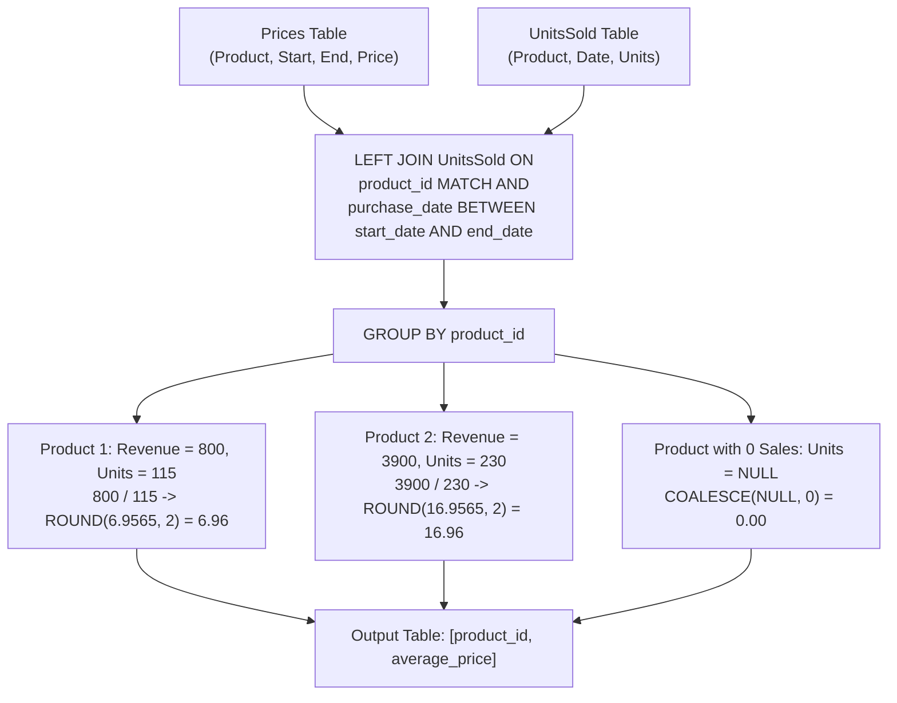

# Guided Example: Average Selling Price

## 1. Problem Essence & Algorithmic Mental Model

We are given two relational tables:
1. `Prices(product_id, start_date, end_date, price)`: Defines the active selling price for each product across disjoint, inclusive temporal intervals $[start\_date, end\_date]$.
2. `UnitsSold(product_id, purchase_date, units)`: Records individual transaction events, indicating how many units of a product were purchased on a specific date.

We must compute the **average selling price** for each product, rounded to 2 decimal places. If a product recorded zero sales across all time, its average selling price must be reported as $0$.

The average price is not a simple arithmetic mean of listed prices; it is a **volume-weighted average**:
$$\text{Average Price} = \frac{\text{Total Revenue}}{\text{Total Units Sold}} = \frac{\sum (\text{price} \times \text{units})}{\sum \text{units}}$$

```
Temporal Relational Join Architecture:
Price Interval:      [  2019-02-17  ── Price = $5 ──  2019-02-28  ]
Transaction Event:                   2019-02-25: 100 units
Join Match:          Purchase date falls within [start, end]!
Revenue Generated:   100 units x $5 = $500

Next Price Interval: [  2019-03-01  ── Price = $20 ──  2019-03-22 ]
Transaction Event:   2019-03-01: 15 units
Revenue Generated:   15 units x $20 = $300

Total Revenue = $800, Total Units = 115 => Average = 800 / 115 = $6.96
```

Key relational considerations:
- **Temporal Interval Join:** Matching sales to prices requires checking both identity (`product_id`) and temporal containment (`purchase_date BETWEEN start_date AND end_date`).
- **Left Outer Join:** Products present in `Prices` that have zero records in `UnitsSold` must not be dropped. A `LEFT JOIN` preserves these products.
- **Null Coalescence:** For products with zero sales, $\sum \text{units}$ is `NULL`, producing a division by null. Wrapping the quotient in `COALESCE(..., 0)` safely maps unmatched rows to $0$.

---

## 2. Mathematical Formalism & Invariants

Let $\mathcal{P}$ denote the set of price intervals $(p, s, e, c)$, where $p \in \mathbb{Z}^+$ is the product ID, $[s, e]$ is the active calendar interval, and $c \in \mathbb{R}^+$ is the unit price.
Let $\mathcal{U}$ denote the multiset of transactions $(p, d, u)$, where $d$ is the purchase date and $u \in \mathbb{Z}^+$ is the units sold.

### Temporal Join Predicate
A transaction $(p_u, d, u) \in \mathcal{U}$ belongs to price interval $(p_p, s, e, c) \in \mathcal{P}$ if and only if:
$$p_p = p_u \quad \text{and} \quad s \le d \le e$$

### Volume-Weighted Average Formulation
For each distinct product $p \in \pi_{\text{product\_id}}(\mathcal{P})$:
$$\text{Revenue}(p) = \sum_{(p, s, e, c) \in \mathcal{P}} \; \sum_{\substack{(p, d, u) \in \mathcal{U} \\ s \le d \le e}} c \cdot u$$
$$\text{TotalUnits}(p) = \sum_{\substack{(p, d, u) \in \mathcal{U} \\ \exists (p, s, e, c) \in \mathcal{P}, \; s \le d \le e}} u$$

The final metric is:
$$\text{AvgPrice}(p) = \begin{cases} \text{round}\left( \frac{\text{Revenue}(p)}{\text{TotalUnits}(p)}, \; 2 \right) & \text{if } \text{TotalUnits}(p) > 0 \\ 0 & \text{if } \text{TotalUnits}(p) = 0 \end{cases}$$

---

## 3. Concrete Example Execution & State Evolution

Consider the database instance:
- `Prices`:
  - Product 1: `[2019-02-17, 2019-02-28]` at $\$5$
  - Product 1: `[2019-03-01, 2019-03-22]` at $\$20$
  - Product 2: `[2019-02-01, 2019-02-20]` at $\$15$
  - Product 2: `[2019-02-21, 2019-03-31]` at $\$30$
- `UnitsSold`:
  - Product 1: `2019-02-25` (100 units)
  - Product 1: `2019-03-01` (15 units)
  - Product 2: `2019-02-10` (200 units)
  - Product 2: `2019-03-22` (30 units)

### Step-by-Step Join and Aggregation Trace

| Product ID | Transaction Date | Units $u$ | Matched Price Interval | Active Price $c$ | Revenue Generated $c \cdot u$ |
|---|---|---|---|---|---|
| **Product 1** | `2019-02-25` | 100 | `[2019-02-17, 2019-02-28]` | $\$5$ | $100 \times 5 = \$500$ |
| **Product 1** | `2019-03-01` | 15 | `[2019-03-01, 2019-03-22]` | $\$20$ | $15 \times 20 = \$300$ |
| **Product 1 Totals** | - | $\sum u = 115$ | - | - | $\sum c \cdot u = \$800$ |
| **Product 2** | `2019-02-10` | 200 | `[2019-02-01, 2019-02-20]` | $\$15$ | $200 \times 15 = \$3000$ |
| **Product 2** | `2019-03-22` | 30 | `[2019-02-21, 2019-03-31]` | $\$30$ | $30 \times 30 = \$900$ |
| **Product 2 Totals** | - | $\sum u = 230$ | - | - | $\sum c \cdot u = \$3900$ |

### Mathematical Quotients:
- **Product 1:**
  $$\frac{\$800}{115 \text{ units}} \approx 6.95652 \dots \xrightarrow{\text{round to 2 decimals}} \mathbf{6.96}$$
- **Product 2:**
  $$\frac{\$3900}{230 \text{ units}} \approx 16.95652 \dots \xrightarrow{\text{round to 2 decimals}} \mathbf{16.96}$$



---

## 4. Multi-Approach Comparison & Trade-Offs

| Query Strategy | Correlated Subquery per Product | Inner Temporal Join (Defective) | Left Outer Temporal Join (Optimal) |
|---|---|---|---|
| **Query Pattern** | Compute sums via subselect in `SELECT` | `FROM Prices JOIN UnitsSold` | `FROM Prices LEFT JOIN UnitsSold` |
| **Zero-Sales Products** | Handled, but requires nested scans | **Fails** (drops products without sales) | **Correct** (preserves products with null padding) |
| **Execution Plan** | $N$ nested scans over `UnitsSold` | Single hash or merge join | Single hash or merge join with outer preservation |
| **Null Safety** | Requires `IFNULL` / `COALESCE` | N/A (drops rows) | Handled via `COALESCE(ROUND(...), 0)` |
| **Complexity on $N = 10^5$**| $\mathcal{O}(P \cdot U)$ quadratic | $\mathcal{O}(P + U)$ | $\mathcal{O}(P + U)$ linear scan and hash join |

```
Pitfall of Inner Join:
If Product 3 exists in Prices but never sold a single unit:
INNER JOIN: Completely removes Product 3 from output -> WRONG!
LEFT JOIN:  Produces (Product 3, NULL, NULL) -> COALESCE returns 0 -> CORRECT!
```

---

## 5. Algorithmic Edge Cases & Boundary Analysis

| Boundary Scenario | Configuration Details | Expected Output | Behavioral Verification |
|---|---|---|---|
| **Product with Zero Sales** | Listed in `Prices`, absent in `UnitsSold` | `0` | Left join produces `NULL` for units; `COALESCE` replaces null quotient with `0`. |
| **Sales on Interval Boundary** | `purchase_date == start_date` or `end_date` | Included in calculation | `BETWEEN` operator is strictly inclusive on both endpoints ($s \le d \le e$). |
| **Multiple Sales in Same Period**| Multiple sales on same day or period | Correctly accumulated | `SUM(price * units)` sums across all matching rows without duplicate loss. |
| **Single Price Period** | Product has exactly 1 price period | Flat average | Calculation simplifies to exact price. |
| **All Products Sold Out** | All products have massive sales | Correct float precision | Numeric casting preserves 2-decimal fractional accuracy without truncation. |

---

## 6. Mathematical Verification & Complexity Derivation

Let $P$ be the number of rows in `Prices`.
Let $U$ be the number of rows in `UnitsSold`.

### Database Engine Query Complexity:
1. **Join Phase:**
   - The query evaluates `Prices LEFT JOIN UnitsSold` on `p.product_id = u.product_id` and date range containment.
   - If an index exists on `(product_id, purchase_date)`, each price interval probes the index in $\mathcal{O}(\log U + K)$ time where $K$ is matched transactions.
   - Without indices, a hash join on `product_id` followed by range filtering runs in $\mathcal{O}(P + U)$ time.
2. **Aggregation Phase:**
   - Grouping by `p.product_id` aggregates the intermediate joined stream using a hash table of size $|\pi(P)| \le P$.
   - Aggregation cost: $\mathcal{O}(P + U)$.
3. **Projection & Rounding:**
   - Evaluating `SUM(price * units) / SUM(units)` and `COALESCE(ROUND(..., 2), 0)` takes $\mathcal{O}(1)$ operations per product group.
4. **Total Asymptotic Cost:**
   $$T(P, U) = \mathcal{O}(P + U)$$
   Auxiliary memory is bounded by the hash aggregate table: $\mathcal{O}(P)$.

---

## 7. Synthesis & Strategic Takeaways

1. **Inclusive Range Joins**: The SQL `BETWEEN` operator encapsulates closed intervals $[a, b]$; when joining against temporal validity ranges, using `purchase_date BETWEEN start_date AND end_date` maps transactions to their active pricing tier in a single declarative expression.
2. **Outer Joins Preserve Domain Completeness**: When a problem requires computing statistics for *all* items in an entity table (even those with no matching activity), an outer join prevents empty subsets from vanishing.
3. **Defensive Null Coalescence**: Division by a nullable aggregate (such as `SUM(units)`) inherently risks generating `NULL` or division-by-zero; guarding the quotient with `COALESCE` ensures compliant default values.
