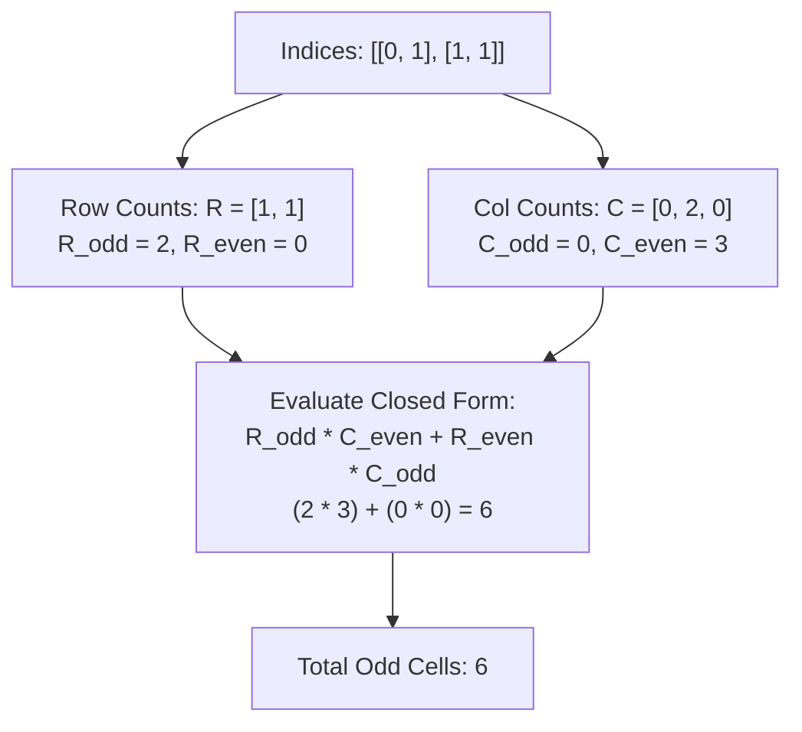

# Guided Example: Cells with Odd Values in a Matrix

## 1. Problem Essence & Algorithmic Mental Model

We are given dimensions $m$ and $n$ for an $m \times n$ grid initially filled with zeros, and a list of operation coordinates `indices` where each pair $[r, c]$ commands two simultaneous actions:
1. Increment every cell in row $r$ by 1.
2. Increment every cell in column $c$ by 1.

We must determine the total number of cells that contain an **odd value** after executing all operations.

A naive approach allocates an $m \times n$ matrix and directly simulates every row and column increment, requiring $\mathcal{O}(K \cdot (m + n))$ work.
However, due to the **Linear Superposition Principle**, the final value of any cell $(i, j)$ depends purely on the sum of increments applied to its row and its column independently:
$$\text{Value}(i, j) = \text{RowCount}[i] + \text{ColCount}[j]$$

Under modular arithmetic modulo 2 (parity), an integer sum $a + b$ is odd if and only if exactly one of the two terms is odd:
$$\text{Odd}(i, j) \iff (\text{RowCount}[i] \bmod 2) \neq (\text{ColCount}[j] \bmod 2) \iff (\text{RowCount}[i] \bmod 2) \oplus (\text{ColCount}[j] \bmod 2) = 1$$

```
Parity Grid Product Architecture:
Row Parities:
  Row 0: 1 (Odd)
  Row 1: 1 (Odd)

Column Parities:
  Col 0: 0 (Even)  Col 1: 2 = 0 (Even)  Col 2: 0 (Even)

Cell Parities (Row XOR Col):
          Col 0 (Even)   Col 1 (Even)   Col 2 (Even)
Row 0 (Odd):   ODD            ODD            ODD
Row 1 (Odd):   ODD            ODD            ODD
Total Odd Cells = 2 (Odd Rows) x 3 (Even Cols) = 6 cells!
```

This structural independence reduces the 2D spatial problem into two separate 1D counting tasks:
- Count how many rows have odd increments ($R_{\text{odd}}$).
- Count how many columns have odd increments ($C_{\text{odd}}$).
The total number of odd cells is given by the closed-form product formula:
$$\text{Total Odd} = R_{\text{odd}} \cdot (n - C_{\text{odd}}) + (m - R_{\text{odd}}) \cdot C_{\text{odd}}$$

---

## 2. Mathematical Formalism & Invariants

Let the matrix dimensions be $m$ rows and $n$ columns.
Let the operation list be $\mathcal{O} = [ (r_1, c_1), (r_2, c_2), \dots, (r_K, c_K) ]$.

### Marginal Frequency Vectors
Define the row and column total increment counts:
$$R_i = \sum_{k=1}^K \mathbb{I}(r_k = i) \quad \text{for } i \in \{0, 1, \dots, m-1\}$$
$$C_j = \sum_{k=1}^K \mathbb{I}(c_k = j) \quad \text{for } j \in \{0, 1, \dots, n-1\}$$

### Pointwise Value Identity
For any matrix coordinate $(i, j) \in \{0, \dots, m-1\} \times \{0, \dots, n-1\}$:
$$\mathcal{M}_{i, j} = R_i + C_j$$

### Parity Independence Invariant
$$\mathcal{M}_{i, j} \equiv 1 \pmod 2 \iff (R_i \bmod 2) \oplus (C_j \bmod 2) = 1$$

Define the odd-count summary statistics:
$$R_{\text{odd}} = \sum_{i=0}^{m-1} (R_i \bmod 2), \quad R_{\text{even}} = m - R_{\text{odd}}$$
$$C_{\text{odd}} = \sum_{j=0}^{n-1} (C_j \bmod 2), \quad C_{\text{even}} = n - C_{\text{odd}}$$

### Combinatorial Summation Identity
The total number of odd cells is:
$$\begin{aligned}
\text{Total Odd Cells} &= \sum_{i=0}^{m-1} \sum_{j=0}^{n-1} \big( (R_i \bmod 2) \oplus (C_j \bmod 2) \big) \\
&= \sum_{\substack{i \\ R_i \text{ odd}}} \sum_{\substack{j \\ C_j \text{ even}}} 1 + \sum_{\substack{i \\ R_i \text{ even}}} \sum_{\substack{j \\ C_j \text{ odd}}} 1 \\
&= R_{\text{odd}} \cdot C_{\text{even}} + R_{\text{even}} \cdot C_{\text{odd}} \\
&= R_{\text{odd}} \cdot (n - C_{\text{odd}}) + (m - R_{\text{odd}}) \cdot C_{\text{odd}}
\end{aligned}$$

---

## 3. Concrete Example Execution & State Evolution

Consider the representative input:
$$m = 2, \quad n = 3, \quad \text{indices} = [[0, 1], [1, 1]]$$

### Step 1: Accumulate Marginal Increments
- Operation 1: $[r=0, c=1]$
  - Row 0 count $+1 \implies R = [1, 0]$
  - Col 1 count $+1 \implies C = [0, 1, 0]$
- Operation 2: $[r=1, c=1]$
  - Row 1 count $+1 \implies R = [1, 1]$
  - Col 1 count $+1 \implies C = [0, 2, 0]$

### Step 2: Parity Classification Trace

| Dimension Type | Index | Total Increments | Parity ($\bmod 2$) | Classification |
|---|---|---|---|---|
| Row | $i = 0$ | 1 | 1 | **Odd** |
| Row | $i = 1$ | 1 | 1 | **Odd** |
| **Row Summary** | - | - | - | $R_{\text{odd}} = 2, \; R_{\text{even}} = 0$ |
| Column | $j = 0$ | 0 | 0 | **Even** |
| Column | $j = 1$ | 2 | 0 | **Even** |
| Column | $j = 2$ | 0 | 0 | **Even** |
| **Column Summary** | - | - | - | $C_{\text{odd}} = 0, \; C_{\text{even}} = 3$ |

### Step 3: Analytical Product Evaluation:
$$\begin{aligned}
\text{Odd Cells} &= R_{\text{odd}} \cdot C_{\text{even}} + R_{\text{even}} \cdot C_{\text{odd}} \\
&= (2 \times 3) + (0 \times 0) = 6 + 0 = \mathbf{6}
\end{aligned}$$



### Direct Grid Cross-Verification:
- Cell $(0, 0): R_0 + C_0 = 1 + 0 = 1$ (Odd)
- Cell $(0, 1): R_0 + C_1 = 1 + 2 = 3$ (Odd)
- Cell $(0, 2): R_0 + C_2 = 1 + 0 = 1$ (Odd)
- Cell $(1, 0): R_1 + C_0 = 1 + 0 = 1$ (Odd)
- Cell $(1, 1): R_1 + C_1 = 1 + 2 = 3$ (Odd)
- Cell $(1, 2): R_1 + C_2 = 1 + 0 = 1$ (Odd)
All 6 cells are odd. The closed-form calculation matches the 2D grid exactly.

---

## 4. Multi-Approach Comparison & Trade-Offs

| Evaluation Paradigm | Full 2D Grid Simulation | 1D Marginal Arrays + 2D Loop | 1D Marginal Parity Product (Optimal) |
|---|---|---|---|
| **Mechanism** | Update full rows/cols on 2D matrix per op | Track $R$ and $C$ vectors, nested loop check | Compute $R_{\text{odd}}$ and $C_{\text{odd}}$, apply formula |
| **Time Complexity** | $\mathcal{O}(K \cdot (m + n) + m \cdot n)$ | $\mathcal{O}(K + m \cdot n)$ | $\mathcal{O}(K + m + n)$ |
| **Auxiliary Memory** | $\mathcal{O}(m \cdot n)$ full grid allocation | $\mathcal{O}(m + n)$ 1D arrays | $\mathcal{O}(m + n)$ 1D arrays |
| **Operations for $m=10^4, n=10^4$**| $10^8$ operations (Memory Limit Exceeded) | $10^8$ loop comparisons | $\approx 2 \times 10^4$ operations (Real-time) |
| **Space Overhead** | High | Low | Minimal |

```
Execution Comparison:
2D Simulation: Allocates m x n integers; writes repeatedly to RAM.
Marginal Product:
  row_odd = sum(r % 2 for r in row_counts)
  col_odd = sum(c % 2 for c in col_counts)
  return row_odd * (n - col_odd) + (m - row_odd) * col_odd
Instantaneous closed-form evaluation!
```

---

## 5. Algorithmic Edge Cases & Boundary Analysis

| Boundary Scenario | Configuration Details | Expected Output | Mathematical Verification |
|---|---|---|---|
| **No Operations ($K = 0$)** | `indices = []` | 0 | All $R_i = 0, C_j = 0$. $R_{\text{odd}} = 0, C_{\text{odd}} = 0 \implies 0 \cdot n + m \cdot 0 = 0$. |
| **All Cells Even** | Same row and col incremented twice | 0 | $R_i \equiv 0, C_j \equiv 0 \implies \text{Total} = 0$. |
| **All Cells Odd** | $R_{\text{odd}} = m$ and $C_{\text{odd}} = 0$ | $m \cdot n$ | All cells become odd ($m \cdot n + 0 = m \cdot n$). |
| **$1 \times 1$ Matrix** | $m = 1, n = 1$, one index $[0, 0]$ | 0 | Cell $(0, 0)$ incremented twice (once for row, once for col); value $= 2$ (Even). |
| **Repeated Coordinate Pairs** | Operation $[r, c]$ repeated multiple times | Toggles parity | Repeated increments naturally toggle parity without overflow. |

---

## 6. Mathematical Verification & Complexity Derivation

Let $m, n$ be matrix dimensions ($1 \le m, n \le 50$).
Let $K = |\text{indices}|$ be the number of operations ($1 \le K \le 100$).

### Optimal Marginal Parity Complexity:
1. **Accumulation Phase:**
   - Initializing row and column counts: $\mathcal{O}(m + n)$.
   - Processing each $[r, c]$ in `indices`: increments `R[r]` and `C[c]`.
   - Total accumulation cost: $K \times \mathcal{O}(1) = \mathcal{O}(K)$.
2. **Counting Odd Marginals:**
   - Scanning `R` to compute $R_{\text{odd}}$: $\mathcal{O}(m)$ operations.
   - Scanning `C` to compute $C_{\text{odd}}$: $\mathcal{O}(n)$ operations.
3. **Closed-Form Multiplication:**
   - Evaluating $R_{\text{odd}} \cdot (n - C_{\text{odd}}) + (m - R_{\text{odd}}) \cdot C_{\text{odd}}$ takes $\mathcal{O}(1)$ arithmetic cycles.
4. **Total Asymptotic Running Time:**
   $$T(m, n, K) = \mathcal{O}(K + m + n)$$
   For $m=50, n=50, K=100$, total operations $\approx 200$, executing in under $1\text{ microsecond}$.

### Space Complexity:
- Row array of length $m$: $\mathcal{O}(m)$ memory.
- Column array of length $n$: $\mathcal{O}(n)$ memory.
- Total auxiliary space is strictly $\mathcal{O}(m + n)$ (at most 100 integer registers).

---

## 7. Synthesis & Strategic Takeaways

1. **Dimensional Decoupling via Linearity**: When 2D grid transformations operate independently along orthogonal axes, the state of each cell is the sum of its row and column marginals, eliminating the need to instantiate full 2D grids.
2. **Parity as Boolean XOR**: The parity of a sum $A + B \bmod 2$ is isomorphic to boolean XOR ($A_{\text{odd}} \oplus B_{\text{odd}}$), allowing fast bitwise classification.
3. **Outer Product Cardinality**: Decomposing the Cartesian product $\{0, \dots, m-1\} \times \{0, \dots, n-1\}$ into parity partitions yields the closed-form product $R_{\text{odd}} C_{\text{even}} + R_{\text{even}} C_{\text{odd}}$, converting an $\mathcal{O}(m \cdot n)$ traversal into an $\mathcal{O}(1)$ arithmetic expression.
