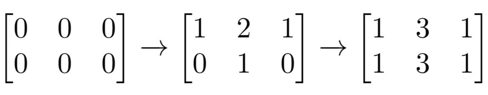
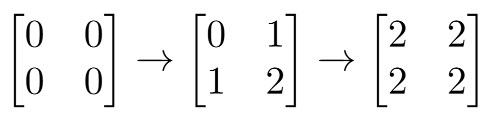

### 1. Description

There is an `m x n` matrix that is initialized to all `0`'s. There is also a 2D array `indices` where each $\text{indices}[i] = [r_{i}, c_{i}]$ represents a **0-indexed location** to perform some increment operations on the matrix.

For each location $\text{indices}[i]$, do **both** of the following:

- Increment **all** the cells on row $r_{i}$.

- Increment **all** the cells on column $c_{i}$.

Given `m`, `n`, and `indices`, return *the **number of odd-valued cells** in the matrix after applying the increment to all locations in *`indices`.

### 2. Function Contract

- `n`: Input parameter.
- Returns expected result.

### 3. Examples

#### Example 1

- **Input:** $m = 2, n = 3, indices = [[0,1],[1,1]]$
- **Output:** `6`
- **Explanation:** Initial matrix = [[0,0,0],[0,0,0]].
After applying first increment it becomes [[1,2,1],[0,1,0]].
The final matrix is [[1,3,1],[1,3,1]], which contains 6 odd numbers.
#### Example 2

- **Input:** $m = 2, n = 2, indices = [[1,1],[0,0]]$
- **Output:** `0`
- **Explanation:** Final matrix = [[2,2],[2,2]]. There are no odd numbers in the final matrix.

### 4. Constraints

- $1 \le m, n \le 50$

- $1 \le \text{indices.length} \le 100$

- $0 \le r_{i} < m$

- $0 \le c_{i} < n$

**Follow up:** Could you solve this in $O(n + m + \text{indices.length})$ time with only $O(n + m)$ extra space?