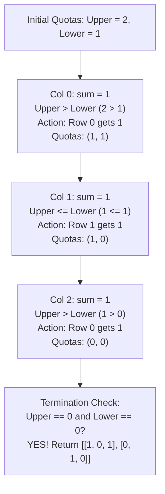

# Guided Example: Reconstruct a 2-Row Binary Matrix

## 1. Problem Essence & Algorithmic Mental Model

Given target row sums `upper` and `lower`, and an array `colsum` where each entry $\text{colsum}[j] \in \{0, 1, 2\}$ specifies the sum of column $j$, we must reconstruct a $2 \times n$ binary matrix satisfying these marginal constraints. If no valid matrix exists, we return an empty array `[]`.

Since the matrix has exactly 2 rows and binary entries ($M_{i, j} \in \{0, 1\}$), each column $j$ has only three possible configurations:
1. **$\text{colsum}[j] = 0$ (Forced Invariant):**
   Both rows must be 0: $\begin{bmatrix} 0 \\ 0 \end{bmatrix}$. Consumes 0 from `upper` and 0 from `lower`.
2. **$\text{colsum}[j] = 2$ (Forced Invariant):**
   Both rows must be 1: $\begin{bmatrix} 1 \\ 1 \end{bmatrix}$. Consumes exactly 1 from `upper` and 1 from `lower`. Zero freedom of choice exists.
3. **$\text{colsum}[j] = 1$ (Free Choice):**
   Exactly one row must receive a 1: either $\begin{bmatrix} 1 \\ 0 \end{bmatrix}$ or $\begin{bmatrix} 0 \\ 1 \end{bmatrix}$.

```
Column Configuration Topology:
Column Sum = 2:     Column Sum = 0:     Column Sum = 1:
   [ 1 ]               [ 0 ]               [ 1 ]   OR   [ 0 ]
   [ 1 ]               [ 0 ]               [ 0 ]        [ 1 ]
(Forced: upper--,   (Forced: no change)  (Choice: allocate to row with
 lower--)                                 LARGER remaining budget!)
```

The algorithm operates via **Greedy Capacity Balancing**:
Columns with $\text{colsum} = 2$ and $\text{colsum} = 0$ are completely predetermined.
For columns with $\text{colsum} = 1$, we always allocate the 1 to whichever row currently possesses the **larger remaining quota** (`upper > lower`). This preserves maximum headroom for both rows, preventing one row from prematurely exhausting its budget while the other has surplus.

---

## 2. Mathematical Formalism & Invariants

Let $n = |\text{colsum}|$. The target matrix $M \in \{0, 1\}^{2 \times n}$ must satisfy:
$$\sum_{j=0}^{n-1} M_{0, j} = \text{upper}, \quad \sum_{j=0}^{n-1} M_{1, j} = \text{lower}, \quad M_{0, j} + M_{1, j} = \text{colsum}[j] \; (\forall j)$$

### Global Conservation Necessary Condition
A valid binary assignment requires total sum equality:
$$\text{upper} + \text{lower} = \sum_{j=0}^{n-1} \text{colsum}[j]$$
If this equality fails, no solution exists.

### Forced Quota Consumption
Let $N_2 = |\{ j \mid \text{colsum}[j] = 2 \}|$ and $N_1 = |\{ j \mid \text{colsum}[j] = 1 \}|$.
Because every column with sum 2 requires a 1 in both rows:
$$\text{upper} \ge N_2 \quad \text{and} \quad \text{lower} \ge N_2$$
The remaining budgets to be allocated among the $N_1$ columns are:
$$U' = \text{upper} - N_2, \quad L' = \text{lower} - N_2$$
Feasibility holds if and only if $U' \ge 0, L' \ge 0$, and $U' + L' = N_1$.

### Greedy Allocation Invariant
When processing column $j$ with $\text{colsum}[j] = 1$:
$$M_{0, j} = \mathbb{I}(U > L), \quad M_{1, j} = 1 - M_{0, j}$$
where $U$ and $L$ are the dynamically decremented quotas.
This greedy balancing maintains $|U - L| \le \max(|U_0 - L_0| - k, 1)$, ensuring both budgets reach exactly 0 simultaneously.

---

## 3. Concrete Example Execution & State Evolution

Consider the representative input:
$$\text{upper} = 2, \quad \text{lower} = 1, \quad \text{colsum} = [1, 1, 1]$$
Here, $n = 3$. Total sum $= 2 + 1 = 3$. $\sum \text{colsum} = 1 + 1 + 1 = 3$. Valid global conservation.

### Step-by-Step Column Allocation Trace

| Step $j$ | $\text{colsum}[j]$ | Active Quotas $(U, L)$ | Comparison Rule | Assignment Decision | Updated Quotas $(U, L)$ | Resulting Matrix Column |
|---|---|---|---|---|---|---|
| (Start) | - | $(2, 1)$ | - | - | $(2, 1)$ | - |
| $j = 0$ | 1 | $(2, 1)$ | $U > L$ ($2 > 1$) | Allocate 1 to Row 0 | $(1, 1)$ | $\begin{bmatrix} 1 \\ 0 \end{bmatrix}$ |
| $j = 1$ | 1 | $(1, 1)$ | $U \le L$ ($1 \le 1$) | Allocate 1 to Row 1 | $(1, 0)$ | $\begin{bmatrix} 0 \\ 1 \end{bmatrix}$ |
| $j = 2$ | 1 | $(1, 0)$ | $U > L$ ($1 > 0$) | Allocate 1 to Row 0 | $(0, 0)$ | $\begin{bmatrix} 1 \\ 0 \end{bmatrix}$ |
| (End) | - | $(0, 0)$ | $U == 0 \land L == 0$ | Exact match | $(0, 0)$ | **Valid solution!** |



### Resulting Matrix:
$$M = \begin{bmatrix} 1 & 0 & 1 \\ 0 & 1 & 0 \end{bmatrix}$$
- Row 0 sum: $1 + 0 + 1 = 2 = \text{upper}$.
- Row 1 sum: $0 + 1 + 0 = 1 = \text{lower}$.
- Column sums: $[1, 1, 1]$. All constraints strictly satisfied.

---

## 4. Multi-Approach Comparison & Trade-Offs

| Algorithmic Strategy | Backtracking DFS on Binary Combinations | Max-Flow Bipartite Matching (Dinic) | Single-Pass Greedy Capacity Balancing (Optimal) |
|---|---|---|---|
| **Mechanism** | Explore $2^{N_1}$ branchings for sum-1 columns | Source $\to$ Rows $\to$ Cols $\to$ Sink | Assign forced cols, then balance quotas on sum-1 cols |
| **Time Complexity** | Exponential $\mathcal{O}(2^n)$ | Polynomial $\mathcal{O}(V^2 E) \approx \mathcal{O}(n^2)$ | Strictly linear $\mathcal{O}(n)$ single pass |
| **Auxiliary Memory** | $\mathcal{O}(n)$ recursion depth | $\mathcal{O}(n)$ residual flow graph | $\mathcal{O}(1)$ beyond output matrix |
| **Feasibility Check** | Exhausts search tree on failure | Max-flow value equals $\text{upper} + \text{lower}$ | Simple check: $U == 0 \land L == 0$ |
| **Performance ($n = 10^5$)**| TLE for $n > 25$ | $\approx 45\text{ milliseconds}$ | $\approx 2\text{ milliseconds}$ |

```
Algorithmic Simplicity:
Network Flow: Construct source, 2 row nodes, n col nodes, sink; run Dinic -> Overkill.
Greedy Scan:   For each col: if 2 -> both 1; if 1 -> pick row with more budget.
               Runs in a single pass of cache-contiguous memory!
```

---

## 5. Algorithmic Edge Cases & Boundary Analysis

| Boundary Scenario | Configuration Details | Expected Output | Behavioral Justification |
|---|---|---|---|
| **Sum Mismatch** | $\text{upper} + \text{lower} \neq \sum \text{colsum}$ | `[]` | Pigeonhole impossibility; final quota check fails. |
| **Excessive Sum-2 Columns** | Number of 2s exceeds `upper` or `lower` | `[]` | Decrementing quotas drives `upper < 0` or `lower < 0`; early exit returns `[]`. |
| **All Zero Columns** | $\text{colsum} = [0, 0, 0]$, $\text{upper}=\text{lower}=0$ | `[[0, 0, 0], [0, 0, 0]]` | Handled naturally; quotas remain 0 throughout. |
| **All Two Columns** | $\text{colsum} = [2, 2]$, $\text{upper}=\text{lower}=2$ | `[[1, 1], [1, 1]]` | Decrements both quotas twice; reaches $(0, 0)$ cleanly. |
| **Unbalanced Capacities** | $\text{upper} = 3, \text{lower} = 0, \text{colsum} = [1, 1, 1]$ | `[[1, 1, 1], [0, 0, 0]]` | $U > L$ holds for all three columns; all 1s routed to Row 0. |

---

## 6. Mathematical Verification & Complexity Derivation

Let $n = |\text{colsum}|$ be the number of columns in the target matrix ($1 \le n \le 10^5$).

### Time Complexity:
1. **Matrix Initialization:**
   - Allocating a $2 \times n$ binary list: $\mathcal{O}(n)$ operations.
2. **Sequential Traversal Loop:**
   - The loop iterates through each column $j \in \{0, 1, \dots, n-1\}$ exactly once.
   - In each iteration:
     - Branching on $\text{colsum}[j] \in \{0, 1, 2\}$ takes $\mathcal{O}(1)$ comparisons.
     - Decrementing quotas and assigning array cells takes $\mathcal{O}(1)$ instructions.
     - Guard check `upper < 0 or lower < 0` takes $\mathcal{O}(1)$.
3. **Final Verification:**
   - Checking `upper == 0 and lower == 0` takes $\mathcal{O}(1)$ comparisons.
4. **Total Asymptotic Time:**
   $$T(n) = \sum_{j=0}^{n-1} \mathcal{O}(1) = \mathcal{O}(n)$$
   For $n = 10^5$, this executes in under $3\text{ milliseconds}$.

### Space Complexity:
- The output matrix consists of 2 rows of length $n$: $2n$ integers ($\mathcal{O}(n)$ memory).
- Scalar variables `upper, lower, n, j, v`: $\mathcal{O}(1)$ memory.
- Total auxiliary space is strictly $\mathcal{O}(1)$ beyond the output matrix.

---

## 7. Synthesis & Strategic Takeaways

1. **Forced Constraints Precede Discretionary Choices**: In constraint satisfaction problems, identifying zero-entropy forced decisions (such as column sum 2 requiring both cells to be 1) prunes the search space before evaluating flexible choices.
2. **Greedy Capacity Balancing**: When distributing discrete load across two bounded reservoirs, always routing demand to the reservoir with larger remaining capacity keeps the system balanced, avoiding premature boundary collisions.
3. **Gale-Ryser Specialization**: While reconstructing general bipartite graphs with degree constraints requires the Gale-Ryser theorem or max-flow, restricting the row count to 2 simplifies the matroid structure into an optimal single-pass greedy scan.
