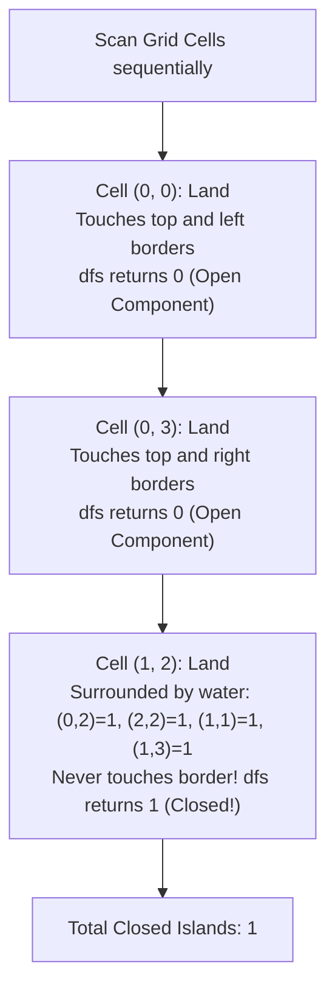

# Guided Example: Number of Closed Islands

## 1. Problem Essence & Algorithmic Mental Model

Given an $m \times n$ grid consisting of `0`s (land) and `1`s (water), an **island** is defined as a maximal 4-directionally connected component of land cells. A **closed island** is an island that is completely surrounded by water on all four sides (top, right, bottom, left). In terms of the grid boundaries, this means that **no cell of the island may lie on the perimeter of the grid** ($i = 0, i = m-1, j = 0, j = n-1$). If any cell of an island touches the boundary, it "leaks" off the grid and is not closed.

We must determine the total number of strictly closed islands.

Consider the grid as a topological surface:
- Any land cell situated on the outer border has an open edge facing off-grid. Any land cells connected to it belong to an "open" boundary continent.
- Any land component completely contained within the strict interior $1 \le i \le m-2, 1 \le j \le n-2$ that is buffered on all sides by water cells (`1`) forms a "closed" island.

```
Grid Topological Segmentation (0 = Land, 1 = Water):
    c=0  c=1  c=2  c=3  c=4
r=0 [0]  [0]   1   [0]  [0]   <── Border Land (Open Continent)
r=1 [0]   1   (0)   1   [0]   <── Center Cell (0) is surrounded by 1s!
r=2 [0]   1    1    1   [0]   <── Border Land (Open Continent)

[0] = Open Land (touches perimeter -> INVALID)
(0) = Closed Island at (1, 2) (completely enclosed by 1s -> VALID, Count = 1)
```

The algorithm performs **Depth-First Search (DFS) Component Sinking**:
- Traverse unvisited land cells (`0`) to explore their entire connected component.
- During traversal, sink visited land into water by setting `grid[i][j] = 1`, preventing redundant visits.
- Track whether *every* cell in the component lies strictly within the interior:
  $$\text{is\_interior} = (0 < i < m - 1) \land (0 < j < n - 1)$$
- Aggregate this condition across all cells in the component via logical AND ($\&$). The component increments our closed island counter if and only if every single cell was interior.

---

## 2. Mathematical Formalism & Invariants

Let the grid domain be $\mathcal{G} = \{0, 1, \dots, m-1\} \times \{0, 1, \dots, n-1\}$.
Define the boundary perimeter:
$$\partial \mathcal{G} = \{ (i, j) \in \mathcal{G} \mid i = 0 \lor i = m-1 \lor j = 0 \lor j = n-1 \}$$
Define the interior region:
$$\text{Int}(\mathcal{G}) = \mathcal{G} \setminus \partial \mathcal{G} = \{ (i, j) \in \mathcal{G} \mid 0 < i < m-1 \land 0 < j < n-1 \}$$

### Island Connected Component
A land component $\mathcal{C} \subseteq \mathcal{G}$ is a maximal connected subset of vertices in the 4-neighbor grid graph such that $\forall (i, j) \in \mathcal{C}, \text{grid}[i][j] = 0$.

### Closed Island Theorem
An island component $\mathcal{C}$ is closed if and only if it is completely contained within the interior:
$$\mathcal{C} \text{ is closed} \iff \mathcal{C} \cap \partial \mathcal{G} = \emptyset \iff \mathcal{C} \subseteq \text{Int}(\mathcal{G})$$

### Recursive Predicate Propagation Invariant
For a component $\mathcal{C}$ explored starting at root $(r, c)$:
$$\text{dfs}(i, j) = \mathbb{I}\big( (i, j) \in \text{Int}(\mathcal{G}) \big) \;\land\; \bigwedge_{(x, y) \in \mathcal{N}(i, j) \cap \mathcal{C}} \text{dfs}(x, y)$$
Because the bitwise AND ($\&$) absorbs $0$, if even a single cell $(x, y) \in \mathcal{C}$ touches the boundary $\partial \mathcal{G}$, the return value for the entire component collapses to $0$.

---

## 3. Concrete Example Execution & State Evolution

Consider the input grid:
$$\text{grid} = \begin{bmatrix}
0 & 0 & 1 & 0 & 0 \\
0 & 1 & 0 & 1 & 0 \\
0 & 1 & 1 & 1 & 0
\end{bmatrix}$$
Dimensions: $m = 3, n = 5$.

### Step-by-Step Traversal Trace

| Scan Order $(i, j)$ | Initial State | Action Taken | Component Explored | Boundary Cell Encountered? | Sunk to Water | Component Closed? | Cumulative Closed Islands |
|---|---|---|---|---|---|---|---|
| $(0, 0)$ | Land (`0`) | DFS start | Cells $(0, 0), (0, 1), (1, 0), (2, 0)$ | **Yes:** $(0, 0) \in \partial \mathcal{G}$ | Sunk to `1` | **No (Open)** | 0 |
| $(0, 3)$ | Land (`0`) | DFS start | Cells $(0, 3), (0, 4), (1, 4), (2, 4)$ | **Yes:** $(0, 3) \in \partial \mathcal{G}$ | Sunk to `1` | **No (Open)** | 0 |
| $(1, 2)$ | Land (`0`) | DFS start | Cell $(1, 2)$ | **No:** $0 < 1 < 2 \land 0 < 2 < 4$ | Sunk to `1` | **Yes (Closed!)** | **1** |
| Remaining | Water (`1`) | - | No unvisited land remains | - | - | - | **1** |



### Verification of Cell $(1, 2)$:
- North neighbor $(0, 2) = 1$ (Water)
- South neighbor $(2, 2) = 1$ (Water)
- West neighbor $(1, 1) = 1$ (Water)
- East neighbor $(1, 3) = 1$ (Water)
Cell $(1, 2)$ is completely enclosed by water on all four sides. Total closed islands $= \mathbf{1}$.

---

## 4. Multi-Approach Comparison & Trade-Offs

| Algorithmic Strategy | Boundary Elimination Pre-pass + Count | Single-Pass DFS with AND Predicate (Optimal) | Disjoint Set Union (DSU) with Dummy Border Node |
|---|---|---|---|
| **Mechanism** | 1. Flood fill from boundary cells to sink them<br/>2. Count remaining interior islands | DFS every component, evaluate $\text{res} = \text{res} \ \& \ \text{dfs}()$ | Union adjacent 0s; union border 0s to virtual node $\infty$ |
| **Passes over Grid** | Two distinct passes | Single scan pass | Edge union pass + component count |
| **Time Complexity** | $\mathcal{O}(m \cdot n)$ | $\mathcal{O}(m \cdot n)$ | $\mathcal{O}(m \cdot n \cdot \alpha(m \cdot n))$ |
| **Auxiliary Memory** | $\mathcal{O}(m \cdot n)$ call stack | $\mathcal{O}(m \cdot n)$ call stack | $\mathcal{O}(m \cdot n)$ parent array |
| **In-Place Mutation** | Modifies `grid` in-place | Modifies `grid` in-place | Non-destructive (reads grid only) |
| **Implementation Complexity**| Moderate (duplicate flood fill code) | Minimal (10 lines total) | High (DSU boilerplate) |

```
Execution Comparison:
Boundary Pre-Pass: Runs DFS on all 4 borders, then runs DFS on interior -> 2 passes.
Single-Pass DFS:   dfs() visits component once, returns 0 if any border cell is touched.
                   res = int(interior) & dfs(up) & dfs(down) & dfs(left) & dfs(right)
                   Single pass, completely clean!
```

---

## 5. Algorithmic Edge Cases & Boundary Analysis

| Boundary Scenario | Configuration Details | Expected Output | Structural Justification |
|---|---|---|---|
| **All Water Grid** | Grid filled entirely with `1`s | 0 | No land cells exist; loop never initiates DFS. |
| **All Land Grid** | Grid filled entirely with `0`s | 0 | Single massive component touches all 4 borders; returns 0. |
| **Corner-Touching Island**| Island touches cell $(0, 0)$ | 0 | Cell $(0, 0)$ is on boundary; entire component invalidated. |
| **Multiple Closed Islands**| Several separated pools of interior 0s | Exact count | Each interior component sinks independently, incrementing count. |
| **Minimum Grid Size ($3 \times 3$)**| $3 \times 3$ with center `0` | 1 | Only cell $(1, 1)$ is interior; if surrounded by 1s, yields 1. |

---

## 6. Mathematical Verification & Complexity Derivation

Let $m$ be the number of rows and $n$ be the number of columns. Total grid cells $N = m \cdot n$ ($1 \le m, n \le 100$).

### Time Complexity Analysis:
1. **Grid Traversal:**
   - The outer nested loop inspects each cell $(i, j) \in \mathcal{G}$ exactly once: $m \cdot n$ checks.
2. **Component Flood Fill:**
   - When a land cell (`0`) is encountered, DFS explores all 4-directional edges.
   - Each land cell is set to `1` upon entry (`grid[i][j] = 1`), ensuring it is visited at most once across the entire execution.
   - Each cell explores 4 directional neighbors: $4 \times m \cdot n$ edge checks.
3. **Total Operation Count:**
   $$T(m, n) = \mathcal{O}(m \cdot n)$$
   For $m = 100, n = 100$, $N = 10,000$ cells, executing in under $3\text{ milliseconds}$.

### Space Complexity Analysis:
- The algorithm modifies `grid` in-place to track visited status, using $\mathcal{O}(1)$ auxiliary heap memory.
- In the worst case (a snake-like land corridor filling the grid), the recursion call stack can reach a maximum depth of $m \cdot n$:
  $$\text{Stack Depth} \le m \cdot n = \mathcal{O}(m \cdot n)$$
  For $10,000$ frames, this consumes approximately $1\text{ MB}$, well within standard limits.

---

## 7. Synthesis & Strategic Takeaways

1. **Topological Boundary Detection via Monolithic AND**: In connected component classification, whether an entire component satisfies a global geometric invariant (such as avoiding borders) can be accumulated by bitwise ANDing local cell validity across all recursive branches.
2. **In-Place Sinking Eliminates Visited Sets**: Overwriting visited land cells (`0 \to 1`) directly in the grid eliminates the need for hash sets or secondary boolean arrays, maximizing spatial cache locality.
3. **Short-Circuit Evaluation Prevention**: When using `res &= dfs(x, y)`, note that Python's `&` operator (unlike `and`) unconditionally evaluates both operands, ensuring that the entire connected component is sunk into water even after a boundary cell has already been detected.
