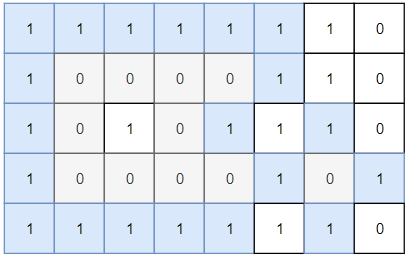
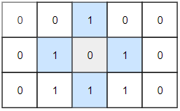

## Description

Given a 2D `grid` consists of `0s` (land) and `1s` (water).  An *island* is a maximal 4-directionally connected group of `0s` and a *closed island* is an island **totally** (all left, top, right, bottom) surrounded by `1s.`

Return the number of *closed islands*.
### Function Contract

- `n`: Input parameter.
- Returns expected result.

### Examples
#### Example 1

- **Input:** `grid = [[1,1,1,1,1,1,1,0],[1,0,0,0,0,1,1,0],[1,0,1,0,1,1,1,0],[1,0,0,0,0,1,0,1],[1,1,1,1,1,1,1,0]]`
- **Output:** `2`
- **Explanation:**
Islands in gray are closed because they are completely surrounded by water (group of 1s).
#### Example 2

- **Input:** `grid = [[0,0,1,0,0],[0,1,0,1,0],[0,1,1,1,0]]`
- **Output:** `1`
#### Example 3

- **Input:** `grid = [[1,1,1,1,1,1,1],`
[1,0,0,0,0,0,1],
[1,0,1,1,1,0,1],
[1,0,1,0,1,0,1],
[1,0,1,1,1,0,1],
[1,0,0,0,0,0,1],
[1,1,1,1,1,1,1]]
- **Output:** `2`
### Constraints

- $1 \le \text{grid.length}, \text{grid}[0].length \le 100$

- $0 \le \text{grid}[i][j] \le 1$