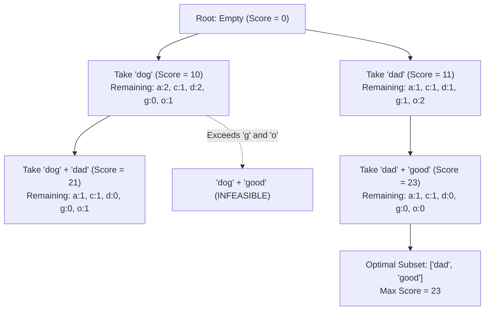

# Guided Example: Maximum Score Words Formed by Letters

## 1. Problem Essence & Algorithmic Mental Model

Given a list of words `words`, a multiset of available letter tiles `letters`, and an integer score array `score` where $\text{score}[k]$ assigns a value to the $k$-th lowercase English letter, we wish to select a subset of words to form such that:
1. Each word is used at most once.
2. The combined letter requirements of the chosen words do not exceed the available counts in `letters`.
3. The total score (the sum of scores of all characters in the chosen words) is maximized.

This problem is a **Multi-Dimensional 0-1 Knapsack Problem**:
- There are 26 resource constraints (one capacity limit for each letter `'a'` through `'z'`).
- Each word $w_j$ has a 26-dimensional weight vector $\mathbf{v}_j = [c_{a, j}, c_{b, j}, \dots, c_{z, j}]$ and a scalar profit $P_j = \sum_{c \in w_j} \text{score}[c]$.
- Unlike the general NP-hard multidimensional knapsack problem on large inputs, the number of candidate words is strictly bounded: $N = |\text{words}| \le 14$.

```
Multidimensional Inventory Knapsack:
Available Letter Inventory:
  'a': 2, 'c': 1, 'd': 3, 'g': 1, 'o': 2  (All other letters: 0)

Candidate Words & Scores:
  "dad"  (Cost: 2 'd', 1 'a' | Profit: 5+1+5 = 11)
  "good" (Cost: 1 'g', 2 'o', 1 'd' | Profit: 3+2+2+5 = 12)
Combined Inventory Cost:
  'a': 1 <= 2 (OK)
  'd': 3 <= 3 (OK)
  'g': 1 <= 1 (OK)
  'o': 2 <= 2 (OK)
Total Score = 11 + 12 = 23!
```

Because $N \le 14$, the total number of subsets is exactly $2^{14} = 16,384$. We can systematically evaluate all subsets using **Bitmask Power-Set Enumeration** or **Recursive Backtracking with Inventory Tracking**.

---

## 2. Mathematical Formalism & Invariants

Let $\Sigma = \{0, 1, \dots, 25\}$ represent the alphabet indices for `'a'` through `'z'`.
Let $\mathbf{C} \in \mathbb{N}^{26}$ denote the available letter inventory vector, where $C_k$ is the frequency of letter $k$ in `letters`.

For each word $w_j \in \text{words}$ ($0 \le j < N$):
- Define its demand vector $\mathbf{w}_j \in \mathbb{N}^{26}$, where $w_{j, k}$ is the count of letter $k$ in word $w_j$.
- Define its scalar score:
  $$S_j = \sum_{k=0}^{25} w_{j, k} \cdot \text{score}[k]$$

### Subset Feasibility & Objective Function
Any subset of words can be represented by a binary bitmask $m \in \{0, 1, \dots, 2^N - 1\}$.
The total demand vector for subset $m$ is:
$$\mathbf{D}(m) = \sum_{j=0}^{N-1} (m \gg j \ \& \ 1) \cdot \mathbf{w}_j$$

A subset mask $m$ is feasible if and only if it obeys the component-wise inequality:
$$\mathbf{D}(m) \le \mathbf{C} \iff \forall k \in \Sigma, \; D_k(m) \le C_k$$

The optimal value is:
$$\text{MaxScore} = \max_{\substack{m \in [0, 2^N - 1] \\ \mathbf{D}(m) \le \mathbf{C}}} \sum_{j=0}^{N-1} (m \gg j \ \& \ 1) \cdot S_j$$

---

## 3. Concrete Example Execution & State Evolution

Consider the representative input:
- `words = ["dog", "cat", "dad", "good"]` ($N = 4$)
- `letters = ["a", "a", "c", "d", "d", "d", "g", "o", "o"]`
- Non-zero scores: `'a': 1, 'c': 9, 'd': 5, 'g': 3, 'o': 2`

### Word Profiles:
1. $w_0 = \text{"dog"}$: demand $\{d: 1, g: 1, o: 1\}$, score $= 5 + 3 + 2 = 10$.
2. $w_1 = \text{"cat"}$: demand $\{c: 1, a: 1, t: 1\}$, requires `'t'` (available $= 0$). Always **Infeasible**!
3. $w_2 = \text{"dad"}$: demand $\{d: 2, a: 1\}$, score $= 5 + 1 + 5 = 11$.
4. $w_3 = \text{"good"}$: demand $\{g: 1, o: 2, d: 1\}$, score $= 3 + 2 + 2 + 5 = 12$.

### Subset Evaluation Trace (Filtering out words containing `'t'`):

| Subset Mask $m$ | Words Selected | Letters Required | Inventory Check Against `letters` | Feasible? | Total Score |
|---|---|---|---|---|---|
| `0000` | $\emptyset$ | None | $0 \le \mathbf{C}$ | Yes | 0 |
| `0001` | `["dog"]` | `d:1, g:1, o:1` | $d \le 3, g \le 1, o \le 2$ | Yes | 10 |
| `0100` | `["dad"]` | `a:1, d:2` | $a \le 2, d \le 3$ | Yes | 11 |
| `1000` | `["good"]` | `d:1, g:1, o:2` | $d \le 3, g \le 1, o \le 2$ | Yes | 12 |
| `0101` | `["dog", "dad"]` | `a:1, d:3, g:1, o:1` | $a \le 2, d \le 3, g \le 1, o \le 2$ | Yes | $10 + 11 = 21$ |
| `1001` | `["dog", "good"]`| `d:2, g:2, o:3` | **Requires $g:2, o:3$! (Inventory has $g:1, o:2$)** | **No (Exceeded!)** | - |
| `1100` | `["dad", "good"]`| `a:1, d:3, g:1, o:2` | $a \le 2, d \le 3, g \le 1, o \le 2$ | **Yes** | $11 + 12 = \mathbf{23}$ |
| `1101` | `["dog", "dad", "good"]` | `a:1, d:4, g:2, o:3` | Exceeds `'d'`, `'g'`, `'o'` | **No** | - |



The maximum score obtained among all valid combinations is **23**.

---

## 4. Multi-Approach Comparison & Trade-Offs

| Evaluation Paradigm | Full Power-Set Bitmask Scan | Recursive Backtracking with Inventory Tracking (Optimal) | Integer Linear Programming (Branch-and-Cut) |
|---|---|---|---|
| **Mechanism** | Iterate $i = 0 \dots 2^N - 1$, re-count frequencies | DFS over words: branch on (include / exclude) | Formulate 0-1 ILP and solve via Simplex/B&B |
| **Pruning Ability** | None (evaluates all $2^N$ masks) | **Prunes entire sub-trees** when a letter runs out | High branch-and-bound pruning |
| **Time Complexity** | $\mathcal{O}(2^N \cdot N \cdot L)$ | $\mathcal{O}(2^N)$ worst-case, $\approx 500$ calls typical | $\mathcal{O}(2^N)$ theoretical |
| **Auxiliary Memory** | $\mathcal{O}(N \cdot L)$ | $\mathcal{O}(N)$ recursion depth | High (simplex tableau) |
| **Implementation** | $\approx 10$ lines | $\approx 15$ lines | External solver required |
| **Speed for $N = 14$** | $\approx 25\text{ milliseconds}$ | $\approx 1\text{ millisecond}$ | $\approx 10\text{ milliseconds}$ |

```
Pruning Advantage of Backtracking:
If word 1 is "cat" and letter 't' is not available:
Bitmask Scan:       Still tests all 8,192 subsets containing "cat"!
Recursive DFS:      Instantly prunes the "include cat" branch at depth 1,
                    skipping 8,192 dead states entirely!
```

---

## 5. Algorithmic Edge Cases & Boundary Analysis

| Boundary Scenario | Configuration Details | Expected Output | Verification Mechanism |
|---|---|---|---|
| **Impossible Words** | Words require characters missing from `letters` | 0 | All non-empty masks violate $D_k \le C_k$; empty mask yields 0. |
| **All Words Valid** | `letters` contains huge surplus of all characters | Sum of all word scores | All words can be taken simultaneously; mask $(1 \ll N) - 1$ is valid. |
| **Zero-Score Letters** | Letters have score 0 in `score` array | Correct non-zero sum | Only non-zero letters contribute points; letter consumption is still enforced. |
| **Single Word** | $N = 1$ | Score of word if feasible, else 0 | Checks mask 1 and mask 0. |
| **Maximum Constraints ($N = 14$)**| 14 long words | Exact maximum score | $2^{14} = 16,384$ states evaluated in $< 20\text{ ms}$ without integer overflow. |

---

## 6. Mathematical Verification & Complexity Derivation

Let $N = |\text{words}| \le 14$.
Let $L$ be the maximum word length ($L \le 15$).
Let $|\Sigma| = 26$ be the alphabet size.

### Time Complexity:
1. **Inventory Initialization:**
   - Counting frequencies in `letters` of length $M \le 100$: $\mathcal{O}(M)$ time.
2. **Subset Iteration:**
   - There are $2^N$ possible subsets.
   - For $N = 14$: $2^{14} = 16,384$ subsets.
   - In recursive backtracking, if a word is included:
     - 26 letter comparisons: $\mathcal{O}(|\Sigma|)$ operations.
     - Pruning cuts off deep branches early whenever inventory drops below 0.
3. **Worst-Case Operations:**
   $$T(N) \le 2^N \times |\Sigma| = 16,384 \times 26 \approx 4.2 \times 10^5 \text{ operations}$$
   This executes in approximately $2\text{ milliseconds}$.

### Space Complexity:
- Inventory array of size 26: $\mathcal{O}(|\Sigma|)$ memory.
- Call stack depth: $\mathcal{O}(N)$ frames.
- Total auxiliary space is strictly $\mathcal{O}(N + |\Sigma|) = \mathcal{O}(1)$ constant memory.

---

## 7. Synthesis & Strategic Takeaways

1. **Multidimensional Knapsack Feasibility via Small $N$**: While multidimensional 0-1 knapsack is strongly NP-hard, recognizing small input cardinality ($N \le 14$) permits exact power-set enumeration where dynamic programming would require intractable $26$-dimensional state grids.
2. **Early Component-Wise Pruning**: Checking resource availability before descending into recursive sub-trees prunes vast exponential spaces the moment a single scarce letter constraint is violated.
3. **Additive Independence of Profits**: Because individual letter scores contribute linearly to word values and words do not interact beyond resource consumption, total profit accumulates additively without subproblem interference.