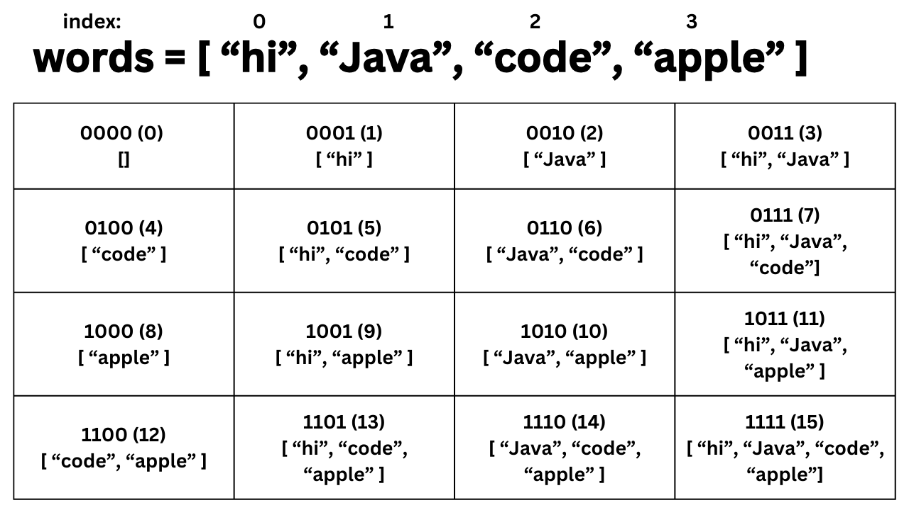

[TOC]

## Solution

---

### Overview

Given a list of `words`, we need to find the maximum subset score using the given set of `letters`. Each letter has a score tied to it, which is provided in `score`. Each entry in `words` can only be used once, although the same word can occur as multiple entries. Each character in `letters` can be used at most once.

This problem tests your ability to implement an algorithm that efficiently maintains a maximum score over all subsets of a set of words. The two main ways to do this are using an iterative loop and a recursive search method.

---

### Approach 1: Iterative Loop for Every Subset

#### Intuition

Since the size of the input is very small, a brute-force solution is feasible. We can check all subsets of `words` and return the largest score among subsets that can be constructed with the given `letters`.

Let's create a frequency array `freq` that stores the frequency of each letter in `letters`, which is needed to track how many copies of each letter we can use. For every subset of words, let's also create a `subsetLetters` array that stores the frequency of each letter of every word in the subset. The `subsetLetters` array is used to track the current state of words and how many copies of each letter are needed to build the current subset. Specifically, this subset can be constructed if and only if $\text{freq}[c] \le \text{subsetLetters}[c]$ for all letters `c`. If a subset is valid, its score is equal to the sum of $\text{subsetLetters}[c] * \text{score}[c]$ for all `c`.

Now that we have a strategy to check the validity and score of a subset, we need to generate and check the subsets. For this approach, we'll use a for loop that iterates through every integer `mask` whose binary representation corresponds to a subset of `words`. The $i^{\texttt{th}}$ bit in `mask` equals `1` if this subset contains $\text{words}[i]$, and `0` otherwise.

Example binary representations of subsets:



#### Algorithm

1. Generate a frequency array where $\text{freq}[c]$ is the number of times letter `c` appears in `letters`.
2. Initialize `maxScore` to store the largest score among valid subsets.
3. Use a for loop that goes from $0$ (inclusive) to $2^W$ (exclusive) where $W$ is the length of `words` to iterate over every subset using masks. For each mask, word $i$ is in this subset if the $i^{\texttt{th}}$ bit is set in the current mask.
4. For each word in the current subset, increment $\text{subsetLetters}[c]$ for each letter `c` in the word.
5. Declare a helper function, `subsetScore,` that checks if the subset can be built out of the given letters and calculates the score:
- Initialize a variable `totalScore` to `0`.
- For each character in the alphabet, compute the score of this subset by adding $\text{score}[c]$ for every occurrence of `c` in this subset, and add it to `totalScore`.  If $\text{freq}[c] < \text{subsetLetters}[c]$ holds true for any letter `c`, then return $0$, as this subset is impossible to construct with the given letters.
- Return `totalScore`.
6. If `maxScore` is less than the result of `subsetScore`, update `maxScore`.
7. Return `maxScore` after all subsets are checked.

#### Implementation

```python
class Solution:
    def maxScoreWords(
        self, words: List[str], letters: List[str], score: List[int]
    ) -> int:
        W = len(words)

        # Count how many times each letter occurs
        freq = [0 for i in range(26)]
        for c in letters:
            freq[ord(c) - 97] += 1

        # Calculate score of subset
        def subset_score(subset_letters, score, freq):
            total_score = 0
            for c in range(26):
                total_score += subset_letters[c] * score[c]

                # Check if we have enough of each letter
                # to build this subset of words
                if subset_letters[c] > freq[c]:
                    return 0
            return total_score

        max_score = 0

        # Iterate over every subset of words
        subset_letters = {}
        for mask in range(1 << W):

            # Reset the subset_letters map
            subset_letters = [0 for i in range(26)]

            # Find words in this subset
            for i in range(W):
                if (mask & (1 << i)) > 0:

                    # Count the letters in this word
                    L = len(words[i])
                    for j in range(L):
                        subset_letters[ord(words[i][j]) - 97] += 1

            # Calculate score of subset
            max_score = max(
                max_score, subset_score(subset_letters, score, freq)
            )

        # Return max_score as the result
        return max_score
```

#### Complexity Analysis

Let $W$ be the length of `words`, $L$ be the maximum length of any word in `words`, and $A$ be the size of the alphabet (in this case, $A = 26$).

* Time complexity: $O(2^W \cdot (WL + A))$.

For each subset, we need to iterate through every string in this subset, which takes $WL$ time. Additionally, $A$ operations are needed to populate the `subsetLetters` array for each subset.

We have two choices for each word: it belongs in the subset, or it doesn't. This gives a total of $2^W$ possible subsets for $W$ words. Therefore, this yields a complexity of $O(2^W(WL + A))$.

* Space complexity: $O(A)$.

In this implementation, only two arrays of length $A$ are created: the `freq` array, which stores the frequencies of characters in `letters`, and the `subsetLetters` array, which stores letter frequencies for the current subset.

---

### Approach 2: Backtracking

#### Intuition

Suppose the set of usable letters in a given input does not contain the letter "d", and the set of words is `["abcd", "acc", "abb", "bc"]`. Note that any subset containing the word "abcd" is always invalid, because the word contains letter "d". The iterative approach will continue to check every subset that contains "abcd", which results in a considerable amount of unnecessary computation. What if we had a way to prune all subsets containing the word "abcd"? This is where a recursive solution comes into play.

Rather than iteratively checking every subset of words, we can use a recursive function to choose whether we include or exclude the current word in a candidate subset. If we pass the `subsetLetters` array as a parameter throughout every recursive call, after the addition of a word to a subset, we can check if there is a letter `c` where $\text{subsetLetters}[c]$ exceeds $\text{freq}[c]$ (see the `isValidWord` method). Once a recursive call terminates, we can roll back any changes made by the current recursive call to extensively search for all possibilities.

This approach is called backtracking, which is a search strategy that visits states and rolls back changes to return to a previous state. Doing so allows you to explore all branches from one state. For more details, see our [backtracking explore card](https://leetcode.com/explore/learn/card/recursion-ii/472/backtracking/).

The base case is when all words have been considered for the subset, which is handled by comparing `maxScore` with `totalScore` and updating `maxScore` if `totalScore` is larger. The recursive case considers two choices: adding the $i^{\texttt{th}}$ word or not adding the $i^{\texttt{th}}$ word. This generates the subsets that will eventually either reach the base case or get pruned because that subset is not valid.

One notable merit of this backtracking solution lies in the pruning of bad subsets. If there is a set of subsets that share the same words that break the limits imposed by the given letters, the recursive algorithm can choose not to continue the search down this branch. For example, if the first word cannot be constructed, this recursive algorithm would immediately cut out any subset containing the first word, whereas an iterative solution would still check every subset that contains the first word.

#### Algorithm

1. Generate a frequency array where $\text{freq}[c]$ is the number of times letter `c` appears in `letters`.
2. Initialize `maxScore` to store the largest score among valid subsets.
3. Call a recursive subroutine `check` that passes `w` (the index of the current word), `words`, `score`, `subsetLetters`, and `totalScore` (the sum of word scores in the subset) as parameters. Steps 4-10 describe the `check` method.
4. If `w` equals $-1$, all words have been considered, and we should update `maxScore` to `totalScore` if `maxScore` is less than `totalScore`.
5. Otherwise, we need to consider two possible recursive calls: one that adds $\text{words}[w]$ to the subset, and one that doesn't.
6. To account for not adding a word, call $check(w - 1, words, score, subsetLetters, totalScore)$.
7. To add $\text{words}[w]$ to the subset, update `subsetLetters` and `totalScore` to include the word.
8. If the addition of $\text{words}[w]$ does not violate letter limits imposed by `freq`, make the recursive call $check(w - 1, words, score, subsetLetters, totalScore)$. To check for validity, we define the `isValidWord` method as follows:
- For each character in the alphabet, check if $\text{freq}[c] < \text{subsetLetters}[c]$. If there exists such `c`, return `false`.
- Return `true` if the subset can be built out of the given letters.
9. Roll back the changes to `subsetLetters` and `totalScore` immediately after making this recursive call.
10. Call $check(W - 1, words, score, subsetLetters, 0)$, where `subsetLetters` is initially all zeros.
11. Return `maxScore` as the result.

#### Implementation

```python
class Solution:
    def maxScoreWords(
        self, words: List[str], letters: List[str], score: List[int]
    ) -> int:
        W = len(words)
        # Count how many times each letter occurs
        self.max_score = 0
        freq = [0 for i in range(26)]
        subset_letters = [0 for i in range(26)]
        for c in letters:
            freq[ord(c) - 97] += 1

        # Check if adding this word exceeds the frequency of any letter
        def is_valid_word(subset_letters):
            for c in range(26):
                if freq[c] < subset_letters[c]:
                    return False
            else:
                return True

        def check(w, words, score, subset_letters, total_score):
            if w == -1:
                # If all words have been iterated,
                # check the score of this subset
                self.max_score = max(self.max_score, total_score)
                return
            # Not adding words[w] to the current subset
            check(w - 1, words, score, subset_letters, total_score)
            # Adding words[w] to the current subset
            L = len(words[w])
            for i in range(L):
                c = ord(words[w][i]) - 97
                subset_letters[c] += 1
                total_score += score[c]
            if is_valid_word(subset_letters):
                # Consider the next word if this subset is still valid
                check(w - 1, words, score, subset_letters, total_score)
            # Rollback effects of this word
            for i in range(L):
                c = ord(words[w][i]) - 97
                subset_letters[c] -= 1
                total_score -= score[c]

        check(W - 1, words, score, subset_letters, 0)
        # Return max_score as the result
        return self.max_score
```

#### Complexity Analysis

Let $W$ be the length of `words`, $L$ be the maximum length of any word in `words`, and $A$ be the size of the alphabet (in this case, $A = 26$).

* Time complexity: $O(2^W \cdot (L + A))$.

There are a total of $2^W$ subsets that could be checked, and the `check` function could be called for each one, or up to $2^W$ times. Inside the `check` function, we iterate through the current word's letters to determine if the subset it currently belongs in is valid, which takes $L$ time. Additionally, the `isValidWord` function takes $A$ time because we compare the count of each letter in the alphabet with the frequency. This yields a complexity of $O(2^W(L + A)$.

While the worst-case runtime of backtracking matches the worst-case runtime of the iterative solution, in practice, the backtracking solution will prune many subset possibilities that break the limits imposed by the given letters and will run significantly faster than the iterative solution.

* Space complexity: $O(A + W)$.

In this implementation, only two arrays of length $A$ are created: the `freq` array that stores the frequencies of characters in `letters`, and the `subsetLetters` array that stores letter frequencies for the current subset. Additionally, the `check` method is called with and without each element in `words`, which incurs $O(W)$ space on the recursive call stack.