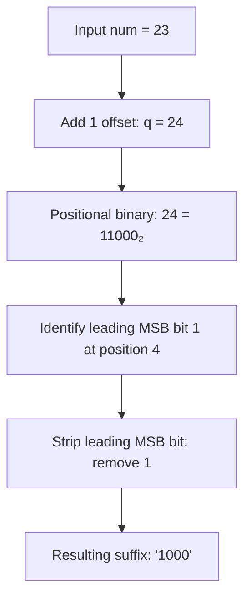

# Guided Example: Encode Number

We trace the step-by-step transformation of a non-negative integer into its canonical shortlex binary encoding on a representative problem instance:

- **Input:** `num = 23`
- **Required Output:** `"1000"`

This instance illustrates the transition from zero-based integer indices to binary tree path addresses, exposing why simple base-2 conversion fails and how offset shifting restores bijective alignment.

---

## 1. Instance & Teaching Goal

In standard positional binary notation, positive integers have no leading zeros, which prevents direct representation of strings like `"0"`, `"00"`, or `"01"`. The problem defines an encoding that orders all binary strings first by length (shortlex order) and then lexicographically:

$$
\varepsilon, \text{"0"}, \text{"1"}, \text{"00"}, \text{"01"}, \text{"10"}, \text{"11"}, \text{"000"}, \dots
$$

The target is to determine the $23\text{rd}$ string (0-indexed) in this infinite sequence.

A naive generation method would enumerate all binary strings length by length until reaching index $23$. While feasible for small numbers, this approach scales linearly with $N$ and becomes intractable when $N = 10^9$. The optimal strategy establishes a mathematical bijection between the shifted index $q = \text{num} + 1$ and the node addressing system of a complete binary tree.

```
                    1 (empty: "")
                  /               \
            2 ("0")               3 ("1")
           /       \             /       \
       4 ("00")   5 ("01")   6 ("10")   7 ("11")
      /
   ...
  24 ("1000")
```

The goal is to compute `"1000"` directly in logarithmic time without generating intermediate strings.

---

## 2. Conceptual Foundation & Invariants

Each length block $L \ge 0$ contains exactly $2^L$ binary words. The cumulative count of all strings having length strictly less than $L$ forms a geometric series:

$$
S(L) = \sum_{k=0}^{L-1} 2^k = 2^L - 1
$$

Thus, strings of length $L$ span the 0-based indices from $2^L - 1$ to $2^{L+1} - 2$.

| Length $L$ | Strings in Block ($2^L$) | Index Range in Problem | Shifted Range ($q = \text{num} + 1$) |
|---|---|---|---|
| $0$ | $1$ (`""`) | $[0, 0]$ | $[1, 1]$ |
| $1$ | $2$ (`"0"`, `"1"`) | $[1, 2]$ | $[2, 3]$ |
| $2$ | $4$ (`"00"` to `"11"`) | $[3, 6]$ | $[4, 7]$ |
| $3$ | $8$ (`"000"` to `"111"`) | $[7, 14]$ | $[8, 15]$ |
| $4$ | $16$ (`"0000"` to `"1111"`) | $[15, 30]$ | $[16, 31]$ |

When we add $1$ to $\text{num}$, defining $q = \text{num} + 1$, the shifted index $q$ falls in the interval $[2^L, 2^{L+1} - 1]$. In standard binary notation, every integer in this interval requires exactly $L + 1$ bits, beginning with a leading `1` followed by $L$ arbitrary bits.

> **Bijective Prefix Invariant.** For any non-negative integer $\text{num}$, the binary representation of $q = \text{num} + 1$ consists of a single leading bit `1` followed by exactly $L$ bits that correspond identically to the $L$-character encoded string. Stripping the most significant bit yields the exact encoded word.



---

## 3. Step-by-Step Worked Execution

### Phase 1: Coordinate Transformation
We evaluate $q = \text{num} + 1$:
$$
q = 23 + 1 = 24
$$

In a complete 1-indexed binary heap:
- The root at index $1$ represents the empty string.
- Given any node at index $k$, its left child $2k$ appends `'0'`, and its right child $2k + 1$ appends `'1'`.
Node $24$ is reached from root $1$ through a deterministic sequence of branch choices.

| Parameter | Value Before Step | Operation / Rule | Value After Step |
|---|---|---|---|
| Input Integer | $\text{num} = 23$ | Shift to 1-based tree index ($q = \text{num} + 1$) | $q = 24$ |
| Target Length $L$ | Unknown | Determine exponent $L$ such that $2^L \le q < 2^{L+1}$ | $L = 4$ ($16 \le 24 < 32$) |

### Phase 2: Binary Decomposition
We compute the binary representation of $q = 24$:
$$
24 = 16 + 8 + 0 + 0 + 0 = 1 \cdot 2^4 + 1 \cdot 2^3 + 0 \cdot 2^2 + 0 \cdot 2^1 + 0 \cdot 2^0 = 11000_2
$$

The length of the binary string is $L + 1 = 5$ bits.

| Bit Index | Weight ($2^k$) | Bit Value | Significance in Path |
|---|---|---|---|
| $4$ (MSB) | $16$ | `1` | Heap Root / Anchor (stripped) |
| $3$ | $8$ | `1` | First path branch: Right (`'1'`) |
| $2$ | $4$ | `0` | Second path branch: Left (`'0'`) |
| $1$ | $2$ | `0` | Third path branch: Left (`'0'`) |
| $0$ (LSB) | $1$ | `0` | Fourth path branch: Left (`'0'`) |

### Phase 3: Suffix Extraction
The leading bit `1` anchors the depth level $L = 4$. Discarding this structural anchor leaves the 4 suffix bits:
$$
\text{Bits: } [1, 1, 0, 0, 0] \xrightarrow{\text{strip MSB}} [1, 0, 0, 0] \implies \text{"1000"}
$$

The result matches the required output.

---

## 4. Complete Execution Trace

| Step | State / Variable | Value Observed | Decision / Invariant Check |
|---|---|---|---|
| 1 | Input $\text{num}$ | $23$ | Valid non-negative integer |
| 2 | Shifted $q$ | $24$ | $q = \text{num} + 1$, maps into 1-based heap |
| 3 | Interval test | $[16, 31]$ | $2^4 \le 24 < 2^5 \implies$ output string length is $4$ |
| 4 | Binary expansion | $11000_2$ | Contains 5 bits, MSB is always `1` |
| 5 | Bit strip | Suffix $1000_2$ | Drop MSB, retain all remaining bits |
| 6 | String synthesis | `"1000"` | Output synthesized; matches length $4$ rank |

---

## 5. Algorithmic Correctness

**Soundness.** For any block length $L$, the mapping from numbers $0 \le k < 2^L$ to $L$-digit binary strings is an isomorphism between integers in standard binary and fixed-width strings. Adding $2^L$ sets bit $L$ to `1` without modifying the lower $L$ bits. Therefore, converting $2^L + k$ to binary and stripping the leading `1` reproduces $k$ formatted as an $L$-bit string with all required leading zeros.

**Completeness.** Every binary string of length $L$ corresponds to an integer $k \in [0, 2^L - 1]$. Summing the counts of strings of shorter lengths partitions the non-negative integers $[0, \infty)$ into disjoint intervals $[2^L - 1, 2^{L+1} - 2]$. Every non-negative integer belongs to exactly one such interval, ensuring that the encoding is bijective and unique.

---

## 6. Traps This Instance Exposes

- **Zero boundary case:** For $\text{num} = 0$, $q = 1$, which is $1_2$ in binary. Stripping the leading bit leaves an empty string `""`, which correctly represents the unique string of length zero.
- **Leading zero loss:** In ordinary integers, values like `"00"` and `"0"` evaluate to the numerical value $0$. Stripping from $q = \text{num} + 1$ automatically preserves leading zeros because the length is determined by the position of the MSB rather than numerical value.
- **Power-of-two boundaries:**
  - Lower boundary $\text{num} = 2^L - 1 \implies q = 2^L \implies 100\dots0_2 \implies \text{"00}\dots\text{0"}$ ($L$ zeros).
  - Upper boundary $\text{num} = 2^{L+1} - 2 \implies q = 2^{L+1} - 1 \implies 111\dots1_2 \implies \text{"11}\dots\text{1"}$ ($L$ ones).
- **Arithmetic overflow:** $q = \text{num} + 1 \le 10^9 + 1$, fitting well within standard 32-bit signed and unsigned integer ranges ($< 2^{31} - 1$).

---

## 7. Complexity Derivation

- **Time Complexity:** $\mathcal{O}(\log \text{num})$. Computing $q = \text{num} + 1$ is an $\mathcal{O}(1)$ arithmetic operation. Converting $q$ to its binary representation or extracting bits sequentially takes time proportional to the number of bits, which is $\lfloor \log_2(\text{num} + 1) \rfloor + 1 \le 31$ operations.
- **Auxiliary Space Complexity:** $\mathcal{O}(\log \text{num})$. The only auxiliary memory allocated is the buffer required to store the resulting character string of length $L \le 30$. No recursion stack or heap-allocated tables are used.
