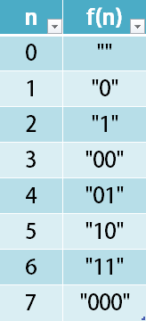

## Description

Given a non-negative integer `num`, Return its *encoding* string.

The encoding is done by converting the integer to a string using a secret function that you should deduce from the following table:

### Function Contract

### Inputs

- `num`: A non-negative integer whose encoding must be determined from the supplied mapping pattern.

For the complexity discussion, let $q = \texttt{num} + 1$.

### Return value

Return the binary-character string assigned to `num` by the deduced function. Leading zeros are part of an encoding, and the encoding of `0` is the empty string.

### Examples

#### Example 1

- **Input:** $num = 23$
- **Output:** `"1000"`
#### Example 2

- **Input:** $num = 107$
- **Output:** `"101100"`
### Constraints

- $0 \le num \le 10^{9}$