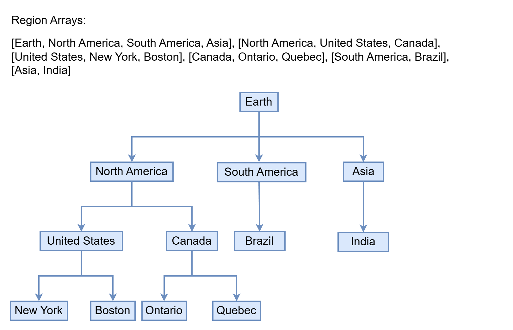
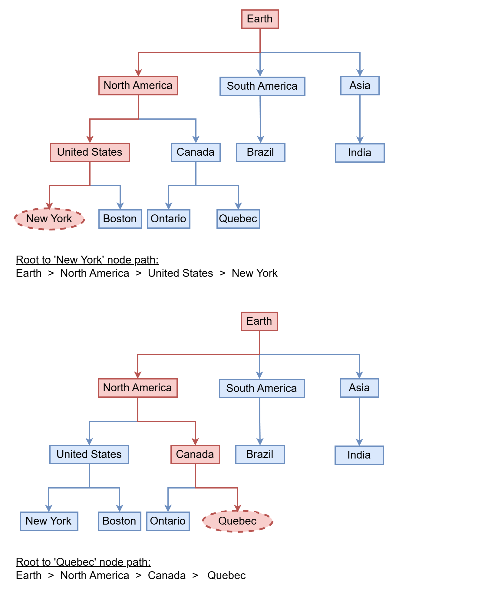
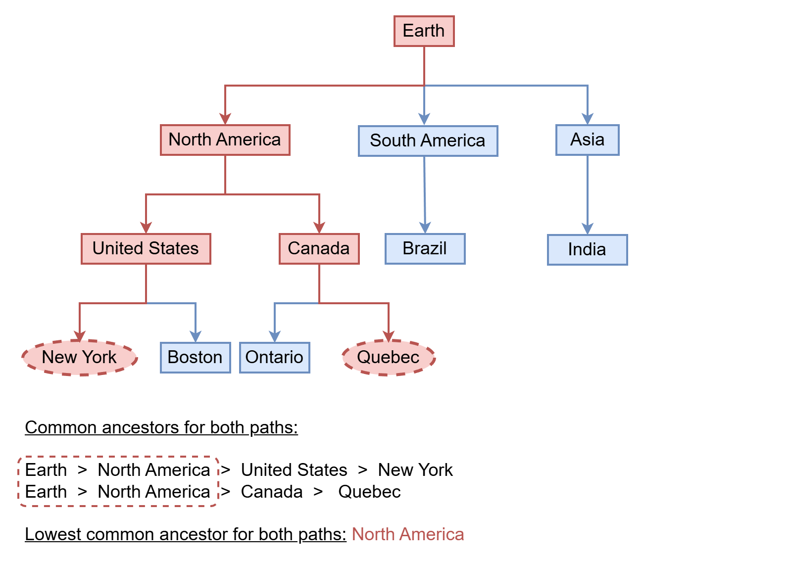
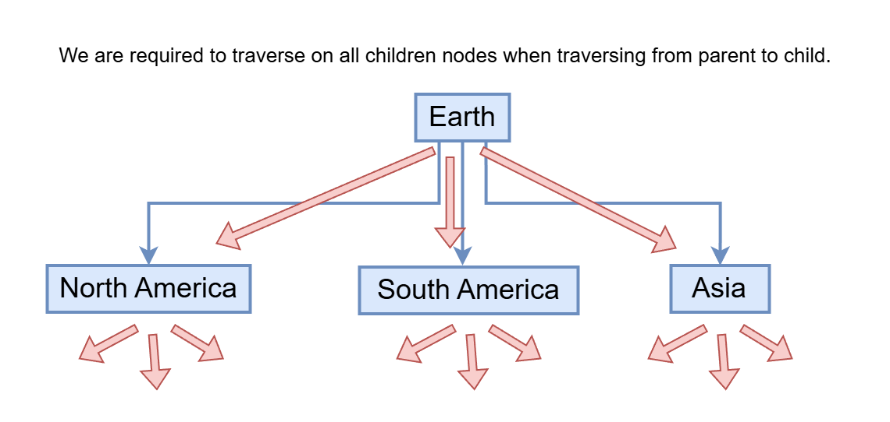
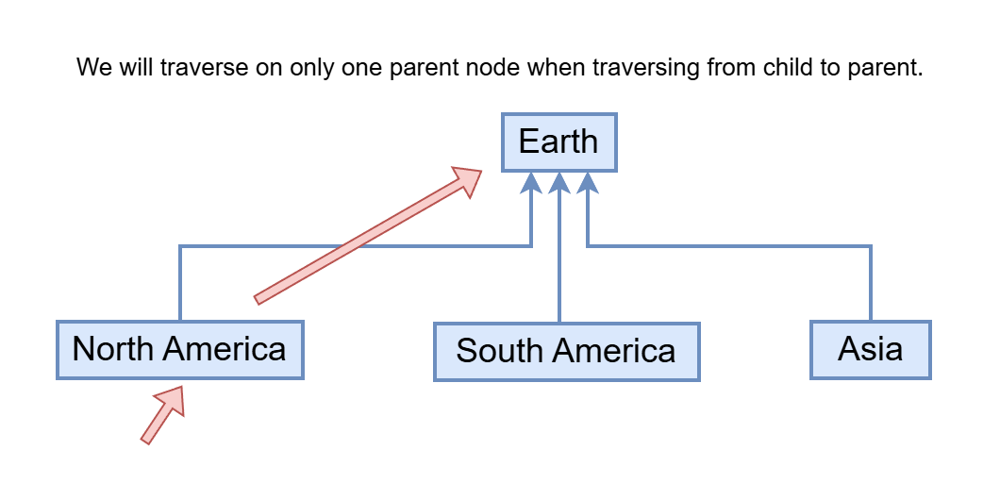
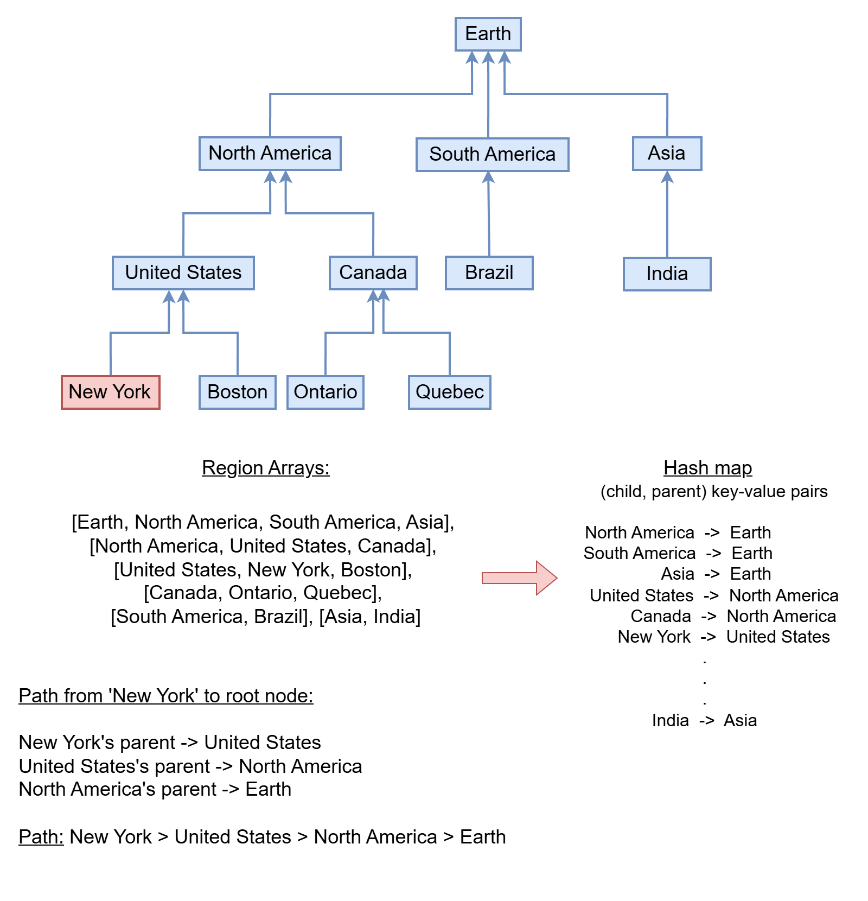

[TOC]

## Solution

---

### Overview

In this problem, we are given lists of regions organized in a hierarchy. The first region in each list is the "parent," and the remaining regions are its "children." For example, in the list `["Earth", "North America", "South America", "Asia"]`, the regions `"North America"`, `"South America"`, and `"Asia"` are all subregions of `"Earth"`. This hierarchy forms a tree-like structure where each subregion belongs to only one larger region.



The task is to find the smallest common region that contains two specified regions, `region1` and `region2`.

To solve this, we need to identify the lowest common ancestor (LCA) of `region1` and `region2` within the hierarchical tree. In a tree, the LCA of two nodes is the deepest node that is an ancestor of both. This is equivalent to finding the smallest common region that contains both `region1` and `region2`.

For a better understanding, it might help to solve the LeetCode problem [Lowest Common Ancestor of a Binary Tree](https://leetcode.com/problems/lowest-common-ancestor-of-a-binary-tree/description/) before approaching this more general tree problem.

---

### Approach: Lowest Common Ancestor of a Generic Tree

#### Intuition

To find the lowest common ancestor in a tree, we need the path arrays from the root node to both `region1` and `region2`. By comparing these paths, we can identify common ancestors and determine the lowest (or deepest) one.





<br />

To create these path arrays, a straightforward method is to start at the root node and traverse to the target node using BFS or DFS. However, this isn't the most efficient way since a parent node can have many children, requiring us to search through each one.



<br />

Instead, a better approach is to start from the target node and move upward to the root. Given that each child node has only one parent, we can generate the path more efficiently this way.



<br />

We can map the parent-child relationships in a hash map. By doing so, we can easily trace the path from any node back to the root. The `regions` array provides the data for this mapping, where the first region in each list is the parent, and the others are its children.



<br />

#### Algorithm

1. Create a hash map named `childParentMap` to store relationships. The key will be a child region, and the value will be its parent region.

2. Loop through each array in `regions`. For each array, treat the first element as the parent region and map every other element in the array to this parent in `childParentMap`.

3. Define a method `fetchPathForRegion` that takes `currNode` and `childParentMap` as inputs. This method returns a vector `path` representing the path from the root node to `currNode`.
   - Start by creating an array `path` and adding `currNode` to it.
   - Move upward by following the parent of `currNode` in `childParentMap`, adding each parent to `path`.
   - Stop when you reach the root, a node with no parent, and reverse `path` to list nodes from the root to `currNode`.
   - Return the `path` array.

4. Use `fetchPathForRegion` to find the path from the root to `region1`, storing it in `path1`. Do the same for `region2`, storing the result in `path2`.

5. Set up two indices, `i` and `j`, at `0`. Initialize an empty string `lowestCommonAncestor`.

6. Compare elements in `path1` and `path2` at `i` and `j`. If they match, update `lowestCommonAncestor` to this common node and increment both indices. Stop when the paths differ or one ends.

7. Return `lowestCommonAncestor`, which is the lowest common ancestor of `region1` and `region2`.

#### Implementation

```python
class Solution:
    # Function to return a list representing the path from the root node
    # to the current node.
    def fetch_path_for_region(self, curr_node, child_parent_map):
        path = []
        # Start by adding the current node to the path.
        path.append(curr_node)

        # Traverse upwards through the tree by finding the parent of the
        # current node. Continue until the root node is reached.
        while curr_node in child_parent_map:
            parent_node = child_parent_map[curr_node]
            path.append(parent_node)
            curr_node = parent_node

        # Reverse the path so that it starts from the root and
        # ends at the given current node.
        path.reverse()
        return path

    def findSmallestRegion(
        self, regions: List[List[str]], region1: str, region2: str
    ) -> str:
        # Dictionary to store (child -> parent) relationships for each region.
        child_parent_map = {}

        # Populate the 'child_parent_map' using the provided 'regions' list.
        for region_array in regions:
            parent_node = region_array[0]
            for i in range(1, len(region_array)):
                child_parent_map[region_array[i]] = parent_node

        # Store the paths from the root node to 'region1' and 'region2'
        # nodes in their respective lists.
        path1 = self.fetch_path_for_region(region1, child_parent_map)
        path2 = self.fetch_path_for_region(region2, child_parent_map)

        i, j = 0, 0
        lowest_common_ancestor = ""
        # Traverse both paths simultaneously until the paths diverge.
        # The last common node is the lowest common ancestor.
        while i < len(path1) and j < len(path2) and path1[i] == path2[j]:
            lowest_common_ancestor = path1[i]
            i += 1
            j += 1

        # Return the lowest common ancestor of 'region1' and 'region2'.
        return lowest_common_ancestor
```

#### Complexity Analysis

Let $m$ be the number of region arrays, and let $n$ be the number of regions in each array.

* Time Complexity: $O(m * n)$

    We loop through each item in the `regions` arrays to map child-parent relationships in a hash map. This takes $O(m * n)$ time.

    To create the path to a region, we traverse the hierarchy, which can have up to $n$ regions. Reversing the `path` array also takes $O(n)$ time.

    To find the lowest common ancestor, we compare paths. In the worst case, each path has $n$ elements, so this takes $O(n)$ time.

    Thus, the worst-case time complexity is $O(m * n + n + n) = O(m * n)$.

* Space Complexity: $O(m * n)$

    We use a hash map to store all child-parent pairs. This uses $O(m * n)$ space.

    We store the paths for two regions in arrays, which each take $O(n)$ space.

    So, in the worst case, the space complexity is $O(m * n + n) = O(m * n)$.