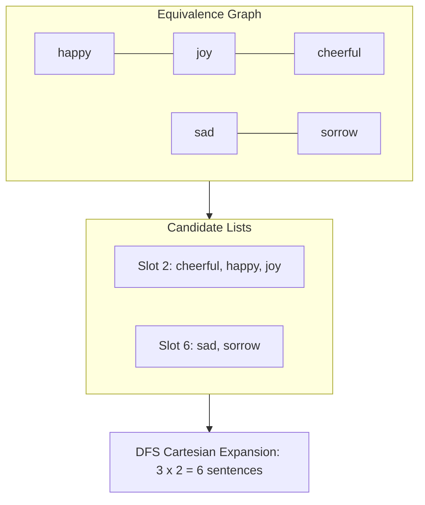

# Guided Example: Synonymous Sentences

We trace the step-by-step construction of all valid synonymous sentences on a representative problem instance:

- **Input:**
  - `synonyms = [["happy", "joy"], ["sad", "sorrow"], ["joy", "cheerful"]]`
  - `text = "I am happy today but was sad yesterday"`
- **Required Output:**
  ```text
  [
    "I am cheerful today but was sad yesterday",
    "I am cheerful today but was sorrow yesterday",
    "I am happy today but was sad yesterday",
    "I am happy today but was sorrow yesterday",
    "I am joy today but was sad yesterday",
    "I am joy today but was sorrow yesterday"
  ]
  ```

This instance illustrates graph equivalence closure via disjoint set union, lexicographical option ordering, and Cartesian product generation across sentence token slots.

---

## 1. Instance & Teaching Goal

The input provides an undirected graph of synonym pairs and a text string composed of space-separated words. Synonymity is an equivalence relation:
1. **Reflexivity:** Every word is synonymous with itself.
2. **Symmetry:** If word $A$ is synonymous with word $B$, then $B$ is synonymous with $A$.
3. **Transitivity:** If word $A$ is synonymous with word $B$ and $B$ is synonymous with word $C$, then $A$ is synonymous with $C$.

Because `happy` pairs with `joy` and `joy` pairs with `cheerful`, all three words belong to a single connected component $\{ \text{"cheerful"}, \text{"happy"}, \text{"joy"} \}$. Any appearance of one of these words in `text` can be replaced by any member of its component.

The goal is to generate every sentence reachable by valid replacements, formatted as space-separated tokens, and sorted in strict lexicographical order. A brute-force search without equivalence partitioning risks duplicate paths or missing transitive links. The optimal strategy decouples equivalence class discovery from sentence expansion.

```
Token Slots:  [I]   [am]      [happy]       [today]  [but]  [was]     [sad]      [yesterday]
               │     │           │             │       │      │         │             │
Candidates:  {"I"} {"am"} {"cheerful",      {"today"} {"but"}{"was"} {"sad",     {"yesterday"}
                           "happy",                                   "sorrow"}
                           "joy"}
```

---

## 2. Conceptual Foundation & Invariants

The algorithm proceeds in two phases:
1. **Equivalence Partitioning:** Build an undirected graph where vertices are words and edges are synonym pairs. Partition the vocabulary into connected components using Disjoint Set Union (DSU) or Breadth-First Search (BFS). Sort the words within each component lexicographically.
2. **Backtracking Product Expansion:** Tokenize the text into an array of $M$ words. Map each token $w_i$ to its ordered candidate list $C(w_i)$. If $w_i$ belongs to an equivalence component, $C(w_i)$ contains all words in that component in sorted order; otherwise, $C(w_i) = [w_i]$. Form the Cartesian product $C(w_0) \times C(w_1) \times \dots \times C(w_{M-1})$.

| Component ID | Words in Connected Component | Canonical Representative | Sorted Candidate List |
|---|---|---|---|
| $0$ | `happy`, `joy`, `cheerful` | `cheerful` | `["cheerful", "happy", "joy"]` |
| $1$ | `sad`, `sorrow` | `sad` | `["sad", "sorrow"]` |
| Disjoint / Other | `I`, `am`, `today`, `but`, `was`, `yesterday` | Self | Singleton sets `[w]` |

> **Lexicographical Production Invariant.** At token slot $i$, choosing candidate replacements in strictly ascending alphabetical order guarantees that complete sentences produced via depth-first recursion are emitted in globally sorted lexicographical order without requiring an expensive post-generation sort.



---

## 3. Step-by-Step Worked Execution

### Phase 1: Graph Construction and Equivalence Classes
We process the given synonym edges:
- Pair 1: `["happy", "joy"]` $\implies$ merge sets $\{ \text{happy} \}$ and $\{ \text{joy} \}$.
- Pair 2: `["sad", "sorrow"]` $\implies$ merge sets $\{ \text{sad} \}$ and $\{ \text{sorrow} \}$.
- Pair 3: `["joy", "cheerful"]` $\implies$ merge set $\{ \text{happy}, \text{joy} \}$ with $\{ \text{cheerful} \}$.

Resulting connected components:
- Component A: $\{ \text{cheerful}, \text{happy}, \text{joy} \}$. Sorted list: `["cheerful", "happy", "joy"]`.
- Component B: $\{ \text{sad}, \text{sorrow} \}$. Sorted list: `["sad", "sorrow"]`.

| Token Index $i$ | Token Word $w_i$ | Belongs to Component? | Replacement Candidate List $C(w_i)$ |
|---|---|---|---|
| $0$ | `"I"` | No | `["I"]` |
| $1$ | `"am"` | No | `["am"]` |
| $2$ | `"happy"` | Yes (Component A) | `["cheerful", "happy", "joy"]` |
| $3$ | `"today"` | No | `["today"]` |
| $4$ | `"but"` | No | `["but"]` |
| $5$ | `"was"` | No | `["was"]` |
| $6$ | `"sad"` | Yes (Component B) | `["sad", "sorrow"]` |
| $7$ | `"yesterday"` | No | `["yesterday"]` |

### Phase 2: Systematic Search Tree Traversal
The tokens at indices $0, 1, 3, 4, 5, 7$ have unique choices. Only slots $2$ and $6$ branch.
Total generated sentences:
$$
1 \times 1 \times 3 \times 1 \times 1 \times 1 \times 2 \times 1 = 6 \text{ sentences}
$$

We branch depth-first across slots $2$ and $6$:

1. **Branch Slot 2 = `"cheerful"`:**
   - Sub-branch Slot 6 = `"sad"`:
     Sentence: `"I am cheerful today but was sad yesterday"`
   - Sub-branch Slot 6 = `"sorrow"`:
     Sentence: `"I am cheerful today but was sorrow yesterday"`
2. **Branch Slot 2 = `"happy"`:**
   - Sub-branch Slot 6 = `"sad"`:
     Sentence: `"I am happy today but was sad yesterday"`
   - Sub-branch Slot 6 = `"sorrow"`:
     Sentence: `"I am happy today but was sorrow yesterday"`
3. **Branch Slot 2 = `"joy"`:**
   - Sub-branch Slot 6 = `"sad"`:
     Sentence: `"I am joy today but was sad yesterday"`
   - Sub-branch Slot 6 = `"sorrow"`:
     Sentence: `"I am joy today but was sorrow yesterday"`

---

## 4. Complete Execution Trace

| Step | Current Prefix up to Slot 2 | Slot 6 Choice | Formed Sentence | Lexicographical Rank |
|---|---|---|---|---|
| 1 | `"I am cheerful today but was"` | `"sad"` | `"I am cheerful today but was sad yesterday"` | 1 |
| 2 | `"I am cheerful today but was"` | `"sorrow"` | `"I am cheerful today but was sorrow yesterday"` | 2 |
| 3 | `"I am happy today but was"` | `"sad"` | `"I am happy today but was sad yesterday"` | 3 |
| 4 | `"I am happy today but was"` | `"sorrow"` | `"I am happy today but was sorrow yesterday"` | 4 |
| 5 | `"I am joy today but was"` | `"sad"` | `"I am joy today but was sad yesterday"` | 5 |
| 6 | `"I am joy today but was"` | `"sorrow"` | `"I am joy today but was sorrow yesterday"` | 6 |

---

## 5. Algorithmic Correctness

**Soundness.** Every output sentence is composed of tokens that are either identical to the source word or mutually reachable through a sequence of synonym pairs. Because the relation generated by reflexive-transitive closure partitions words into disjoint equivalence classes, every candidate choice in $C(w_i)$ is an authorized semantic synonym.

**Completeness.** The depth-first search traverses the complete Cartesian product $\prod_{i=0}^{M-1} C(w_i)$. Since $C(w_i)$ contains all reachable synonyms for word $w_i$, no valid substitution sequence is omitted. Furthermore, sorting candidate lists prior to traversal guarantees that the generated sequence is strictly increasing lexicographically, with zero duplicate sentences.

---

## 6. Traps This Instance Exposes

- **Transitivity chains:** Pair lists like $(A, B)$ and $(B, C)$ require transitively linking $A$ and $C$. A direct lookup dictionary mapping only pairs directly stated in `synonyms` would fail to substitute `cheerful` for `happy`.
- **Multiple occurrences:** If the same word appears multiple times in `text`, each occurrence branches independently over the component's candidates.
- **Unused synonym groups:** Synonym pairs may exist in `synonyms` whose words never appear in `text`. The algorithm must construct the graph without requiring every vertex to appear in the sentence.
- **Lexicographical order of sentences:** Sorting complete sentences after generating all of them takes $\mathcal{O}(K \log K \cdot L)$ time, where $K$ is the number of sentences and $L$ is sentence length. Generating them in pre-sorted order by sorting each component first avoids this post-processing overhead.

---

## 7. Complexity Derivation

- **Time Complexity:**
  - **Graph Construction & Sorting:** Let $V$ be the number of unique words in `synonyms` and $E$ be the number of pairs. DSU operations run in $\mathcal{O}((V + E) \alpha(V))$. Sorting words within components takes $\mathcal{O}(V \log V \cdot W)$, where $W$ is the maximum word length.
  - **Cartesian Expansion:** Let $M$ be the number of words in `text`, and $K = \prod |C(w_i)|$ be the total number of synonymous sentences. Constructing each sentence takes $\mathcal{O}(M \cdot W)$ time.
  - **Total Time:** $\mathcal{O}((V + E) \alpha(V) + V \log V \cdot W + K \cdot M \cdot W)$.
- **Auxiliary Space Complexity:** $\mathcal{O}(V \cdot W + M \cdot W)$. The DSU structure and component lists take $\mathcal{O}(V \cdot W)$ space. The recursion call stack has depth bounded by $M$, holding a path buffer of length $\mathcal{O}(M \cdot W)$. The final output list stores all $K$ sentences.
