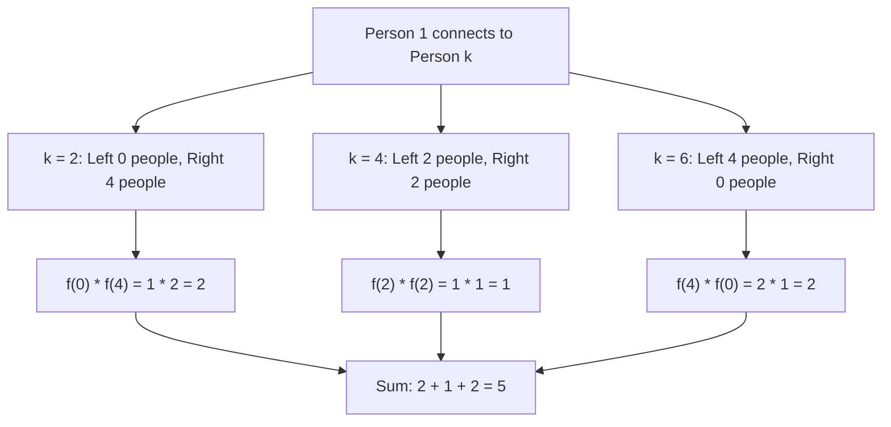

# Guided Example: Handshakes That Don't Cross

We trace the step-by-step counting of non-crossing chord pairings around a circle on a representative problem instance:

- **Input:** `numPeople = 6`
- **Required Output:** `5`

This instance illustrates the planarity partition property of non-crossing chords, the parity restriction on subproblem sizes, and the Catalan convolution recurrence.

---

## 1. Instance & Teaching Goal

Consider $2n = 6$ people sitting in fixed cyclic order around a circular table, indexed $1, 2, 3, 4, 5, 6$. Every person must shake hands with exactly one other person via straight chords across the circle such that no two handshakes cross each other.

If person $1$ connects to person $k$, the chord $(1, k)$ cuts the circular disk into two separate open regions:
- The region containing persons $\{2, 3, \dots, k-1\}$, having size $k - 2$.
- The region containing persons $\{k+1, k+2, \dots, 6\}$, having size $6 - k$.

```
         1 ──────── 2
        /            \
       6              3
        \            /
         5 ──────── 4
```

Because chords cannot cross, any person inside the first region can only shake hands with another person strictly within that same region. A region can be completely paired up if and only if it contains an even number of people. Consequently, $k - 2$ must be even, forcing $k \in \{2, 4, 6\}$.

The teaching goal is to compute the number of non-crossing configurations modulo $10^9 + 7$ by systematically summing independent subproblem products without double counting.

---

## 2. Conceptual Foundation & Invariants

Let $f(2m)$ denote the number of valid non-crossing handshake configurations for $2m$ people (or $m$ pairs).
For $m = 0$, an empty set of people has exactly $1$ valid configuration (the vacuous pairing), so $f(0) = 1$.
For $m = 1$ ($2$ people), $f(2) = 1$.

When solving for $2m$ people:
1. Fix an arbitrary anchor person, conventionally person $1$.
2. Person $1$ must partner with some person $k$.
3. To leave an even number of people in both partitioned sectors, $k$ must have the form $k = 2i + 2$, where $0 \le i \le m - 1$.
4. The sector to the left of chord $(1, k)$ contains $2i$ people.
5. The sector to the right of chord $(1, k)$ contains $2m - 2 - 2i = 2(m - 1 - i)$ people.
6. By the multiplication principle of independent choices, the number of ways to complete handshakes with partner $k$ fixed is:
   $$
   f(2i) \times f(2(m - 1 - i))
   $$

| Subproblem Size $2m$ | Pairs $m$ | Partition Formula $\sum_{i=0}^{m-1} f(2i) \cdot f(2(m-1-i))$ | Result $f(2m)$ |
|---|---|---|---|
| $0$ | $0$ | Base configuration (empty boundary) | $1$ |
| $2$ | $1$ | $f(0) \cdot f(0) = 1 \cdot 1$ | $1$ |
| $4$ | $2$ | $f(0) \cdot f(2) + f(2) \cdot f(0) = 1 \cdot 1 + 1 \cdot 1$ | $2$ |
| $6$ | $3$ | $f(0) \cdot f(4) + f(2) \cdot f(2) + f(4) \cdot f(0) = 1 \cdot 2 + 1 \cdot 1 + 2 \cdot 1$ | $5$ |

> **Planar Partition Invariant.** The selection of the partner for the lowest-indexed unpaired person uniquely partitions the remaining circular perimeter into two disjoint subsets of even parity. Because the partition boundary chord cannot be crossed, the total count is the exact sum of products of independent sub-counts, satisfying the Catalan recurrence $C_m = \sum_{i=0}^{m-1} C_i C_{m-1-i}$.



---

## 3. Step-by-Step Worked Execution

We compute $f(6)$ systematically by building smaller subproblems.

### Step 1: Base Configurations
- $f(0) = 1$ (0 people: $1$ trivial empty arrangement)
- $f(2) = 1$ (2 people: chord $(1, 2)$ is the only option)

### Step 2: Evaluating $f(4)$ ($4$ people)
Person $1$ can shake hands with person $2$ or person $4$:
- Case $k = 2$: Left size $0$, Right size $2 \implies f(0) \times f(2) = 1 \times 1 = 1$.
- Case $k = 4$: Left size $2$, Right size $0 \implies f(2) \times f(0) = 1 \times 1 = 1$.
Summing all valid partner choices:
$$
f(4) = 1 + 1 = 2
$$

| State Parameter | Partner $k$ | Left Subproblem $f(l)$ | Right Subproblem $f(r)$ | Product Contribution |
|---|---|---|---|---|
| $f(4)$ Case A | $k = 2$ | $f(0) = 1$ | $f(2) = 1$ | $1$ |
| $f(4)$ Case B | $k = 4$ | $f(2) = 1$ | $f(0) = 1$ | $1$ |
| Total $f(4)$ | - | - | - | $1 + 1 = 2$ |

### Step 3: Evaluating $f(6)$ ($6$ people)
Person $1$ can shake hands with person $2$, person $4$, or person $6$:

1. **Case $k = 2$:**
   - People between $1$ and $2$: empty set $\implies$ size $l = 0$.
   - People after $2$: $\{3, 4, 5, 6\} \implies$ size $r = 4$.
   - Contribution: $f(0) \times f(4) = 1 \times 2 = 2$.
   - Configurations:
     - Pairing $[(1, 2), (3, 4), (5, 6)]$
     - Pairing $[(1, 2), (3, 6), (4, 5)]$

2. **Case $k = 4$:**
   - People between $1$ and $4$: $\{2, 3\} \implies$ size $l = 2$.
   - People after $4$: $\{5, 6\} \implies$ size $r = 2$.
   - Contribution: $f(2) \times f(2) = 1 \times 1 = 1$.
   - Configuration:
     - Pairing $[(1, 4), (2, 3), (5, 6)]$

3. **Case $k = 6$:**
   - People between $1$ and $6$: $\{2, 3, 4, 5\} \implies$ size $l = 4$.
   - People after $6$: empty set $\implies$ size $r = 0$.
   - Contribution: $f(4) \times f(0) = 2 \times 1 = 2$.
   - Configurations:
     - Pairing $[(1, 6), (2, 3), (4, 5)]$
     - Pairing $[(1, 6), (2, 5), (3, 4)]$

Summing the three mutually exclusive partition cases:
$$
f(6) = (1 \times 2) + (1 \times 1) + (2 \times 1) = 2 + 1 + 2 = 5
$$

---

## 4. Complete Execution Trace

| Iteration $m$ | Evaluated Term $f(2m)$ | Partition Convolution Terms | Value (mod $10^9 + 7$) |
|---|---|---|---|
| $0$ | $f(0)$ | Base case definition | $1$ |
| $1$ | $f(2)$ | $f(0) \cdot f(0)$ | $1$ |
| $2$ | $f(4)$ | $f(0) \cdot f(2) + f(2) \cdot f(0)$ | $2$ |
| $3$ | $f(6)$ | $f(0) \cdot f(4) + f(2) \cdot f(2) + f(4) \cdot f(0)$ | $5$ |

All intermediate sums remain well below the modulus $10^9 + 7$.

---

## 5. Algorithmic Correctness

**Soundness.** Every counted handshake pairing is non-crossing. Because the chord from person $1$ to person $k$ is straight, any other handshake must either lie entirely on one side of chord $(1, k)$ or cross it. Restricting pairings strictly within the left and right subsets independently guarantees that no chord crosses $(1, k)$, and by induction on subproblems, no internal chords cross each other either.

**Completeness.** In any valid pairing, person $1$ must shake hands with someone. Because the table has $2n$ seats, that partner must be some seat $k \in \{2, 3, \dots, 2n\}$. If $k$ were odd, the left partition would have an odd number of people, which cannot form complete pairs without at least one chord crossing out of the region. Thus $k$ must be even. Because each choice of $k$ yields a distinct partner for person $1$, the cases are mutually exclusive and collectively exhaustive.

---

## 6. Traps This Instance Exposes

- **Odd subproblem sizes:** Attempting to pair person $1$ with an odd-numbered seat like person $3$ leaves $1$ person ($2$) on one side and $3$ people ($4, 5, 6$) on the other side. An odd count cannot be partitioned into disjoint pairs without someone crossing the divider chord.
- **Overcounting permutations:** Assigning partners without fixing person $1$ as an anchor leads to overcounting by cyclic symmetries or permutation factors. Anchoring on the lowest-indexed person at each level guarantees each configuration is counted exactly once.
- **Modulus application:** For large $n$ (up to $n = 500$), the convolution products grow exponentially. Every addition and multiplication must be taken modulo $10^9 + 7$ to avoid integer overflow.
- **Base case definition:** Treating $f(0) = 0$ instead of $f(0) = 1$ would cause all terms to collapse to zero because the empty sector represents a valid completed side.

---

## 7. Complexity Derivation

- **Time Complexity:** $\mathcal{O}(n^2)$, where $n = \text{numPeople} / 2$. Computing $f(2m)$ requires summing $m$ products of previously computed subproblems. Across all $m \in \{1, 2, \dots, n\}$, the total number of operations is:
  $$
  \sum_{m=1}^n m = \frac{n(n + 1)}{2} = \mathcal{O}(n^2)
  $$
  For $\text{numPeople} \le 1000 \implies n \le 500$, $n^2 / 2 \approx 125{,}000$ operations, executing in under $10$ milliseconds.
- **Auxiliary Space Complexity:** $\mathcal{O}(n)$. Storing the 1D dynamic programming table of size $n + 1$ requires $\mathcal{O}(n)$ auxiliary memory.
