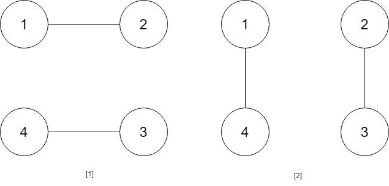
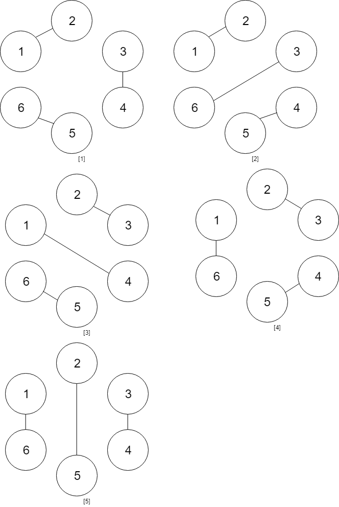

### 1. Description

You are given an **even** number of people `numPeople` that stand around a circle and each person shakes hands with someone else so that there are $numPeople / 2$ handshakes total.

Return *the number of ways these handshakes could occur such that none of the handshakes cross*.

Since the answer could be very large, return it **modulo** $10^{9} + 7$.

### 2. Function Contract

### Input

- `numPeople`: The even number of people standing around the circle.

Let $p=	exttt{numPeople}/2$ be the number of handshake pairs, and let $M=$10^{9}$+7$ be the required modulus.

### Return value

Return the number of ways to pair every person with exactly one other person without any two handshakes crossing, reduced modulo $M$.

### 3. Examples

#### Example 1

- **Input:** $numPeople = 4$
- **Output:** `2`
- **Explanation:** There are two ways to do it, the first way is [(1,2),(3,4)] and the second one is [(2,3),(4,1)].
#### Example 2

- **Input:** $numPeople = 6$
- **Output:** `5`

### 4. Constraints

- $2 \le numPeople \le 1000$

- `numPeople` is even.