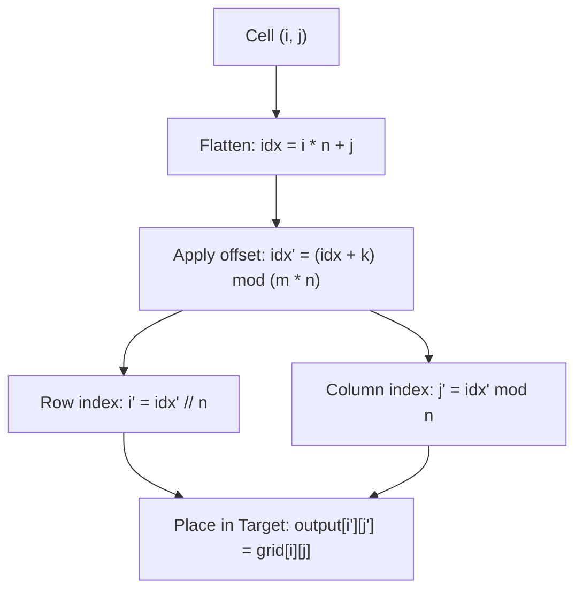

# Guided Example: Shift 2D Grid

We trace the step-by-step cyclic rotation of a 2D matrix on a representative problem instance:

- **Input:**
  - `grid = [[1, 2, 3], [4, 5, 6], [7, 8, 9]]`
  - `k = 1`
- **Required Output:**
  ```text
  [
    [9, 1, 2],
    [3, 4, 5],
    [6, 7, 8]
  ]
  ```

This instance demonstrates how row-major linearization converts complex multi-branch cell transitions into modular arithmetic shifts over a 1D index space.

---

## 1. Instance & Teaching Goal

The problem specifies three distinct movement rules for a single shift operation on an $m \times n$ matrix:
1. `grid[i][j]` moves to `grid[i][j + 1]` (horizontal shift within the same row).
2. `grid[i][n - 1]` moves to `grid[i + 1][0]` (wrap around to the start of the next row).
3. `grid[m - 1][n - 1]` moves to `grid[0][0]` (wrap around from bottom-right to top-left).

Simulating these three conditional branches cell by cell across $k$ rounds incurs $\mathcal{O}(k \cdot m \cdot n)$ time, which becomes inefficient when $k$ is large ($k \le 100$). Furthermore, in-place overwriting risks destroying values before they have been propagated.

```
Initial 2D Matrix (3 x 3):
[ 1,  2,  3 ]
[ 4,  5,  6 ]
[ 7,  8,  9 ]

Row-Major Flattened 1D Array (Length 9):
Index:  0   1   2   3   4   5   6   7   8
Value: [1,  2,  3,  4,  5,  6,  7,  8,  9]

Cyclic Shift by k = 1 (Index: (idx + 1) mod 9):
Index:  0   1   2   3   4   5   6   7   8
Value: [9,  1,  2,  3,  4,  5,  6,  7,  8]

Reconstructed 2D Matrix:
[ 9,  1,  2 ]
[ 3,  4,  5 ]
[ 6,  7,  8 ]
```

The teaching goal is to recognize that the three piecewise transition rules are collectively identical to a standard cyclic right-shift of a 1D flattened array. Mapping indices directly via modular arithmetic achieves an optimal single-pass $\mathcal{O}(m \cdot n)$ construction independent of $k$.

---

## 2. Conceptual Foundation & Invariants

Let the grid have $m$ rows and $n$ columns. The total number of elements is $N = m \cdot n$.

### Bijective Coordinate Transformations
1. **Flattening (2D to 1D):**
   A cell at coordinate $(i, j)$ with $0 \le i < m$ and $0 \le j < n$ has unique row-major 1D index:
   $$
   \text{idx} = i \cdot n + j
   $$
2. **Modular Shift:**
   Shifting cyclically right by $k$ positions advances index $\text{idx}$ to:
   $$
   \text{idx}' = (\text{idx} + k) \pmod N
   $$
3. **Unflattening (1D to 2D):**
   The destination 2D coordinates $(i', j')$ are obtained via Euclidean division by $n$:
   $$
   i' = \lfloor \text{idx}' / n \rfloor, \quad j' = \text{idx}' \pmod n
   $$

| Source Cell $(i, j)$ | Source Value | 1D Index $\text{idx} = i \cdot n + j$ | Shifted Index $\text{idx}' = (\text{idx} + 1) \bmod 9$ | Target Cell $(i', j')$ |
|---|---|---|---|---|
| $(0, 0)$ | $1$ | $0$ | $1$ | $(0, 1)$ |
| $(0, 1)$ | $2$ | $1$ | $2$ | $(0, 2)$ |
| $(0, 2)$ | $3$ | $2$ | $3$ | $(1, 0)$ |
| $(1, 0)$ | $4$ | $3$ | $4$ | $(1, 1)$ |
| $(1, 1)$ | $5$ | $4$ | $5$ | $(1, 2)$ |
| $(1, 2)$ | $6$ | $5$ | $6$ | $(2, 0)$ |
| $(2, 0)$ | $7$ | $6$ | $7$ | $(2, 1)$ |
| $(2, 1)$ | $8$ | $7$ | $8$ | $(2, 2)$ |
| $(2, 2)$ | $9$ | $8$ | $0$ | $(0, 0)$ |

> **Cyclic Permutation Invariant.** The shift operation defines a permutation $\pi$ on the $m \cdot n$ elements consisting of cycles of length dividing $m \cdot n$. Applying the shift $k$ times is equivalent to applying the shift $k \pmod{m \cdot n}$ times. Every element moves deterministically to its target without interference.



---

## 3. Step-by-Step Worked Execution

We execute the direct destination mapping on the $3 \times 3$ grid with $k = 1$, where $m = 3, n = 3, N = 9$.

### Step 1: Mapping Row 0
- Cell $(0, 0)$ with value $1$:
  - $\text{idx} = 0 \cdot 3 + 0 = 0$.
  - $\text{idx}' = (0 + 1) \bmod 9 = 1$.
  - $i' = 1 // 3 = 0$, $j' = 1 \bmod 3 = 1 \implies \text{output}[0][1] = 1$.
- Cell $(0, 1)$ with value $2$:
  - $\text{idx} = 0 \cdot 3 + 1 = 1$.
  - $\text{idx}' = (1 + 1) \bmod 9 = 2$.
  - $i' = 2 // 3 = 0$, $j' = 2 \bmod 3 = 2 \implies \text{output}[0][2] = 2$.
- Cell $(0, 2)$ with value $3$ (row end):
  - $\text{idx} = 0 \cdot 3 + 2 = 2$.
  - $\text{idx}' = (2 + 1) \bmod 9 = 3$.
  - $i' = 3 // 3 = 1$, $j' = 3 \bmod 3 = 0 \implies \text{output}[1][0] = 3$.

### Step 2: Mapping Row 1
- Cell $(1, 0)$ with value $4$:
  - $\text{idx} = 1 \cdot 3 + 0 = 3$.
  - $\text{idx}' = (3 + 1) \bmod 9 = 4$.
  - $i' = 4 // 3 = 1$, $j' = 4 \bmod 3 = 1 \implies \text{output}[1][1] = 4$.
- Cell $(1, 1)$ with value $5$:
  - $\text{idx} = 1 \cdot 3 + 1 = 4$.
  - $\text{idx}' = (4 + 1) \bmod 9 = 5$.
  - $i' = 5 // 3 = 1$, $j' = 5 \bmod 3 = 2 \implies \text{output}[1][2] = 5$.
- Cell $(1, 2)$ with value $6$ (row end):
  - $\text{idx} = 1 \cdot 3 + 2 = 5$.
  - $\text{idx}' = (5 + 1) \bmod 9 = 6$.
  - $i' = 6 // 3 = 2$, $j' = 6 \bmod 3 = 0 \implies \text{output}[2][0] = 6$.

### Step 3: Mapping Row 2
- Cell $(2, 0)$ with value $7$:
  - $\text{idx} = 2 \cdot 3 + 0 = 6$.
  - $\text{idx}' = (6 + 1) \bmod 9 = 7$.
  - $i' = 7 // 3 = 2$, $j' = 7 \bmod 3 = 1 \implies \text{output}[2][1] = 7$.
- Cell $(2, 1)$ with value $8$:
  - $\text{idx} = 2 \cdot 3 + 1 = 7$.
  - $\text{idx}' = (7 + 1) \bmod 9 = 8$.
  - $i' = 8 // 3 = 2$, $j' = 8 \bmod 3 = 2 \implies \text{output}[2][2] = 8$.
- Cell $(2, 2)$ with value $9$ (matrix end):
  - $\text{idx} = 2 \cdot 3 + 2 = 8$.
  - $\text{idx}' = (8 + 1) \bmod 9 = 0$.
  - $i' = 0 // 3 = 0$, $j' = 0 \bmod 3 = 0 \implies \text{output}[0][0] = 9$.

All 9 cells are populated without collision or omission.

---

## 4. Complete Execution Trace

| Processing Order | Source Coordinate | Source Value | Transformed 1D Index | Target Coordinate | Value Assigned |
|---|---|---|---|---|---|
| 1 | $(0, 0)$ | $1$ | $1$ | $(0, 1)$ | $1$ |
| 2 | $(0, 1)$ | $2$ | $2$ | $(0, 2)$ | $2$ |
| 3 | $(0, 2)$ | $3$ | $3$ | $(1, 0)$ | $3$ |
| 4 | $(1, 0)$ | $4$ | $4$ | $(1, 1)$ | $4$ |
| 5 | $(1, 1)$ | $5$ | $5$ | $(1, 2)$ | $5$ |
| 6 | $(1, 2)$ | $6$ | $6$ | $(2, 0)$ | $6$ |
| 7 | $(2, 0)$ | $7$ | $7$ | $(2, 1)$ | $7$ |
| 8 | $(2, 1)$ | $8$ | $8$ | $(2, 2)$ | $8$ |
| 9 | $(2, 2)$ | $9$ | $0$ | $(0, 0)$ | $9$ |

Final reconstructed grid:
```text
[ [9, 1, 2],
  [3, 4, 5],
  [6, 7, 8] ]
```

---

## 5. Algorithmic Correctness

**Soundness.** Consider the three movement rules under row-major index mapping $\text{idx} = i \cdot n + j$:
1. If $j < n - 1$: $\text{new\_idx} = i \cdot n + (j + 1) = \text{idx} + 1$.
2. If $j = n - 1$ and $i < m - 1$: $\text{new\_idx} = (i + 1) \cdot n + 0 = i \cdot n + n = \text{idx} + 1$.
3. If $i = m - 1$ and $j = n - 1$: $\text{idx} = m \cdot n - 1$, and the target is $(0, 0)$, which has $\text{new\_idx} = 0 = (\text{idx} + 1) \bmod (m \cdot n)$.
In all cases, a single shift operation corresponds exactly to incrementing the row-major index by $1$ modulo $m \cdot n$. By induction, applying the shift $k$ times corresponds to adding $k$ modulo $m \cdot n$.

**Completeness.** The modular shift function $f(\text{idx}) = (\text{idx} + k) \bmod N$ is a bijection on the finite set $\{0, 1, \dots, N-1\}$. Thus, every target cell receives exactly one source value, preserving the multiset of matrix elements without omission or duplication.

---

## 6. Traps This Instance Exposes

- **In-place overwriting:** Writing directly into `grid[i'][j']` without a separate output buffer destroys elements before they are read. Using a newly allocated result matrix ensures clean single-pass placement.
- **Redundant full rotations:** If $k \ge m \cdot n$, shifting element by element performs redundant cycles. Pre-reducing $k_{\text{eff}} = k \pmod{m \cdot n}$ handles cases where $k$ is arbitrarily large.
- **Non-square grids:** Grids where $m \ne n$ must strictly divide and multiply by the column count $n$, not the row count $m$.
- **Boundary wrap at the bottom-right:** The last cell $(m-1, n-1)$ wraps to $(0, 0)$. Modular arithmetic handles this automatically because $(m \cdot n - 1 + 1) \bmod (m \cdot n) = 0$.

---

## 7. Complexity Derivation

- **Time Complexity:** $\mathcal{O}(m \cdot n)$. The algorithm iterates through each of the $m \times n$ cells exactly once. Each cell requires a constant number of arithmetic operations (multiplication, addition, modulo, integer division) and one assignment. The runtime is completely independent of $k$.
- **Auxiliary Space Complexity:** $\mathcal{O}(m \cdot n)$ to allocate the result matrix returned to the caller. No auxiliary stack, recursion, or additional data structures are required.
