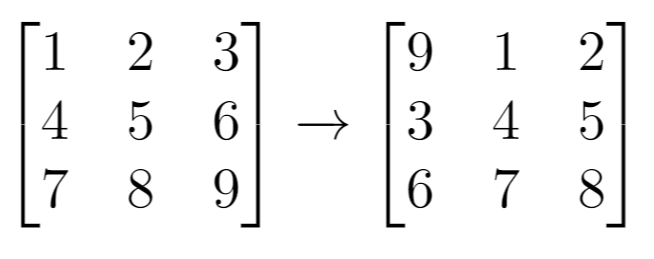
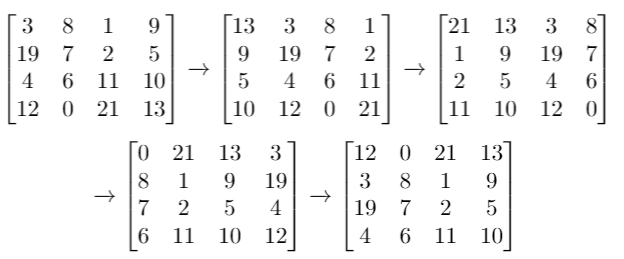

## Description

Given a 2D `grid` of size `m x n` and an integer `k`. You need to shift the `grid` `k` times.

In one shift operation:

- Element at $\text{grid}[i][j]$ moves to $\text{grid}[i][j + 1]$.

- Element at $\text{grid}[i][n - 1]$ moves to $grid[i + 1][0]$.

- Element at $grid[m - 1][n - 1]$ moves to $\text{grid}[0][0]$.

Return the *2D grid* after applying shift operation `k` times.
### Function Contract

- `n`: Input parameter.
- Returns expected result.

### Examples

#### Example 1

- **Input:** `grid = [[1,2,3],[4,5,6],[7,8,9]], k = 1`
- **Output:** `[[9,1,2],[3,4,5],[6,7,8]]`
#### Example 2

- **Input:** `grid = [[3,8,1,9],[19,7,2,5],[4,6,11,10],[12,0,21,13]], k = 4`
- **Output:** `[[12,0,21,13],[3,8,1,9],[19,7,2,5],[4,6,11,10]]`
#### Example 3

- **Input:** `grid = [[1,2,3],[4,5,6],[7,8,9]], k = 9`
- **Output:** `[[1,2,3],[4,5,6],[7,8,9]]`
### Constraints

- $m = \text{grid.length}$

- $n = \text{grid}[i].length$

- $1 \le m \le 50$

- $1 \le n \le 50$

- $-1000 \le \text{grid}[i][j] \le 1000$

- $0 \le k \le 100$