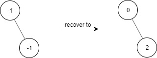
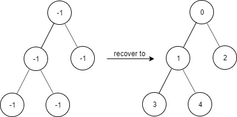
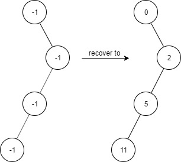

### 1. Description

Given a binary tree with the following rules:

- $\text{root.val} = 0$

- For any `treeNode`:

		- If `treeNode.val` has a value `x` and $\text{treeNode.left} \neq null$, then $\text{treeNode.left}.val = 2 * x + 1$

- If `treeNode.val` has a value `x` and $\text{treeNode.right} \neq null$, then $\text{treeNode.right}.val = 2 * x + 2$

Now the binary tree is contaminated, which means all `treeNode.val` have been changed to `-1`.

Implement the `FindElements` class:

- `FindElements(TreeNode* root)` Initializes the object with a contaminated binary tree and recovers it.

- `bool find(int target)` Returns `true` if the `target` value exists in the recovered binary tree.

### 2. Function Contract

**Methods**

- `TreeNode(val=0, left=None, right=None)`: Initializes the data structure.
- `TreeNode(root: Optional[TreeNode])`: Initializes the data structure.
- `find(target: int) -> `bool``: Executes operation.

### 3. Examples

#### Example 1



```
**Input**
["FindElements","find","find"]
[[[-1,null,-1]],[1],[2]]
**Output**
[null,false,true]
**Explanation**
FindElements findElements = new FindElements([-1,null,-1]);
findElements.find(1); // return False
findElements.find(2); // return True
```

#### Example 2



```
**Input**
["FindElements","find","find","find"]
[[[-1,-1,-1,-1,-1]],[1],[3],[5]]
**Output**
[null,true,true,false]
**Explanation**
FindElements findElements = new FindElements([-1,-1,-1,-1,-1]);
findElements.find(1); // return True
findElements.find(3); // return True
findElements.find(5); // return False
```

#### Example 3



```
**Input**
["FindElements","find","find","find","find"]
[[[-1,null,-1,-1,null,-1]],[2],[3],[4],[5]]
**Output**
[null,true,false,false,true]
**Explanation**
FindElements findElements = new FindElements([-1,null,-1,-1,null,-1]);
findElements.find(2); // return True
findElements.find(3); // return False
findElements.find(4); // return False
findElements.find(5); // return True
```

### 4. Constraints

- $\text{TreeNode.val} = -1$

- The height of the binary tree is less than or equal to `20`

- The total number of nodes is between $[1, 10^{4}]$

- Total calls of `find()` is between $[1, 10^{4}]$

- $0 \le target \le 10^{6}$
