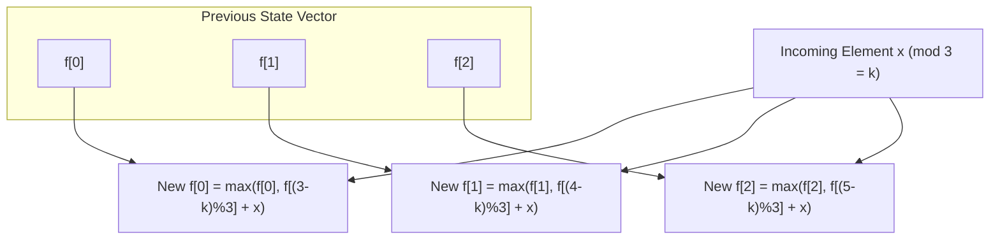

# Guided Example: Greatest Sum Divisible by Three

We trace the step-by-step evolution of a residue-partitioned dynamic programming array on a representative problem instance:

- **Input:** `nums = [3, 6, 5, 1, 8]`
- **Required Output:** `18`

This instance illustrates modular equivalence classes, the Knapsack-like choice of element inclusion, and how tracking three residue states achieves an optimal subset sum in linear time.

---

## 1. Instance & Teaching Goal

Given an array of positive integers, we seek a subset whose elements sum to a multiple of $3$, such that the sum is maximized.
For `nums = [3, 6, 5, 1, 8]`:
- The total sum of all elements is $3 + 6 + 5 + 1 + 8 = 23$.
- Evaluating modulo 3: $23 \equiv 2 \pmod 3$.
- Because $23$ is not divisible by $3$, at least one element (or group of elements) must be excluded.
- Excluded candidates with residue $2$: $5$ or $8$. Removing $5$ yields $23 - 5 = 18 \equiv 0 \pmod 3$. Removing $8$ yields $23 - 8 = 15$.
- Excluded candidates with residue $1$: only $1$ exists, so we cannot remove two residue-1 elements.
- The maximum divisible sum is therefore $18$.

A brute-force power-set search evaluates $2^N = 2^5 = 32$ subsets (or $2^{40000}$ in the general problem, which is impossible). The optimal DP approach recognizes that any subset sum belongs to one of exactly three residue classes modulo $3$: $\{0, 1, 2\}$.

```
Residue 0 [Target]:  Sum = 18  (e.g., 3 + 6 + 1 + 8)
Residue 1:           Sum = 22  (e.g., 3 + 6 + 5 + 8)
Residue 2:           Sum = 23  (all elements: 3 + 6 + 5 + 1 + 8)
```

The teaching goal is to maintain the maximum reachable sum for each of the three remainders simultaneously as each element is considered.

---

## 2. Conceptual Foundation & Invariants

Let $f[r]$ denote the maximum subset sum formed using a prefix of `nums` such that:
$$
\text{sum} \equiv r \pmod 3 \quad \text{for } r \in \{0, 1, 2\}
$$

### Base State (Empty Subset)
- An empty subset has a sum of $0$, and $0 \equiv 0 \pmod 3$, so $f[0] = 0$.
- No subset can produce a remainder of $1$ or $2$ using zero elements, so $f[1] = -\infty$ and $f[2] = -\infty$.

### State Transition
When processing an incoming number $x$ with residue $k = x \bmod 3$:
For each remainder $r \in \{0, 1, 2\}$, we can either:
1. **Exclude $x$:** Keep the previous best sum for remainder $r$, which is $f_{\text{prev}}[r]$.
2. **Include $x$:** Pair $x$ with a previously formed sum having remainder $(r - k) \bmod 3$:
   $$
   f_{\text{new}}[r] = \max\left( f_{\text{prev}}[r], \; f_{\text{prev}}[(r - k) \bmod 3] + x \right)
   $$

| Residue Class $r$ | Meaning | Initial State | Transition Invariant |
|---|---|---|---|
| $r = 0$ | Maximum sum with $\text{sum} \equiv 0 \pmod 3$ | $0$ | $\max(f[0], f[(0 - x) \bmod 3] + x)$ |
| $r = 1$ | Maximum sum with $\text{sum} \equiv 1 \pmod 3$ | $-\infty$ | $\max(f[1], f[(1 - x) \bmod 3] + x)$ |
| $r = 2$ | Maximum sum with $\text{sum} \equiv 2 \pmod 3$ | $-\infty$ | $\max(f[2], f[(2 - x) \bmod 3] + x)$ |

> **Residue Optimality Invariant.** After processing the first $i$ elements, $f[r]$ contains the absolute maximum sum of any subset chosen from `nums[0..i-1]` that satisfies $\text{sum} \equiv r \pmod 3$. Any lower sum with the same remainder can never lead to a strictly better final answer and is safely pruned.



---

## 3. Step-by-Step Worked Execution

We trace the arrival of each number from `nums = [3, 6, 5, 1, 8]`.

### Initialization
$$
f = [0, -\infty, -\infty]
$$

### Step 1: Processing $x = 3$ ($3 \bmod 3 = 0$)
Adding $3$ preserves the residue class of any existing sum:
- $r = 0$: $\max(0, f[0] + 3) = \max(0, 0 + 3) = 3$.
- $r = 1$: $\max(-\infty, f[1] + 3) = -\infty$.
- $r = 2$: $\max(-\infty, f[2] + 3) = -\infty$.
Updated state:
$$
f = [3, -\infty, -\infty]
$$

### Step 2: Processing $x = 6$ ($6 \bmod 3 = 0$)
Adding $6$ preserves residue:
- $r = 0$: $\max(3, f[0] + 6) = \max(3, 3 + 6) = 9$.
- $r = 1$: $\max(-\infty, f[1] + 6) = -\infty$.
- $r = 2$: $\max(-\infty, f[2] + 6) = -\infty$.
Updated state:
$$
f = [9, -\infty, -\infty]
$$

### Step 3: Processing $x = 5$ ($5 \bmod 3 = 2$)
- $r = 0$: $\max(9, f[1] + 5) = \max(9, -\infty + 5) = 9$.
- $r = 1$: $\max(-\infty, f[2] + 5) = \max(-\infty, -\infty + 5) = -\infty$.
- $r = 2$: $\max(-\infty, f[0] + 5) = \max(-\infty, 9 + 5) = 14$.
Updated state:
$$
f = [9, -\infty, 14]
$$

### Step 4: Processing $x = 1$ ($1 \bmod 3 = 1$)
- $r = 0$: $\max(9, f[2] + 1) = \max(9, 14 + 1) = 15$.
- $r = 1$: $\max(-\infty, f[0] + 1) = \max(-\infty, 9 + 1) = 10$.
- $r = 2$: $\max(14, f[1] + 1) = \max(14, -\infty + 1) = 14$.
Updated state:
$$
f = [15, 10, 14]
$$

### Step 5: Processing $x = 8$ ($8 \bmod 3 = 2$)
- $r = 0$: $\max(15, f[1] + 8) = \max(15, 10 + 8) = 18$.
- $r = 1$: $\max(10, f[2] + 8) = \max(10, 14 + 8) = 22$.
- $r = 2$: $\max(14, f[0] + 8) = \max(14, 15 + 8) = 23$.
Updated state:
$$
f = [18, 22, 23]
$$

The final answer is $f[0] = 18$.

---

## 4. Complete Execution Trace

| Element $x$ | $x \bmod 3$ | Prior $f$ | Candidates Considered with $+x$ | New $f[0]$ | New $f[1]$ | New $f[2]$ |
|---|---|---|---|---|---|---|
| Init | - | - | Base definition: empty set sum is $0$ | $0$ | $-\infty$ | $-\infty$ |
| $3$ | $0$ | $[0, -\infty, -\infty]$ | $0+3=3$ | $3$ | $-\infty$ | $-\infty$ |
| $6$ | $0$ | $[3, -\infty, -\infty]$ | $3+6=9$ | $9$ | $-\infty$ | $-\infty$ |
| $5$ | $2$ | $[9, -\infty, -\infty]$ | $9+5=14$ | $9$ | $-\infty$ | $14$ |
| $1$ | $1$ | $[9, -\infty, 14]$ | $9+1=10, 14+1=15$ | $15$ | $10$ | $14$ |
| $8$ | $2$ | $[15, 10, 14]$ | $15+8=23, 10+8=18, 14+8=22$ | $18$ | $22$ | $23$ |

Final result: $f[0] = 18$.

---

## 5. Algorithmic Correctness

**Soundness.** Every state $f[r]$ represents the exact sum of a valid subset of elements drawn from `nums`. Because arithmetic addition modulo 3 satisfies $(a + b) \bmod 3 = ((a \bmod 3) + (b \bmod 3)) \bmod 3$, combining an existing sum having remainder $r_{\text{old}}$ with $x$ having remainder $k$ produces a sum with remainder $(r_{\text{old}} + k) \bmod 3$. Setting $r = (r_{\text{old}} + k) \bmod 3$ ensures $f[0]$ is always strictly divisible by $3$.

**Completeness.** By mathematical induction on the prefix length, every possible subset sum modulo 3 is considered. Since we take the maximum between including and excluding each element at each step, no higher sum with remainder $r$ can exist. The algorithm evaluates all $2^N$ subset combinations compressed into 3 optimal representative residues.

---

## 6. Traps This Instance Exposes

- **Simultaneous state updates:** When updating $f[r]$, we must reference values from the previous iteration $f_{\text{prev}}$. Updating in-place in a single array without a snapshot can cause an element $x$ to be added to itself multiple times in the same step.
- **Unreachable state initialization:** Initializing $f[1] = 0$ or $f[2] = 0$ instead of $-\infty$ produces incorrect results when positive remainders cannot yet be formed (for example, if `nums = [3, 6]`, where remainder $1$ is never achievable).
- **Greedy smallest-removal trap:** Removing the smallest element of a matching remainder (e.g., removing $5$ vs two ones) requires tracking the two smallest remainder-1 elements and the two smallest remainder-2 elements. The DP approach handles all combinations automatically without special branching.

---

## 7. Complexity Derivation

- **Time Complexity:** $\mathcal{O}(N)$, where $N$ is the number of integers in `nums`. For each of the $N$ numbers, exactly $3$ constant-time arithmetic evaluations and comparisons are performed. For $N = 40{,}000$, the total number of operations is $1.2 \times 10^5$, executing in under $5$ milliseconds.
- **Auxiliary Space Complexity:** $\mathcal{O}(1)$. The algorithm requires only two 3-element numeric vectors to store $f_{\text{prev}}$ and $f_{\text{new}}$, requiring constant auxiliary memory.
