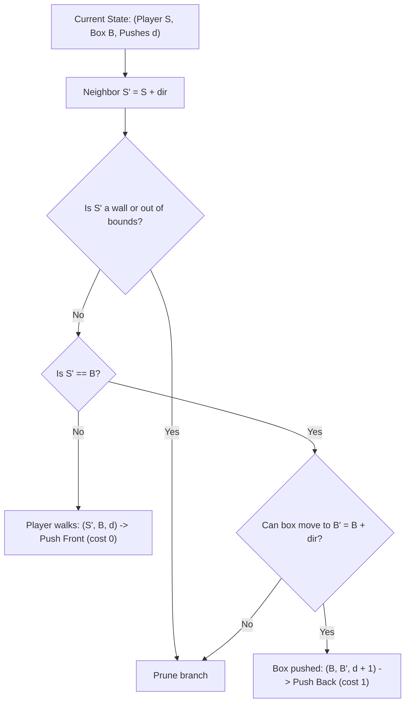

# Guided Example: Minimum Moves to Move a Box to Their Target Location

We trace the step-by-step state exploration of a Sokoban-style grid puzzle on a representative problem instance:

- **Input:**
  ```text
  grid = [
    ["#","#","#","#","#","#"],
    ["#","T","#","#","#","#"],
    ["#",".",".","B",".","#"],
    ["#",".","#","#",".","#"],
    ["#",".",".",".","S","#"],
    ["#","#","#","#","#","#"]
  ]
  ```
- **Required Output:** `3`

This instance illustrates the dual-entity state representation (player position and box position), the distinction between zero-cost player walking and unit-cost box pushing, and the optimality of 0-1 Breadth-First Search (or nested BFS) on the composite state space.

---

## 1. Instance & Teaching Goal

The board contains four distinct entities:
- `S`: Starting location of the player (storekeeper) at $(4, 4)$.
- `B`: Initial location of the box at $(2, 3)$.
- `T`: Target destination for the box at $(1, 1)$.
- `#`: Impassable wall obstacles.
- `.`: Free traversable floor tiles.

```
       0   1   2   3   4   5
   0 [ #   #   #   #   #   # ]
   1 [ #   T   #   #   #   # ]      T = Target (1, 1)
   2 [ #   .   .   B   .   # ]      B = Box    (2, 3)
   3 [ #   .   #   #   .   # ]
   4 [ #   .   .   .   S   # ]      S = Player (4, 4)
   5 [ #   #   #   #   #   # ]
```

The objective is to minimize the number of **pushes** applied to the box. Free movements of the player do not increment the push counter. Crucially, the player cannot walk through the box or through walls, meaning the box itself acts as an obstacle during player repositioning.

A simple shortest-path search on the box alone fails because the box cannot move unless the player can physically reach the adjacent cell directly behind it. The optimal approach models the problem as a shortest path on a directed state graph where each state is the pair $(\text{Player}, \text{Box})$, with player step transitions having weight $0$ and box push transitions having weight $1$.

---

## 2. Conceptual Foundation & Invariants

Let $(S, B)$ denote the composite state where $S = (s_r, s_c)$ is the player coordinate and $B = (b_r, b_c)$ is the box coordinate.

### Transition Rules
From any state $(S, B)$, the player attempts to move to an adjacent orthogonal neighbor $S' = (s_r + \Delta r, s_c + \Delta c)$:
1. **Player Repositioning (Weight 0):**
   If $S' \ne B$ and $S'$ is not a wall, the player walks freely to $S'$.
   $$
   (S, B) \xrightarrow{\text{cost } 0} (S', B)
   $$
2. **Box Push (Weight 1):**
   If $S' = B$, the player steps into the box's cell, pushing it to $B' = (b_r + \Delta r, b_c + \Delta c)$. This push is valid if and only if $B'$ is inside grid boundaries and not a wall.
   $$
   (S, B) \xrightarrow{\text{cost } 1} (B, B')
   $$

Because edge weights are strictly in $\{0, 1\}$, a double-ended queue (0-1 BFS) guarantees that states are expanded in non-decreasing order of push cost:
- Cost-0 transitions (player walking) are pushed to the **front** of the deque.
- Cost-1 transitions (box pushes) are pushed to the **back** of the deque.

| State Dimension | Representation | Size Bound | Role |
|---|---|---|---|
| Player Position $S$ | Coordinate $(s_r, s_c)$ | $M \times N \le 400$ | Determines pushing leverage and walkability |
| Box Position $B$ | Coordinate $(b_r, b_c)$ | $M \times N \le 400$ | Physical obstacle and target tracking |
| Composite State $(S, B)$ | Pair of cells | $(M \times N)^2 \le 160{,}000$ | Disjoint state vertices in the 0-1 BFS graph |

> **0-1 BFS Monotonicity Invariant.** The push distance $d$ of states extracted from the double-ended queue is non-decreasing. When a state $(S, B)$ with $B = T$ is popped, the associated push count $d$ is mathematically guaranteed to be minimal.



---

## 3. Step-by-Step Worked Execution

We trace the critical path from start state $(S_0, B_0) = ((4, 4), (2, 3))$ to target $T = (1, 1)$.

### Phase 1: Repositioning for Push 1 (Pushes = 0)
To push the box left toward column $1$, the player must be located at $(2, 4)$ (immediately right of the box at $(2, 3)$).
- Player path with cost $0$: $(4, 4) \to (3, 4) \to (2, 4)$.
- All intermediate cells are open floor `.` and do not collide with the box at $(2, 3)$.
- Arriving state: Player at $(2, 4)$, Box at $(2, 3)$, Pushes $= 0$.

### Phase 2: Push 1 — Leftward Push (Pushes = 1)
- Player attempts to move left into the box cell $(2, 3)$.
- The box is displaced one unit left into $(2, 2)$, which is an open floor tile.
- Resulting state: Player at $(2, 3)$, Box at $(2, 2)$, Pushes $= 1$.

| Step Component | Coordinate Before | Action | Coordinate After | Push Cost |
|---|---|---|---|---|
| Box State | $(2, 3)$ | Pushed left | $(2, 2)$ | $+1$ |
| Player State | $(2, 4)$ | Takes previous box cell | $(2, 3)$ | $0$ |

### Phase 3: Push 2 — Immediate Follow-up Push Left (Pushes = 2)
- The player is already at $(2, 3)$, positioned directly behind the box at $(2, 2)$.
- Zero walk steps needed.
- Player pushes left into $(2, 2)$.
- The box is displaced one unit left into $(2, 1)$, which is an open floor tile.
- Resulting state: Player at $(2, 2)$, Box at $(2, 1)$, Pushes $= 2$.

### Phase 4: Repositioning around Obstacle Wall (Pushes = 2)
The box is now at $(2, 1)$, and target $T$ is at $(1, 1)$ (one unit above the box).
To push the box up into $(1, 1)$, the player must stand at $(3, 1)$ (directly below the box).
- Direct walk from $(2, 2)$ down to $(3, 2)$ is blocked by a wall `#`.
- The player cannot walk left through the box at $(2, 1)$.
- The player walks around the central wall barrier via the open lower corridor:
  $$
  (2, 2) \to (2, 3) \to (2, 4) \to (3, 4) \to (4, 4) \to (4, 3) \to (4, 2) \to (4, 1) \to (3, 1)
  $$
- Every step is along open floor without crossing the box.
- All these moves have weight $0$, so the push counter remains $2$.
- Arriving state: Player at $(3, 1)$, Box at $(2, 1)$, Pushes $= 2$.

### Phase 5: Push 3 — Upward Push into Target (Pushes = 3)
- Player at $(3, 1)$ moves up into $(2, 1)$.
- Box is pushed up from $(2, 1)$ into $(1, 1)$.
- Destination cell $(1, 1)$ is the target $T$.
- Target reached with push count $3$.

---

## 4. Complete Execution Trace

| Phase | Player Position $S$ | Box Position $B$ | Action Taken | Push Count $d$ | Deque Operation |
|---|---|---|---|---|---|
| Start | $(4, 4)$ | $(2, 3)$ | Initial setup | $0$ | Root popped |
| Walk | $(3, 4) \to (2, 4)$ | $(2, 3)$ | Player navigates behind box | $0$ | Front operations |
| Push 1 | $(2, 3)$ | $(2, 2)$ | Box pushed left | $1$ | Pushed to back |
| Push 2 | $(2, 2)$ | $(2, 1)$ | Box pushed left | $2$ | Pushed to back |
| Walk | $(2, 2) \to (3, 1)$ | $(2, 1)$ | Player circles around lower wall | $2$ | Front operations |
| Push 3 | $(2, 1)$ | $(1, 1)$ | Box pushed up into Target $T$ | $3$ | Target Match: Return 3 |

---

## 5. Algorithmic Correctness

**Soundness.** Every state transition corresponds to a physically valid movement on the grid. Player movements never pass through walls or the box. Box pushes occur only when the player occupies the adjacent cell in the exact pushing direction and the destination cell is an unblocked floor tile.

**Completeness.** The state graph contains at most $(M \cdot N)^2$ discrete configurations. The 0-1 BFS visits every reachable configuration in order of non-decreasing push cost. Because all edge weights are non-negative ($0$ or $1$), Dijkstra's condition holds, ensuring that the first time any state $(S, T)$ is popped from the queue, its recorded push count is the global minimum. If the queue empties without reaching $T$, the target is provably unreachable.

---

## 6. Traps This Instance Exposes

- **Box occlusion during player walk:** When the player paths around to get behind the box, the box's current cell cannot be traversed. Treating the box as free floor during player walk search would allow impossible "ghost" player moves through the box.
- **Dead ends and corners:** If a box is pushed into a non-target corner formed by two walls (e.g. top and left walls), it can never be pushed in any direction again. The BFS explores other branches, naturally abandoning dead-end states.
- **Player distance vs box pushes:** Minimizing player steps does not minimize box pushes. A path where the player walks $10$ steps to push the box once is superior to a path where the player walks $1$ step to push the box twice in suboptimal directions. Edge weight $0$ for walking correctly models this preference.

---

## 7. Complexity Derivation

- **Time Complexity:** $\mathcal{O}((M \cdot N)^2)$.
  The state graph consists of $V \le (M \cdot N)^2$ vertices. From each state $(S, B)$, the player has $4$ possible directional moves, giving out-degree at most $4$ and $E \le 4 (M \cdot N)^2$ directed edges. Since 0-1 BFS processes each edge at most once with constant-time deque operations, the total time is $\mathcal{O}(V + E) = \mathcal{O}((M \cdot N)^2)$.
  For $M, N \le 20$, $M \cdot N \le 400$, so $V \le 160{,}000$, executing comfortably within $0.1$ seconds.
- **Auxiliary Space Complexity:** $\mathcal{O}((M \cdot N)^2)$ to maintain the 2D visited boolean matrix and the BFS double-ended queue.
