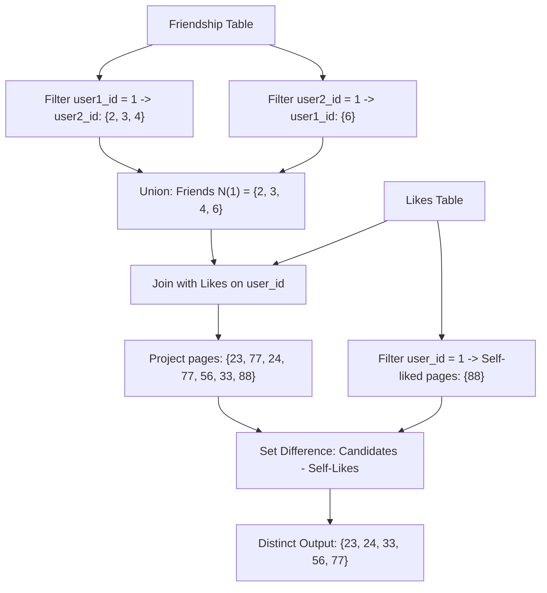

# Guided Example: Page Recommendations

We trace the step-by-step evaluation of a relational query generating social network page recommendations on a representative problem instance:

- **Input:**
  - `Friendship` table containing undirected edges between pairs of users.
  - `Likes` table recording which pages each user has liked.
  - User target: `user_id = 1`.
- **Sample Data:**
  - `Friendship`:
    $$
    (1, 2), (1, 3), (1, 4), (2, 3), (2, 4), (2, 5), (6, 1)
    $$
  - `Likes`:
    $$
    (1, 88), (2, 23), (3, 24), (4, 56), (5, 11), (6, 33), (2, 77), (3, 77), (6, 88)
    $$
- **Required Output:**
  ```text
  recommended_page: [23, 24, 33, 56, 77]
  ```

This instance illustrates symmetric edge unpivoting in relational tables, set projection across intermediate joins, deduplication, and anti-join filtering.

---

## 1. Instance & Teaching Goal

In social graphs, friendship is inherently bidirectional (symmetric). A relationship record $(u_1, u_2)$ means that $u_1$ is friends with $u_2$, and $u_2$ is friends with $u_1$. However, relational storage often normalizes this by storing each pair only once, with $u_1 < u_2$ or in arbitrary insertion order.

For target user $1$:
1. Some friends appear in column `user2_id` where `user1_id = 1` (users $2, 3, 4$).
2. Other friends appear in column `user1_id` where `user2_id = 1` (user $6$).
3. Users who are friends with user $2$ (such as user $5$) are second-degree connections, not immediate friends of user $1$.

```
Friends of User 1:
   User 1 <───> User 2  (likes: 23, 77)
   User 1 <───> User 3  (likes: 24, 77)
   User 1 <───> User 4  (likes: 56)
   User 6 <───> User 1  (likes: 33, 88)

Pages Liked by Friends: {23, 24, 33, 56, 77, 88}
Pages Liked by User 1:  {88}
Recommended Difference: {23, 24, 33, 56, 77}
```

The teaching goal is to express the multi-step relational pipeline: unpivot symmetric friendship links, join against page likes, prune pages already liked by user $1$, and deduplicate the result set.

---

## 2. Conceptual Foundation & Invariants

Let $F \subseteq U \times U$ denote the symmetric friendship relation, and $L \subseteq U \times P$ denote the user-to-page liking relation.

### Relational Transformations
1. **Neighborhood Extraction (Symmetric Union):**
   The set of direct friends $\mathcal{N}(1)$ is the union of endpoints connected to user $1$:
   $$
   \mathcal{N}(1) = \{ u_2 \mid (1, u_2) \in \text{Friendship} \} \cup \{ u_1 \mid (u_1, 1) \in \text{Friendship} \}
   $$
2. **Candidate Expansion (Natural Join):**
   Join the friends set $\mathcal{N}(1)$ with `Likes` on matching `user_id` to obtain all pairs $(u, p)$ where $u \in \mathcal{N}(1)$ and $(u, p) \in L$. Project onto the page attribute:
   $$
   \mathcal{P}_{\text{friends}} = \{ p \mid \exists u \in \mathcal{N}(1), \; (u, p) \in L \}
   $$
3. **Anti-Join / Set Difference:**
   Target user $1$ has already liked pages $\mathcal{P}_{\text{self}} = \{ p \mid (1, p) \in L \}$.
   A page is recommended if and only if it was liked by at least one friend and not liked by user $1$:
   $$
   \mathcal{R} = \mathcal{P}_{\text{friends}} \setminus \mathcal{P}_{\text{self}}
   $$

| Stage | Input Relation | Relational Operation | Output Invariant |
|---|---|---|---|
| 1. Friends Extraction | `Friendship` | Filter $u_1 = 1 \lor u_2 = 1$, project other endpoint | Complete set of 1st-degree friends $\mathcal{N}(1)$ |
| 2. Self-Likes Extraction | `Likes` | Filter $u = 1$, project `page_id` | Pages already consumed by user $1$ |
| 3. Candidate Pages | $\mathcal{N}(1) \bowtie \text{Likes}$ | Equi-join on `user_id`, project `page_id` | All pages liked by any friend |
| 4. Final Recommendation | Candidates $\setminus$ Self-Likes | Set difference, distinct projection | Novel recommended pages |

> **Novelty Invariant.** Every page in the final recommendation set $\mathcal{R}$ must have at least one endorsement from $\mathcal{N}(1)$ and exactly zero endorsements from user $1$.



---

## 3. Step-by-Step Worked Execution

### Phase 1: Resolving Symmetric Friendships
Scan `Friendship` for rows involving user $1$:
- Row `(1, 2)`: `user1_id = 1` $\implies$ friend `2`.
- Row `(1, 3)`: `user1_id = 1` $\implies$ friend `3`.
- Row `(1, 4)`: `user1_id = 1` $\implies$ friend `4`.
- Row `(2, 3)`: user $1$ not involved $\implies$ ignored.
- Row `(2, 4)`: user $1$ not involved $\implies$ ignored.
- Row `(2, 5)`: user $1$ not involved $\implies$ ignored.
- Row `(6, 1)`: `user2_id = 1` $\implies$ friend `6`.

Union of friend identifiers:
$$
\mathcal{N}(1) = \{2, 3, 4, 6\}
$$

### Phase 2: Identifying User 1's Pre-Existing Likes
Scan `Likes` for rows with `user_id = 1`:
- Row `(1, 88)`: `page_id = 88`.
$$
\mathcal{P}_{\text{self}} = \{88\}
$$

### Phase 3: Joining Friends with Likes
We evaluate the `Likes` records corresponding to users in $\mathcal{N}(1) = \{2, 3, 4, 6\}$:

| User ID $u$ | Is Friend of 1? | Page ID $p$ | Added to Candidates? | Rationale |
|---|---|---|---|---|
| $1$ | No (Self) | $88$ | No | In self-likes |
| $2$ | Yes | $23$ | Yes | Friend endorsement |
| $3$ | Yes | $24$ | Yes | Friend endorsement |
| $4$ | Yes | $56$ | Yes | Friend endorsement |
| $5$ | No | $11$ | No | Not in $\mathcal{N}(1)$ |
| $6$ | Yes | $33$ | Yes | Friend endorsement |
| $2$ | Yes | $77$ | Yes | Friend endorsement |
| $3$ | Yes | $77$ | Yes (duplicate) | Friend endorsement |
| $6$ | Yes | $88$ | Yes | Friend endorsement |

Raw candidate pages from friends:
$$
[23, 24, 56, 33, 77, 77, 88]
$$

### Phase 4: Set Difference and Deduplication
1. **Filtering out $\mathcal{P}_{\text{self}}$:**
   Page $88$ is in $\mathcal{P}_{\text{self}}$, so it is removed.
   Remaining pages: $[23, 24, 56, 33, 77, 77]$.
2. **Deduplication:**
   Page $77$ was liked by both user $2$ and user $3$. The distinct projection collapses multiple endorsements into a single entry:
   $$
   \mathcal{R} = \{23, 24, 33, 56, 77\}
   $$

---

## 4. Complete Execution Trace

| Pipeline Step | Relational Entity Processed | Intermediate Result | Status / Check |
|---|---|---|---|
| Step 1 | Forward friendships $(1, u_2)$ | $\{2, 3, 4\}$ | Extracted from column 2 |
| Step 2 | Reverse friendships $(u_1, 1)$ | $\{6\}$ | Extracted from column 1 |
| Step 3 | Full friend set $\mathcal{N}(1)$ | $\{2, 3, 4, 6\}$ | Disjoint union completed |
| Step 4 | Self likes $\mathcal{P}_{\text{self}}$ | $\{88\}$ | Isolated exclusion baseline |
| Step 5 | Friend likes projection | $\{23, 24, 33, 56, 77, 88\}$ | Joined on `user_id` |
| Step 6 | Anti-join $(\setminus \{88\})$ | $\{23, 24, 33, 56, 77\}$ | Self-liked page $88$ purged |
| Step 7 | Deduplication | $[23, 24, 33, 56, 77]$ | Unique recommendation rows |

---

## 5. Algorithmic Correctness

**Soundness.** Every returned page $p$ satisfies two conditions:
1. There exists at least one user $u \in \mathcal{N}(1)$ such that $(u, p) \in \text{Likes}$.
2. $(1, p) \notin \text{Likes}$.
No non-friend endorsement can introduce a page because the join is restricted to $\mathcal{N}(1)$. No self-liked page can appear because the outer condition explicitly prunes all elements of $\mathcal{P}_{\text{self}}$.

**Completeness.** Any page $p$ liked by a friend of user $1$ and not liked by user $1$ must be present in the joined candidate set and will survive the exclusion filter. Deduplication preserves exactly one instance of each distinct page ID, ensuring neither false negatives nor duplicate rows.

---

## 6. Traps This Instance Exposes

- **Single-direction friendship trap:** Filtering only `user1_id = 1` misses friend $6$, omitting page $33$. Filtering only `user2_id = 1` misses friends $2, 3, 4$, omitting pages $23, 24, 56, 77$. Both directions must be combined.
- **Transitive friend contamination:** User $5$ is friends with user $2$. User $5$ likes page $11$. Including friends-of-friends would falsely recommend page $11$. The neighborhood filter must strictly enforce 1st-degree hops.
- **Overlapping likes between friend and self:** Both friend $6$ and user $1$ liked page $88$. If the self-like exclusion is omitted, page $88$ would be incorrectly recommended.
- **Duplicate friend recommendations:** Both user $2$ and user $3$ liked page $77$. Without distinct grouping or set collapse, page $77$ would appear twice in the result table.

---

## 7. Complexity Derivation

- **Time Complexity:**
  - **Friendship Lookup:** Filtering and unioning table `Friendship` of $F$ rows takes $\mathcal{O}(F)$ time using hash index lookups or table scans.
  - **Self-Likes Lookup:** Filtering `Likes` for user $1$ takes $\mathcal{O}(L_1)$ time, where $L_1$ is the number of pages liked by user $1$.
  - **Candidate Join:** Joining friends $\mathcal{N}(1)$ with table `Likes` of $L$ rows takes $\mathcal{O}(|\mathcal{N}(1)| + L)$ using hash join.
  - **Set Difference and Sorting:** Deduplicating and filtering candidates takes $\mathcal{O}(K)$ where $K$ is the number of candidate pairs.
  - **Total Execution Time:** $\mathcal{O}(F + L)$, linear with respect to the total number of records in the database.
- **Auxiliary Space Complexity:** $\mathcal{O}(|\mathcal{N}(1)| + L_1 + |\mathcal{R}|)$ auxiliary memory for the in-memory hash sets of friends, self-likes, and distinct recommended pages.
