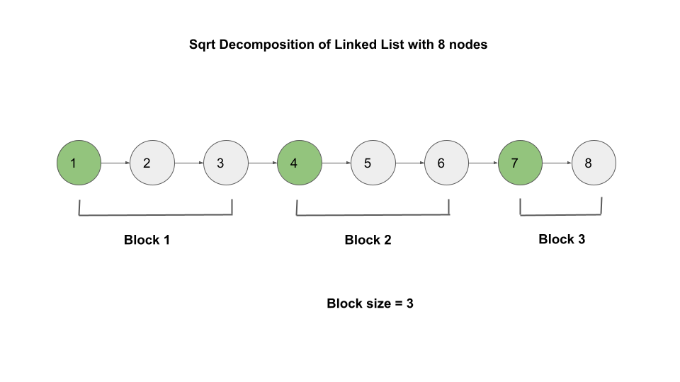

## Solution

---

### Overview

We are given an immutable linked list and our task is to print out all values of nodes in reverse order without modifying the given linked list.

We are given the head of the linked list as an instance of `ImmutableListNode`. Further, we are allowed to only operate over the linked list using two APIs:

1. `ImmutableListNode.printValue()`: Print value of the current node.
2. `ImmutableListNode.getNext()`: Return the next node.

---

### Approach 1: Recursion

#### Intuition

As the linked list must be printed in reverse order, our task is to figure out to handle the nodes in reverse order.

We can consider moving from the head to the tail in a recursive manner. When we return from a recursive call, we move back to the node we came from.

The recursive strategy will be as follows:

```
printLinkedListInReverse(head.getNext());
head.printValue();
```

By making these calls, a recursive stack will be created, with the head at the bottom and the last node at the top.

Here's a visual representation that shows how the working of this approach:

!?!../Documents/1265/1265-slides.json:601,301!?!

As you can observe, the process of backtracking begins when we reach the end of the list. The recursive call for the top element is popped out of the stack and its node value is printed. The values are therefore printed in reverse order as we have the last node at the top and the head at the bottom.

#### Algorithm

1. We use the given method `printLinkedListInReverse(head)` recursively until we reach the end of the list.
2. If `head` is not `null`, recursively move to the next node by calling `printLinkedListInReverse(head.getNext())`. After the recursive call, print the value of the current node, i.e., `head.printValue()`.

#### Implementation

```python
class Solution:
    def printLinkedListInReverse(self, head: 'ImmutableListNode') -> None:
        if head is not None:
            self.printLinkedListInReverse(head.getNext())
            head.printValue()
```

#### Complexity Analysis

Here $n$ is the size of the linked list.

* Time complexity: $O(n)$.
- We make one function call per node and each call runs in $O(1)$.

* Space complexity: $O(n)$.
- The recursion stack will grow up to a size of $n$ when recursive calls corresponding to all the nodes are in the stack (right before the first print).

---

### Approach 2: Using Stack

#### Intuition

In the previous method, we used recursion to go from the beginning to the end and then backtracked to print the values in reverse order.

Under the hood, computers implement recursion using a call stack. We can perform the same algorithm iteratively using our own stack.

Pushing the nodes in the stack, we move from the head to the tail. When we get to the end of the list, we pop the nodes from the top and start printing their values.

#### Algorithm

1. Create a `stack` that stores elements of `ImmutableListNode`.
2. Push all nodes into `stack`.
3. While `stack` is not empty:
- Get the top element `node` of `stack`.
- Pop the top element.
- Print the value of `node`.

#### Implementation

```python
class Solution:
    def printLinkedListInReverse(self, head: 'ImmutableListNode') -> None:
        stack = []
        while head:
            stack.append(head)
            head = head.getNext()

        while stack:
            node = stack.pop()
            node.printValue()
```

#### Complexity Analysis

Here $n$ is the size of the linked list.

* Time complexity: $O(n)$.
- We push all the nodes in the stack which takes $O(n)$ time. We also pop all of them out of the stack which again takes $O(n)$ time.

* Space complexity: $O(n)$.
- Before we start printing values, the stack will have a size of $n$.

---

### Approach 3: Square Root Decomposition

#### Intuition

The previous two approaches are standard approaches to use in an interview. The rest of the approaches in this article will focus on interesting ways we can reduce the space complexity. Note that these following approaches are not necessarily "better" or "worse", but just interesting alternative ways to approach the problem.

Since we need to reverse the full list, we can break it up into different blocks and print the node values in the opposite order in each block. The first recursion strategy we outlined above will be used to simply reverse the node values in one block at a time.

The advantage of using the blocks is that the recursion stack will only expand up to the size of a single block, unlike the earlier way where it grew to size `n` (where `n` is the size of the linked list). We will print the values starting with the last block and continuing through the second-last block and ending at the first block.

As we cannot move in the reverse manner using the linked list, we would also need to store the starting nodes for every block to reverse the list from the start of the block. From each starting node of a block, we will use the recursion technique to print the node values in reverse order in each block.

Let's assume that each block is `x` in size. As a result, we would have $n / x$ blocks and would need to store $n / x$ starting nodes for each block. The recursion stack would expand to size `x` because we will only reverse one block at a time. Therefore, the space complexity would be $O(n / x + x)$. When `x` = $\sqrt{n}$, it would be minimal.

This technique of reducing the complexity of an algorithm by a factor of $\sqrt{n}$ by dividing the input into $\sqrt{n}$ chunks and performing operations on whole chunks when possible is called **square root decomposition**.

The linked list is divided into equal blocks of size $\sqrt{n}$, where the size of the final block may not be exactly $\sqrt{n}$. We stack the starting nodes for each block so that the starting node for the most recent block is at the top. Here is a diagram showing how the linked list with `8` nodes breaks down:



The starting nodes of each block that we will keep in a stack are the nodes that are colored green.

To print the values of each block, we would use a recursive method identical to the first technique. To print the node values from the initial node up to the size of the block in reverse order, we pass the starting node of each block along with a size for each block. We pop out the current node from the stack to move to the next block.

#### Algorithm

1. Create a method `getLinkedListSize` which takes an `ImmutableListNode head` as the parameter. It returns the size of the linked list.
2. We create another method `printLinkedListInReverseRecursively` similar to the recursive method we used in the first approach. It takes `ImmutableListNode head` and `size` as the parameters. It prints the values of nodes starting from `head` up to size `size` in the reverse order. We do the following in this method:
- If `size` is `0` or `head` is `null`, it means either we have completed this block or reached the end of the list. We don't do anything in such a case.
- Else if $size \neq 0$ and `head` is not `null`, we recursively call `printLinkedListInReverseRecursively` passing `head` as `head.getNextNode()` to move to the next node and `size` as $size - 1$ as we have covered the current node.
- After the recursive call we print the current node.
3. Now in the main function `printLinkedListInReverse`, we create an integer variable `linkedListSize` and set it equal to `getLinkedListSize(head)`.
4. Create another integer variable `blockSize` equal to `sqrt(linkedListSize)`. We take the `ceil` of it (round up) to convert it to a whole number.
5. Create a stack `blocks` of type `ImmutableListNode` to store starting nodes for all the blocks. We also create a copy `curr` of `head`.
6. Iterate from $i = 0$ to $linkedListSize - 1$ and perform the following:
- For every position `i` that is divisible by `blockSize`, i.e., $i \% blockSize = 0$, we push `curr` to `blocks`. These nodes are the starting nodes of the blocks.
- Update $curr = \text{curr.getNextNode}()$.
7. While `block` is not empty:
- Call `printLinkedListInReverseRecursively` passing the top element of `blockSize` as the first parameter and `blockSize` as the second parameter.
- Pop the top element from `blocks`.

#### Implementation

```python
class Solution:
    def printLinkedListInReverseRecursively(self, head: 'ImmutableListNode', size: int) -> None:
        if size > 0 and head is not None:
            self.printLinkedListInReverseRecursively(head.getNext(), size - 1)
            head.printValue()

    def getLinkedListSize(self, head: 'ImmutableListNode') -> int:
        size = 0
        while head is not None:
            size += 1
            head = head.getNext()
        return size

    def printLinkedListInReverse(self, head: 'ImmutableListNode') -> None:
        linked_list_size = self.getLinkedListSize(head)
        block_size = math.ceil(math.sqrt(linked_list_size))

        blocks = []
        curr = head
        for i in range(linked_list_size):
            if i % block_size == 0:
                blocks.append(curr)
            curr = curr.getNext()

        while blocks:
            self.printLinkedListInReverseRecursively(blocks.pop(), block_size)
```

#### Complexity Analysis

Here $n$ is the size of the linked list.

* Time complexity: $O(n)$.
- Finding the size of the linked list takes $O(n)$ time.
- Figuring out all the starting nodes of the blocks also takes $O(n)$ time.
- We use recursive function for all the $\sqrt{n}$ number of blocks. It takes $O(\sqrt{n})$ time to print the node values in each block of size $\sqrt{n}$. As a result, it takes $O(n)$ to print node values in all the blocks.

* Space complexity: $O(\sqrt{n})$.
- We have $\sqrt{n}$ blocks and store the same number of nodes that act as starting nodes for the blocks.
- The recursion stack grows maximum up to size of $O(\sqrt{n})$ as we are using one block of size $\sqrt{n}$ at a time.

### Approach 4: Divide and Conquer

#### Intuition

In the previous approach, we divided the list into equal blocks of $\sqrt{n}$ size. It reduced the linear space complexity to $O(\sqrt{n})$.

By splitting the linked list into two halves, we could further reduce the space complexity. We first solve (print the node values backward) the right part before solving the left part so that the right part's node values are printed before the left part's node values. The division of a portion into two equal pieces can be further repeated.

This technique of breaking a given problem into two (or more) similar subproblems, solving them in turn, and finally composing their solutions to solve the given problem is called **divide and conquer**.

We would require a recursive function, say `helper`, that accepts two parameters to hold the range of the problem, the initial node `start` and the node `end` at which the range terminates. We would include `start` but exclude `end` in the range.

In this method, we check if `start` is equal to `null` or $start = end$. If any of these conditions hold, we simply return as there is no valid node in this range.

If $\text{start.getNextNode}() = end$, it means `start` is the only node in this range. We print its value and return.

Otherwise, the range has many nodes. We have to divide this range into two equal parts. If we find the `middle` of this range, we can recursively call `helper` with `middle` and `end` parameters to print the node values on right side of the range first and then call the same method with `start` and `middle` as parameters.

> You may recognize this strategy from the merge sort algorithm.

Let's find the middle of the range with `start` and `end` as starting and ending nodes respectively.

To get to the middle of the list, we can use two pointers: `slow` and `fast`. We set their initial value to `start`.

We move `slow` to the next node after moving `fast` two nodes ahead. We perform this until `fast` or `fast.next` becomes `null`. Because `fast` moves at twice the speed of `slow`, we will have the required middle node at `slow`.

#### Algorithm

1. Create a recursive method `helper` that takes the starting node `start` and the ending node `end` as parameters. We perform the following in this method:
- If $start = null$ or $start = end$, return.
- If $\text{start.getNextNode}() = end$, print the node value of `start` and return.
- Create two `ListNode` pointers `slow` and `fast`. Initialize both of them to `start`.
- To get to the middle of the list, we move `fast` two steps ahead and `slow` one step ahead. We iterate until we can move two steps ahead, i.e., while `fast` and `fast.next` are not `null`. We keep updating `fast` to two nodes ahead, i.e., $fast = \text{fast.next}.next$ and `slow` to `slow.next` in the while loop.
- The middle node of the range is `slow`. Recursively call `helper(slow, end)` and then `helper(start, slow)`.
2. Call the recursive method `helper` from the main method passing `head` and `null` as the parameters.

#### Implementation

```python
class Solution:
    def helper(self, start: 'ImmutableListNode', end: 'ImmutableListNode') -> None:
        if start is None or start == end:
            return
        if start.getNext() == end:
            start.printValue()
            return

        slow = start
        fast = start

        while fast != end and fast.getNext() != end:
            slow = slow.getNext()
            fast = fast.getNext().getNext()

        self.helper(slow, end)
        self.helper(start, slow)

    def printLinkedListInReverse(self, head: 'ImmutableListNode') -> None:
        self.helper(head, None)
```

#### Complexity Analysis

Here $n$ is the size of the linked list.

* Time complexity: $O(n \cdot log{n})$.
- We are recursively splitting the problem space (range) into two subproblems with ranges that are each half as large. Because we are dividing the problem in half at each level, a recursive tree with a height of $O(\log{n})$ is formed.
- The recursive technique requires $O(r)$ time to find the middle of any range $r$. The only action in the `helper` method that requires more than constant time is locating the middle of the range.
- We have a $O(n)$ range at each level, which is the sum of all the nodes at that level. The first level contains a node with a range of $n$, the second level has two nodes with ranges of $n / 2$ each, and the third level has four nodes with ranges of $n / 4$ each, etc. As a result, the time complexity to operate over all the nodes at any level is $O(n)$. It would take $O(n \cdot log{n})$ time overall because there are $O(\log{n})$ levels.

* Space complexity: $O(\log{n})$.
- The recursion tree would be $O(\log{n})$ in height, as we previously discussed. Because there can only ever be one active recursive call at a time at each level, the maximum number of recursive calls in the recursion stack can also be $O(\log{n})$.

---

### Approach 5: Constant Space

#### Intuition

Using the divide and conquer strategy, we further decreased the space complexity to $O(\log{n})$. Let's try to maintain a constant level of space complexity.

We cannot employ any stacks, as we did in any of the above methods, to achieve constant space complexity. To print the node values without saving anything, we must find a mechanism to loop through the list.

We can iterate starting with $curr = head$ and continue until `curr.getNextNode()` returns `null` to print the value of the last node. The `curr` node is the last node to be printed once the loop ends, therefore we print its value.

How then can we print the value of the second-to-last node? We save the node we just printed and then restart back at the `head`, and proceed again until  `curr.getNextNode()` equals the saved node.

Other values can be printed similarly. Every time a loop is executed, we update the linked list's end to the last node of the iteration.

We create a variable called `end` to hold the node where our traversal should conclude when we start at the beginning. We set its initial value to `null`.

After setting up a new variable, $curr = head$, we proceed until `curr.getNextNode()` equals `end`. The value of `curr` is printed. Since this acts as the new endpoint for the following iteration, we update `end` equal to `curr`.

We keep on repeating this process until `end` becomes equal to `head` which would mean we've printed all the node values.

#### Algorithm

1. Create two `ImmutableListNode` variables `curr` and `end`. Initialize `end` to `null`.
2. While `head` is not equal to `end`:
- Set `curr` equal to `head`.
- While `curr.getNextNode()` is not equal to `end`, keep updating $curr = \text{curr.getNextNode}()$.
- Print the value of `curr`.
- Update $end = curr$.

#### Implementation

```python
class Solution:
    def printLinkedListInReverse(self, head: 'ImmutableListNode') -> None:
        end = None

        while head != end:
            curr = head
            while curr.getNext() != end:
                curr = curr.getNext()
            curr.printValue()
            end = curr
```

#### Complexity Analysis

Here $n$ is the size of the linked list.

* Time complexity: $O(n^2)$.
- After each repetition, we update the end to a previous node as we traverse from the starting node to the final node. In the first iteration, getting to the end requires $n - 1$ steps, in the second, $n - 2$ steps, in the third, $n - 3$ steps, and so on. A total of $n + (n - 1) + (n - 2) +... 1 = O(n^2)$ steps would be required.

* Space complexity: $O(1)$.
- We are not using any space except declaring a few instances of `ImmutableListNode` which take up constant space.