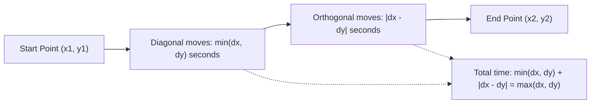

# Guided Example: Minimum Time Visiting All Points

We trace the step-by-step computation of the optimal trajectory through sequential planar waypoints on a representative problem instance:

- **Input:** `points = [[1, 1], [3, 4], [-1, 0]]`
- **Required Output:** `7`

This instance illustrates the Chebyshev metric ($L_\infty$ norm), the geometric decomposition into simultaneous diagonal and orthogonal steps, and the optimality of pairwise distance summation.

---

## 1. Instance & Teaching Goal

The problem requires visiting an ordered sequence of $N$ points on an integer grid. In each 1-second step, we can move:
- Horizontally: $\Delta x = \pm 1, \; \Delta y = 0$
- Vertically: $\Delta x = 0, \; \Delta y = \pm 1$
- Diagonally: $\Delta x = \pm 1, \; \Delta y = \pm 1$

These movement rules correspond precisely to the movement of a King on a chessboard. Moving diagonally allows both the $x$ and $y$ coordinate differences to decrease simultaneously by $1$ in a single second.

```
Segment 1: From (1, 1) to (3, 4)
  Δx = |3 - 1| = 2,  Δy = |4 - 1| = 3
  (1, 1) ──diagonal──> (2, 2) ──diagonal──> (3, 3) ──vertical──> (3, 4)
  Cost: 2 diagonal + 1 vertical = 3 seconds = max(2, 3)

Segment 2: From (3, 4) to (-1, 0)
  Δx = |-1 - 3| = 4,  Δy = |0 - 4| = 4
  (3, 4) ──4 diagonals──> (-1, 0)
  Cost: 4 diagonal + 0 straight = 4 seconds = max(4, 4)

Total Minimum Time = 3 + 4 = 7 seconds
```

Because the points must be visited strictly in the specified sequence, the global minimum time is the exact sum of the pairwise minimum times between consecutive points $P_i$ and $P_{i+1}$.

The teaching goal is to derive the King's move / Chebyshev distance formula $\max(|\Delta x|, |\Delta y|)$ and demonstrate why no simulation of individual second-by-second steps is required.

---

## 2. Conceptual Foundation & Invariants

Let two consecutive points be $P_1 = (x_1, y_1)$ and $P_2 = (x_2, y_2)$. Define the absolute coordinate spans:
$$
\Delta x = |x_2 - x_1|, \quad \Delta y = |y_2 - y_1|
$$

### Motion Decomposition
In any step of $1$ second, the maximum change along the $x$-axis is $1$, and the maximum change along the $y$-axis is $1$:
$$
|x(t+1) - x(t)| \le 1, \quad |y(t+1) - y(t)| \le 1
$$
Therefore, traversing a total displacement of $\Delta x$ requires at least $\Delta x$ seconds, and traversing $\Delta y$ requires at least $\Delta y$ seconds:
$$
T \ge \Delta x \quad \text{and} \quad T \ge \Delta y \implies T \ge \max(\Delta x, \Delta y)
$$

We can always achieve this theoretical lower bound:
1. **Diagonal Phase:** Move diagonally in the direction of both coordinate targets for $\min(\Delta x, \Delta y)$ seconds. Each diagonal move reduces both horizontal and vertical distances by $1$.
2. **Orthogonal Phase:** After the diagonal phase, the shorter coordinate displacement has reached zero, leaving $|\Delta x - \Delta y|$ remaining along the longer axis. Move purely orthogonally for $|\Delta x - \Delta y|$ seconds.

Total transit time:
$$
T = \min(\Delta x, \Delta y) + |\Delta x - \Delta y| = \max(\Delta x, \Delta y)
$$

| Segment | Start $P_i$ | End $P_{i+1}$ | $\Delta x$ | $\Delta y$ | Diagonal Steps | Orthogonal Steps | Duration $T_i$ |
|---|---|---|---|---|---|---|---|
| Segment 1 | $(1, 1)$ | $(3, 4)$ | $2$ | $3$ | $2$ | $1$ | $3$ |
| Segment 2 | $(3, 4)$ | $(-1, 0)$ | $4$ | $4$ | $4$ | $0$ | $4$ |

> **Chebyshev Metric Invariant.** The minimum time to travel between any two grid points under 8-directional unit steps equals their Chebyshev distance $d_\infty(P_1, P_2) = \max(|x_2 - x_1|, |y_2 - y_1|)$. The triangle inequality holds, ensuring that straight-line King paths are optimal.



---

## 3. Step-by-Step Worked Execution

We process the point list `[[1, 1], [3, 4], [-1, 0]]` sequentially.

### Segment 1: From $(1, 1)$ to $(3, 4)$
1. **Coordinate differences:**
   $$
   \Delta x = |3 - 1| = 2, \quad \Delta y = |4 - 1| = 3
   $$
2. **Phase breakdown:**
   - Diagonal moves: $\min(2, 3) = 2$ steps northeast.
     - Step 1: $(1, 1) \to (2, 2)$
     - Step 2: $(2, 2) \to (3, 3)$
   - Orthogonal moves: $|2 - 3| = 1$ step north.
     - Step 3: $(3, 3) \to (3, 4)$
3. **Segment duration:**
   $$
   T_1 = \max(2, 3) = 3 \text{ seconds}
   $$

### Segment 2: From $(3, 4)$ to $(-1, 0)$
1. **Coordinate differences:**
   $$
   \Delta x = |-1 - 3| = |-4| = 4, \quad \Delta y = |0 - 4| = |-4| = 4
   $$
2. **Phase breakdown:**
   - Diagonal moves: $\min(4, 4) = 4$ steps southwest.
     - Step 1: $(3, 4) \to (2, 3)$
     - Step 2: $(2, 3) \to (1, 2)$
     - Step 3: $(1, 2) \to (0, 1)$
     - Step 4: $(0, 1) \to (-1, 0)$
   - Orthogonal moves: $|4 - 4| = 0$ steps.
3. **Segment duration:**
   $$
   T_2 = \max(4, 4) = 4 \text{ seconds}
   $$

### Total Path Accumulation
Summing the durations of all consecutive segments:
$$
T_{\text{total}} = T_1 + T_2 = 3 + 4 = 7 \text{ seconds}
$$

---

## 4. Complete Execution Trace

| Segment Index $i$ | Current Point $P_i$ | Target Point $P_{i+1}$ | Axis Displacements $(\Delta x, \Delta y)$ | Evaluated Duration $\max(\Delta x, \Delta y)$ | Cumulative Time |
|---|---|---|---|---|---|
| Init | $(1, 1)$ | - | - | - | $0$ |
| 1 | $(1, 1)$ | $(3, 4)$ | $(2, 3)$ | $\max(2, 3) = 3$ | $3$ |
| 2 | $(3, 4)$ | $(-1, 0)$ | $(4, 4)$ | $\max(4, 4) = 4$ | $7$ |

Final result: $7$.

---

## 5. Algorithmic Correctness

**Soundness.** In 1 second, a move changes $x$ by $c_x \in \{-1, 0, 1\}$ and $y$ by $c_y \in \{-1, 0, 1\}$. Thus, after $k$ seconds, the maximum possible displacement along the $x$-axis is $k$ and along the $y$-axis is $k$. Therefore, reaching a displacement of $(\Delta x, \Delta y)$ requires $k \ge \max(\Delta x, \Delta y)$ steps. Because our explicit two-phase trajectory reaches the target in exactly $\max(\Delta x, \Delta y)$ steps, this value is strictly minimal.

**Completeness.** The problem dictates that points must be visited in the given order without skipping or reordering. The minimum time for the entire path is the sum of the minimum times for each individual leg. Since each leg is solved optimally by the closed-form Chebyshev formula, the overall sum is globally optimal.

---

## 6. Traps This Instance Exposes

- **Manhattan distance assumption:** Assuming only horizontal and vertical moves are allowed yields the Manhattan distance $\Delta x + \Delta y$. For Segment 1, Manhattan distance gives $2 + 3 = 5$, which is suboptimal because it ignores diagonal movement.
- **Euclidean rounding:** Using Euclidean distance $\sqrt{\Delta x^2 + \Delta y^2}$ is invalid because travel is constrained to a discrete grid where diagonal moves cost $1$ second rather than $\sqrt{2}$ seconds.
- **Negative coordinates:** Coordinates can be negative (e.g. $(-1, 0)$). Calculating differences without absolute values can lead to negative times if not handled properly.
- **Single point list:** When $N = 1$, the loop over adjacent pairs does not execute, correctly yielding $0$ seconds because no travel is required.

---

## 7. Complexity Derivation

- **Time Complexity:** $\mathcal{O}(N)$, where $N$ is the number of points. We perform a single linear sweep over the $N - 1$ consecutive pairs, evaluating the closed-form arithmetic expression $\max(|x_{i+1} - x_i|, |y_{i+1} - y_i|)$ in $\mathcal{O}(1)$ time per pair.
- **Auxiliary Space Complexity:** $\mathcal{O}(1)$. Only a single integer accumulator is maintained to store the running sum.
