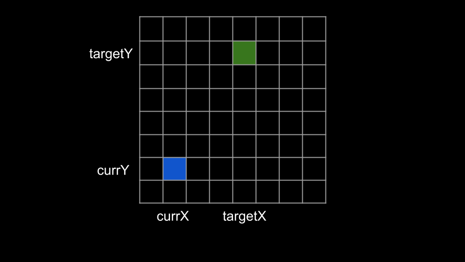
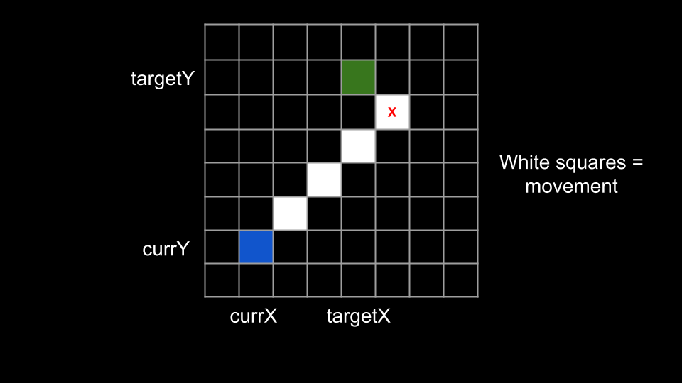
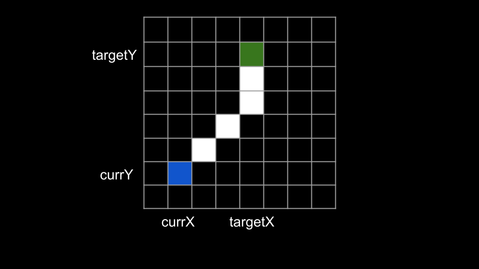

## Solution

---

### Approach: Move Diagonally as Much as Possible

**Intuition**

Because we have to visit each point in order, if we consider each pair of adjacent points as a segment, each segment is entirely independent. Our decisions within the current segment do not affect the decisions in other segments. Therefore, the optimal solution for this problem consists of the optimal solutions for each individual segment. To solve this problem, the first thing we need to determine is the optimal strategy for moving between adjacent points.

At each second, we have three options:

1. Move 1 unit vertically toward our target.
2. Move 1 unit horizontally toward our target.
3. Move diagonally toward our target, which is 1 unit vertically and then 1 unit horizontally.

Notice that the 3rd option of moving diagonally is actually the combination of the first two options. Because all three options take the same amount of time, moving diagonally is the most efficient option in terms of distance per time.

Thus, we should aim to move diagonally as much as possible. Let's say our current position is `currX, currY` and we are trying to reach a target at position `targetX, targetY`.


<br>

When does moving diagonally stop saving time? If either $currX = targetX$ or $currY = targetY$, it means we are already lined up to our target in one of the directions. Thus, moving diagonally will not provide any benefit over moving horizontally or vertically. Some of the $\sqrt{2}$ distance from moving diagonally will be wasted.


<br>

In the above image, you can see that if we keep moving diagonally after being lined up with the target, we will overshoot it on the x coordinate. Thus, we should only move diagonally until we are lined up in one direction, then make up the remaining distance with vertical or horizontal movements.


<br>

Using this strategy, how do we calculate the required time to travel between two points? We can think of two different stages for the movement:

1. Move diagonally until lined up in a direction.
2. Move horizontally or vertically the remaining distance.

Let's say the difference in `x` coordinates between the current position and the target is `xDiff`. Similarly, the difference in `y` coordinates is `yDiff`. Step 1 will take `min(xDiff, yDiff)` time.

How much time will step 2 take? The larger horizontal or vertical distance at the beginning is `max(xDiff, yDiff)`, but we already traveled `min(xDiff, yDiff)` in both directions. Thus, step 2 will take $max(xDiff, yDiff) - min(xDiff, yDiff)$.

The sum of step 1 and step 2 is $min(xDiff, yDiff) + max(xDiff, yDiff) - min(xDiff, yDiff) = max(xDiff, yDiff)$. Thus, the time it will take to move between two points is `max(xDiff, yDiff)`.

> This distance is also known as the [Chebyshev distance](https://en.wikipedia.org/wiki/Chebyshev_distance).

This brings us to our solution. We will iterate over each index `i` of `points` except for the last one. At each index, we treat $\text{points}[i]$ as the current point and $points[i + 1]$ as the target point. We then calculate the `x` difference and `y` difference using the absolute value function. Finally, we add the larger of the two to our answer.

> The problem states that we must visit the points in order. Thus, if we are currently at $\text{points}[i]$, the next point we need to reach is $points[i + 1]$. The final point has no next point, which is why we stop iteration before the final index.

**Algorithm**

1. Initialize the answer $ans = 0$.
2. Iterate `i` from `0` until $\text{points.length} - 1$:
- Set `currX` to $\text{points}[i][0]$ and `currY` to $\text{points}[i][1]$
- Set `targetX` to $points[i + 1][0]$ and `targetY` to $points[i + 1][1]$
- Add the maximum of $abs(targetX - currX)$ and $abs(targetY - currY)$ to `ans`.
3. Return `ans`.

**Implementation**

```python
class Solution:
    def minTimeToVisitAllPoints(self, points: List[List[int]]) -> int:
        ans = 0
        for i in range(len(points) - 1):
            curr_x, curr_y = points[i]
            target_x, target_y = points[i + 1]
            ans += max(abs(target_x - curr_x), abs(target_y - curr_y))

        return ans
```

**Complexity Analysis**

Given $n$ as the length of `points`,

* Time complexity: $O(n)$

    We iterate `i` over $n - 1$ indices. At each iteration, we perform $O(1)$ work.

* Space complexity: $O(1)$

    We aren't using any extra space other than a few integers.

<br/>

---