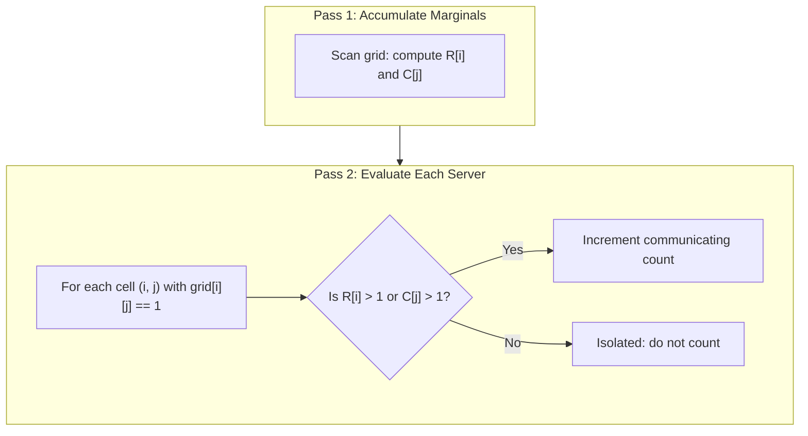

# Guided Example: Count Servers that Communicate

We trace the step-by-step identification of connected nodes on a planar server grid on a representative problem instance:

- **Input:**
  ```text
  grid = [
    [1, 1, 0, 0],
    [0, 0, 1, 0],
    [0, 0, 1, 0],
    [0, 0, 0, 1]
  ]
  ```
- **Required Output:** `4`

This instance illustrates marginal histogram projections (row and column counts), the geometric isolation condition, and optimal two-pass matrix filtering without graph construction.

---

## 1. Instance & Teaching Goal

We are given an $m \times n$ matrix representing a data center, where `1` denotes an active server and `0` denotes an empty rack. Two servers communicate if and only if they reside in the same row or the same column.

```
       Col 0   Col 1   Col 2   Col 3   Row Sum
Row 0 [  1       1       0       0   ]    2  <-- communicates via Row 0
Row 1 [  0       0       1       0   ]    1  <-- communicates via Col 2
Row 2 [  0       0       1       0   ]    1  <-- communicates via Col 2
Row 3 [  0       0       0       1   ]    1  <-- isolated (Row 3 = 1, Col 3 = 1)
---------------------------------------
Col Sum  1       1       2       1
```

A naive approach would build an explicit adjacency graph connecting every pair of servers sharing a row or column, requiring $\mathcal{O}(S^2)$ edge evaluations, where $S$ is the number of servers.
The optimal strategy recognizes that communication is a local property determined entirely by the 1D marginal server counts along its row and column. A server at $(i, j)$ communicates if and only if:
$$
\text{Total in Row } i > 1 \quad \lor \quad \text{Total in Column } j > 1
$$

The teaching goal is to demonstrate the two-pass histogram projection technique that solves the problem in $\mathcal{O}(m \cdot n)$ time and $\mathcal{O}(m + n)$ auxiliary space.

---

## 2. Conceptual Foundation & Invariants

Let $G \in \{0, 1\}^{m \times n}$ denote the grid. Define the 1D marginal projection arrays:
$$
R_i = \sum_{j=0}^{n-1} G[i][j], \quad C_j = \sum_{i=0}^{m-1} G[i][j]
$$

### Communication Condition
For any server located at $(i, j)$ with $G[i][j] = 1$:
- The number of other servers in row $i$ is $R_i - 1$.
- The number of other servers in column $j$ is $C_j - 1$.
- The server communicates with at least one other server if and only if $(R_i - 1) + (C_j - 1) > 0$, or equivalently:
  $$
  R_i \ge 2 \quad \lor \quad C_j \ge 2
  $$

Conversely, a server is completely isolated if and only if $R_i = 1$ and $C_j = 1$.

| Coordinate | Value $G[i][j]$ | Row Count $R_i$ | Col Count $C_j$ | Predicate: $R_i > 1 \lor C_j > 1$ | Communicating? |
|---|---|---|---|---|---|
| $(0, 0)$ | $1$ | $2$ | $1$ | True ($R_0 = 2$) | Yes |
| $(0, 1)$ | $1$ | $2$ | $1$ | True ($R_0 = 2$) | Yes |
| $(1, 2)$ | $1$ | $1$ | $2$ | True ($C_2 = 2$) | Yes |
| $(2, 2)$ | $1$ | $1$ | $2$ | True ($C_2 = 2$) | Yes |
| $(3, 3)$ | $1$ | $1$ | $1$ | False ($R_3 = 1, C_3 = 1$) | No (Isolated) |

> **Marginal Sufficiency Invariant.** The communication status of server $(i, j)$ depends solely on the marginal sums $R_i$ and $C_j$. Once these $m + n$ sums are computed, every server's reachability is evaluated in $\mathcal{O}(1)$ independent of other cells.



---

## 3. Step-by-Step Worked Execution

### Pass 1: Accumulate Row and Column Marginals
We iterate through all $4 \times 4 = 16$ cells to compute sums:
- **Row sums:**
  - Row $0$: $1 + 1 + 0 + 0 = 2$
  - Row $1$: $0 + 0 + 1 + 0 = 1$
  - Row $2$: $0 + 0 + 1 + 0 = 1$
  - Row $3$: $0 + 0 + 0 + 1 = 1$
  $$
  R = [2, 1, 1, 1]
  $$
- **Column sums:**
  - Col $0$: $1 + 0 + 0 + 0 = 1$
  - Col $1$: $1 + 0 + 0 + 0 = 1$
  - Col $2$: $0 + 1 + 1 + 0 = 2$
  - Col $3$: $0 + 0 + 0 + 1 = 1$
  $$
  C = [1, 1, 2, 1]
  $$

### Pass 2: Filter and Count Communicating Servers
We inspect all cells containing active servers ($G[i][j] = 1$):

1. **Server at $(0, 0)$:**
   - $R_0 = 2$, $C_0 = 1$.
   - Since $R_0 = 2 > 1$, server communicates with $(0, 1)$.
   - Count increments to $1$.
2. **Server at $(0, 1)$:**
   - $R_0 = 2$, $C_1 = 1$.
   - Since $R_0 = 2 > 1$, server communicates with $(0, 0)$.
   - Count increments to $2$.
3. **Server at $(1, 2)$:**
   - $R_1 = 1$, $C_2 = 2$.
   - Since $C_2 = 2 > 1$, server communicates with $(2, 2)$.
   - Count increments to $3$.
4. **Server at $(2, 2)$:**
   - $R_2 = 1$, $C_2 = 2$.
   - Since $C_2 = 2 > 1$, server communicates with $(1, 2)$.
   - Count increments to $4$.
5. **Server at $(3, 3)$:**
   - $R_3 = 1$, $C_3 = 1$.
   - Neither $R_3 > 1$ nor $C_3 > 1$.
   - Server is isolated. Count remains $4$.

---

## 4. Complete Execution Trace

| Inspection Step | Cell Coordinate | $G[i][j]$ | $R_i$ | $C_j$ | Decision Rule | Running Total |
|---|---|---|---|---|---|---|
| 1 | $(0, 0)$ | $1$ | $2$ | $1$ | $R_0 > 1 \implies$ communicating | $1$ |
| 2 | $(0, 1)$ | $1$ | $2$ | $1$ | $R_0 > 1 \implies$ communicating | $2$ |
| 3 | $(1, 2)$ | $1$ | $1$ | $2$ | $C_2 > 1 \implies$ communicating | $3$ |
| 4 | $(2, 2)$ | $1$ | $1$ | $2$ | $C_2 > 1 \implies$ communicating | $4$ |
| 5 | $(3, 3)$ | $1$ | $1$ | $1$ | $R_3 \le 1 \land C_3 \le 1 \implies$ isolated | $4$ |

Final result: $4$.

---

## 5. Algorithmic Correctness

**Soundness.** A server at $(i, j)$ communicates if there exists another server $(i', j')$ such that $(i' = i \lor j' = j)$ and $(i', j') \ne (i, j)$.
If $R_i > 1$, there must exist some $j' \ne j$ with $G[i][j'] = 1$. Similarly, if $C_j > 1$, there exists some $i' \ne i$ with $G[i'][j] = 1$. Thus, the condition $R_i > 1 \lor C_j > 1$ is both necessary and sufficient for communication.

**Completeness.** Every cell in the grid is scanned in the second pass. No server is omitted. Because each server $(i, j)$ is visited exactly once, no communicating server is double counted.

---

## 6. Traps This Instance Exposes

- **Overcounting intersection cells:** If a server satisfies both $R_i > 1$ and $C_j > 1$, it must be counted exactly once. Using an `OR` boolean operator ensures unit increment rather than adding $2$.
- **Graph traversal overhead:** Constructing connected components using Breadth-First Search or Disjoint Set Union works correctly but requires building explicit edge lists. The marginal projection achieves the same outcome without graph structures.
- **Empty matrix rows/columns:** Rows and columns with sum $0$ contribute nothing and do not affect the validity of other rows/columns.

---

## 7. Complexity Derivation

- **Time Complexity:** $\mathcal{O}(m \cdot n)$.
  - Pass 1 traverses all $m \times n$ cells once to calculate the row and column sums, performing $\mathcal{O}(m \cdot n)$ additions.
  - Pass 2 traverses all $m \times n$ cells once, performing $\mathcal{O}(1)$ checks and additions per cell.
  - Total runtime is $\mathcal{O}(m \cdot n)$, which is optimal since every grid entry must be inspected at least once.
- **Auxiliary Space Complexity:** $\mathcal{O}(m + n)$ to store the 1D marginal arrays for $m$ row sums and $n$ column sums.
