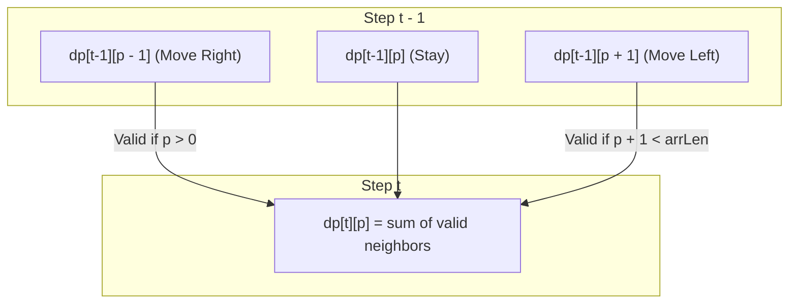

# Guided Example: Number of Ways to Stay in the Same Place After Some Steps

We trace the step-by-step dynamic programming evaluation of bounded 1D lattice random walks on a representative problem instance:

- **Input:**
  - `steps = 3`
  - `arrLen = 2`
- **Required Output:** `4`

This instance illustrates path combinatorics on a bounded discrete line, boundary reflection constraints, and the horizon truncation optimization that caps search width at $\min(\text{arrLen}, \lfloor \text{steps} / 2 \rfloor + 1)$.

---

## 1. Instance & Teaching Goal

We start at position $0$ on an array of length $\text{arrLen} = 2$, which has valid indices $\{0, 1\}$. At each step, we can:
- Move Right: position increases by $+1$ (valid only if position $+ 1 < \text{arrLen}$).
- Move Left: position decreases by $-1$ (valid only if position $- 1 \ge 0$).
- Stay: position remains unchanged.

The question asks for the total number of distinct step sequences of length `steps = 3` that begin at index $0$ and terminate at index $0$ without ever stepping out of bounds.

```
Array Indices:      [ 0 ]   <───>   [ 1 ]
                    Start           Boundary

Possible Walks of Length 3 Returning to 0:
1. Stay  ──> Stay  ──> Stay   : 0 -> 0 -> 0 -> 0
2. Right ──> Left  ──> Stay   : 0 -> 1 -> 0 -> 0
3. Right ──> Stay  ──> Left   : 0 -> 1 -> 1 -> 0
4. Stay  ──> Right ──> Left   : 0 -> 0 -> 1 -> 0

Total Valid Walks: 4
```

A brute-force recursion without memoization explores $3^{\text{steps}} = 3^3 = 27$ branches (or $3^{500} \approx 3.6 \times 10^{238}$ in the full constraints). Dynamic programming aggregates paths by (step, position), reducing exponential branching to polynomial state transitions.

---

## 2. Conceptual Foundation & Invariants

Let $dp[t][p]$ denote the number of valid paths from index $0$ to position $p$ using exactly $t$ steps.

### Horizon Truncation Principle
To return to index $0$ after $T$ total steps:
- If a walk reaches position $p$, it requires at least $p$ leftward steps to return to $0$.
- With $T - t$ steps remaining, returning to $0$ is physically possible if and only if $p \le T - t$.
- In particular, the maximum distance reachable while still being able to return within $T$ steps is:
  $$
  p_{\max} = \min\left(\text{arrLen} - 1, \; \lfloor T / 2 \rfloor\right)
  $$
Even if $\text{arrLen} = 10^6$, for $T = 500$, the walker can never venture past index $250$. Any position beyond $\lfloor T / 2 \rfloor$ can be safely ignored.

### State Transition
For step $t \in [1, \text{steps}]$ and position $p \in [0, p_{\max}]$:
$$
dp[t][p] = \left( dp[t-1][p] + dp[t-1][p-1] + dp[t-1][p+1] \right) \pmod{10^9 + 7}
$$
subject to boundary constraints:
- $dp[t-1][p-1] = 0$ when $p = 0$ (cannot step left of boundary $0$).
- $dp[t-1][p+1] = 0$ when $p = \text{arrLen} - 1$ (cannot step right of boundary $\text{arrLen} - 1$).

| Step $t$ | Meaning | Active Domain $p$ | Initial State |
|---|---|---|---|
| $t = 0$ | Start configuration | $p \in [0, p_{\max}]$ | $dp[0][0] = 1$, all other $dp[0][p] = 0$ |
| $t \ge 1$ | Paths accumulated after $t$ steps | $p \in [0, p_{\max}]$ | Transition from $t - 1$ vector |

> **Conservation of Valid Trajectories Invariant.** At step $t$, $dp[t][p]$ equals the exact number of legal walks of length $t$ that terminate at index $p$. Boundary pruning guarantees that no paths violate array limits.



---

## 3. Step-by-Step Worked Execution

For `steps = 3` and `arrLen = 2`:
- $p_{\max} = \min(2 - 1, \lfloor 3 / 2 \rfloor) = \min(1, 1) = 1$.
- We maintain a 1D vector of length $2$: $[dp[0], dp[1]]$.

### Step 0: Initialization ($t = 0$)
At time $0$, the pointer is at index $0$:
$$
dp = [1, 0]
$$

### Step 1: Evaluating Transitions after 1 Step ($t = 1$)
- Position $p = 0$:
  - Stay at $0$: $dp[0] = 1$.
  - Move Left from $1$: $dp[1] = 0$.
  - Sum: $1 + 0 = 1$.
- Position $p = 1$:
  - Move Right from $0$: $dp[0] = 1$.
  - Stay at $1$: $dp[1] = 0$.
  - Sum: $1 + 0 = 1$.
State vector after $t = 1$:
$$
dp = [1, 1]
$$

### Step 2: Evaluating Transitions after 2 Steps ($t = 2$)
- Position $p = 0$:
  - Stay at $0$: $dp[0] = 1$.
  - Move Left from $1$: $dp[1] = 1$.
  - Sum: $1 + 1 = 2$.
- Position $p = 1$:
  - Move Right from $0$: $dp[0] = 1$.
  - Stay at $1$: $dp[1] = 1$.
  - Sum: $1 + 1 = 2$.
State vector after $t = 2$:
$$
dp = [2, 2]
$$

### Step 3: Evaluating Transitions after 3 Steps ($t = 3$)
- Position $p = 0$:
  - Stay at $0$: $dp[0] = 2$.
  - Move Left from $1$: $dp[1] = 2$.
  - Sum: $2 + 2 = 4$.
- Position $p = 1$:
  - Move Right from $0$: $dp[0] = 2$.
  - Stay at $1$: $dp[1] = 2$.
  - Sum: $2 + 2 = 4$.
State vector after $t = 3$:
$$
dp = [4, 4]
$$

The target value is $dp[0] = 4$.

---

## 4. Complete Execution Trace

| Step $t$ | Current Vector $dp$ | Transitions for $p = 0$ | Transitions for $p = 1$ | New Vector $dp$ | Modulo $10^9 + 7$ |
|---|---|---|---|---|---|
| $0$ | $[1, 0]$ | Base: start at index $0$ | Base: empty | $[1, 0]$ | Verified |
| $1$ | $[1, 0]$ | $\text{Stay}(1) + \text{Left}(0) = 1$ | $\text{Right}(1) + \text{Stay}(0) = 1$ | $[1, 1]$ | Holds |
| $2$ | $[1, 1]$ | $\text{Stay}(1) + \text{Left}(1) = 2$ | $\text{Right}(1) + \text{Stay}(1) = 2$ | $[2, 2]$ | Holds |
| $3$ | $[2, 2]$ | $\text{Stay}(2) + \text{Left}(2) = 4$ | $\text{Right}(2) + \text{Stay}(2) = 4$ | $[4, 4]$ | Final: $4$ |

---

## 5. Algorithmic Correctness

**Soundness.** Every counted path corresponds to a sequence of legal transitions that never violates the array boundaries $0 \le p < \text{arrLen}$. By omitting out-of-bounds terms ($p < 0$ or $p \ge \text{arrLen}$) from the sum, invalid walks are strictly prevented from entering the tally.

**Completeness.** Any valid walk of length $t$ ending at position $p$ must arrive from position $p$, $p - 1$, or $p + 1$ at step $t - 1$. Because these three incoming origins are mutually exclusive and collectively exhaustive, their sum accounts for every valid continuation without omission or overcounting.

---

## 6. Traps This Instance Exposes

- **Massive `arrLen` memory allocation:** If `arrLen = 10^6` and an array of size $10^6$ is allocated, memory limits are exceeded. Clamping the array size to $\min(\text{arrLen}, \lfloor \text{steps} / 2 \rfloor + 1) \le 251$ avoids this trap completely.
- **In-place vector overwrite:** Updating $dp[p]$ directly while reading $dp[p-1]$ and $dp[p+1]$ in the same loop causes newer values to corrupt older ones. Using a double-buffered vector or a fresh copy for step $t$ ensures clean transitions.
- **Boundary reflections:** At index $0$, moving left is forbidden; only staying and moving right are valid options. At index $\text{arrLen} - 1$, moving right is forbidden.
- **Modulus at each addition:** For larger `steps` (e.g. $500$), numbers grow astronomically. The modulo $10^9 + 7$ must be applied during neighbor summation to prevent integer overflow.

---

## 7. Complexity Derivation

- **Time Complexity:** $\mathcal{O}(\text{steps} \cdot \min(\text{arrLen}, \text{steps}))$.
  Let $K = \min(\text{arrLen}, \lfloor \text{steps} / 2 \rfloor + 1)$. There are $\text{steps}$ rounds, and each round performs $\mathcal{O}(1)$ work for each of the $K$ positions.
  With $\text{steps} \le 500$, $K \le 251$. Total operations:
  $$
  500 \times 251 \approx 125{,}500
  $$
  running in less than $5$ milliseconds.
- **Auxiliary Space Complexity:** $\mathcal{O}(\min(\text{arrLen}, \text{steps}))$. Using rolling arrays of size $K \le 251$ requires minimal auxiliary memory, independent of large `arrLen`.
