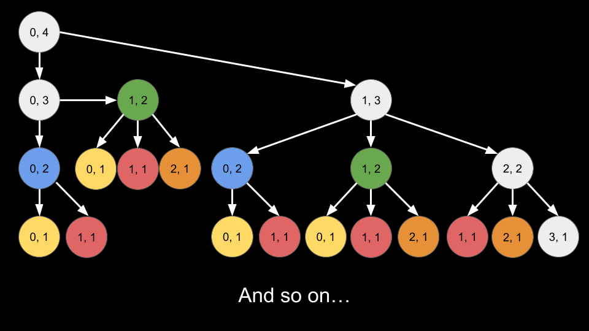
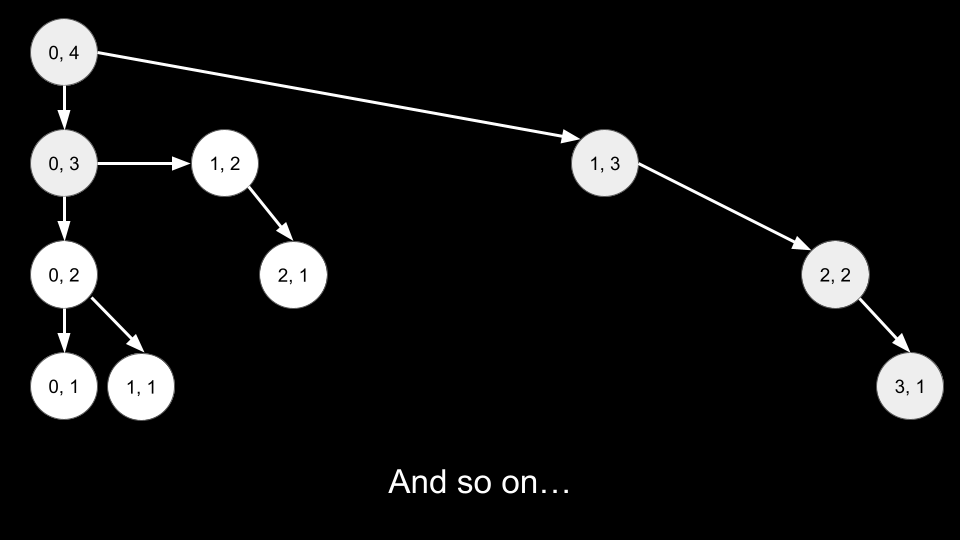

## Solution

---

### Approach 1: Top-Down Dynamic Programming

**Intuition**

> **Note.** For this approach, we assume that you already know the fundamentals of dynamic programming and are figuring out how to apply it to a wide range of problems, such as this one. If you are not yet at this stage, we recommend checking out our relevant [Explore Card content on dynamic programming](https://leetcode.com/explore/featured/card/dynamic-programming/) before coming back to this problem.

Let's imagine that we are positioned on a number line. This number line starts at `0` and ends at $arrLen - 1$ (since `arrLen` is 0-indexed). We start at `0` on this number line, and on each move we are allowed to move left, right, or stay.

We start at `0`, need to make `steps` moves, and want to end up back at `0`. Without loss of generality, let's say we are currently at `curr` on the number line and need to make `remain` more moves. We have three options:

1. Don't move. We will stay at `curr` and need to make $remain - 1$ more moves.
2. Move left. We can only do this if `curr > 0`. We move to $curr - 1$ and need to make $remain - 1$ more moves.
3. Move right. We can only do this if $curr < arrLen - 1$. We move to $curr + 1$ and need to make $remain - 1$ more moves.

Let's define a function `dp(curr, remain)` that returns the number of ways we can arrive at `0` from `curr` after `remain` moves. If we want to go back to `0`, we can only do so through one of these three options. In other words, the number of ways to return to `0` from the current state is equivalent to the sum of the number of ways to return to `0` in the next three options. We have the following transitions:

1. $dp(curr, remain) += dp(curr, remain - 1)$
2. $dp(curr, remain) += dp(curr - 1, remain - 1) if curr > 0$
3. $dp(curr, remain) += dp(curr + 1, remain - 1) if curr < arrLen - 1>$

What will be the base case of this function? If $remain = 0$, we have no more moves to make. If $curr = 0$, then we have found a way to accomplish our task, so we `return 1`. Otherwise, we return `0`.

This recursive approach will solve the problem, but will have an exponential time complexity as each call to `dp` creates three more calls. Many states of `curr, remain` will be repeated. In the below tree, each node represents a call to `dp` with the first number being `curr` and the second one being `steps`. Nodes with the same color represent the same arguments. With larger values of `steps` and `arrLen`, the tree will quickly grow beyond what we can compute.


<br>

To prevent repeated computation, we will memoize the `dp` function. Using a data structure `memo`, the first time we find the answer for a state `curr, remain`, we will save it in `memo`. In the future when we see the same `curr, remain` state again, we can refer to `memo` instead of having to re-calculate. With memoization, the tree now looks like this:


<br>

If we want to use a 2D array to implement `memo`, we must be careful with the sizing. Notice in the constraints that while `steps` can be up to `500`, `arrLen` can be up to $10^6$. However, it is impossible for any call to have a value of `curr` greater than `steps`. The furthest we can go is by only making moves to the right, but we would run out of moves after `steps` moves. Thus, we can safely perform $arrLen = min(arrLen, steps)$ before starting the algorithm.

The answer to the original problem is `dp(0, steps)`. We start at `0` and need to make `steps` moves.

**Algorithm**

All arithmetic operations should be done mod $10^9 + 7$.

1. Create a memoized function `dp(curr, remain)`:
- If $remain = 0$:
- Return `1` if $curr = 0$, and `0` otherwise.
- Initialize $ans = dp(curr, remain - 1)$.
- If `curr > 0`, add $dp(curr - 1, remain - 1)$ to `ans`.
- If $curr < arrLen - 1$, add $dp(curr + 1, remain - 1)$ to `ans`.
- Return `ans`.
2. Set $arrLen = min(arrLen, steps)$.
3. Return `dp(0, steps)`.

To memoize `dp`:

1. After the base case, check if `curr, remain` has already been calculated using a data structure `memo`.
- If it has already been calculated, return the saved result.
2. Before returning `ans`, store `ans` in `memo` while associating it with `curr, remain`.

**Implementation**

> In Python, we use [@functools.cache](https://docs.python.org/3/library/functools.html#functools.cache) to memoize our function.

```python
class Solution:
    def numWays(self, steps: int, arrLen: int) -> int:
        @cache
        def dp(curr, remain):
            if remain == 0:
                if curr == 0:
                    return 1

                return 0

            ans = dp(curr, remain - 1)
            if curr > 0:
                ans = (ans + dp(curr - 1, remain - 1)) % MOD

            if curr < arrLen - 1:
                ans = (ans + dp(curr + 1, remain - 1)) % MOD

            return ans

        MOD = 10 ** 9 + 7
        return dp(0, steps)
```

**Complexity Analysis**

Given $n$ as `steps` and $m$ as `arrLen`,

* Time complexity: $O(n \cdot \min{(n, m)})$

    There can be `steps` values of `remain` and `min(steps, arrLen)` values of `curr`. The reason `curr` is limited by `steps` is because if we were to only move right, we would eventually run out of moves. Thus, there are $O(n \cdot \min{(n, m)})$ states of `curr, remain`. Due to memoization, we never calculate a state more than once. To calculate a given state costs $O(1)$ as we are simply adding up three options.

* Space complexity: $O(n \cdot \min{(n, m)})$

    The recursion call stack uses up to $O(n)$ space, but this is dominated by `memo` which has a size of $O(n \cdot \min{(n, m)})$.

<br/>

---

### Approach 2: Bottom-Up Dynamic Programming

**Intuition**

The "answer state" is $curr = 0, remain = steps$. In the previous approach, we started by making a call to `dp(0, steps)` and made function calls down to the base case. In this approach, we will start at the base case and iterate toward the answer state.

To implement this iterative algorithm, we will convert `dp` from a function to an array. Here, $\text{dp}[curr][remain]$ is analogous to `dp(curr, remain)` from the previous approach.

First, we need to size `dp`. The first dimension needs to be the range of `curr`. As the number line has a limit of $arrLen - 1$, the first dimension of `dp` should have a size of `arrLen`. As we mentioned briefly in the previous approach, the value of `arrLen` can be reduced to `min(arrLen, steps)`. Larger values of `arrLen` (greater than `steps`) are pointless because we could not reach those states due to running out of `steps`. The second dimension of `dp` needs to be the range of `remain`. As the maximum value of `remain` is `steps`, the second dimension of `dp` should have a size of $steps + 1$. Thus, dp will have a size of $arrLen * (steps + 1)$ (after we update $arrLen = min(arrLen, steps)$).

Second, we need to initialize the base case. Assuming `dp` is initialized with values of `0`, the only non-zero base case is when $curr = 0, remain = 0$, the answer is `1`. Thus, we will set $\text{dp}[0][0] = 1$.

Third, we need to configure our for-loops. We will use nested for-loops to iterate over all states of `curr, remain`. We must iterate starting from the base case. Thus, our first loop will be over `remain` starting at `1` and ending at `steps`. Our second loop will be over `curr` starting at $arrLen - 1$ and ending at `0`.

> Generally, you want the final loop iteration to calculate the final answer. As our answer state is $curr = 0, remain = steps$, we have the loop for `remain` end at `steps` and the loop for `curr` end at `0`.

Finally, each inner loop iteration represents a state `curr, remain`. We will calculate its value $\text{dp}[curr][remain]$ just like we did in the previous approach by considering the three options:

1. Don't move. Add $\text{dp}[curr][remain - 1]$.
2. Move left. We can only do this if `curr > 0`. Add $dp[curr - 1][remain - 1]$.
3. Move right. We can only do this if $curr < arrLen - 1$. Add $dp[curr + 1][remain - 1]$.

The answer to the original problem is $\text{dp}[0][steps]$. We return this value at the end.

**Algorithm**

All arithmetic operations should be done mod $10^9 + 7$.

1. Set $arrLen = min(arrLen, steps)$.
2. Create an array $\text{dp}[arrLen][steps + 1]$.
3. Set $\text{dp}[0][0] = 1$, the base case.
4. Iterate `remain` from `1` to `steps`:
- Iterate `curr` from $arrLen - 1$ to `0`:
- Initialize $ans = \text{dp}[curr][remain - 1]$.
- If `curr > 0`, add $dp[curr - 1][remain - 1]$ to `ans`.
- If $curr < arrLen - 1$, add $dp[curr + 1][remain - 1]$ to `ans`.
- Set $\text{dp}[curr][remain] = ans$.
5. Return $\text{dp}[0][steps]$.

**Implementation**

```python
class Solution:
    def numWays(self, steps: int, arrLen: int) -> int:
        MOD = 10 ** 9 + 7
        arrLen = min(arrLen, steps)
        dp = [[0] * (steps + 1) for _ in range(arrLen)]
        dp[0][0] = 1

        for remain in range(1, steps + 1):
            for curr in range(arrLen - 1, -1, -1):
                ans = dp[curr][remain - 1]

                if curr > 0:
                    ans = (ans + dp[curr - 1][remain - 1]) % MOD

                if curr < arrLen - 1:
                    ans = (ans + dp[curr + 1][remain - 1]) % MOD

                dp[curr][remain] = ans

        return dp[0][steps]
```

**Complexity Analysis**

Given $n$ as `steps` and $m$ as `arrLen`,

* Time complexity: $O(n \cdot \min{(n, m)})$

    Our nested for-loops iterate over $O(n \cdot \min{(n, m)})$ states of `curr, remain`. Calculating each state is done in $O(1)$.

* Space complexity: $O(n \cdot \min{(n, m)})$

    `dp` has a size of $O(n \cdot \min{(n, m)})$.

<br/>

---

### Approach 3: Space-Optimized Dynamic Programming

**Intuition**

You may notice that in the previous two approaches, to calculate a state `curr, remain`, we only needed states involving $remain - 1$. For example, if we wanted to calculate $\text{dp}[4][6]$, we only needed values of `dp[...][5]`. Values stored in `dp[...][4], dp[...][3], dp[...][2]`, etc. are no longer required.

As we iterate over `remain` using the outer for-loop, we only need to store values of `dp` for the current value of `remain` and the previous value $remain - 1$. We will use two arrays of size `arrLen` to do this: `dp` and `prevDp`.

Here, $\text{dp}[curr]$ is analogous to $\text{dp}[curr][remain]$ from the previous approach. $\text{prevDp}[curr]$ is analogous to $\text{dp}[curr][remain - 1]$ from the previous approach.

As the first value of $remain = 1$, this means initially, `prevDp` represents values for $remain = 0$. This means we must initialize $\text{prevDp}[0]$, as this is our base case $curr = 0, remain = 0$.

At the beginning of each outer for-loop iteration, we will reset `dp`. We will then calculate `dp` using values from `prevDp`. Once we have finished calculating `dp`, we will update $prevDp = dp$, so that in the next iteration, `prevDp` will represent the correct values.

For example, when $remain = 5$:

1. $\text{dp}[curr]$ represents $\text{dp}[curr][5]$ from the previous approach. We calculate it using `prevDp`, where $\text{prevDp}[curr]$ represents $\text{prevDp}[curr][4]$ from the previous approach.
2. Once we finish calculating `dp`, the next for-loop iteration has $remain = 6$, and now `prevDp` must represent values of $remain = 5$.
3. This is why we update $prevDp = dp$, since we just calculated `dp` to have the values for $remain = 5$.

The final value we have in our for-loop over `remain` is `steps`. Thus, the final calculated `dp` will represent values for $remain = steps$. We can simply return $\text{dp}[0]$, which represents $\text{dp}[0][steps]$ from the previous approach, our answer state.

**Algorithm**

All arithmetic operations should be done mod $10^9 + 7$.

1. Set $arrLen = min(arrLen, steps)$.
2. Create an array $\text{dp}[arrLen]$ and an array $\text{prevDp}[arrLen]$.
3. Set $\text{prevDp}[0] = 1$, the base case.
4. Iterate `remain` from `1` to `steps`:
- Reset `dp`.
- Iterate `curr` from $arrLen - 1$ to `0`:
- Initialize $ans = \text{prevDp}[curr]$.
- If `curr > 0`, add $prevDp[curr - 1]$ to `ans`.
- If $curr < arrLen - 1$, add $prevDp[curr + 1]$ to `ans`.
- Set $\text{dp}[curr] = ans$.
- Update $prevDp = dp$.
5. Return $\text{dp}[0]$.

**Implementation**

```python
class Solution:
    def numWays(self, steps: int, arrLen: int) -> int:
        MOD = 10 ** 9 + 7
        arrLen = min(arrLen, steps)
        dp = [0] * (arrLen)
        prevDp = [0] * (arrLen)
        prevDp[0] = 1

        for remain in range(1, steps + 1):
            dp = [0] * (arrLen)

            for curr in range(arrLen - 1, -1, -1):
                ans = prevDp[curr]

                if curr > 0:
                    ans = (ans + prevDp[curr - 1]) % MOD

                if curr < arrLen - 1:
                    ans = (ans + prevDp[curr + 1]) % MOD

                dp[curr] = ans

            prevDp = dp

        return dp[0]
```

**Complexity Analysis**

Given $n$ as `steps` and $m$ as `arrLen`,

* Time complexity: $O(n \cdot \min{(n, m)})$

    Our nested for-loops iterate over $O(n \cdot \min{(n, m)})$ states of `curr, remain`. Calculating each state is done in $O(1)$.

* Space complexity: $O(\min{(n, m)})$

    `dp` and `prevDp` have a size of $O(\min{(n, m)})$.

<br/>

---