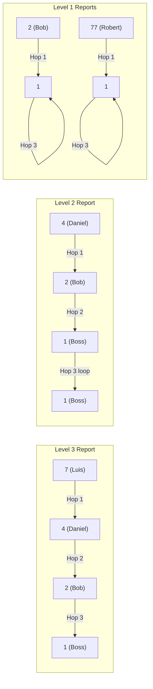

# Guided Example: All People Report to the Given Manager

We trace the step-by-step resolution of a hierarchical organizational query identifying indirect reports within a bounded depth on a representative problem instance:

- **Input:**
  - `Employees` relation with schema `(employee_id, employee_name, manager_id)`
  - Head of Company: `head_id = 1`
  - Maximum reporting depth: $\le 3$ managerial levels
- **Sample Data:**
  - Employee `1`: `Boss`, `manager_id = 1` (Head of Company, self-loop)
  - Employee `2`: `Bob`, `manager_id = 1`
  - Employee `3`: `Alice`, `manager_id = 3` (independent division head)
  - Employee `4`: `Daniel`, `manager_id = 2`
  - Employee `7`: `Luis`, `manager_id = 4`
  - Employee `8`: `Jhon`, `manager_id = 3`
  - Employee `9`: `Angela`, `manager_id = 8`
  - Employee `77`: `Robert`, `manager_id = 1`
- **Required Output:**
  ```text
  employee_id: [2, 4, 7, 77]
  ```

This instance illustrates self-referential graph hierarchies, fixed-point self-loop padding across relational joins, and finite-depth transitive reachability.

---

## 1. Instance & Teaching Goal

An organization is structured as a directed graph where each employee node has a single outgoing edge directed toward their manager:
$$
u \xrightarrow{\text{reports to}} \text{manager}(u)
$$

The company head (employee `1`) has a self-loop: `1 -> 1`.
We want to find all employees who directly or indirectly report to employee `1` through at most $3$ managerial levels, excluding employee `1` themselves.

```
Hierarchy 1 (Connected to Head 1):
      [7: Luis]
         │ (Level 3)
         ▼
     [4: Daniel]
         │ (Level 2)
         ▼
      [2: Bob]       [77: Robert]
         │ (Level 1)     │ (Level 1)
         ▼               ▼
      ┌───────────────────────┐
      │   1: Boss (Head)      │ ──┐
      │   manager_id = 1      │ ◄─┘ (Self-loop)
      └───────────────────────┘

Hierarchy 2 (Disjoint Tree):
   [9: Angela] ──> [8: Jhon] ──> [3: Alice] ──┐
                                     ▲        │
                                     └────────┘ (Self-loop)
```

A general recursive graph traversal is one option, but because the maximum path length is strictly bounded at $3$, a sequence of equi-joins on the self-referencing relation provides an exact algebraic solution.

The teaching goal is to demonstrate how the head's self-loop `1 -> 1` naturally pads paths of length $1$ and $2$ into paths of length exactly $3$, allowing a three-way relational join to capture all reports up to depth $3$ simultaneously.

---

## 2. Conceptual Foundation & Invariants

Let $E$ denote the `Employees` table with schema $(e, m)$ representing employee identifier $e$ and manager identifier $m$.

### Path Extension via Successive Joins
Consider an employee $e_1$. We trace their reporting chain step by step:
1. **Hop 1 (Direct Manager):** $e_1$ reports to $e_2 = m(e_1)$.
2. **Hop 2 (Manager's Manager):** $e_2$ reports to $e_3 = m(e_2)$.
3. **Hop 3 (Third-Level Manager):** $e_3$ reports to $m(e_3)$.

Because the company head satisfies the fixed-point identity $m(1) = 1$:
- If $e_1$ is a **Level 1** direct report ($m(e_1) = 1$):
  The chain develops as $e_1 \to 1 \to 1 \to 1$. Thus, the third hop manager is $1$.
- If $e_1$ is a **Level 2** report ($m(e_1) = e_2$ where $m(e_2) = 1$):
  The chain develops as $e_1 \to e_2 \to 1 \to 1$. The third hop manager is $1$.
- If $e_1$ is a **Level 3** report ($e_1 \to e_2 \to e_3 \to 1$):
  The chain develops as $e_1 \to e_2 \to e_3 \to 1$. The third hop manager is $1$.

Any employee whose distance to employee `1` is strictly greater than $3$ (or who reports to an unrelated hierarchy, like Alice's team) will have $m(e_3) \ne 1$ after 3 hops.

| Entity | Hop 1: $m(e_1)$ | Hop 2: $m(e_2)$ | Hop 3: $m(e_3)$ | Reaches Head? | Distance $\le 3$? |
|---|---|---|---|---|---|
| Employee `1` (Boss) | `1` | `1` | `1` | Yes | Self (Excluded) |
| Employee `2` (Bob) | `1` | `1` | `1` | Yes | Level 1: Included |
| Employee `77` (Robert) | `1` | `1` | `1` | Yes | Level 1: Included |
| Employee `4` (Daniel) | `2` | `1` | `1` | Yes | Level 2: Included |
| Employee `7` (Luis) | `4` | `2` | `1` | Yes | Level 3: Included |
| Employee `3` (Alice) | `3` | `3` | `3` | No (`3 != 1`) | Excluded |
| Employee `8` (Jhon) | `3` | `3` | `3` | No (`3 != 1`) | Excluded |
| Employee `9` (Angela) | `8` | `3` | `3` | No (`3 != 1`) | Excluded |

> **Self-Loop Absorption Invariant.** For any directed path that reaches node $1$ in $k \le 3$ steps, traversing additional hops beyond $k$ remains stationed at node $1$ due to the reflexive transition $1 \to 1$. Therefore, testing whether the 3-step ancestor equals $1$ is equivalent to testing whether the geodesic distance is at most $3$.



---

## 3. Step-by-Step Worked Execution

We join three aliases of the `Employees` table: $E_1 \bowtie E_2 \bowtie E_3$.

### Step 1: First Hop ($E_1 \bowtie E_2$ on $E_1.\text{manager\_id} = E_2.\text{employee\_id}$)
Every employee is paired with their immediate manager:
- $(1, \text{manager } 1) \bowtie (1, \text{manager } 1)$
- $(2, \text{manager } 1) \bowtie (1, \text{manager } 1)$
- $(77, \text{manager } 1) \bowtie (1, \text{manager } 1)$
- $(4, \text{manager } 2) \bowtie (2, \text{manager } 1)$
- $(7, \text{manager } 4) \bowtie (4, \text{manager } 2)$
- $(3, \text{manager } 3) \bowtie (3, \text{manager } 3)$
- $(8, \text{manager } 3) \bowtie (3, \text{manager } 3)$
- $(9, \text{manager } 8) \bowtie (8, \text{manager } 3)$

### Step 2: Second Hop ($E_2 \bowtie E_3$ on $E_2.\text{manager\_id} = E_3.\text{employee\_id}$)
Every chain is extended to the manager's manager:
- For `7`: $E_1 = 7 \to E_2 = 4 \to E_3 = 2$ (since $4$'s manager is $2$).
- For `4`: $E_1 = 4 \to E_2 = 2 \to E_3 = 1$ (since $2$'s manager is $1$).
- For `2`: $E_1 = 2 \to E_2 = 1 \to E_3 = 1$ (since $1$'s manager is $1$).
- For `77`: $E_1 = 77 \to E_2 = 1 \to E_3 = 1$ (since $1$'s manager is $1$).
- For `1`: $E_1 = 1 \to E_2 = 1 \to E_3 = 1$.
- For `9`: $E_1 = 9 \to E_2 = 8 \to E_3 = 3$ (since $8$'s manager is $3$).
- For `8`: $E_1 = 8 \to E_2 = 3 \to E_3 = 3$.
- For `3`: $E_1 = 3 \to E_2 = 3 \to E_3 = 3$.

### Step 3: Evaluating the 3rd Hop Manager Condition ($E_3.\text{manager\_id} = 1$)
We check the manager of $E_3$:
- For `7`: $E_3 = 2$, and $2$'s manager is $1 \implies 1 = 1$ (Satisfied!).
- For `4`: $E_3 = 1$, and $1$'s manager is $1 \implies 1 = 1$ (Satisfied!).
- For `2`: $E_3 = 1$, and $1$'s manager is $1 \implies 1 = 1$ (Satisfied!).
- For `77`: $E_3 = 1$, and $1$'s manager is $1 \implies 1 = 1$ (Satisfied!).
- For `1`: $E_3 = 1$, and $1$'s manager is $1 \implies 1 = 1$, but $E_1 = 1$, so it is excluded by the self-exclusion rule ($E_1 \ne 1$).
- For `9`: $E_3 = 3$, and $3$'s manager is $3 \ne 1$ (Rejected).
- For `8`: $E_3 = 3$, and $3$'s manager is $3 \ne 1$ (Rejected).
- For `3`: $E_3 = 3$, and $3$'s manager is $3 \ne 1$ (Rejected).

---

## 4. Complete Execution Trace

| Candidate $e_1$ | 1st Manager $e_2$ | 2nd Manager $e_3$ | 3rd Manager $m(e_3)$ | $m(e_3) = 1$? | $e_1 \ne 1$? | Included in Output? |
|---|---|---|---|---|---|---|
| $1$ (Boss) | $1$ | $1$ | $1$ | True | False | Excluded (Head) |
| $2$ (Bob) | $1$ | $1$ | $1$ | True | True | Included |
| $3$ (Alice) | $3$ | $3$ | $3$ | False | True | Excluded |
| $4$ (Daniel) | $2$ | $1$ | $1$ | True | True | Included |
| $7$ (Luis) | $4$ | $2$ | $1$ | True | True | Included |
| $8$ (Jhon) | $3$ | $3$ | $3$ | False | True | Excluded |
| $9$ (Angela) | $8$ | $3$ | $3$ | False | True | Excluded |
| $77$ (Robert) | $1$ | $1$ | $1$ | True | True | Included |

Final result set: $\{2, 4, 7, 77\}$.

---

## 5. Algorithmic Correctness

**Soundness.** Every included employee $e_1$ satisfies $e_1 \ne 1$ and reaches node $1$ within $3$ transitions. Because $m(1) = 1$, the only way $m(e_3)$ can equal $1$ is if $e_1 \to 1$ (1 step), $e_1 \to e_2 \to 1$ (2 steps), or $e_1 \to e_2 \to e_3 \to 1$ (3 steps). No employee further than $3$ steps from the head can satisfy this condition.

**Completeness.** Every employee in the company has a unique manager. The equi-joins follow the unique functional mapping $u \mapsto m(u)$ deterministically. Since all possible reports at depths $1$, $2$, and $3$ terminate at $1$ after $3$ steps, no valid direct or indirect subordinate is missed.

---

## 6. Traps This Instance Exposes

- **Excluding the head of the company:** The Boss (employee `1`) trivially reports to themselves and satisfies $m(e_3) = 1$. Failing to filter out `employee_id != 1` includes the head in their own subordinate list.
- **Disconnected self-loops:** Employee `3` (Alice) reports to herself (`3 -> 3`). Her reporting chain stays trapped in her own self-loop and never reaches `1`. Checking $m(e_3) = 1$ correctly rejects Alice and all her subordinates (`8`, `9`).
- **Chain depth greater than 3:** If an employee were at level $4$ ($10 \to 7 \to 4 \to 2 \to 1$), three hops from $10$ would only reach manager $2 \ne 1$, correctly omitting them from the result set.
- **Multiple direct reports:** Both `2` and `77` report directly to `1`. The relational join operates row by row, naturally supporting multiple branches in the hierarchy tree without conflicts.

---

## 7. Complexity Derivation

- **Time Complexity:** $\mathcal{O}(N)$, where $N$ is the number of employee records.
  Each join is an equi-join on the primary key `employee_id`. With index lookups or hash joins, each hop takes $\mathcal{O}(N)$ time. Since the join depth is a constant $3$, the total query execution time is strictly $\mathcal{O}(N)$.
- **Auxiliary Space Complexity:** $\mathcal{O}(N)$ for the intermediate join buffers and hash index tables.
