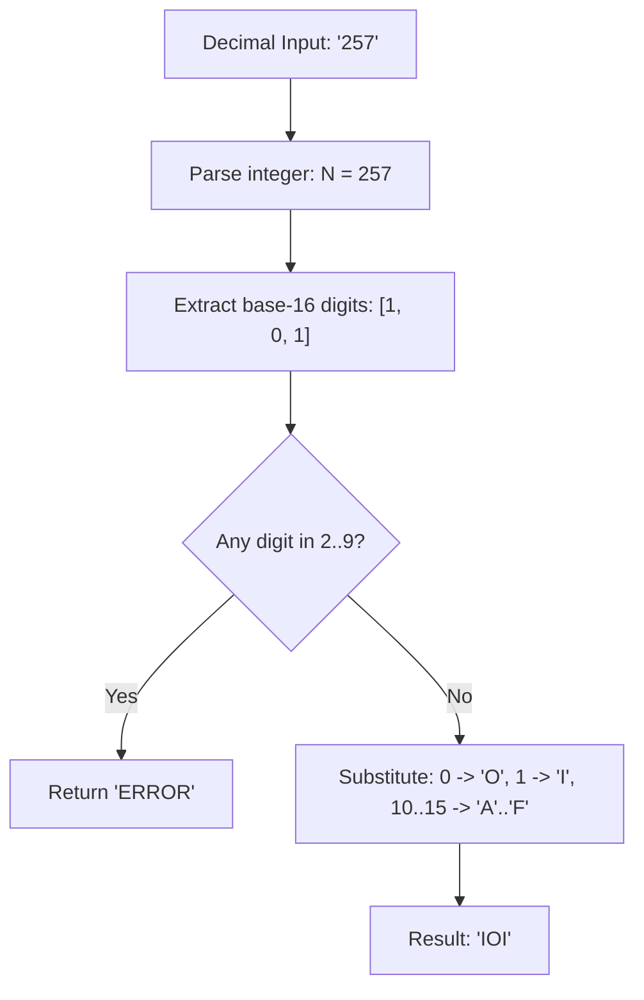

# Guided Example: Hexspeak

We trace the step-by-step conversion and alphabet validation of a decimal number into its Hexspeak equivalent on a representative problem instance:

- **Input:** `num = "257"`
- **Required Output:** `"IOI"`

This instance illustrates radix-16 decomposition, character mapping between numeric symbols and homoglyphic letters, and alphabet membership validation.

---

## 1. Instance & Teaching Goal

Hexspeak is a traditional programming novelty that uses base-16 (hexadecimal) digits to spell English words. The allowed alphabet consists strictly of eight letters:
$$
\Sigma_{\text{Hexspeak}} = \{ \text{'A'}, \text{'B'}, \text{'C'}, \text{'D'}, \text{'E'}, \text{'F'}, \text{'I'}, \text{'O'} \}
$$

The conversion rules from base-16 are:
- Hexadecimal digit `0` maps to letter `'O'`.
- Hexadecimal digit `1` maps to letter `'I'`.
- Hexadecimal digits `10` through `15` map to uppercase letters `'A'` through `'F'`.
- Any hexadecimal digit from `2` through `9` has no valid letter representation. If any such digit appears in the hexadecimal representation of `num`, the entire output is invalid and must evaluate to `"ERROR"`.

```
Input: "257"
Base-10 Value: 257

Radix-16 Decomposition:
257 / 16 = 16  remainder  1  --> Hex digit '1'
 16 / 16 =  1  remainder  0  --> Hex digit '0'
  1 / 16 =  0  remainder  1  --> Hex digit '1'

Hexadecimal Representation: "101"

Character-by-Character Mapping:
  '1' ──> 'I'
  '0' ──> 'O'
  '1' ──> 'I'

Constructed Word: "IOI"
Alphabet Validation: All characters ∈ {A, B, C, D, E, F, I, O} --> Valid!
```

The teaching goal is to perform base-16 digit extraction and apply the homoglyphic substitution rule while maintaining an early-rejection check for forbidden digits $\{2, 3, 4, 5, 6, 7, 8, 9\}$.

---

## 2. Conceptual Foundation & Invariants

Let $N$ denote the numerical value represented by the decimal string `num`.
We extract base-16 digits by successive division by $16$:
$$
N = \sum_{k=0}^{L-1} d_k \cdot 16^k \quad \text{where } d_k \in \{0, 1, \dots, 15\}
$$

### Digit Mapping Function
Define the character mapping $\mu(d)$ for $d \in \{0, 1, \dots, 15\}$:
$$
\mu(d) =
\begin{cases}
\text{'O'}, & \text{if } d = 0 \\
\text{'I'}, & \text{if } d = 1 \\
\text{undefined (Forbidden)}, & \text{if } 2 \le d \le 9 \\
\text{'A'} + (d - 10), & \text{if } 10 \le d \le 15
\end{cases}
$$

| Radix-16 Value $d$ | Standard Hex Symbol | Hexspeak Letter $\mu(d)$ | Status |
|---|---|---|---|
| $0$ | `0` | `'O'` | Valid |
| $1$ | `1` | `'I'` | Valid |
| $2 \dots 9$ | `2` to `9` | None | Forbidden $\implies$ `"ERROR"` |
| $10$ | `A` | `'A'` | Valid |
| $11$ | `B` | `'B'` | Valid |
| $12$ | `C` | `'C'` | Valid |
| $13$ | `D` | `'D'` | Valid |
| $14$ | `E` | `'E'` | Valid |
| $15$ | `F` | `'F'` | Valid |

> **Alphabet Soundness Invariant.** The result string is valid if and only if every base-16 digit $d_k$ in the positional expansion of $N$ satisfies $d_k \in \{0, 1, 10, 11, 12, 13, 14, 15\}$. The presence of any single digit in $\{2, \dots, 9\}$ immediately terminates evaluation with `"ERROR"`.



---

## 3. Step-by-Step Worked Execution

We trace the algorithm on `num = "257"`.

### Phase 1: Numerical Parsing
The input string `"257"` parses to the positive integer $N = 257$.
Since $N \le 10^{12}$, standard 64-bit integer representations accurately hold the value without precision loss.

### Phase 2: Base-16 Digit Extraction
We repeatedly divide by $16$ to extract remainders:
1. **Iteration 1:**
   - Quotient: $\lfloor 257 / 16 \rfloor = 16$
   - Remainder: $257 \pmod{16} = 1$
   - Hex digit: $d_0 = 1$
2. **Iteration 2:**
   - Quotient: $\lfloor 16 / 16 \rfloor = 1$
   - Remainder: $16 \pmod{16} = 0$
   - Hex digit: $d_1 = 0$
3. **Iteration 3:**
   - Quotient: $\lfloor 1 / 16 \rfloor = 0$
   - Remainder: $1 \pmod{16} = 1$
   - Hex digit: $d_2 = 1$
   - Quotient is now $0$, so extraction terminates.

Reversing the extracted remainders $[d_2, d_1, d_0]$ yields the positional base-16 digits:
$$
[1, 0, 1]_{16}
$$

| Position (MSB to LSB) | Digit Value $d$ | Forbidden Range Check ($2 \le d \le 9$) | Substitution $\mu(d)$ | Accumulated Prefix |
|---|---|---|---|---|
| Index 0 (MSB) | $1$ | False | `'I'` | `"I"` |
| Index 1 | $0$ | False | `'O'` | `"IO"` |
| Index 2 (LSB) | $1$ | False | `'I'` | `"IOI"` |

### Phase 3: Validation and Assembly
- All digits are strictly in the valid set $\{0, 1\}$.
- No digit falls in the range $2 \dots 9$.
- The final assembled string is `"IOI"`.

---

## 4. Complete Execution Trace

| Step | State / Variable | Observed Value | Action / Rule Applied |
|---|---|---|---|
| 1 | Input String | `"257"` | Parse to 64-bit integer $N = 257$ |
| 2 | Div-Mod Cycle 1 | $257 = 16 \times 16 + 1$ | Record remainder $1$, continue with quotient $16$ |
| 3 | Div-Mod Cycle 2 | $16 = 1 \times 16 + 0$ | Record remainder $0$, continue with quotient $1$ |
| 4 | Div-Mod Cycle 3 | $1 = 0 \times 16 + 1$ | Record remainder $1$, terminate with quotient $0$ |
| 5 | Hex digits | $[1, 0, 1]$ | Check alphabet condition: all digits valid |
| 6 | Transformed characters | `['I', 'O', 'I']` | Homoglyph substitution: $1 \mapsto \text{'I'}, 0 \mapsto \text{'O'}$ |
| 7 | Output string | `"IOI"` | Return valid result |

---

## 5. Algorithmic Correctness

**Soundness.** Base-16 positional decomposition is unique for every positive integer. The mapping $\mu$ correctly implements the problem specification by substituting `0` with `'O'`, `1` with `'I'`, and mapping $10 \dots 15$ to `'A'` through `'F'`. Emitting `"ERROR"` whenever an unmapped digit in $\{2, \dots, 9\}$ is encountered guarantees that no invalid character escapes detection.

**Completeness.** Every digit of the base-16 representation is examined. The termination condition quotient $= 0$ ensures that all significant digits are processed. Because the base-16 representation of any integer $N \le 10^{12}$ has at most $10$ hexadecimal digits, complete digit coverage is guaranteed.

---

## 6. Traps This Instance Exposes

- **Forbidden digits $2$ through $9$:** Even if a number contains valid letters like `'A'` or `'F'`, having a single intermediate digit like `'3'` or `'7'` (for example, `0x1A3F`) renders the entire word invalid, requiring `"ERROR"`.
- **Case sensitivity:** Standard hex formatters often output lowercase letters (`'a'` through `'f'`). These must be normalized to uppercase (`'A'` through `'F'`) to match Hexspeak specifications.
- **Large integer range:** The input string can represent values up to $10^{12}$, which exceeds the 32-bit signed integer maximum ($2^{31} - 1 \approx 2.14 \times 10^9$). Calculations must use 64-bit unsigned/signed integers to avoid overflow.
- **Order of digits:** Successive division yields remainders from least significant bit (LSB) to most significant bit (MSB). The digits must be reversed to maintain correct positional ordering.

---

## 7. Complexity Derivation

- **Time Complexity:** $\mathcal{O}(\log_{16} N)$, where $N$ is the numerical value of `num`.
  For $N \le 10^{12}$, $\log_{16}(10^{12}) \approx 10$ hexadecimal digits. Parsing the string takes $\mathcal{O}(L)$ time where $L \le 12$, and extracting digits takes at most $10$ divisions. The entire operation executes in microseconds.
- **Auxiliary Space Complexity:** $\mathcal{O}(\log_{16} N)$ to store the character sequence of length at most $10$.
