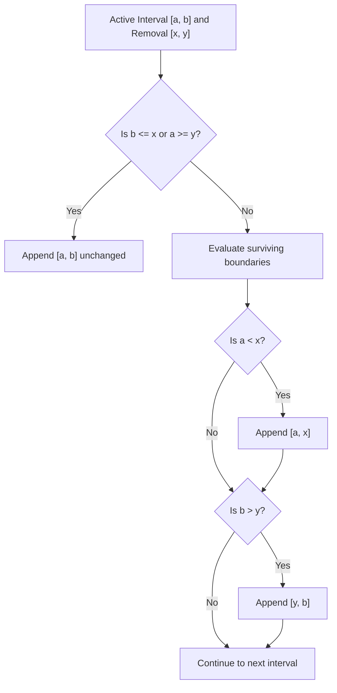

# Guided Example: Remove Interval

We trace the step-by-step subtraction of an interval from a sorted list of disjoint intervals on a representative problem instance:

- **Input:**
  - `intervals = [[0, 2], [3, 4], [5, 7]]`
  - `toBeRemoved = [1, 6]`
- **Required Output:** `[[0, 1], [6, 7]]`

This instance illustrates interval difference logic, the four geometric overlap configurations (disjoint, left-truncated, completely covered, and right-truncated), and order-preserving single-pass linear filtering.

---

## 1. Instance & Teaching Goal

We are given a collection of pairwise disjoint intervals sorted in ascending order by their start points. We must remove all points lying in the half-open interval $[x, y) = [1, 6)$ from the union of these intervals.

```
Original Intervals:
  [0 ─── 2]       [3 ─ 4]       [5 ─────── 7]
   0   1   2   3   4   5   6   7

Removal Range [1, 6]:
       [=======================)
       1   2   3   4   5   6

Remaining Intervals:
  [0 ─ 1]                         [6 ───── 7]
   0   1                           6       7
```

A naive approach might convert intervals into discrete point sets, but intervals can have real-valued endpoints up to $10^9$.
The optimal strategy processes each interval $[a, b]$ independently:
1. If $[a, b]$ does not intersect $[x, y]$, keep $[a, b]$ unchanged.
2. If $[a, b]$ intersects $[x, y]$, at most two surviving sub-intervals can remain:
   - A left segment $[a, x]$ if $a < x$.
   - A right segment $[y, b]$ if $b > y$.

The teaching goal is to demonstrate how piecewise endpoint comparison trims, splits, or deletes intervals in a single forward pass without requiring secondary sorting.

---

## 2. Conceptual Foundation & Invariants

Let $[a, b]$ be an active interval and $[x, y]$ be `toBeRemoved`. There are four mutually exclusive geometric relationships:

1. **Strictly Disjoint:**
   - Either $b \le x$ (the interval lies completely to the left of the removal zone).
   - Or $a \ge y$ (the interval lies completely to the right of the removal zone).
   - In both cases, $[a, b] \cap [x, y) = \emptyset$. Retain $[a, b]$ in its entirety.
2. **Left-End Overlap (Truncated on the Right):**
   - $a < x < b \le y$.
   - The portion $[x, b]$ is removed. The sub-interval $[a, x]$ survives.
3. **Completely Contained (Swallowed):**
   - $x \le a < b \le y$.
   - The entire interval $[a, b]$ is swallowed by the removal zone. Zero sub-intervals survive.
4. **Right-End Overlap (Truncated on the Left):**
   - $x \le a < y < b$.
   - The portion $[a, y]$ is removed. The sub-interval $[y, b]$ survives.
5. **Internal Split (Pierced):**
   - $a < x < y < b$.
   - The interior $[x, y]$ is excised, splitting $[a, b]$ into two surviving pieces: $[a, x]$ and $[y, b]$.

| Interval $[a, b]$ | Condition Check | Left Piece Survives ($a < x$) | Right Piece Survives ($b > y$) | Emitted Segments |
|---|---|---|---|---|
| $[0, 2]$ | Overlaps $[1, 6]$ | Yes ($0 < 1 \implies [0, 1]$) | No ($2 \le 6$) | $[0, 1]$ |
| $[3, 4]$ | Fully inside $[1, 6]$ | No ($3 \ge 1$) | No ($4 \le 6$) | None (Swallowed) |
| $[5, 7]$ | Overlaps $[1, 6]$ | No ($5 \ge 1$) | Yes ($7 > 6 \implies [6, 7]$) | $[6, 7]$ |

> **Monotone Ordering Invariant.** Because the input intervals are sorted by start points and pairwise disjoint ($b_i < a_{i+1}$), any surviving sub-intervals $[a_i, x]$ and $[y_i, b_i]$ strictly satisfy $x \le y_i < a_{i+1}$. Appending them in iteration order guarantees that the output remains strictly sorted and pairwise disjoint.



---

## 3. Step-by-Step Worked Execution

We process `intervals = [[0, 2], [3, 4], [5, 7]]` with `toBeRemoved = [1, 6]`, where $x = 1$ and $y = 6$.

### Step 1: Processing Interval $[0, 2]$
- Disjoint test: Is $b \le x$ ($2 \le 1$ False) or $a \ge y$ ($0 \ge 6$ False)? Overlap exists.
- Left surviving segment:
  - Check $a < x$: $0 < 1$ is True.
  - Retain $[a, x] = [0, 1]$.
- Right surviving segment:
  - Check $b > y$: $2 > 6$ is False.
- Emitted for this interval: $[0, 1]$.
- Output buffer: `[[0, 1]]`.

### Step 2: Processing Interval $[3, 4]$
- Disjoint test: Is $b \le x$ ($4 \le 1$ False) or $a \ge y$ ($3 \ge 6$ False)? Overlap exists.
- Left surviving segment:
  - Check $a < x$: $3 < 1$ is False.
- Right surviving segment:
  - Check $b > y$: $4 > 6$ is False.
- Emitted for this interval: None (interval is completely engulfed).
- Output buffer: `[[0, 1]]`.

### Step 3: Processing Interval $[5, 7]$
- Disjoint test: Is $b \le x$ ($7 \le 1$ False) or $a \ge y$ ($5 \ge 6$ False)? Overlap exists.
- Left surviving segment:
  - Check $a < x$: $5 < 1$ is False.
- Right surviving segment:
  - Check $b > y$: $7 > 6$ is True.
  - Retain $[y, b] = [6, 7]$.
- Emitted for this interval: $[6, 7]$.
- Output buffer: `[[0, 1], [6, 7]]`.

All intervals in the input list have been evaluated.

---

## 4. Complete Execution Trace

| Interval $[a, b]$ | Removal Range $[x, y]$ | Disjoint? | Left Piece ($a < x$) | Right Piece ($b > y$) | Action Taken |
|---|---|---|---|---|---|
| $[0, 2]$ | $[1, 6]$ | False | $[0, 1]$ | None | Append $[0, 1]$ |
| $[3, 4]$ | $[1, 6]$ | False | None | None | Discarded entirely |
| $[5, 7]$ | $[1, 6]$ | False | None | $[6, 7]$ | Append $[6, 7]$ |

Final synthesized output: `[[0, 1], [6, 7]]`.

---

## 5. Algorithmic Correctness

**Soundness.** For any interval $[a, b]$, the set subtraction $[a, b] \setminus [x, y)$ equals:
$$
([a, b] \cap (-\infty, x)) \cup ([a, b] \cap [y, \infty))
$$
If $a < x$, the intersection with $(-\infty, x)$ is $[a, \min(b, x)] = [a, x]$. If $b > y$, the intersection with $[y, \infty)$ is $[\max(a, y), b] = [y, b]$. Because all subtracted points lie strictly in $[x, y)$, every point retained in the output belongs to the original set and not to `toBeRemoved`.

**Completeness.** Every interval in the input is visited. Because intervals are initially disjoint, the removal interval $[x, y)$ can only interact with intervals that overlap it. Any interval strictly outside $[x, y)$ is preserved intact. Thus, no valid points are lost and no removed points are kept.

---

## 6. Traps This Instance Exposes

- **Boundary condition collisions:** If an interval meets the removal range at a single boundary point (e.g. $[0, 1]$ with removal $[1, 6]$), $b = x = 1$. The interval is open on the right in $[x, y)$, meaning point $1$ is excluded from the removal zone. The condition $b \le x$ correctly treats $[0, 1]$ as disjoint and preserves it intact.
- **Interval splitting in the interior:** When an interval $[0, 10]$ has removal $[3, 7]$, both conditions $a < x$ ($0 < 3$) and $b > y$ ($10 > 7$) evaluate to true, correctly producing two separate intervals $[0, 3]$ and $[7, 10]$.
- **Empty result:** If the removal range completely subsumes all intervals, every interval produces zero surviving segments, correctly returning an empty list `[]`.

---

## 7. Complexity Derivation

- **Time Complexity:** $\mathcal{O}(N)$, where $N$ is the number of intervals in `intervals`. The algorithm performs a single pass over the array, evaluating constant-time comparison operations for each interval.
- **Auxiliary Space Complexity:** $\mathcal{O}(1)$ beyond the memory required to hold the output interval list (which contains at most $N + 1$ intervals).
