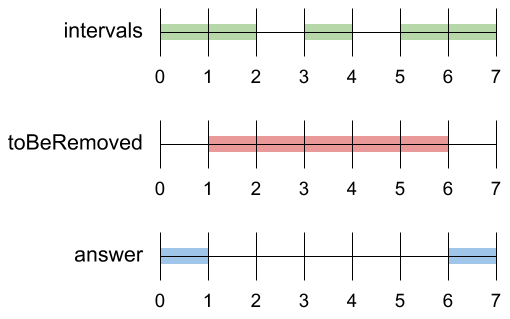
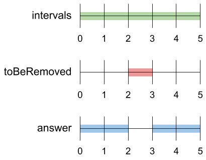

## Description

A set of real numbers can be represented as the union of several disjoint intervals, where each interval is in the form `[a, b)`. A real number `x` is in the set if one of its intervals `[a, b)` contains `x` (i.e. $a \le x < b$).

You are given a **sorted** list of disjoint intervals `intervals` representing a set of real numbers as described above, where $\text{intervals}[i] = [a_{i}, b_{i}]$ represents the interval $[a_{i}, b_{i})$. You are also given another interval `toBeRemoved`.

Return *the set of real numbers with the interval *`toBeRemoved`* **removed** from** *`intervals`*. In other words, return the set of real numbers such that every *`x`* in the set is in *`intervals`* but **not** in *`toBeRemoved`*. Your answer should be a **sorted** list of disjoint intervals as described above.*
### Function Contract

**Inputs**

- `intervals`: a sorted list of $n$ disjoint pairs `[a_i,b_i]`, each representing $[a_i,b_i)$.
- `toBeRemoved`: a pair representing the half-open interval to subtract.

**Return value**

- Return a sorted list of disjoint half-open intervals representing the set difference between the original union and `toBeRemoved`.

Because right endpoints are excluded, two intervals that meet only at one interval's right endpoint do not overlap. Every returned interval must be nonempty.

### Examples
#### Example 1

- **Input:** $intervals = [[0,2],[3,4],[5,7]], toBeRemoved = [1,6]$
- **Output:** `[[0,1],[6,7]]`
#### Example 2

- **Input:** $intervals = [[0,5]], toBeRemoved = [2,3]$
- **Output:** `[[0,2],[3,5]]`
#### Example 3

- **Input:** $intervals = [[-5,-4],[-3,-2],[1,2],[3,5],[8,9]], toBeRemoved = [-1,4]$
- **Output:** `[[-5,-4],[-3,-2],[4,5],[8,9]]`
### Constraints

- $1 \le \text{intervals.length} \le 10^{4}$

- $-10^{9} \le a_{i} < b_{i} \le 10^{9}$