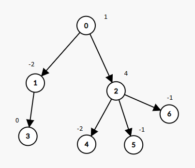

### 1. Description

A tree rooted at node 0 is given as follows:

- The number of nodes is `nodes`;

- The value of the $$i^{\text{th}}$$ node is $\text{value}[i]$;

- The parent of the $$i^{\text{th}}$$ node is $\text{parent}[i]$.

Remove every subtree whose sum of values of nodes is zero.

Return *the number of the remaining nodes in the tree*.

### 2. Function Contract

**Inputs**

- `nodes`: the number $n$ of nodes in the tree.
- `parent`: a length-$n$ array in which $\text{parent}[i]$ gives node `i`'s parent and $\text{parent}[0] = -1$ marks node `0` as the root.
- `value`: a length-$n$ array in which $\text{value}[i]$ is node `i`'s integer value.

The three inputs are guaranteed to describe a valid tree rooted at node `0`. The contract does not require a parent to have a smaller index than its child.

**Return value**

- Return the number of nodes remaining after every subtree whose node-value sum is zero has been removed.

### 3. Examples

#### Example 1

- **Input:** $nodes = 7, parent = [-1,0,0,1,2,2,2], value = [1,-2,4,0,-2,-1,-1]$
- **Output:** `2`
#### Example 2

- **Input:** $nodes = 7, parent = [-1,0,0,1,2,2,2], value = [1,-2,4,0,-2,-1,-2]$
- **Output:** `6`

### 4. Constraints

- $1 \le nodes \le 10^{4}$

- $\text{parent.length} = nodes$

- $0 \le \text{parent}[i] \le nodes - 1$

- $\text{parent}[0] = -1$ which indicates that `0` is the root.

- $\text{value.length} = nodes$

- $-10^{5} \le \text{value}[i] \le 10^{5}$

- The given input is **guaranteed** to represent a **valid tree**.