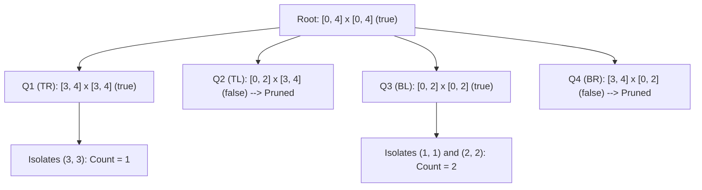

# Guided Example: Number of Ships in a Rectangle

We trace the step-by-step spatial quadtree decomposition locating hidden coordinates via an oracle function on a representative problem instance:

- **Input:**
  - `bottomLeft = [0, 0]`
  - `topRight = [4, 4]`
  - Hidden Ships in the Sea: `[[1, 1], [2, 2], [3, 3], [5, 5]]`
- **Required Output:** `3`

This instance illustrates 2D geometric bisection, hierarchical space partitioning (quadtree decomposition), and aggressive pruning of empty regions under a strict query budget ($\le 400$ API calls).

---

## 1. Instance & Teaching Goal

We must count the number of ships inside the target rectangle $[0, 4] \times [0, 4]$. An interactive oracle `hasShips(topRight, bottomLeft)` answers whether at least one ship exists in a specified axis-aligned rectangular region. The exact locations of ships are unknown.

The sea contains four ships:
- $(1, 1)$, $(2, 2)$, and $(3, 3)$ lie inside the target rectangle $[0, 4] \times [0, 4]$.
- $(5, 5)$ lies strictly outside the target rectangle and must not be counted.

```
y
4 │  .   .   .  (3,3) .
3 │  .   .   .   .    .
2 │  .   .  (2,2).    .
1 │  .  (1,1).   .    .
0 │  .   .   .   .    .
  └─────────────────────── x
     0   1   2   3    4
```

A brute-force query of every integer point in $[0, 4] \times [0, 4]$ requires $(4 - 0 + 1) \times (4 - 0 + 1) = 25$ queries (or $(1000 + 1)^2 \approx 10^6$ in the general problem, which drastically exceeds the 400 query limit).
Because at most $10$ ships exist across the entire sea, the distribution of ships is extremely sparse.

The optimal strategy employs a 2D quadtree divide-and-conquer bisection:
1. Query the candidate rectangle. If the oracle returns `false`, no ships exist anywhere in this region, pruning the entire sub-tree in a single query.
2. If `true` and the rectangle has shrunk to a single point ($x_1 = x_2$ and $y_1 = y_2$), a ship is confirmed at this point.
3. Otherwise, bisect both axes into four disjoint quadrants and recurse.

---

## 2. Conceptual Foundation & Invariants

Let $R = [x_1, x_2] \times [y_1, y_2]$ be a closed discrete rectangular region with $x_1 \le x_2$ and $y_1 \le y_2$.

### Quadtree Bisection
We calculate the integer midpoints:
$$
\text{mid}_x = \lfloor (x_1 + x_2) / 2 \rfloor, \quad \text{mid}_y = \lfloor (y_1 + y_2) / 2 \rfloor
$$

The rectangle $R$ is partitioned into four pairwise disjoint sub-rectangles:
1. **Top-Right ($Q_1$):** $[\text{mid}_x + 1, x_2] \times [\text{mid}_y + 1, y_2]$
2. **Top-Left ($Q_2$):** $[x_1, \text{mid}_x] \times [\text{mid}_y + 1, y_2]$
3. **Bottom-Left ($Q_3$):** $[x_1, \text{mid}_x] \times [y_1, \text{mid}_y]$
4. **Bottom-Right ($Q_4$):** $[\text{mid}_x + 1, x_2] \times [y_1, \text{mid}_y]$

Every integer coordinate $(x, y) \in R$ belongs to exactly one quadrant.

| Quadrant | Coordinate Range | Contains Target Ships? | Oracle Query Result |
|---|---|---|---|
| Entire Region $R$ | $[0, 4] \times [0, 4]$ | $(1, 1), (2, 2), (3, 3)$ | `true` (Branch) |
| $Q_1$ (Top-Right) | $[3, 4] \times [3, 4]$ | $(3, 3)$ | `true` (Branch) |
| $Q_2$ (Top-Left) | $[0, 2] \times [3, 4]$ | None | `false` (Prune immediately) |
| $Q_3$ (Bottom-Left) | $[0, 2] \times [0, 2]$ | $(1, 1), (2, 2)$ | `true` (Branch) |
| $Q_4$ (Bottom-Right) | $[3, 4] \times [0, 2]$ | None | `false` (Prune immediately) |

> **Sparse Partition Invariant.** An oracle query returning `false` on rectangle $[x_1, x_2] \times [y_1, y_2]$ proves that the intersection of the hidden ship set with this region is empty, guaranteeing that zero ships are missed when the entire branch is discarded without further inspection.



---

## 3. Step-by-Step Worked Execution

We trace the recursive exploration starting at $[0, 4] \times [0, 4]$.

### Level 0: Root Query
- Call `hasShips([4, 4], [0, 0])`.
- Since $(1, 1), (2, 2), (3, 3)$ are inside, oracle returns `true`.
- Not a single cell ($0 < 4$ and $0 < 4$), so calculate midpoints:
  $$
  \text{mid}_x = \lfloor (0 + 4) / 2 \rfloor = 2, \quad \text{mid}_y = \lfloor (0 + 4) / 2 \rfloor = 2
  $$

### Level 1: Evaluating the Four Quadrants
1. **Quadrant $Q_1$ (Top-Right): $[3, 4] \times [3, 4]$**
   - Call `hasShips([4, 4], [3, 3])`. Returns `true` (ship at $(3, 3)$ is present).
   - Bisect $Q_1$: $\text{mid}_x = 3, \text{mid}_y = 3$.
   - Sub-quadrants of $Q_1$:
     - $[3, 3] \times [3, 3]$: single point! Oracle returns `true` $\implies$ Ship confirmed at $(3, 3)$! (Count $= 1$).
     - $[4, 4] \times [4, 4]$: oracle returns `false` $\implies$ pruned.
     - $[3, 3] \times [4, 4]$: oracle returns `false` $\implies$ pruned.
     - $[4, 4] \times [3, 3]$: oracle returns `false` $\implies$ pruned.
   - Total from $Q_1$: $1$ ship.

2. **Quadrant $Q_2$ (Top-Left): $[0, 2] \times [3, 4]$**
   - Call `hasShips([2, 4], [0, 3])`.
   - Returns `false`. Entire quadrant pruned immediately with $1$ query.
   - Total from $Q_2$: $0$ ships.

3. **Quadrant $Q_3$ (Bottom-Left): $[0, 2] \times [0, 2]$**
   - Call `hasShips([2, 2], [0, 0])`. Returns `true` (ships $(1, 1)$ and $(2, 2)$ inside).
   - Bisect $Q_3$: $\text{mid}_x = 1, \text{mid}_y = 1$.
   - Sub-quadrants of $Q_3$:
     - $[0, 1] \times [0, 1]$: contains $(1, 1) \implies$ recurses to single cell $(1, 1)$, returns $1$.
     - $[2, 2] \times [2, 2]$: single cell $(2, 2)$, oracle returns `true` $\implies$ returns $1$.
     - Remaining two sub-rectangles: oracle returns `false` $\implies$ pruned.
   - Total from $Q_3$: $1 + 1 = 2$ ships.

4. **Quadrant $Q_4$ (Bottom-Right): $[3, 4] \times [0, 2]$**
   - Call `hasShips([4, 2], [3, 0])`.
   - Returns `false`. Pruned immediately with $1$ query.
   - Total from $Q_4$: $0$ ships.

### Total Ship Count
$$
\text{Total} = Q_1 + Q_2 + Q_3 + Q_4 = 1 + 0 + 2 + 0 = 3
$$

---

## 4. Complete Execution Trace

| Search Node | Region $[x_1, x_2] \times [y_1, y_2]$ | Oracle Result | Classification | Sub-Tree Ship Count |
|---|---|---|---|---|
| Root | $[0, 4] \times [0, 4]$ | `true` | Internal Node | $1 + 0 + 2 + 0 = 3$ |
| $Q_1$ | $[3, 4] \times [3, 4]$ | `true` | Internal Node | $1$ |
| $Q_1 \to (3, 3)$ | $[3, 3] \times [3, 3]$ | `true` | Leaf Point | $1$ (Found) |
| $Q_1 \to \text{others}$ | Various | `false` | Empty Leaf | $0$ |
| $Q_2$ | $[0, 2] \times [3, 4]$ | `false` | Empty Node | $0$ (Pruned) |
| $Q_3$ | $[0, 2] \times [0, 2]$ | `true` | Internal Node | $2$ |
| $Q_3 \to [0, 1]^2$ | $[0, 1] \times [0, 1]$ | `true` | Internal Node | $1$ |
| $Q_3 \to (1, 1)$ | $[1, 1] \times [1, 1]$ | `true` | Leaf Point | $1$ (Found) |
| $Q_3 \to (2, 2)$ | $[2, 2] \times [2, 2]$ | `true` | Leaf Point | $1$ (Found) |
| $Q_4$ | $[3, 4] \times [0, 2]$ | `false` | Empty Node | $0$ (Pruned) |

---

## 5. Algorithmic Correctness

**Soundness.** A ship is only counted when the candidate region shrinks to a point of area $1 \times 1$ ($x_1 = x_2$ and $y_1 = y_2$) and the oracle explicitly confirms `hasShips = true`. Since ships occupy distinct integer coordinates, each confirmed point represents a unique, valid ship.

**Completeness.** The four quadrants partition the parent rectangle into four non-overlapping subsets whose union equals the parent rectangle. A quadrant is only discarded when the oracle guarantees it contains zero ships. Therefore, no quadrant containing a ship is ever pruned, ensuring all ships in the target rectangle are found.

---

## 6. Traps This Instance Exposes

- **Degenerate sub-rectangles:** If $x_1 > x_2$ or $y_1 > y_2$ occurs during midpoint integer division, returning $0$ immediately prevents invalid coordinate queries.
- **Query budget exhaustion:** Querying sub-regions before verifying whether the parent contains any ships causes exponential query proliferation. Querying the parent first prunes entire branches with a single call.
- **Inclusive boundaries:** The rectangle boundaries are inclusive. Point $(x, y)$ on the boundary line belongs to exactly one quadrant due to $[\text{mid}_x + 1, x_2]$ and $[x_1, \text{mid}_x]$ indexing, preventing double counting.
- **Ships outside target rectangle:** The ship at $(5, 5)$ lies beyond the root rectangle $[0, 4] \times [0, 4]$. Because the root query is bounded by the target coordinates, points outside the bounding box are never evaluated.

---

## 7. Complexity Derivation

- **Query Complexity:** $\mathcal{O}(K \log(\max(X, Y)))$, where $K \le 10$ is the number of ships and $X, Y \le 1000$ are the grid dimensions.
  - The maximum depth of the quadtree is $\lceil \log_2(1000) \rceil = 10$.
  - Each ship lies at the bottom of a root-to-leaf path of depth at most $10$.
  - At each level along this path, at most $4$ sibling quadrants are queried.
  - The total number of oracle calls across all $K \le 10$ ships is bounded by $4 \cdot K \cdot \log_2(1000) \le 4 \times 10 \times 10 = 400$, perfectly obeying the problem's query limit.
- **Auxiliary Space Complexity:** $\mathcal{O}(\log(\max(X, Y)))$. The recursion call stack depth is bounded by the tree height, which is at most $10$.
