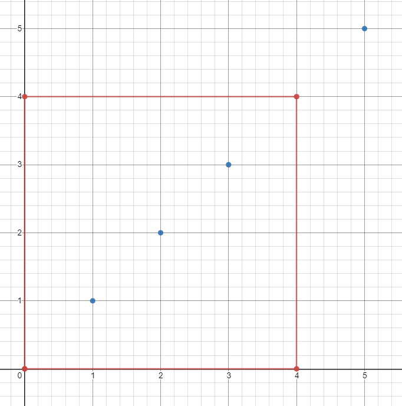

## Description

*(This problem is an **interactive problem**.)*

Each ship is located at an integer point on the sea represented by a cartesian plane, and each integer point may contain at most 1 ship.

You have a function `Sea.hasShips(topRight, bottomLeft)` which takes two points as arguments and returns `true` If there is at least one ship in the rectangle represented by the two points, including on the boundary.

Given two points: the top right and bottom left corners of a rectangle, return the number of ships present in that rectangle. It is guaranteed that there are **at most 10 ships** in that rectangle.

Submissions making **more than 400 calls** to `hasShips` will be judged *Wrong Answer*. Also, any solutions that attempt to circumvent the judge will result in disqualification.

**Example :**

- **Input:** ``
ships = [[1,1],[2,2],[3,3],[5,5]], topRight = [4,4], bottomLeft = [0,0]
- **Output:** `3`
- **Explanation:** From [0,0] to [4,4] we can count 3 ships within the range.
#### Example 2

- **Input:** $ans = [[1,1],[2,2],[3,3]], topRight = [1000,1000], bottomLeft = [0,0]$
- **Output:** `3`
### Function Contract

**Inputs**

- `sea`: a hidden `Sea` object whose only problem-authorized observation is `hasShips(topRight, bottomLeft)`.
- `topRight`: a `Point` with fields `x` and `y` giving the upper-right corner $(x_2, y_2)$ of the target rectangle.
- `bottomLeft`: a `Point` with fields `x` and `y` giving the lower-left corner $(x_1, y_1)$ of the target rectangle.

For an ordered query rectangle, `sea.hasShips(topRight, bottomLeft)` returns `true` exactly when at least one hidden ship lies inside it, including on its boundary. The `ships` data shown in examples initializes the judge's hidden map; it is not supplied as an accessible parameter to the solution.

Let $s$ be the number of ships in the target rectangle, and let

$C = \max(x_2 - x_1 + 1,\ y_2 - y_1 + 1)$

be the larger inclusive side length.

**Return value**

- Return the number $s$ of hidden ship points in the inclusive target rectangle while using at most $400$ calls to `hasShips`.

### Constraints

- On the input `ships` is only given to initialize the map internally. You must solve this problem "blindfolded". In other words, you must find the answer using the given `hasShips` API, without knowing the `ships` position.

- $0 \le \text{bottomLeft}[0] \le \text{topRight}[0] \le 1000$

- $0 \le \text{bottomLeft}[1] \le \text{topRight}[1] \le 1000$

- $topRight \neq bottomLeft$