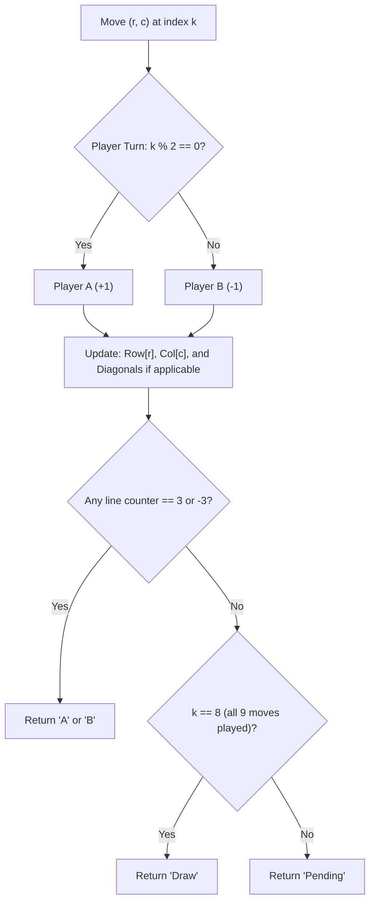

# Guided Example: Find Winner on a Tic Tac Toe Game

We trace the step-by-step game progression and winning condition evaluation for a standard Tic-Tac-Toe match on a representative problem instance:

- **Input:**
  `moves = [[0, 0], [2, 0], [1, 1], [2, 1], [2, 2]]`
- **Required Output:** `"A"`

This instance illustrates alternating player turns, the eight canonical winning lines on a $3 \times 3$ grid, incremental line-sum tracking, and early termination on victory.

---

## 1. Instance & Teaching Goal

The game is played on a $3 \times 3$ grid initialized with empty cells:
- Player `A` always moves first (even-indexed moves $0, 2, 4, \dots$) placing `'X'`.
- Player `B` always moves second (odd-indexed moves $1, 3, 5, \dots$) placing `'O'`.
- A player wins if they place three of their marks along any of the $8$ winning lines:
  - 3 Rows: Row $0$, Row $1$, Row $2$
  - 3 Columns: Col $0$, Col $1$, Col $2$
  - 2 Diagonals: Main Diagonal ($i = j$) and Anti-Diagonal ($i + j = 2$)
- If all $9$ moves are played without a winner, the outcome is `"Draw"`.
- If fewer than $9$ moves are played and no player has won, the outcome is `"Pending"`.

```
Move 0: A plays (0, 0)      Move 1: B plays (2, 0)      Move 2: A plays (1, 1)
  X . .                       X . .                       X . .
  . . .                       . . .                       . X .
  . . .                       O . .                       O . .

Move 3: B plays (2, 1)      Move 4: A plays (2, 2)      Final Board:
  X . .                       X . .                       X  .  .
  . X .                       . X .                       .  X  .
  O O .                       O O X                       O  O [X]  <-- Diagonal Win!
```

The teaching goal is to maintain counters for the $8$ possible winning lines so that win detection requires $\mathcal{O}(1)$ work per move, avoiding complete grid rescans.

---

## 2. Conceptual Foundation & Invariants

Each cell $(r, c)$ on the $3 \times 3$ grid participates in:
1. Row $r$ (index $r \in \{0, 1, 2\}$)
2. Column $c$ (index $c \in \{0, 1, 2\}$)
3. Main Diagonal if $r = c$ (cells $(0, 0), (1, 1), (2, 2)$)
4. Anti-Diagonal if $r + c = 2$ (cells $(0, 2), (1, 1), (2, 0)$)

Notice that the center cell $(1, 1)$ satisfies both diagonal conditions simultaneously.

### Line Vector Tracking
Instead of checking all lines from scratch, we can attribute signed point scores to each line:
- Player A adds $+1$ to all lines containing their chosen cell.
- Player B adds $-1$ to all lines containing their chosen cell.
- If any line counter reaches $+3$, Player A wins immediately.
- If any line counter reaches $-3$, Player B wins immediately.

| Line Index | Description | Coordinates Included | Player A Target | Player B Target |
|---|---|---|---|---|
| $0, 1, 2$ | Rows $0, 1, 2$ | $(r, 0), (r, 1), (r, 2)$ | $+3$ | $-3$ |
| $3, 4, 5$ | Cols $0, 1, 2$ | $(0, c), (1, c), (2, c)$ | $+3$ | $-3$ |
| $6$ | Main Diagonal | $(0, 0), (1, 1), (2, 2)$ | $+3$ | $-3$ |
| $7$ | Anti-Diagonal | $(0, 2), (1, 1), (2, 0)$ | $+3$ | $-3$ |

> **Monotone Line Count Invariant.** In each turn, only lines passing through the current move coordinate are altered. A line counter reaches $3$ if and only if all three collinear cells have been occupied by the same player.



---

## 3. Step-by-Step Worked Execution

We track Player A's and Player B's moves incrementally across the $8$ lines.

### Move 0: Player A plays $(0, 0)$
- Row $0$ count: $+1$
- Col $0$ count: $+1$
- Main diagonal ($0 = 0$): $+1$
- Anti-diagonal ($0 + 0 \ne 2$): $0$
- No line has reached $3$.

### Move 1: Player B plays $(2, 0)$
- Row $2$ count: $-1$
- Col $0$ count: $-1$
- Main diagonal ($2 \ne 0$): $0$
- Anti-diagonal ($2 + 0 = 2$): $-1$
- No line has reached $-3$.

### Move 2: Player A plays $(1, 1)$
- Row $1$ count: $+1$
- Col $1$ count: $+1$
- Main diagonal ($1 = 1$): $+1 \implies$ accumulated count $= 1 + 1 = 2$
- Anti-diagonal ($1 + 1 = 2$): $+1 \implies$ accumulated count $= 0 + 1 = 1$
- No line has reached $3$.

### Move 3: Player B plays $(2, 1)$
- Row $2$ count: $-1 \implies$ accumulated count $= -1 + (-1) = -2$
- Col $1$ count: $-1$
- Main diagonal ($2 \ne 1$): unchanged
- Anti-diagonal ($2 + 1 \ne 2$): unchanged
- No line has reached $-3$.

### Move 4: Player A plays $(2, 2)$
- Row $2$ count: $+1$ (Player A)
- Col $2$ count: $+1$
- Main diagonal ($2 = 2$): $+1 \implies$ accumulated count $= 2 + 1 = 3$!
- Anti-diagonal ($2 + 2 \ne 2$): unchanged

Line $6$ (Main Diagonal) has reached $+3$. Player A has placed marks at $(0, 0)$, $(1, 1)$, and $(2, 2)$, completing a winning diagonal. The game terminates with winner `"A"`.

---

## 4. Complete Execution Trace

| Turn $k$ | Player | Cell Played $(r, c)$ | Affected Lines | Main Diag Count | Anti Diag Count | Outcome Check |
|---|---|---|---|---|---|---|
| $0$ | A | $(0, 0)$ | Row 0, Col 0, Main Diag | $1$ | $0$ | Continue |
| $1$ | B | $(2, 0)$ | Row 2, Col 0, Anti Diag | $1$ | $-1$ | Continue |
| $2$ | A | $(1, 1)$ | Row 1, Col 1, Both Diags | $2$ | $0$ | Continue |
| $3$ | B | $(2, 1)$ | Row 2, Col 1 | $2$ | $0$ | Continue |
| $4$ | A | $(2, 2)$ | Row 2, Col 2, Main Diag | $3$ | $0$ | Win: Return `"A"` |

---

## 5. Algorithmic Correctness

**Soundness.** A player wins if and only if three of their tokens occupy a row, column, or diagonal. Because moves are played without replacement on a $3 \times 3$ grid, an accumulator for a given line reaching $3$ proves that all three cells of that line belong to Player A. Since Move 4 was made by Player A and caused the main diagonal sum to reach $3$, Player A is correctly declared the winner.

**Completeness.** Every move in the input sequence is processed in chronological order. Checking the win condition after each move ensures that a win is detected immediately when it occurs. If all moves are exhausted with total count $9$ and no line equals $3$ or $-3$, the grid is full, guaranteeing `"Draw"`. If fewer than $9$ moves were played without a win, the state is correctly determined to be `"Pending"`.

---

## 6. Traps This Instance Exposes

- **Premature termination:** Checking for a draw before verifying if the final $9\text{th}$ move creates a winning line can misclassify a last-move win as a draw. The win condition must be checked first.
- **Center cell double diagonal:** The center cell $(1, 1)$ belongs to both the main diagonal and the anti-diagonal. If a move is made at $(1, 1)$, both diagonal counters must increment.
- **Order of play:** Player A always moves on even indices $0, 2, 4, 6, 8$, and Player B moves on odd indices $1, 3, 5, 7$. Associating the move index parity with player identity avoids explicit turn-state management.

---

## 7. Complexity Derivation

- **Time Complexity:** $\mathcal{O}(M)$, where $M \le 9$ is the number of moves played. Each move updates at most $4$ line counters (row, column, and up to two diagonals) and checks if any counter equals $3$. Because $M \le 9$, the maximum number of operations is bounded by a small constant ($\le 40$ operations), running in $\mathcal{O}(1)$ time.
- **Auxiliary Space Complexity:** $\mathcal{O}(1)$. Maintaining the array of $8$ line accumulators requires a fixed $8$-element vector.
