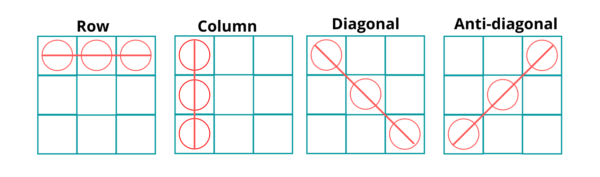
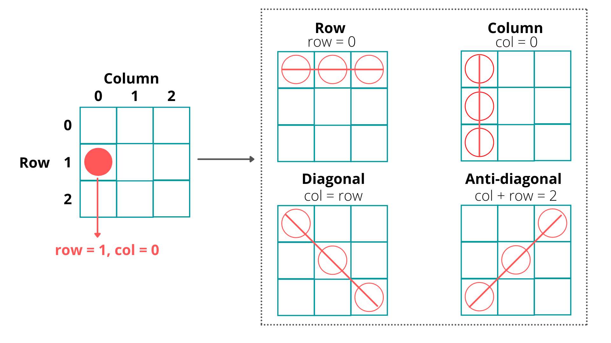
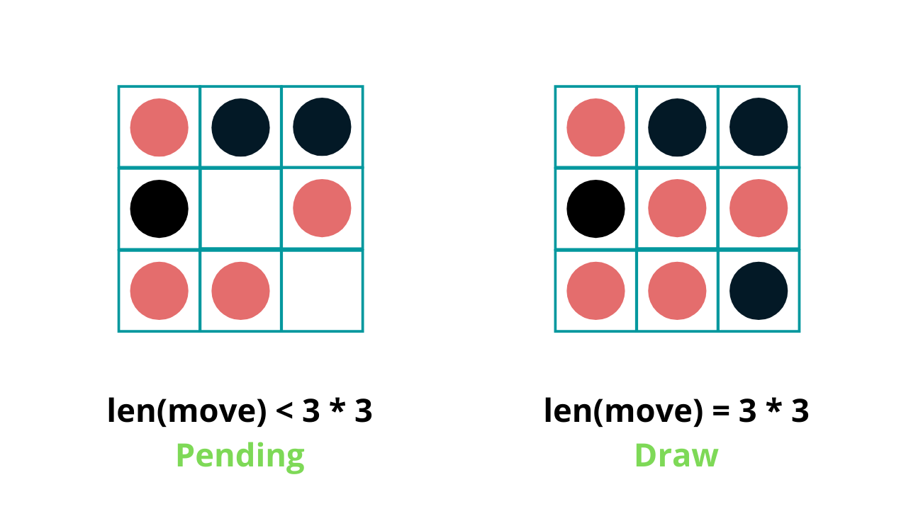
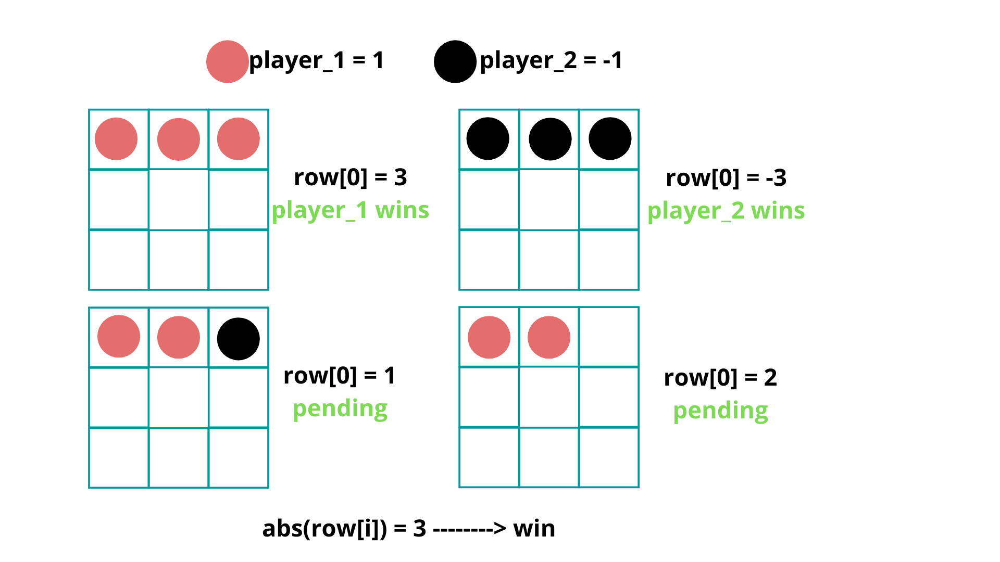
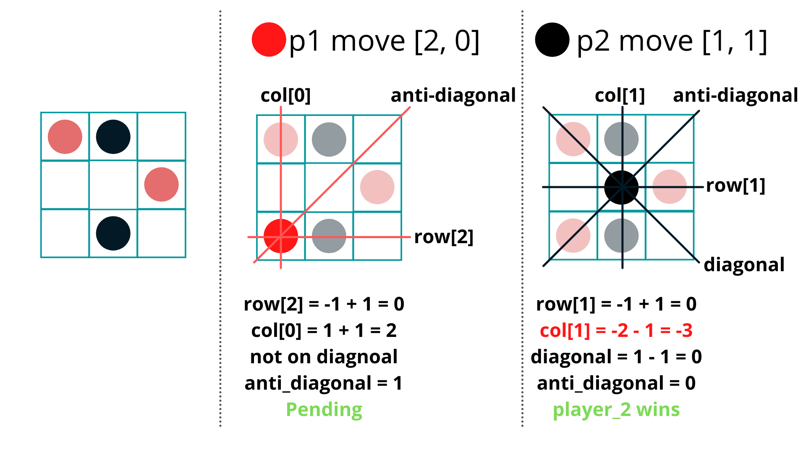

## Solution

---
### Overview

Tic Tac Toe is one of the classic games with pretty simple rules. Two players take turns placing characters on an `n` by `n` board. The first player that connects `n` consecutive characters horizontally, vertically, or diagonally wins the game. Traditionally (and in this problem), the board width is fixed at 3. However, to help demonstrate the efficiency of each approach, we will refer to the board width as `n` throughout this article.

In this problem, we are looking to determine the winner of the game (if one exists). If neither player has won, then we must determine if the game is ongoing or if it has ended in a draw.

The most intuitive approach is to check, after each move, if the current player has won, which can be implemented by different methods. Here we introduce two approaches to solve this problem, the first one is the most intuitive one, while the second one has some optimization.

<br/>

---

### Approach 1: Brute Force

**Intuition**

Since we have to find if the current player has won, let's take a look at what the winning conditions are. The figure below illustrates the 4 winning conditions according to the rules.



The above diagram shows that a player can win by connecting `n` consecutive characters in a row, column, diagonal, or anti-diagonal.

Then, how do we check if any player has won so far?



We can start by creating an `n` by `n` grid that represents the original board.

Next, let's take a closer look at the previous winning conditions. Notice that a character located at `[row, col]` will be on the diagonal when its column index equals its row index, that is $row = col$.  Likewise, a character will be on the anti-diagonal when then the sum of its row index and column index is equal to $n - 1$, that is $row + col = n - 1$.

Suppose the current player marks the location `[row, col]`, where `row` and `col` stand for the row index and column index on board, respectively. If row `row` or column `col` has `n` characters from the same player after this move, then the current player wins.

Now, after each move, we can determine if a player has won by checking each row, column, and diagonal. The next question is, how will we determine the result after all moves have been made? We need to find a way to handle cases where neither player wins.



If neither player has won after all of the moves have been played, we need to check the length of `moves`. There are two possibilities: "Draw" if the board is full, meaning the length of `moves` is $n * n$, or "Pending" otherwise.

Now, we are ready to implement a brute force solution.

**Algorithm**

1) Initialize a 2-dimensional array `board` of size `n` by `n` representing an empty board.

2) For each new move `[row, col]`, mark the relative position $\text{board}[row][col]$ on `board` with the player's id. Suppose player one's id is 1, and player two's id is -1.

3) Then, check if this move meets any of the winning conditions:

- Check if all cells in the current row are filled with characters from the current player. We traverse the row from column `0` to column $n - 1$ while keeping the row index constant.
- Check if all cells in the current column are filled with characters from the current player. We traverse the column from row `0` to row $n - 1$ while keeping the column index constant.
- Check if this move is on the diagonal; that is, check if `row` equals `col`. If so, traverse the entire diagonal and check if all positions on the diagonal contain characters from this player.
- Check if this move is on the anti-diagonal; that is, check if $row + col$ equals $n - 1$. If so, traverse the entire anti-diagonal and check if all positions on the anti-diagonal contain characters from this player.

4) If there is no winner after all of the moves have been played, we will check if the entire board is filled. If so, return "Draw", otherwise return "Pending", meaning the game is still on. That is, check if the length of `moves` equals the number of cells on the `n` by `n` board.

**Implementation**

```python
class Solution:
    def tictactoe(self, moves: List[List[int]]) -> str:

        # Initialize the board, n = 3 in this problem.
        n = 3
        board = [[0] * n for _ in range(n)]

        # Check if any of 4 winning conditions to see if the current player has won.
        def checkRow(row, player_id):
            for col in range(n):
                if board[row][col] != player_id:
                    return False
            return True

        def checkCol(col, player_id):
            for row in range(n):
                if board[row][col] != player_id:
                    return False
            return True

        def checkDiagonal(player_id):
            for row in range(n):
                if board[row][row] != player_id:
                    return False
            return True

        def checkAntiDiagonal(player_id):
            for row in range(n):
                if board[row][n - 1 - row] != player_id:
                    return False
            return True

        # Start with player_1.
        player = 1

        for move in moves:
            row, col = move
            board[row][col] = player

            # If any of the winning conditions is met, return the current player's id.
            if checkRow(row, player) or checkCol(col, player) or \
            (row == col and checkDiagonal(player)) or \
            (row + col == n - 1 and checkAntiDiagonal(player)):
                return 'A' if player == 1 else 'B'

            # If no one wins so far, change to the other player alternatively.
            # That is from 1 to -1, from -1 to 1.
            player *= -1

        # If all moves are completed and there is still no result, we shall check if
        # the grid is full or not. If so, the game ends with draw, otherwise pending.
        return "Draw" if len(moves) == n * n else "Pending"

```

**Complexity Analysis**

Let `n` be the length of the board and `m` be the length of input `moves`.

* Time complexity: $O(m \cdot n)$

    For every move, we need to traverse the same row, column, diagonal, and anti-diagonal, which takes $O(n)$ time.

* Space complexity: $O(n^2)$

    We use an `n` by `n` array to record every move.

<br/>

---
### Approach 2: Record Each Move

**Intuition**

Instead of recording each move in a `n` by `n` grid, as we did in the first approach, could we find a more effective way to record the previous moves?
The answer is Yes.

>Let's take a look at the 4 winning conditions again.


In the first approach, since we created the board and recorded each move, we had to traverse the entire line to check if all marks were of the same type.

>However, this method stores way more information than we actually need, it also results in an increased time and space complexity.

We do not need to know where these marks are located in order to solve the problem. What we do need to know is: after move `[row, col]`, does any row, column, or diagonal meet the winning condition?

>Therefore, we could just record the result of each row and column instead of the position of each move precisely.

Now the question becomes: How should we record the result? Let's take a look at the figure below to find out.



>Notice that there are many unique ways to fill a single row. However, only two cases are considered as a win. Recall that in the first approach, we set the value of players A and B to 1 and -1, respectively. Here we can take advantage of these distinct values again.

Suppose we let the value of player A equal `1` and the value of player B equal `-1`. There are other ways to assign value, but `1` and `-1` are the most convenient.

Therefore, a player will win if the value of any line equals `n` or `-n`. Thus after a move `[row, col]`, we could calculate the value of row `row` and column `col` and check if the absolute value equals `n`. If this move is placed on the diagonal or the anti-diagonal, then we will check if the absolute value of the relative value equals `n` as well.

Thus, we just need to build two arrays to represent the values for each row and column. For instance, $rows = [0, 0, 0]$, represents the initial value of $\text{row}_{1}$, $\text{row}_{2}$, and $\text{row}_{3}$, and the two values `diag` and $\text{anti}_{diag}$ for value on diagonal and anti-diagonal.

To see how this will work, consider the two example moves shown below.



After player A plays at `[2, 0]`, we update the value of $\text{rows}[2]$ and $\text{col}[0]$, since $row = 2$ and $col = 2$. Also, because $row + col = 2$, we will update the value of the anti-diagonal. Since none of these values equals 3 after the update, this means that the game is still on.

After player B's move, we update the value of $\text{row}[1]$ and $\text{col}[1]$. Since this character is on both diagonal and anti-diagonal, we update `diag` and $\text{anti}_{diag}$ as well. We will see that $\text{col}[1] = -3$, which means the current player (player B) has won the game! Thus return `B`.

**Algorithm**

1) We use two lists, `rows` and `cols` of size `n`, to represent each row and column.  We also use two numbers, `diag` and $\text{anti}_{diag}$, to represent the diagonal value and anti-diagonal value, respectively.

2) Set the value of player A as `1` and the value of player B as `-1`.

3) For each new move `[row, col]`, add the player's value to $\text{rows}[row]$ and $\text{cols}[col]$. If `[row, col]` is on the diagonal or anti-diagonal, then add the player's value to `diag` or $\text{anti}_{diag}$ as well.

4) Then, check if this move meets any winning condition:

- Check if all cells in the current row contain characters from this player. To do so, we just need to check if the absolute value of $\text{rows}[row]$ equals `n`.
- Check if all cells in the current column contain characters from this player. To do so, we just need to check if the absolute value of $\text{cols}[col]$ equals `n`.
- Check if this move is on the diagonal; that is if `row` equals `col`. If so, check if the absolute value of `diag` equals `n`.
- Check if this move is on the anti-diagonal; that is if $row + col$ equals $n - 1$. If so, check if the absolute value of $\text{anti}_{diag}$ equals `n`.

5) If there is no winner after all of the moves have been played, we will check if the entire board is filled. If so, return "Draw", otherwise return "Pending", meaning the game is still on. To determine if the entire board is filled, check if the length of `moves` equals the number of cells on the `n` by `n` board.

**Implementation**

```python
class Solution:
    def tictactoe(self, moves: List[List[int]]) -> str:

        # n stands for the size of the board, n = 3 for the current game.
        n = 3

        # use rows and cols to record the value on each row and each column.
        # diag1 and diag2 to record value on diagonal or anti-diagonal.
        rows, cols = [0] * n, [0] * n
        diag = anti_diag = 0

        # Two players having value of 1 and -1, player_1 with value = 1 places first.
        player = 1

        for row, col in moves:

            # Update the row value and column value.
            rows[row] += player
            cols[col] += player

            # If this move is placed on diagonal or anti-diagonal,
            # we shall update the relative value as well.
            if row == col:
                diag += player
            if row + col == n - 1:
                anti_diag += player

            # check if this move meets any of the winning conditions.
            if any(abs(line) == n for line in (rows[row], cols[col], diag, anti_diag)):
                return "A" if player == 1 else "B"

            # If no one wins so far, change to the other player alternatively.
            # That is from 1 to -1, from -1 to 1.
            player *= -1

        # If all moves are completed and there is still no result, we shall check if
        # the grid is full or not. If so, the game ends with draw, otherwise pending.
        return "Draw" if len(moves) == n * n else "Pending"
```

**Complexity Analysis**

Let `n` be the length of the board and `m` be the length of input `moves`.

* Time complexity: $O(m)$

    For every move, we update the value for a row, column, diagonal, and anti-diagonal.  Each update takes constant time. We also check if any of these lines satisfies the winning condition which also takes constant time.

* Space complexity: $O(n)$

    We use two arrays of size `n` to record the value for each row and column, and two integers of constant space to record to value for diagonal and anti-diagonal.

<br/>