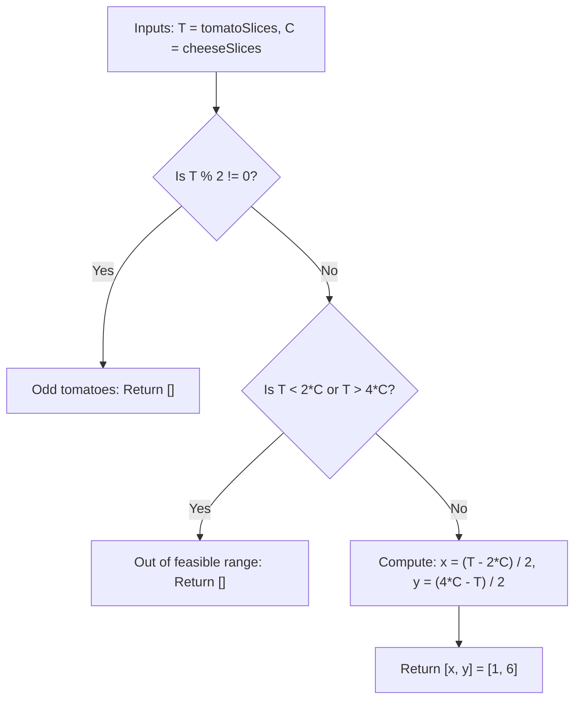

# Guided Example: Number of Burgers with No Waste of Ingredients

We trace the step-by-step algebraic formulation and validation for an exact linear inventory allocation problem on a representative problem instance:

- **Input:**
  - `tomatoSlices = 16`
  - `cheeseSlices = 7`
- **Required Output:** `[1, 6]`

This instance illustrates solving a $2 \times 2$ system of linear Diophantine equations, establishing feasibility bounds, verifying parity invariants, and testing boundary conditions in $\mathcal{O}(1)$ time.

---

## 1. Instance & Teaching Goal

We are given two ingredient inventories:
- $T = 16$ tomato slices
- $C = 7$ cheese slices

Two burger recipes consume these ingredients in fixed integer ratios:
- **Jumbo Burger:** Requires $4$ tomato slices and $1$ cheese slice.
- **Small Burger:** Requires $2$ tomato slices and $1$ cheese slice.

Let $x \ge 0$ denote the number of Jumbo Burgers and $y \ge 0$ denote the number of Small Burgers.
We require all ingredients to be completely exhausted with zero waste:
$$
\begin{cases}
4x + 2y = T \\
x + y = C
\end{cases}
$$

```
Linear System:
  4x + 2y = 16  (Tomatoes)
   x +  y =  7  (Cheese)

Multiply Cheese Equation by 2:
  2x + 2y = 14

Subtract from Tomato Equation:
  (4x + 2y) - (2x + 2y) = 16 - 14
                     2x = 2  ==>  x = 1 (Jumbo Burger)

Substitute x = 1 into Cheese Equation:
  1 + y = 7                  ==>  y = 6 (Small Burgers)
```

A trial-and-error loop testing all $0 \le x \le C$ runs in $\mathcal{O}(C)$ time. The algebraic approach derives the unique closed-form solution directly in $\mathcal{O}(1)$ time and tests integer feasibility in a single step.

---

## 2. Conceptual Foundation & Invariants

From the linear system:
$$
\begin{aligned}
4x + 2y &= T \\
x + y &= C
\end{aligned}
$$

### Closed-Form Solution
Eliminating $y$:
$$
4x + 2(C - x) = T \implies 2x + 2C = T \implies 2x = T - 2C \implies x = \frac{T - 2C}{2}
$$
Eliminating $x$:
$$
y = C - x = C - \frac{T - 2C}{2} = \frac{2C - T + 2C}{2} \implies y = \frac{4C - T}{2}
$$

### Necessary and Sufficient Feasibility Conditions
For non-negative integer burger counts $[x, y]$ to exist, three mathematical conditions must hold simultaneously:
1. **Parity Constraint:**
   Every burger uses an even number of tomatoes ($4$ for Jumbo, $2$ for Small). Hence, $4x + 2y = 2(2x + y)$ is strictly even. $T$ must be even:
   $$
   T \equiv 0 \pmod 2
   $$
2. **Lower Bound on Tomatoes ($x \ge 0$):**
   Even if all $C$ burgers were Small Burgers, they would consume at least $2C$ tomatoes. Therefore:
   $$
   T \ge 2C
   $$
3. **Upper Bound on Tomatoes ($y \ge 0$):**
   Even if all $C$ burgers were Jumbo Burgers, they would consume at most $4C$ tomatoes. Therefore:
   $$
   T \le 4C
   $$

Combining these yields the compact feasibility requirement:
$$
T \text{ is even} \quad \land \quad 2C \le T \le 4C
$$

| Condition Check | Algebraic Form | For $T = 16, C = 7$ | Interpretation |
|---|---|---|---|
| Even Parity | $T \bmod 2 = 0$ | $16 \bmod 2 = 0$ (True) | Whole burgers can be formed |
| Minimum Tomato Bound | $T \ge 2C$ | $16 \ge 14$ (True) | Sufficient tomatoes to make at least small burgers |
| Maximum Tomato Bound | $T \le 4C$ | $16 \le 28$ (True) | Cheese is not in deficit |
| Solvability | All 3 satisfied | True $\implies [x, y] = [1, 6]$ | Valid solution exists |

> **Unique Diophantine Invariant.** Because the coefficient matrix $\begin{pmatrix} 4 & 2 \\ 1 & 1 \end{pmatrix}$ has determinant $4(1) - 2(1) = 2 \ne 0$, the system has a unique real solution. That solution is an integral non-negative pair if and only if $T$ is even and $T \in [2C, 4C]$.



---

## 3. Step-by-Step Worked Execution

We apply the feasibility tests to $T = 16$ and $C = 7$.

### Step 1: Parity Verification
- We compute $T \bmod 2 = 16 \bmod 2 = 0$.
- Parity is even. Whole-burger assembly is possible.

### Step 2: Feasibility Range Check
- Theoretical minimum tomatoes needed: $2 \times C = 2 \times 7 = 14$.
- Theoretical maximum tomatoes absorbable: $4 \times C = 4 \times 7 = 28$.
- Observed tomatoes: $T = 16$.
- Since $14 \le 16 \le 28$, the required solution lies strictly within the non-negative quadrant.

### Step 3: Exact Recipe Calculation
1. Calculate Jumbo Burgers $x$:
   $$
   x = \frac{T - 2C}{2} = \frac{16 - 2(7)}{2} = \frac{16 - 14}{2} = \frac{2}{2} = 1
   $$
2. Calculate Small Burgers $y$:
   $$
   y = \frac{4C - T}{2} = \frac{4(7) - 16}{2} = \frac{28 - 16}{2} = \frac{12}{2} = 6
   $$

### Step 4: Verification of Ingredients
- Tomatoes used: $4 \times 1 + 2 \times 6 = 4 + 12 = 16$ (Leaves $16 - 16 = 0$ waste).
- Cheese used: $1 \times 1 + 1 \times 6 = 1 + 6 = 7$ (Leaves $7 - 7 = 0$ waste).
- Both ingredient waste counts are zero.

---

## 4. Complete Execution Trace

| Check / Computation | Formula / Expression | Value Evaluated | Result / Verification |
|---|---|---|---|
| Parity check | $T \bmod 2$ | $16 \bmod 2 = 0$ | Even: Passes |
| Lower bound | $T - 2C$ | $16 - 14 = 2 \ge 0$ | Passes ($x \ge 0$) |
| Upper bound | $4C - T$ | $28 - 16 = 12 \ge 0$ | Passes ($y \ge 0$) |
| Jumbo Burgers $x$ | $(T - 2C) / 2$ | $2 / 2 = 1$ | $x = 1$ |
| Small Burgers $y$ | $(4C - T) / 2$ | $12 / 2 = 6$ | $y = 6$ |
| Assembly Output | $[x, y]$ | $[1, 6]$ | Verified with 0 waste |

---

## 5. Algorithmic Correctness

**Soundness.** Suppose a pair $[x, y]$ is returned. By algebraic substitution, $4x + 2y = 4\left(\frac{T - 2C}{2}\right) + 2\left(\frac{4C - T}{2}\right) = 2(T - 2C) + (4C - T) = 2T - 4C + 4C - T = T$, and $x + y = \frac{T - 2C + 4C - T}{2} = \frac{2C}{2} = C$. Because $T$ is even, both numerators are even integers, so $x$ and $y$ are whole integers. Because $2C \le T \le 4C$, both $x \ge 0$ and $y \ge 0$. Thus, every returned pair perfectly consumes all ingredients without leftovers.

**Completeness.** Since the coefficient determinant is non-zero, the system $\begin{pmatrix} 4 & 2 \\ 1 & 1 \end{pmatrix} \begin{pmatrix} x \\ y \end{pmatrix} = \begin{pmatrix} T \\ C \end{pmatrix}$ has one and only one mathematical solution in $\mathbb{R}^2$. If $T$ is odd, or if $T < 2C$, or if $T > 4C$, that unique solution fails to be a non-negative integer pair. In those cases, no other solution can exist, so returning `[]` is provably exhaustive.

---

## 6. Traps This Instance Exposes

- **Odd tomato counts:** If $T = 17, C = 4$, $T \bmod 2 = 1$. Both burger types use an even number of tomato slices ($4$ and $2$). Any combination of burgers must use an even number of tomatoes, so odd $T$ can never be fully utilized.
- **Negative quantities:** If $T = 4, C = 17$, the formulas yield $x = (4 - 34) / 2 = -15$ and $y = (68 - 4) / 2 = 32$. Although $x + y = 17$ and $4(-15) + 2(32) = 4$, negative burgers are physically impossible. Checking $T \ge 2C$ and $T \le 4C$ guards against negative outputs.
- **Floating-point division artifacts:** Using integer division after parity validation guarantees that calculations remain strictly in the exact integer domain without floating-point precision issues.

---

## 7. Complexity Derivation

- **Time Complexity:** $\mathcal{O}(1)$. The algorithm computes the result via direct arithmetic operations (multiplication, subtraction, parity check, integer division). No loops or recursive calls are performed.
- **Auxiliary Space Complexity:** $\mathcal{O}(1)$. Memory is limited to a constant number of scalar integer variables and a fixed 2-element return list.
