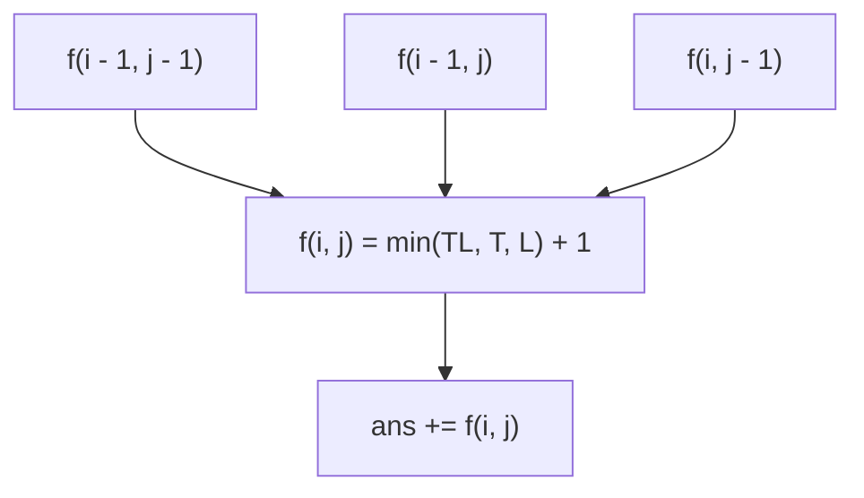

# Guided Example: Count Square Submatrices with All Ones

We trace the step-by-step dynamic programming evaluation of maximal square sizes on a representative problem instance:

- **Input:**
  ```text
  matrix = [
    [0, 1, 1, 1],
    [1, 1, 1, 1],
    [0, 1, 1, 1]
  ]
  ```
- **Required Output:** `15`

This instance illustrates the equivalence between the maximum side length of a square rooted at a bottom-right corner and the number of nested squares sharing that corner, proving why a single local DP recurrence calculates the global count in linear time.

---

## 1. Instance & Teaching Goal

We are given a binary matrix of dimensions $3 \times 4$. We must count all square submatrices whose entries are all `1`.

Squares of various side lengths exist:
- $1 \times 1$ squares: $10$
- $2 \times 2$ squares: $4$
- $3 \times 3$ squares: $1$
Total square submatrices = $10 + 4 + 1 = 15$.

```
Input Matrix (3 x 4):
  0   1   1   1
  1   1   1   1
  0   1   1   1

Overlapping Squares:
- Ten 1x1 squares on all '1' cells.
- Four 2x2 squares:
    top-middle, top-right, bottom-middle, bottom-right.
- One 3x3 square spanning columns 1..3 across all rows 0..2.
```

A brute-force approach enumerates every possible top-left coordinate $(r, c)$ and every possible side length $k$, verifying whether all $k^2$ cells equal `1`. This takes $\mathcal{O}(m \cdot n \cdot \min(m, n)^2)$ time, which is prohibitively slow for large matrices.

The optimal DP strategy makes a fundamental geometric observation:
> If the largest square of all ones with bottom-right corner at $(i, j)$ has side length $k$, then for every size $s \in \{1, 2, \dots, k\}$, there exists exactly one square of size $s \times s$ with bottom-right corner at $(i, j)$.

Therefore, the number of all-ones squares ending at $(i, j)$ is **identically equal** to the maximal square side length $f(i, j)$. Summing $f(i, j)$ over all cells yields the total number of squares in $\mathcal{O}(m \cdot n)$ time.

---

## 2. Conceptual Foundation & Invariants

Let $f(i, j)$ denote the maximum side length of an all-ones square whose bottom-right corner is positioned at coordinate $(i, j)$.

### Recurrence Relation
- If $\text{matrix}[i][j] = 0$:
  No square of ones can have $(i, j)$ as its corner, so $f(i, j) = 0$.
- If $\text{matrix}[i][j] = 1$:
  - If $i = 0$ or $j = 0$ (first row or first column), the square cannot expand beyond the boundary:
    $$
    f(i, j) = 1
    $$
  - For any internal cell ($i > 0$ and $j > 0$), a square of side length $k$ requires:
    1. A square of size at least $k - 1$ at $(i - 1, j - 1)$ (diagonal expansion).
    2. A square of size at least $k - 1$ at $(i - 1, j)$ (vertical expansion).
    3. A square of size at least $k - 1$ at $(i, j - 1)$ (horizontal expansion).
    Taking the minimum of these three neighbors determines the maximum possible side length:
    $$
    f(i, j) = \min\left( f(i - 1, j - 1), \; f(i - 1, j), \; f(i, j - 1) \right) + 1
    $$

| Cell $(i, j)$ | Matrix Value | Neighbor States: $(i-1, j-1), (i-1, j), (i, j-1)$ | Evaluation Formula | $f(i, j)$ | Squares Contributed |
|---|---|---|---|---|---|
| $(0, 0)$ | $0$ | Boundary | $0$ | $0$ | $0$ |
| $(0, 1 \dots 3)$ | $1$ | Boundary | Base case: $1$ | $1$ each | $3$ |
| $(1, 0)$ | $1$ | Boundary | Base case: $1$ | $1$ | $1$ |
| $(1, 1)$ | $1$ | $(0, 0)=0, (0, 1)=1, (1, 0)=1$ | $\min(0, 1, 1) + 1$ | $1$ | $1$ |
| $(1, 2)$ | $1$ | $(0, 1)=1, (0, 2)=1, (1, 1)=1$ | $\min(1, 1, 1) + 1$ | $2$ | $2$ |
| $(1, 3)$ | $1$ | $(0, 2)=1, (0, 3)=1, (1, 2)=2$ | $\min(1, 1, 2) + 1$ | $2$ | $2$ |
| $(2, 0)$ | $0$ | Boundary | $0$ | $0$ | $0$ |
| $(2, 1)$ | $1$ | $(1, 0)=1, (1, 1)=1, (2, 0)=0$ | $\min(1, 1, 0) + 1$ | $1$ | $1$ |
| $(2, 2)$ | $1$ | $(1, 1)=1, (1, 2)=2, (2, 1)=1$ | $\min(1, 2, 1) + 1$ | $2$ | $2$ |
| $(2, 3)$ | $1$ | $(1, 2)=2, (1, 3)=2, (2, 2)=2$ | $\min(2, 2, 2) + 1$ | $3$ | $3$ |

> **Corner Bijection Invariant.** Every valid square submatrix of all ones in the grid has a unique bottom-right corner $(i, j)$. By summing $f(i, j)$ across all $i$ and $j$, every square submatrix is counted exactly once with zero duplicates and zero omissions.



---

## 3. Step-by-Step Worked Execution

We compute the 2D DP table $f$ row by row.

### Row 0 (Top Boundary)
- Cell $(0, 0): \text{matrix}[0][0] = 0 \implies f(0, 0) = 0$.
- Cell $(0, 1): \text{matrix}[0][1] = 1 \implies f(0, 1) = 1$.
- Cell $(0, 2): \text{matrix}[0][2] = 1 \implies f(0, 2) = 1$.
- Cell $(0, 3): \text{matrix}[0][3] = 1 \implies f(0, 3) = 1$.
Row 0 contribution to sum: $0 + 1 + 1 + 1 = 3$.

### Row 1
- Cell $(1, 0): \text{matrix}[1][0] = 1$ (Left boundary) $\implies f(1, 0) = 1$.
- Cell $(1, 1): \text{matrix}[1][1] = 1$:
  - Neighbors: top-left $f(0, 0) = 0$, top $f(0, 1) = 1$, left $f(1, 0) = 1$.
  - $f(1, 1) = \min(0, 1, 1) + 1 = 0 + 1 = 1$.
- Cell $(1, 2): \text{matrix}[1][2] = 1$:
  - Neighbors: top-left $f(0, 1) = 1$, top $f(0, 2) = 1$, left $f(1, 1) = 1$.
  - $f(1, 2) = \min(1, 1, 1) + 1 = 1 + 1 = 2$.
  - Geometric meaning: Contains a $1 \times 1$ square and a $2 \times 2$ square ending at $(1, 2)$.
- Cell $(1, 3): \text{matrix}[1][3] = 1$:
  - Neighbors: top-left $f(0, 2) = 1$, top $f(0, 3) = 1$, left $f(1, 2) = 2$.
  - $f(1, 3) = \min(1, 1, 2) + 1 = 1 + 1 = 2$.
Row 1 contribution to sum: $1 + 1 + 2 + 2 = 6$.

### Row 2
- Cell $(2, 0): \text{matrix}[2][0] = 0 \implies f(2, 0) = 0$.
- Cell $(2, 1): \text{matrix}[2][1] = 1$:
  - Neighbors: top-left $f(1, 0) = 1$, top $f(1, 1) = 1$, left $f(2, 0) = 0$.
  - $f(2, 1) = \min(1, 1, 0) + 1 = 0 + 1 = 1$.
- Cell $(2, 2): \text{matrix}[2][2] = 1$:
  - Neighbors: top-left $f(1, 1) = 1$, top $f(1, 2) = 2$, left $f(2, 1) = 1$.
  - $f(2, 2) = \min(1, 2, 1) + 1 = 1 + 1 = 2$.
- Cell $(2, 3): \text{matrix}[2][3] = 1$:
  - Neighbors: top-left $f(1, 2) = 2$, top $f(1, 3) = 2$, left $f(2, 2) = 2$.
  - $f(2, 3) = \min(2, 2, 2) + 1 = 2 + 1 = 3$.
  - Geometric meaning: Contains three squares ending at $(2, 3)$ with side lengths $1, 2, 3$.
Row 2 contribution to sum: $0 + 1 + 2 + 3 = 6$.

### Total Square Count
$$
\text{Total} = \sum_{i=0}^2 \sum_{j=0}^3 f(i, j) = 3 + 6 + 6 = 15
$$

---

## 4. Complete Execution Trace

The complete DP state matrix $f$ is:
```text
f = [
  [0,  1,  1,  1],
  [1,  1,  2,  2],
  [0,  1,  2,  3]
]
```

| Row Index $i$ | Values in Row $f[i]$ | Partial Row Sum | Running Total of Squares |
|---|---|---|---|
| $0$ | $[0, 1, 1, 1]$ | $0 + 1 + 1 + 1 = 3$ | $3$ |
| $1$ | $[1, 1, 2, 2]$ | $1 + 1 + 2 + 2 = 6$ | $9$ |
| $2$ | $[0, 1, 2, 3]$ | $0 + 1 + 2 + 3 = 6$ | $15$ |

---

## 5. Algorithmic Correctness

**Soundness.** For a cell $(i, j)$ with $\text{matrix}[i][j] = 1$, a square of size $k \times k$ exists with corner at $(i, j)$ if and only if:
- $(i, j)$ contains $1$.
- The horizontal segment of length $k - 1$ to its left contains all ones.
- The vertical segment of length $k - 1$ above it contains all ones.
- The submatrix of size $(k - 1) \times (k - 1)$ with corner at $(i - 1, j - 1)$ contains all ones.
By inductive hypothesis, this holds up to size $k$ if and only if $f(i - 1, j - 1) \ge k - 1$, $f(i - 1, j) \ge k - 1$, and $f(i, j - 1) \ge k - 1$. Taking the minimum plus $1$ guarantees that every counted square consists entirely of ones.

**Completeness.** Every square submatrix in the grid has a unique bottom-right corner. The value $f(i, j)$ accounts for all squares ending at that corner. Since the summation covers all valid $(i, j)$ pairs, no square submatrix can be omitted.

---

## 6. Traps This Instance Exposes

- **Separate counting by size:** Attempting to count $1 \times 1$, $2 \times 2$, and $3 \times 3$ squares in separate passes leads to redundant sweeps. Recognizing that $f(i, j)$ directly represents the count of all squares ending at $(i, j)$ allows single-pass accumulation.
- **Boundary cells:** For cells in row $0$ or column $0$, checking neighbors $(i - 1, j)$ or $(i, j - 1)$ causes out-of-bounds index errors. Setting $f(i, j) = 1$ directly for boundary ones cleanly avoids invalid lookups.
- **Zero cell propagation:** When $\text{matrix}[i][j] = 0$, $f(i, j)$ must be set to $0$. Failing to reset it would cause zeros to inherit positive neighbor values.

---

## 7. Complexity Derivation

- **Time Complexity:** $\mathcal{O}(m \cdot n)$. Each of the $m \times n$ cells is visited once. For each cell, we compute the minimum of three numbers and add $1$, taking $\mathcal{O}(1)$ time.
- **Auxiliary Space Complexity:** $\mathcal{O}(m \cdot n)$ using a standard 2D table, or $\mathcal{O}(n)$ using a 1D rolling array, since each row only depends on the row directly above it and the cell directly to the left.
