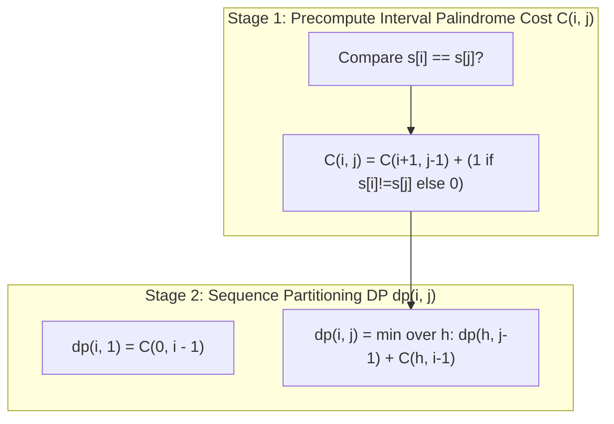

# Guided Example: Palindrome Partitioning III

We trace the step-by-step two-stage dynamic programming optimization for minimum character changes in $k$-palindrome string partitioning on a representative problem instance:

- **Input:**
  - `s = "abc"`
  - `k = 2`
- **Required Output:** `1`

This instance illustrates the decoupling of subsegment palindrome conversion costs from global sequence partitioning, dynamic table construction, and optimal substructure.

---

## 1. Instance & Teaching Goal

We are given a string $s$ of length $N = 3$ and an integer $k = 2$. We must divide $s$ into exactly $k$ non-empty contiguous substrings such that the total number of character changes required to make every substring a palindrome is minimized.

For $s = \text{"abc"}$ and $k = 2$, there are two possible partitions into $2$ non-empty pieces:
1. Cut after index $0$: Substrings `"a"` and `"bc"`
   - Substring `"a"` is already a palindrome ($0$ modifications).
   - Substring `"bc"` requires changing either `'b'` to `'c'` or `'c'` to `'b'` ($1$ modification).
   - Total cost = $0 + 1 = 1$.
2. Cut after index $1$: Substrings `"ab"` and `"c"`
   - Substring `"ab"` requires changing `'a'` or `'b'` ($1$ modification).
   - Substring `"c"` is already a palindrome ($0$ modifications).
   - Total cost = $1 + 0 = 1$.

Both partitions require a minimum of $1$ character change.

```
String s = "abc", k = 2 parts

Partition Option A:
  ["a"]  +  ["bc"]
   cost 0    cost 1 (change 'b'->'c' or 'c'->'b')
   Sum = 0 + 1 = 1

Partition Option B:
  ["ab"] +  ["c"]
   cost 1    cost 0
   Sum = 1 + 0 = 1

Optimal Minimum Cost: 1
```

A brute-force search evaluates $\binom{N - 1}{k - 1}$ partition combinations, recalculating palindrome mismatch counts repeatedly.
The optimal strategy proceeds in two clean stages:
- **Stage 1:** Precompute the cost to convert any substring $s[i \dots j]$ into a palindrome via interval DP.
- **Stage 2:** Partition prefix lengths into $j$ parts using standard sequence DP.

---

## 2. Conceptual Foundation & Invariants

### Stage 1: Interval Substring Palindrome Cost
Let $C(i, j)$ denote the minimum character modifications to turn $s[i \dots j]$ into a palindrome.
- A substring of length $0$ or $1$ is vacuously a palindrome:
  $$
  C(i, i) = 0, \quad C(i, i - 1) = 0
  $$
- For length $\ge 2$:
  Compare the outer characters $s[i]$ and $s[j]$. If they match, zero changes are needed at the boundaries; if they differ, exactly $1$ change harmonizes them. The inner substring $s[i+1 \dots j-1]$ is solved recursively:
  $$
  C(i, j) = C(i + 1, j - 1) + [s[i] \ne s[j]]
  $$

### Stage 2: Partitioning DP
Let $dp(i, j)$ denote the minimum modifications to partition the prefix $s[0 \dots i-1]$ (length $i$) into $j$ palindrome substrings, where $1 \le j \le \min(i, k)$.
- **Base Case ($j = 1$ part):**
  The entire prefix $s[0 \dots i-1]$ forms a single palindrome:
  $$
  dp(i, 1) = C(0, i - 1)
  $$
- **Transition ($j \ge 2$ parts):**
  Choose the starting index $h$ of the $j\text{th}$ substring. The previous $j - 1$ parts cover $s[0 \dots h-1]$ (length $h$), and the final part is $s[h \dots i-1]$:
  $$
  dp(i, j) = \min_{j - 1 \le h < i} \left\{ dp(h, j - 1) + C(h, i - 1) \right\}
  $$

| Stage | Data Structure | Range | Purpose |
|---|---|---|---|
| Stage 1 | Cost Matrix $C(i, j)$ | $0 \le i \le j < N$ | Fast $\mathcal{O}(1)$ lookup of palindrome conversion cost for any slice |
| Stage 2 | DP Table $dp(i, j)$ | $1 \le i \le N, \; 1 \le j \le k$ | Minimum edits to divide prefix of length $i$ into $j$ parts |

> **Optimal Substructure Invariant.** The minimum cost to partition a prefix of length $i$ into $j$ parts is obtained by considering all valid split points $h$ where the sub-problem of partitioning length $h$ into $j - 1$ parts has already been solved optimally.



---

## 3. Step-by-Step Worked Execution

We execute both stages on $s = \text{"abc"}$ with $N = 3, k = 2$.

### Stage 1: Computing Palindrome Cost Matrix $C(i, j)$
- Length 1 substrings ($i = j$):
  - $C(0, 0) = C(1, 1) = C(2, 2) = 0$.
- Length 2 substrings:
  - Slice `"ab"` (indices $0 \dots 1$): $s[0] = \text{'a'}, s[1] = \text{'b'}$. $s[0] \ne s[1] \implies C(0, 1) = 0 + 1 = 1$.
  - Slice `"bc"` (indices $1 \dots 2$): $s[1] = \text{'b'}, s[2] = \text{'c'}$. $s[1] \ne s[2] \implies C(1, 2) = 0 + 1 = 1$.
- Length 3 substring:
  - Slice `"abc"` (indices $0 \dots 2$): $s[0] = \text{'a'}, s[2] = \text{'c'} \implies 1 + C(1, 1) = 1 + 0 = 1$.

Cost Table $C$:
```text
      j=0   j=1   j=2
i=0 [  0     1     1  ]
i=1 [  -     0     1  ]
i=2 [  -     -     0  ]
```

### Stage 2: Partitioning Dynamic Programming $dp(i, j)$
Table dimensions: $(N + 1) \times (k + 1) = 4 \times 3$.

#### Base Cases: $j = 1$ (Single Part)
- Length $i = 1$: $dp(1, 1) = C(0, 0) = 0$ (`"a"`).
- Length $i = 2$: $dp(2, 1) = C(0, 1) = 1$ (`"ab"`).
- Length $i = 3$: $dp(3, 1) = C(0, 2) = 1$ (`"abc"`).

#### Step 2: Evaluating $j = 2$ Parts
- Length $i = 2$ into $2$ parts:
  - Split point $h = 1$:
    $$
    dp(2, 2) = dp(1, 1) + C(1, 1) = 0 + 0 = 0
    $$
    (Splits `"ab"` into `"a"` and `"b"`, $0$ modifications).

- Length $i = 3$ into $2$ parts:
  - Valid split points $h \in \{1, 2\}$:
    - Split $h = 1$: Prefix of length $1$ (`"a"`) and tail slice $s[1 \dots 2]$ (`"bc"`):
      $$
      \text{Cost}_1 = dp(1, 1) + C(1, 2) = 0 + 1 = 1
      $$
    - Split $h = 2$: Prefix of length $2$ (`"ab"`) and tail slice $s[2 \dots 2]$ (`"c"`):
      $$
      \text{Cost}_2 = dp(2, 1) + C(2, 2) = 1 + 0 = 1
      $$
  - Taking the minimum:
    $$
    dp(3, 2) = \min(1, 1) = 1
    $$

Final result: $dp(3, 2) = 1$.

---

## 4. Complete Execution Trace

| Prefix Length $i$ | Substring Examined | Parts $j = 1$ | Parts $j = 2$ Split Options | Minimum $dp(i, j)$ |
|---|---|---|---|---|
| $1$ | `"a"` | $C(0, 0) = 0$ | Not applicable ($j > i$) | $dp(1, 1) = 0$ |
| $2$ | `"ab"` | $C(0, 1) = 1$ | $h = 1: dp(1, 1) + C(1, 1) = 0 + 0 = 0$ | $dp(2, 2) = 0$ |
| $3$ | `"abc"` | $C(0, 2) = 1$ | $h=1: 0 + 1 = 1, \; h=2: 1 + 0 = 1$ | $dp(3, 2) = 1$ |

Final result: $dp(3, 2) = 1$.

---

## 5. Algorithmic Correctness

**Soundness.** In Stage 1, two characters at symmetric offsets must be equal for a substring to be a palindrome. For each mismatched pair, changing either character to match the other costs exactly $1$ operation. Stage 1 counts exactly these mismatch pairs. In Stage 2, any partition into $j$ non-empty parts consists of an initial partition of length $h$ into $j - 1$ parts followed by a final substring $s[h \dots i-1]$. Summing the optimal cost of the prefix with the exact cost of the tail guarantees that the total changes correspond to a legally formed palindrome set.

**Completeness.** All possible lengths $h \in [j-1, i-1]$ for the prefix are explored. Because the minimum over all valid cut points $h$ is selected, no valid partition configuration can achieve a lower total modification count.

---

## 6. Traps This Instance Exposes

- **Zero-change singletons:** When $k = N$, every character becomes its own substring of length $1$, which is trivially a palindrome with $0$ cost.
- **Split boundary constraints:** The cut index $h$ must satisfy $h \ge j - 1$ so that the preceding prefix has enough characters to form $j - 1$ non-empty substrings.
- **Recomputing palindrome mismatches:** Calculating palindrome changes during the partitioning DP loop adds an extra factor of $N$, raising the time complexity to $\mathcal{O}(N^3 \cdot k)$. Precomputing $C(i, j)$ keeps the partitioning step at $\mathcal{O}(N^2 \cdot k)$.

---

## 7. Complexity Derivation

- **Time Complexity:** $\mathcal{O}(N^2 \cdot k)$.
  - **Stage 1:** There are $\mathcal{O}(N^2)$ substring pairs $(i, j)$. Each entry in $C(i, j)$ is computed in $\mathcal{O}(1)$ time by expanding outwards or bottom-up, taking $\mathcal{O}(N^2)$ time total.
  - **Stage 2:** The DP table has size $N \times k$. For each state $(i, j)$, testing all split points $h \in [j-1, i-1]$ takes at most $i \le N$ transitions. This stage takes $\mathcal{O}(N^2 \cdot k)$ time.
  - **Total Runtime:** $\mathcal{O}(N^2 + N^2 \cdot k) = \mathcal{O}(N^2 \cdot k)$.
  With $N \le 100$ and $k \le N$, $N^2 \cdot k \le 10^6$ operations, executing in under $10$ milliseconds.
- **Auxiliary Space Complexity:** $\mathcal{O}(N^2 + N \cdot k)$ to store the cost matrix $C$ and the dynamic programming table $dp$.