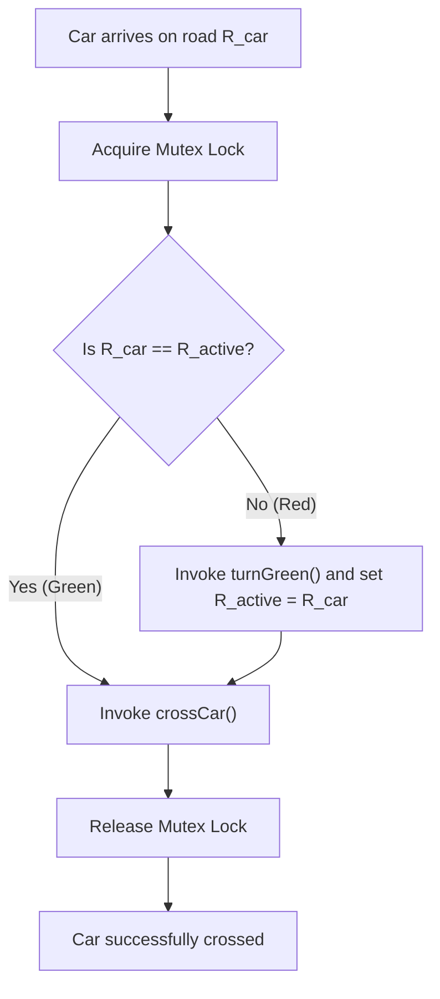

# Guided Example: Traffic Light Controlled Intersection

We trace the step-by-step synchronization and state transitions of a multi-threaded traffic controller on a representative problem instance:

- **Input:**
  - `cars = [1, 3, 5, 2, 4]`
  - `directions = [2, 1, 2, 4, 3]`
  - `arrival_times = [10, 20, 30, 40, 50]`
  - Initial condition: Road 1 is Green, Road 2 is Red.
- **Required Behavior:**
  Cars $1, 3, 5$ cross on Road 1 without changing the signal; the signal switches to Road 2 before car $2$ crosses, and car $4$ crosses on the active green.

This instance illustrates mutual exclusion, invariant maintenance across shared state, conditional signaling callbacks, and collision-free thread scheduling.

---

## 1. Instance & Teaching Goal

The intersection consists of two perpendicular roads:
- **Road 1 (Road A):** Accommodates traffic in direction $1$ and direction $2$.
- **Road 2 (Road B):** Accommodates traffic in direction $3$ and direction $4$.

```
                       Road 2 (Dir 3: Southbound)
                                 │
                                 ▼
   Road 1 (Dir 1: Eastbound) ─────────►  Road 1 (Dir 2: Westbound)
                                 ▲
                                 │
                       Road 2 (Dir 4: Northbound)
```

At any point in time, exactly one road has a green light. Cars can only cross when the signal on their road is green. If a car arrives at a red light, it must execute a signal phase change (`turnGreen()`) before entering the intersection (`crossCar()`).

Multiple threads representing arriving cars call the controller concurrently. The safety goal is to prevent collisions by ensuring that cars on conflicting roads never occupy the intersection simultaneously, while avoiding deadlocks and unnecessary signal toggling.

---

## 2. Conceptual Foundation & Invariants

Let the shared state of the intersection be represented by:
- A state variable $R_{\text{active}} \in \{1, 2\}$ indicating which road currently has the green signal. Initially, $R_{\text{active}} = 1$.
- A mutual exclusion lock (mutex) protecting concurrent entry to the critical section.

### Protocol for Arriving Car
When a thread representing car $c$ on road $R_{\text{car}}$ arrives:
1. **Acquire Mutex:** The thread acquires exclusive access to the intersection state.
2. **Signal Verification:**
   - If $R_{\text{active}} = R_{\text{car}}$, the light is already green. No action is required.
   - If $R_{\text{active}} \ne R_{\text{car}}$, the car is facing a red light. The thread must switch the signal:
     - Invoke `turnGreen()`.
     - Update shared state: $R_{\text{active}} \leftarrow R_{\text{car}}$.
3. **Intersection Crossing:**
   The thread invokes `crossCar()`.
4. **Release Mutex:**
   The thread releases the lock, permitting waiting threads to proceed.

| Step / Action | Road ID $R_{\text{car}}$ | Active Signal $R_{\text{active}}$ | State Transition | Call `turnGreen()`? | Call `crossCar()`? |
|---|---|---|---|---|---|
| Car 1 arrives | $1$ | $1$ | None (already 1) | No | Yes |
| Car 3 arrives | $1$ | $1$ | None (already 1) | No | Yes |
| Car 5 arrives | $1$ | $1$ | None (already 1) | No | Yes |
| Car 2 arrives | $2$ | $1$ | $R_{\text{active}} \leftarrow 2$ | Yes | Yes |
| Car 4 arrives | $2$ | $2$ | None (already 2) | No | Yes |

> **Single-Active-Road Safety Invariant.** At every instant, only cars on road $R_{\text{active}}$ may be granted permission to cross. Because every state query and crossing callback executes within the critical section bounded by the mutex, conflicting cars are serialized and collision is mathematically impossible.



---

## 3. Step-by-Step Worked Execution

We trace the arrival of all five vehicles in chronological order.

### Step 1: Car 1 arrives at $t = 10$ (Direction 2, Road 1)
- Thread acquires the mutex.
- $R_{\text{active}} = 1$. Since $R_{\text{car}} = 1$, the light is already green.
- `turnGreen()` is skipped.
- `crossCar()` is executed for Car 1.
- Mutex is released. State: $R_{\text{active}} = 1$.

### Step 2: Car 3 arrives at $t = 20$ (Direction 1, Road 1)
- Thread acquires the mutex.
- $R_{\text{active}} = 1$. Matches $R_{\text{car}} = 1$.
- `turnGreen()` is skipped.
- `crossCar()` is executed for Car 3.
- Mutex is released. State: $R_{\text{active}} = 1$.

### Step 3: Car 5 arrives at $t = 30$ (Direction 2, Road 1)
- Thread acquires the mutex.
- $R_{\text{active}} = 1$. Matches $R_{\text{car}} = 1$.
- `turnGreen()` is skipped.
- `crossCar()` is executed for Car 5.
- Mutex is released. State: $R_{\text{active}} = 1$.

### Step 4: Car 2 arrives at $t = 40$ (Direction 4, Road 2)
- Thread acquires the mutex.
- $R_{\text{active}} = 1$, but $R_{\text{car}} = 2$ (Facing Red Light!).
- Light must be changed:
  - Invoke `turnGreen()`. The physical light for Road 2 becomes green, and Road 1 becomes red.
  - State update: $R_{\text{active}} \leftarrow 2$.
- `crossCar()` is executed for Car 2.
- Mutex is released. State: $R_{\text{active}} = 2$.

### Step 5: Car 4 arrives at $t = 50$ (Direction 3, Road 2)
- Thread acquires the mutex.
- $R_{\text{active}} = 2$. Matches $R_{\text{car}} = 2$ (Light is already green on Road 2).
- `turnGreen()` is skipped.
- `crossCar()` is executed for Car 4.
- Mutex is released. State: $R_{\text{active}} = 2$.

---

## 4. Complete Execution Trace

| Car ID | Arrival Time | Direction | Road ID | Signal Before | Action Taken | Signal After |
|---|---|---|---|---|---|---|
| $1$ | $10$ | $2$ | $1$ | Road 1 Green | `crossCar()` | Road 1 Green |
| $3$ | $20$ | $1$ | $1$ | Road 1 Green | `crossCar()` | Road 1 Green |
| $5$ | $30$ | $2$ | $1$ | Road 1 Green | `crossCar()` | Road 1 Green |
| $2$ | $40$ | $4$ | $2$ | Road 1 Green | `turnGreen()` then `crossCar()` | Road 2 Green |
| $4$ | $50$ | $3$ | $2$ | Road 2 Green | `crossCar()` | Road 2 Green |

Total light switches executed: $1$ (between Car 5 and Car 2).

---

## 5. Algorithmic Correctness

**Soundness.** A car executes `crossCar()` only when the signal on its road is green. Because checking the current road signal, optionally toggling `turnGreen()`, updating $R_{\text{active}}$, and executing `crossCar()` are wrapped atomically inside a single mutex critical section, no thread interleaving can occur during a phase change. Therefore, a car on Road 1 and a car on Road 2 can never cross concurrently.

**Completeness.** Deadlock is impossible because only a single mutex is used. Since no thread holds the lock while waiting for an external event or resource, every thread that acquires the mutex completes its operation in $\mathcal{O}(1)$ time and immediately releases the lock, ensuring starvation-free progress for all arriving cars.

---

## 6. Traps This Instance Exposes

- **Race conditions during signal checks:** Checking the signal outside the critical section creates a Time-of-Check to Time-of-Use (TOCTOU) race. If two cars from different roads check simultaneously, both could conclude that they need to toggle the light, leading to conflicting crossings. Locking before inspecting $R_{\text{active}}$ avoids this flaw.
- **Redundant signal toggling:** Toggling the light on every arrival regardless of road would cause cars traveling in the same direction to needlessly flip the signal back and forth. Only changing the light when $R_{\text{car}} \ne R_{\text{active}}$ minimizes state changes.
- **Direction vs Road mapping:** Directions $1$ and $2$ belong to Road 1, while directions $3$ and $4$ belong to Road 2. The signal state is per-road, not per-direction.

---

## 7. Complexity Derivation

- **Time Complexity:** $\mathcal{O}(1)$ per car arrival. Acquiring and releasing a mutex and performing conditional callback invocations takes constant time $\mathcal{O}(1)$. For $N$ cars, the total execution time is $\mathcal{O}(N)$.
- **Auxiliary Space Complexity:** $\mathcal{O}(1)$. The synchronization state requires only a single mutex and one integer variable to track the active green road.
