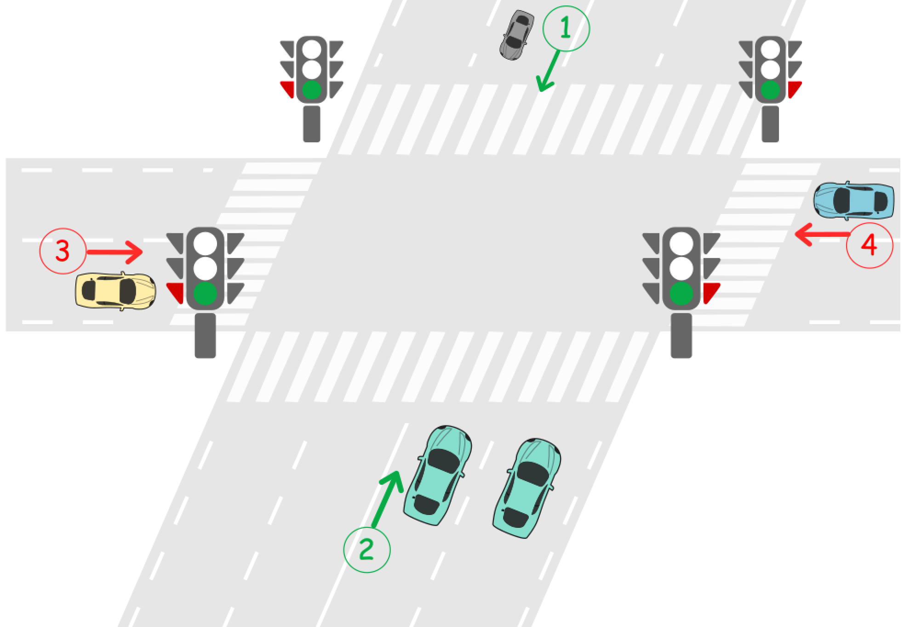

## Description

There is an intersection of two roads. First road is road A where cars travel from North to South in direction 1 and from South to North in direction 2. Second road is road B where cars travel from West to East in direction 3 and from East to West in direction 4.

There is a traffic light located on each road before the intersection. A traffic light can either be green or red.

- **Green** means cars can cross the intersection in both directions of the road.

- **Red** means cars in both directions cannot cross the intersection and must wait until the light turns green.

The traffic lights cannot be green on both roads at the same time. That means when the light is green on road A, it is red on road B and when the light is green on road B, it is red on road A.

Initially, the traffic light is **green** on road A and **red** on road B. When the light is green on one road, all cars can cross the intersection in both directions until the light becomes green on the other road. No two cars traveling on different roads should cross at the same time.

Design a deadlock-free traffic light controlled system at this intersection.

Implement the function `void carArrived(carId, roadId, direction, turnGreen, crossCar)` where:

- `carId` is the id of the car that arrived.

- `roadId` is the id of the road that the car travels on.

- `direction` is the direction of the car.

- `turnGreen` is a function you can call to turn the traffic light to green on the current road.

- `crossCar` is a function you can call to let the current car cross the intersection.

Your answer is considered correct if it avoids cars deadlock in the intersection. Turning the light green on a road when it was already green is considered a wrong answer.
### Function Contract

Construct one `TrafficLight` instance for an intersection whose initial green road is Road A. The judge may invoke its method concurrently:

`carArrived(carId, roadId, direction, turnGreen, crossCar)`

**Inputs**

- `carId`: the unique identifier of the arriving car.
- `roadId`: the road the car is using; `1` identifies Road A and `2` identifies Road B.
- `direction`: the car's direction, where `1` and `2` belong to Road A and `3` and `4` belong to Road B.
- `turnGreen`: a zero-argument judge callback that changes the arriving car's road to green. Invoke it only when that road is currently red.
- `crossCar`: a zero-argument judge callback that makes this arriving car cross. Invoke it once after its road is green.

**Return value**

- `carArrived` returns no value. Across concurrent calls, every car must cross, different roads must never cross simultaneously, redundant green changes are forbidden, and all calls must finish without deadlock.

### Examples
#### Example 1

- **Input:** $cars = [1,3,5,2,4], directions = [2,1,2,4,3], arrivalTimes = [10,20,30,40,50]$
- **Output:** `[`
"Car 1 Has Passed Road A In Direction 2",    // Traffic light on road A is green, car 1 can cross the intersection.
"Car 3 Has Passed Road A In Direction 1",    // Car 3 crosses the intersection as the light is still green.
"Car 5 Has Passed Road A In Direction 2",    // Car 5 crosses the intersection as the light is still green.
"Traffic Light On Road B Is Green",          // Car 2 requests green light for road B.
"Car 2 Has Passed Road B In Direction 4",    // Car 2 crosses as the light is green on road B now.
"Car 4 Has Passed Road B In Direction 3"     // Car 4 crosses the intersection as the light is still green.
]
#### Example 2

- **Input:** $cars = [1,2,3,4,5], directions = [2,4,3,3,1], arrivalTimes = [10,20,30,40,40]$
- **Output:** `[`
"Car 1 Has Passed Road A In Direction 2",    // Traffic light on road A is green, car 1 can cross the intersection.
"Traffic Light On Road B Is Green",          // Car 2 requests green light for road B.
"Car 2 Has Passed Road B In Direction 4",    // Car 2 crosses as the light is green on road B now.
"Car 3 Has Passed Road B In Direction 3",    // Car 3 crosses as the light is green on road B now.
"Traffic Light On Road A Is Green",          // Car 5 requests green light for road A.
"Car 5 Has Passed Road A In Direction 1",    // Car 5 crosses as the light is green on road A now.
"Traffic Light On Road B Is Green",          // Car 4 requests green light for road B. Car 4 blocked until car 5 crosses and then traffic light is green on road B.
"Car 4 Has Passed Road B In Direction 3"     // Car 4 crosses as the light is green on road B now.
]
- **Explanation:** This is a dead-lock free scenario. Note that the scenario when car 4 crosses before turning light into green on road A and allowing car 5 to pass is also **correct** and **Accepted** scenario.
### Constraints

- $1 \le \text{cars.length} \le 20$

- $\text{cars.length} = \text{directions.length}$

- $\text{cars.length} = \text{arrivalTimes.length}$

- All values of `cars` are unique

- $1 \le \text{directions}[i] \le 4$

- `arrivalTimes` is non-decreasing