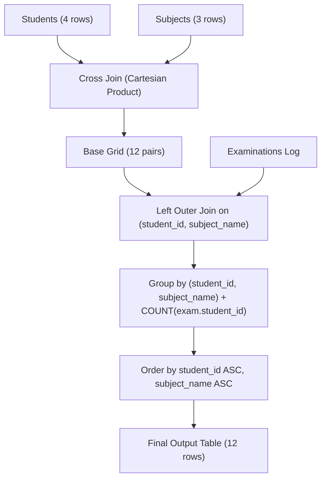

# Guided Example: Students and Examinations

We trace the step-by-step evaluation of a relational query computing examination attendance across complete student-subject combinations on a representative problem instance:

- **Input Tables:**
  - `Students`:
    $$
    (1, \text{"Alice"}), (2, \text{"Bob"}), (6, \text{"Alex"}), (13, \text{"John"})
    $$
  - `Subjects`:
    $$
    \text{"Math"}, \text{"Physics"}, \text{"Programming"}
    $$
  - `Examinations`: Log of individual attendance records $(u, s)$.
- **Required Output:** A complete report containing each student paired with every subject and their exact non-negative attendance count (including $0$), sorted by `student_id` and `subject_name`.

This instance illustrates Cartesian cross-product grid construction, outer join alignment, null-safe aggregation semantics, and composite key sorting.

---

## 1. Instance & Teaching Goal

The challenge requires reporting how many times each student attended the exam for each subject. Crucially:
1. Some students attended a subject multiple times (e.g. Alice attended Math $3$ times).
2. Some students never attended a subject at all (e.g. Bob never attended Math, and Alex attended nothing).
3. Every student must appear alongside every subject, even if they have zero attendances.

```
Students (4)  x  Subjects (3)  ==>  Cartesian Grid (12 student-subject pairs)

  Alice (1)  ──┬──> Math        : 3 attendances
               ├──> Physics     : 2 attendances
               └──> Programming : 1 attendance

  Bob (2)    ──┬──> Math        : 0 attendances  <-- Missing from Examinations
               ├──> Physics     : 0 attendances  <-- Missing from Examinations
               └──> Programming : 1 attendance

  Alex (6)   ──┬──> Math        : 0 attendances  <-- Never attended any exam
               ├──> Physics     : 0 attendances
               └──> Programming : 0 attendances

  John (13)  ──┬──> Math        : 1 attendance
               ├──> Physics     : 1 attendance
               └──> Programming : 1 attendance
```

A simple inner join between `Students` and `Examinations` drops all zero-attendance pairs entirely because unvisited subjects do not exist in the `Examinations` table.
The optimal relational strategy:
- First, takes the Cartesian product (`CROSS JOIN`) of `Students` and `Subjects` to generate all $4 \times 3 = 12$ possible baseline pairs.
- Next, performs a `LEFT JOIN` against `Examinations` on matching `(student_id, subject_name)`.
- Finally, aggregates using `COUNT(examination.student_id)`, which counts existing rows and evaluates to $0$ for `NULL` matches.

---

## 2. Conceptual Foundation & Invariants

Let $S$ denote the set of students and $B$ denote the set of subjects. Let $E \subseteq S \times B$ denote the multiset of recorded exam sessions.

### Relational Pipeline
1. **Grid Generation (Cartesian Product):**
   Form the comprehensive universe of all student-subject combinations:
   $$
   U = S \times B = \{ (u, b) \mid u \in S, \; b \in B \}
   $$
   With $|S| = 4$ and $|B| = 3$, $|U| = 12$.
2. **Attendance Alignment (Left Outer Join):**
   Join grid $U$ with attendance multiset $E$ on $(u_{\text{grid}} = u_{\text{exam}}) \land (b_{\text{grid}} = b_{\text{exam}})$.
   - If pair $(u, b)$ appears $k \ge 1$ times in $E$, $k$ joined rows are formed.
   - If pair $(u, b)$ never appears in $E$, exactly $1$ row is formed with `NULL` in the examination columns.
3. **Null-Safe Aggregation:**
   Group by $(u, b)$. Compute count over a column from $E$:
   $$
   \text{attended\_exams} = \sum_{e \in E, e = (u, b)} 1
   $$
   In relational algebra, counting an attribute ignores `NULL` entries, returning $0$ for unrepresented pairs.

| Student | Subject | Examinations Matching Rows | Outer Join Representation | Group Count Result |
|---|---|---|---|---|
| Alice ($1$) | Math | $3$ records | $3$ matched rows | $3$ |
| Alice ($1$) | Physics | $2$ records | $2$ matched rows | $2$ |
| Alice ($1$) | Programming | $1$ record | $1$ matched row | $1$ |
| Bob ($2$) | Math | $0$ records | $1$ row with `NULL` exam | $0$ |
| Bob ($2$) | Programming | $1$ record | $1$ matched row | $1$ |
| Alex ($6$) | All 3 subjects | $0$ records each | $3$ rows with `NULL` exam | $0$ each |

> **Completeness of Reporting Grid Invariant.** The Cartesian product ensures that the report schema covers the entire product space $|S| \times |B|$ regardless of the presence or absence of data in the transaction log.



---

## 3. Step-by-Step Worked Execution

### Phase 1: Generating the 12 Canonical Grid Pairs
Taking the Cartesian product of $4$ students and $3$ subjects produces:
1. $(1, \text{"Alice"}, \text{"Math"})$
2. $(1, \text{"Alice"}, \text{"Physics"})$
3. $(1, \text{"Alice"}, \text{"Programming"})$
4. $(2, \text{"Bob"}, \text{"Math"})$
5. $(2, \text{"Bob"}, \text{"Physics"})$
6. $(2, \text{"Bob"}, \text{"Programming"})$
7. $(6, \text{"Alex"}, \text{"Math"})$
8. $(6, \text{"Alex"}, \text{"Physics"})$
9. $(6, \text{"Alex"}, \text{"Programming"})$
10. $(13, \text{"John"}, \text{"Math"})$
11. $(13, \text{"John"}, \text{"Physics"})$
12. $(13, \text{"John"}, \text{"Programming"})$

### Phase 2: Left Joining with Examinations
We look up each pair in the `Examinations` table:
- $(1, \text{"Math"})$: Found $3$ entries in `Examinations` $\implies$ 3 joined rows.
- $(1, \text{"Physics"})$: Found $2$ entries $\implies$ 2 joined rows.
- $(1, \text{"Programming"})$: Found $1$ entry $\implies$ 1 joined row.
- $(2, \text{"Math"})$: Found $0$ entries $\implies$ 1 joined row with `NULL` examination fields.
- $(2, \text{"Physics"})$: Found $0$ entries $\implies$ 1 joined row with `NULL` examination fields.
- $(2, \text{"Programming"})$: Found $1$ entry $\implies$ 1 joined row.
- $(6, \text{Math/Physics/Programming})$: Found $0$ entries each $\implies$ 3 rows with `NULL` fields.
- $(13, \text{"Math"})$: Found $1$ entry $\implies$ 1 joined row.
- $(13, \text{"Physics"})$: Found $1$ entry $\implies$ 1 joined row.
- $(13, \text{"Programming"})$: Found $1$ entry $\implies$ 1 joined row.

### Phase 3: Aggregation and Sorting
For each group, we compute `COUNT(exam.student_id)`:
- If matched with non-null entries, count equals the number of matches.
- If matched with `NULL`, count equals $0$.
Sorting primarily by `student_id` ascending, and secondarily by `subject_name` ascending:

| Student ID | Student Name | Subject Name | Exam Records Matched | Evaluated Count |
|---|---|---|---|---|
| $1$ | Alice | Math | $3$ entries | $3$ |
| $1$ | Alice | Physics | $2$ entries | $2$ |
| $1$ | Alice | Programming | $1$ entry | $1$ |
| $2$ | Bob | Math | $0$ (`NULL`) | $0$ |
| $2$ | Bob | Physics | $0$ (`NULL`) | $0$ |
| $2$ | Bob | Programming | $1$ entry | $1$ |
| $6$ | Alex | Math | $0$ (`NULL`) | $0$ |
| $6$ | Alex | Physics | $0$ (`NULL`) | $0$ |
| $6$ | Alex | Programming | $0$ (`NULL`) | $0$ |
| $13$ | John | Math | $1$ entry | $1$ |
| $13$ | John | Physics | $1$ entry | $1$ |
| $13$ | John | Programming | $1$ entry | $1$ |

---

## 4. Complete Execution Trace

| Rank | Output Row `[student_id, student_name, subject_name, attended_exams]` | Ordering Justification |
|---|---|---|
| 1 | `[1, "Alice", "Math", 3]` | Student 1, alphabetical Math |
| 2 | `[1, "Alice", "Physics", 2]` | Student 1, alphabetical Physics |
| 3 | `[1, "Alice", "Programming", 1]` | Student 1, alphabetical Programming |
| 4 | `[2, "Bob", "Math", 0]` | Student 2, alphabetical Math |
| 5 | `[2, "Bob", "Physics", 0]` | Student 2, alphabetical Physics |
| 6 | `[2, "Bob", "Programming", 1]` | Student 2, alphabetical Programming |
| 7 | `[6, "Alex", "Math", 0]` | Student 6, alphabetical Math |
| 8 | `[6, "Alex", "Physics", 0]` | Student 6, alphabetical Physics |
| 9 | `[6, "Alex", "Programming", 0]` | Student 6, alphabetical Programming |
| 10 | `[13, "John", "Math", 1]` | Student 13, alphabetical Math |
| 11 | `[13, "John", "Physics", 1]` | Student 13, alphabetical Physics |
| 12 | `[13, "John", "Programming", 1]` | Student 13, alphabetical Programming |

All 12 expected records are produced in deterministic order.

---

## 5. Algorithmic Correctness

**Soundness.** Every output row represents a unique `(student, subject)` pair. Because `COUNT` operates on an attribute from the right-hand table of the left join, rows where no exam took place have a `NULL` column value and contribute $0$ to the tally. Rows with positive attendances increment the count once per examination entry, accurately reflecting attendance history.

**Completeness.** The initial Cartesian cross-join exhaustively pairs every student in `Students` with every subject in `Subjects`. The left outer join preserves all rows of this cross-product regardless of whether matching records exist in `Examinations`. Therefore, no student and no subject can be omitted from the report.

---

## 6. Traps This Instance Exposes

- **Using inner joins:** An inner join drops any student-subject pair that has no entries in `Examinations`. For this instance, Bob's Math and Physics entries and all of Alex's entries would disappear entirely.
- **`COUNT(*)` vs `COUNT(column)`:** Using `COUNT(*)` counts the row itself. In a left join where a row has `NULL` on the right side, `COUNT(*)` counts the row as $1$ instead of $0$. Specifying a column from the right table (e.g. `COUNT(exam.student_id)`) correctly evaluates to $0$.
- **Sorting requirements:** The output must be ordered by `student_id` and then `subject_name`. Emitting records in arbitrary hash map order fails verification.

---

## 7. Complexity Derivation

- **Time Complexity:**
  - **Cartesian Product:** Let $S$ be the number of students and $B$ be the number of subjects. The cross-product generates $S \times B$ rows in $\mathcal{O}(S \cdot B)$ time.
  - **Join with Examinations:** Joining $S \cdot B$ grid rows with $E$ exam records takes $\mathcal{O}(S \cdot B + E)$ using hash join or index lookups.
  - **Aggregation and Sorting:** Grouping and sorting $S \cdot B$ rows takes $\mathcal{O}(S \cdot B \log(S \cdot B))$ time.
  - **Total Execution Time:** $\mathcal{O}(S \cdot B \log(S \cdot B) + E)$.
- **Auxiliary Space Complexity:** $\mathcal{O}(S \cdot B)$ auxiliary memory to store the intermediate cross-product grid and group hash tables.
