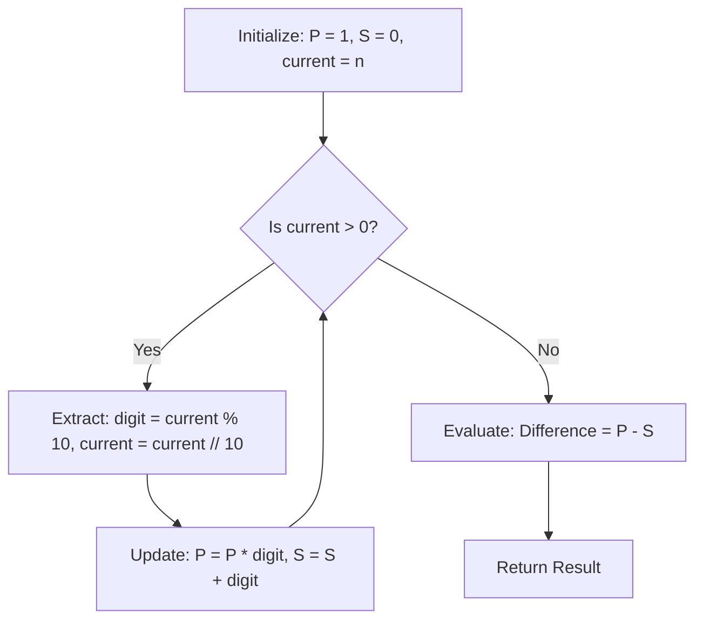

# Guided Example: Subtract the Product and Sum of Digits of an Integer

We trace the step-by-step arithmetic digit decomposition and simultaneous accumulator evaluation on a representative problem instance:

- **Input:** `n = 234`
- **Required Output:** `15`

This instance illustrates decimal radix extraction using modulo-division arithmetic, identity element initialization, and single-pass dual aggregation.

---

## 1. Instance & Teaching Goal

Given an integer $n \ge 1$, we must determine the difference between:
1. The product of its base-10 digits: $P(n) = \prod_{k=0}^{L-1} d_k$
2. The sum of its base-10 digits: $S(n) = \sum_{k=0}^{L-1} d_k$

For $n = 234$:
- Digits: $2, 3, 4$
- Product: $2 \times 3 \times 4 = 24$
- Sum: $2 + 3 + 4 = 9$
- Difference: $P - S = 24 - 9 = 15$

```
Decimal Value: 234

Extraction Cycle (Least Significant to Most Significant):
  234 % 10 = 4,  234 // 10 = 23  ==>  Digit 4
   23 % 10 = 3,   23 // 10 =  2  ==>  Digit 3
    2 % 10 = 2,    2 // 10 =  0  ==>  Digit 2 (Terminates)

Dual Aggregators:
  Product Accumulator: 1 * 4 * 3 * 2 = 24
  Sum Accumulator:     0 + 4 + 3 + 2 =  9

Final Difference:
  24 - 9 = 15
```

Converting the integer to an intermediate string of characters creates heap-allocation overhead.
The optimal strategy extracts digits directly via repeated integer division and remainder operations ($\text{divmod}$ arithmetic), updating running product and sum accumulators simultaneously.

---

## 2. Conceptual Foundation & Invariants

Any positive integer $n$ can be uniquely expressed in base-10 positional notation:
$$
n = d_{L-1} 10^{L-1} + \dots + d_1 10^1 + d_0 10^0 = \sum_{k=0}^{L-1} d_k 10^k
$$
where each digit $d_k \in \{0, 1, \dots, 9\}$ and $d_{L-1} \ne 0$.

### Identity Elements and State Invariant
We maintain two running accumulators:
- **Product Accumulator ($P$):** Initialized to multiplicative identity $1$.
- **Sum Accumulator ($S$):** Initialized to additive identity $0$.

At each step with current remainder $v = n \bmod 10$:
$$
P \leftarrow P \times v, \quad S \leftarrow S + v, \quad n \leftarrow \lfloor n / 10 \rfloor
$$

| Step Component | Role | Identity Element | Update Operation |
|---|---|---|---|
| Product Accumulator $P$ | Maintains running product of processed digits | $1$ (Multiplicative identity) | $P \leftarrow P \times d_k$ |
| Sum Accumulator $S$ | Maintains running sum of processed digits | $0$ (Additive identity) | $S \leftarrow S + d_k$ |
| Dividend Cursor $n$ | Remaining prefix of digits to process | Input $n$ | $n \leftarrow \lfloor n / 10 \rfloor$ |

> **Accumulator Consistency Invariant.** After processing the lowest $k$ digits, $P$ contains the exact product of those $k$ digits and $S$ contains the exact sum. The loop terminates when the dividend cursor reaches zero, guaranteeing all digits have been incorporated.



---

## 3. Step-by-Step Worked Execution

We trace the algorithm on $n = 234$.

### Initialization
- Multiplicative accumulator: $P = 1$
- Additive accumulator: $S = 0$
- Active dividend: $n = 234$

### Step 1: Processing the Units Digit ($k = 0$)
- Remainder: $d_0 = 234 \bmod 10 = 4$
- Next dividend: $n = \lfloor 234 / 10 \rfloor = 23$
- Accumulator updates:
  $$
  P = 1 \times 4 = 4
  $$
  $$
  S = 0 + 4 = 4
  $$

### Step 2: Processing the Tens Digit ($k = 1$)
- Remainder: $d_1 = 23 \bmod 10 = 3$
- Next dividend: $n = \lfloor 23 / 10 \rfloor = 2$
- Accumulator updates:
  $$
  P = 4 \times 3 = 12
  $$
  $$
  S = 4 + 3 = 7
  $$

### Step 3: Processing the Hundreds Digit ($k = 2$)
- Remainder: $d_2 = 2 \bmod 10 = 2$
- Next dividend: $n = \lfloor 2 / 10 \rfloor = 0$
- Accumulator updates:
  $$
  P = 12 \times 2 = 24
  $$
  $$
  S = 7 + 2 = 9
  $$

### Step 4: Termination and Difference Calculation
- Dividend $n = 0$, terminating the extraction loop.
- Final product: $P = 24$
- Final sum: $S = 9$
- Target difference:
  $$
  P - S = 24 - 9 = 15
  $$

---

## 4. Complete Execution Trace

| Iteration | Active $n$ | Extracted Digit $d_k$ | Next $n$ | Running Product $P$ | Running Sum $S$ | Current Margin $P - S$ |
|---|---|---|---|---|---|---|
| Init | $234$ | - | - | $1$ | $0$ | $1$ |
| 1 | $234$ | $4$ | $23$ | $1 \times 4 = 4$ | $0 + 4 = 4$ | $0$ |
| 2 | $23$ | $3$ | $2$ | $4 \times 3 = 12$ | $4 + 3 = 7$ | $5$ |
| 3 | $2$ | $2$ | $0$ | $12 \times 2 = 24$ | $7 + 2 = 9$ | $15$ |

Final result: $15$.

---

## 5. Algorithmic Correctness

**Soundness.** Repeated division by $10$ with remainders extracts the digits of an integer in positional reverse order. Because multiplication and addition are associative and commutative over the integers, the final product $\prod d_k$ and sum $\sum d_k$ are invariant to the order in which digits are accumulated. Subtracting $S$ from $P$ produces the exact requested mathematical difference.

**Completeness.** Every digit of $n$ is processed before $n$ reaches $0$. For any finite integer $n \ge 1$, $\lfloor n / 10 \rfloor < n$, ensuring the sequence of dividends is strictly decreasing and terminates in exactly $\lfloor \log_{10} n \rfloor + 1$ steps with zero skipped digits.

---

## 6. Traps This Instance Exposes

- **Zero digits in numbers:** If any digit is `0` (e.g. $n = 105$), the product becomes $1 \times 0 \times 5 = 0$, while the sum is $1 + 0 + 5 = 6$, yielding a negative difference $0 - 6 = -6$. The difference can legally be negative and should not be clamped to zero.
- **Product accumulator initialization:** Initializing the product accumulator $P$ to $0$ instead of $1$ causes the product to remain stuck at $0$ permanently.
- **Single-digit inputs:** For $n \in \{1, 2, \dots, 9\}$, $P = d$ and $S = d$, so $P - S = 0$. The single-step loop handles this cleanly without special branches.

---

## 7. Complexity Derivation

- **Time Complexity:** $\mathcal{O}(\log_{10} n)$. The number of iterations equals the number of decimal digits $L = \lfloor \log_{10} n \rfloor + 1$. For $n \le 10^5$, $L \le 6$, requiring at most $6$ arithmetic operations.
- **Auxiliary Space Complexity:** $\mathcal{O}(1)$. Memory is limited to a constant number of scalar integer registers holding $P, S, n$, and the extracted digit.
