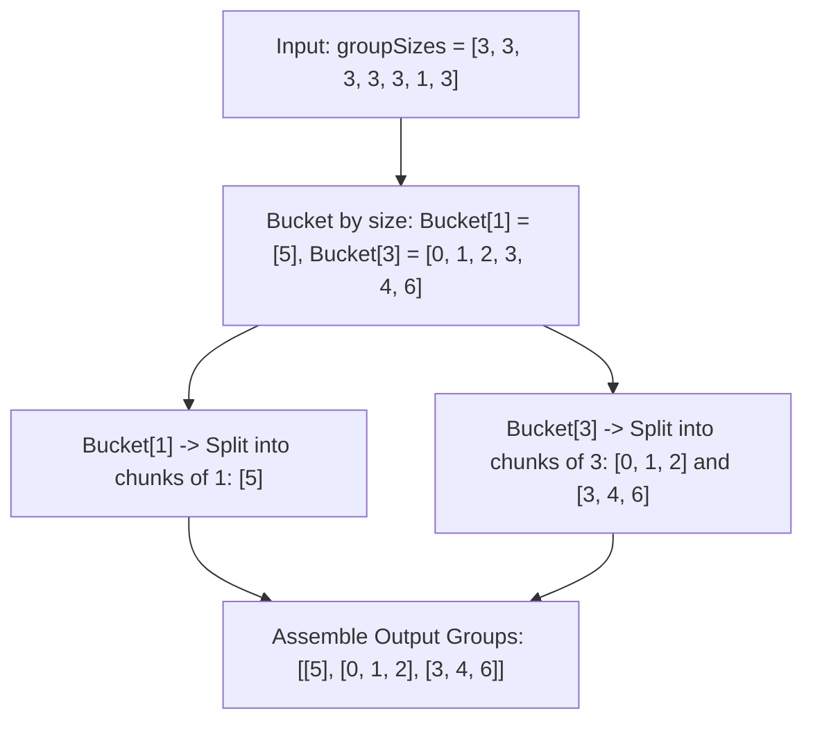

# Guided Example: Group the People Given the Group Size They Belong To

We trace the step-by-step bucketing and chunking partitioning of individuals into required group sizes on a representative problem instance:

- **Input:**
  `groupSizes = [3, 3, 3, 3, 3, 1, 3]`
- **Required Output:**
  ```text
  [
    [5],
    [0, 1, 2],
    [3, 4, 6]
  ]
  ```

This instance illustrates equivalence grouping by size attributes, greedy batch chunking, and partition invariance.

---

## 1. Instance & Teaching Goal

We are given $N = 7$ people indexed from $0$ to $6$. Each person $i$ specifies their mandatory group size $S_i = \text{groupSizes}[i]$:
- Person $0$: size $3$
- Person $1$: size $3$
- Person $2$: size $3$
- Person $3$: size $3$
- Person $4$: size $3$
- Person $5$: size $1$
- Person $6$: size $3$

The objective is to partition all individuals into disjoint subsets such that every person $i$ belongs to a subset of exactly size $S_i$.

```
Person Index:   0   1   2   3   4   5   6
Required Size:  3   3   3   3   3   1   3

Bucket by Required Size:
  Bucket [1]: [5]                   --> Chunk of 1: [5]
  Bucket [3]: [0, 1, 2, 3, 4, 6]    --> Chunk of 3: [0, 1, 2]
                                    --> Chunk of 3: [3, 4, 6]

Final Disjoint Partition:
  Group 1 (Size 1): [5]
  Group 2 (Size 3): [0, 1, 2]
  Group 3 (Size 3): [3, 4, 6]
```

Any arbitrary grouping across different target sizes is invalid. However, among people requiring the exact same size $S$, individuals are interchangeable.
The optimal strategy collects indices into size-keyed buckets and segments each bucket into contiguous chunks of length $S$.

---

## 2. Conceptual Foundation & Invariants

Let $I_S = \{ i \mid \text{groupSizes}[i] = S \}$ denote the collection of people requiring group size $S$.

### Exact Divisibility Guarantee
Because a valid grouping is guaranteed by the problem specification:
- Every person in $I_S$ must be placed into a group of size $S$.
- Groups within $I_S$ are disjoint and contain only members of $I_S$.
- Therefore, the total count $|I_S|$ must be an exact integer multiple of $S$:
  $$
  |I_S| = k \cdot S \quad \text{for some integer } k \ge 1
  $$

### Chunking Mechanism
For each size bucket $I_S$:
1. Read elements sequentially: $p_0, p_1, \dots, p_{|I_S|-1}$.
2. Split the list into $k = |I_S| / S$ chunks of size $S$:
   $$
   G_0 = [p_0 \dots p_{S-1}], \quad G_1 = [p_S \dots p_{2S-1}], \quad \dots, \quad G_{k-1} = [p_{(k-1)S} \dots p_{kS-1}]
   $$
3. Append each chunk $G_m$ to the final result list.

| Bucket Key $S$ | People Collected $I_S$ | Total Count $|I_S|$ | Number of Groups $k = |I_S| / S$ | Generated Chunks |
|---|---|---|---|---|
| $S = 1$ | `[5]` | $1$ | $1 / 1 = 1$ | `[5]` |
| $S = 3$ | `[0, 1, 2, 3, 4, 6]` | $6$ | $6 / 3 = 2$ | `[0, 1, 2]`, `[3, 4, 6]` |

> **Interchangeability Invariant.** Within any size bucket $I_S$, all members share the identical requirement $S$. Any partition of $I_S$ into subsets of size $S$ is equally valid. Contiguous chunking satisfies the constraint greedily without backtracking or search.



---

## 3. Step-by-Step Worked Execution

### Phase 1: Bucket Construction
We iterate through `groupSizes = [3, 3, 3, 3, 3, 1, 3]` by person index $i$:
- $i = 0$: size $3 \implies$ append to Bucket $3$: `[0]`
- $i = 1$: size $3 \implies$ append to Bucket $3$: `[0, 1]`
- $i = 2$: size $3 \implies$ append to Bucket $3$: `[0, 1, 2]`
- $i = 3$: size $3 \implies$ append to Bucket $3$: `[0, 1, 2, 3]`
- $i = 4$: size $3 \implies$ append to Bucket $3$: `[0, 1, 2, 3, 4]`
- $i = 5$: size $1 \implies$ append to Bucket $1$: `[5]`
- $i = 6$: size $3 \implies$ append to Bucket $3$: `[0, 1, 2, 3, 4, 6]`

Resulting buckets:
- Bucket $1$: `[5]`
- Bucket $3$: `[0, 1, 2, 3, 4, 6]`

### Phase 2: Chunking and Group Assembly
1. **Processing Bucket $1$ (Target chunk size $1$):**
   - Slice from index $0$ to $1$: `[5]`.
   - Length is $1$, matching target size $1$.
   - Output group emitted: `[5]`.
2. **Processing Bucket $3$ (Target chunk size $3$):**
   - Slice 1 from index $0$ to $3$: `[0, 1, 2]`.
     - Length is $3$, matching target size $3$.
     - Output group emitted: `[0, 1, 2]`.
   - Slice 2 from index $3$ to $6$: `[3, 4, 6]`.
     - Length is $3$, matching target size $3$.
     - Output group emitted: `[3, 4, 6]`.

All buckets have been processed completely with zero leftover elements.

---

## 4. Complete Execution Trace

| Bucket Key $S$ | Slice Range $[j \dots j + S]$ | Members in Group | Valid Size Check | Cumulative Groups Created |
|---|---|---|---|---|
| $1$ | $[0 \dots 1]$ | `[5]` | Length $= 1 = S$ | `[[5]]` |
| $3$ | $[0 \dots 3]$ | `[0, 1, 2]` | Length $= 3 = S$ | `[[5], [0, 1, 2]]` |
| $3$ | $[3 \dots 6]$ | `[3, 4, 6]` | Length $= 3 = S$ | `[[5], [0, 1, 2], [3, 4, 6]]` |

Final assembled output:
```text
[ [5],
  [0, 1, 2],
  [3, 4, 6] ]
```

---

## 5. Algorithmic Correctness

**Soundness.** Every emitted group $G$ consists of people drawn from the bucket corresponding to size $S = |G|$. Thus, every person $i \in G$ has $\text{groupSizes}[i] = S = |G|$, satisfying the problem constraint. Because each person index appears in exactly one bucket and within that bucket in exactly one non-overlapping chunk, every person belongs to exactly one group.

**Completeness.** Since a valid solution exists, the size of each bucket $|I_S|$ is divisible by $S$. Stepping through each bucket in increments of $S$ exhausts all elements with zero remainder. Thus, no person is left unassigned.

---

## 6. Traps This Instance Exposes

- **Mixing different group sizes:** Placing person $5$ (size 1) in a group with person $0$ (size 3) violates the constraint for both people. Strict key-based segregation by size avoids this.
- **Leftover elements in buckets:** In an arbitrary input, a bucket might have a size not divisible by $S$. The problem statement guarantees feasibility, so $|I_S| \bmod S = 0$ is an invariant.
- **Dynamic emission vs post-chunking:** We can either accumulate all elements into buckets first and chunk afterwards, or maintain a temporary buffer for each size and flush a group the moment its size reaches $S$. Both approaches are equivalent in asymptotic complexity.

---

## 7. Complexity Derivation

- **Time Complexity:** $\mathcal{O}(N)$, where $N$ is the number of people.
  - Phase 1 visits each of the $N$ people once, performing an $\mathcal{O}(1)$ hash map lookup and list append, taking $\mathcal{O}(N)$ total time.
  - Phase 2 slices each element into a group exactly once, performing $\mathcal{O}(N)$ total assignments across all groups.
  - Overall time is strictly linear $\mathcal{O}(N)$.
- **Auxiliary Space Complexity:** $\mathcal{O}(N)$ to store the bucket lists and the final output groups.
