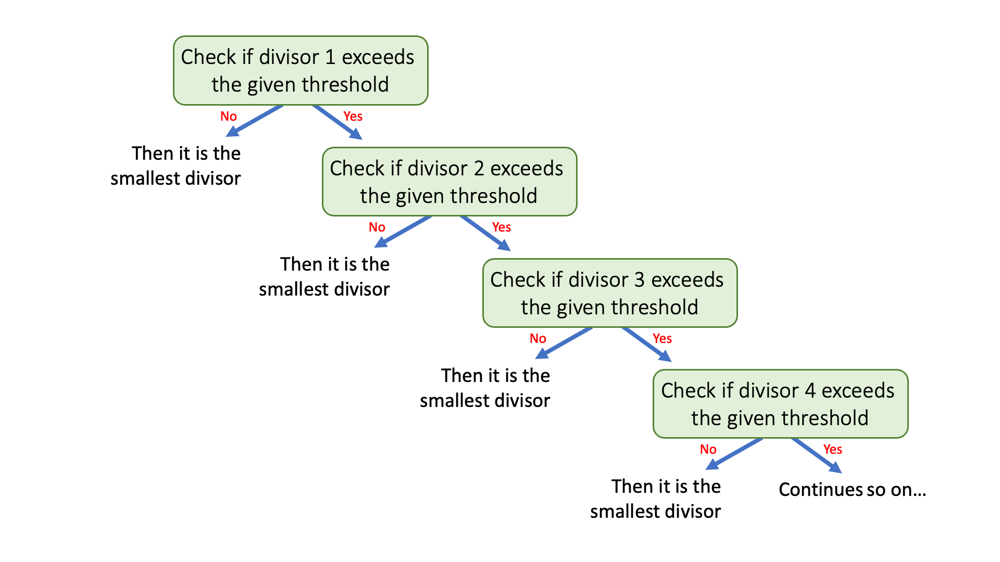
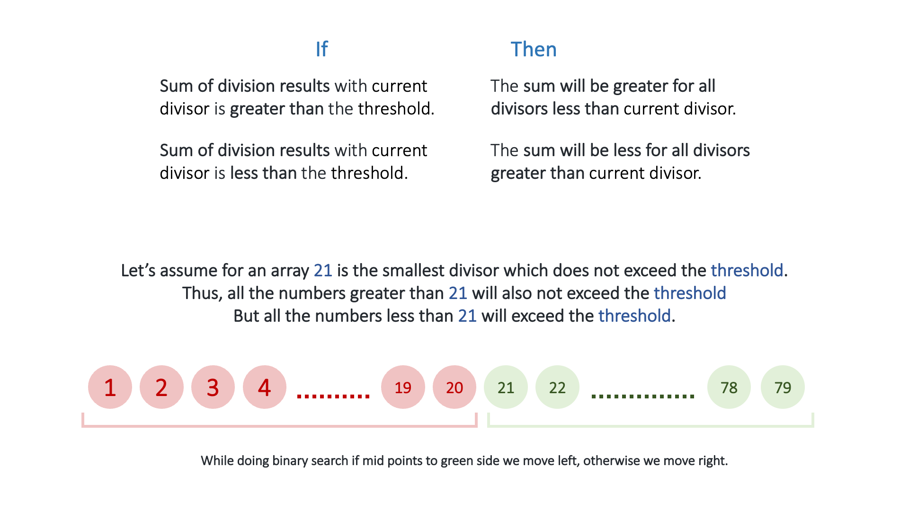

## Solution

---

### Overview

We are given an integer array `nums` and an integer `threshold`, we need to find the smallest possible `divisor`, which when divides all elements of the `nums` array, then the sum of all those divisions should not exceed `threshold`.

Each result of the division is rounded to the nearest integer greater than or equal to that element.
For example: $7/3 = 2.33 \approx \text{ (rounded to) } 3$

Let's first start from a naive approach and optimize it further.

---

### Approach 1: Linear Search

**Intuition**

We need to find the smallest possible `divisor`, thus we can start from the **smallest possible divisor** and check if after dividing all the `nums` array elements with this `divisor`, the division results sum does not exceed the `threshold`, if it doesn't exceed then this will be the smallest `divisor`, thus our answer. Otherwise, we increment `divisor` by `1` and do this step again.



We know the smallest possible divisor can be `1` but **what about the largest?**
The minimum value of `threshold` is equal to `nums` array size. If we divide all elements with the largest element of the `nums` array then the result for each division will be `1` and the sum of those divisions will become equal to the `nums` array size, which is the minimum possible value of `threshold`, thus the upper bound for the divisors is the maximum element of the `nums` array.

Now, you might notice that we will try out all possible divisors one by one, thus this approach is very slow and it is not expected to pass all test cases. But this approach will be the stepping stone to the optimized approach.

**Algorithm**

1. Store the maximum element of the `nums` array in `maxElement` variable.

2. Iterate on all `divisors` from `1` to `maxElement`:
- Initialize two variables, `sumOfDivisionResults` to `0`, to add the division result with each array element, and
    `thresholdExceeded` to `false`, to indicate if the threshold was exceeded or not.
- Iterate on all elements of the `nums` array, and add the division result rounded to the next greater integer in the `sumOfDivisionResults` variable and if the sum exceeds `threshold`, mark `thresholdExceeded` as `true` and stop iterating on `nums` array.
- Check if the `threshold` was exceeded or not, if not exceeded then the current `divisor` is the smallest divisor, thus return it.

3. If we never find any possible divisor, then return `-1`.

**Implementation**

> **Note:** We use $divisionResult = ceil((1.0 * number) / divisor)$ to get the required result. But there is a cool trick to round off the result of the division to the nearest integer greater than or equal to that element which avoids the floating numbers and the potential precision loss, using $divisionResult = (number + divisor - 1) / divisor$. You can use any of these methods in your implementation.

```python
class Solution:
    def smallestDivisor(self, nums: List[int], threshold: int) -> int:
        max_element = max(nums)

        # Iterate on all divisors.
        for divisor in range(1, max_element + 1):
            sum_of_division_results = 0
            threshold_exceeded = True

            # Divide all numbers of array and sum the result.
            for num in nums:
                sum_of_division_results += ceil((1.0 * num) / divisor)
                if sum_of_division_results > threshold:
                    threshold_exceeded = False
                    break

            # If threshold was not exceeded then return current divisor.
            if threshold_exceeded:
                return divisor

        return -1
```

**Complexity Analysis**

Here, $N$ is the number of elements, and $M$ is the maximum element of the `nums` array.

* Time complexity: $O(N \cdot M)$.
  - We iterate on all possible divisors, and for each divisor, we iterate on the whole `nums` array to find the division result sum, which takes $O(N)$ time.
  - Thus, for $M$ divisors, overall it takes $O(N \cdot M)$ time.

* Space complexity: $O(1)$.
  - We have only used some variables, thus we use constant space.

---

### Approach 2: Binary Search

**Intuition**

In the previous approach we were iterating on all possible divisors one by one, thus it was not efficient.
So now we will try to optimize it.

During division, $\text{ numerator / denominator }$, if we increase the $\text{ denominator }$, the result in decrease.

So, we can conclude two points:
1.  If the **sum of division results** with `current divisor` is **greater than** the `threshold`, then the **sum will be greater for all divisors less than** `current divisor` (because if we decrease the denominator the overall result will increase), thus it suggests us we have to only search in right of `current divisor` (i.e. numbers greater than `current divisor`).

2.  Similarly, if the **sum of division results** with `current divisor` is **less than** `threshold`, then the **sum will be less for all divisors greater than** `current divisor` (because if we increase the denominator the overall result will decrease).

Thus, these two points indicate that we can use **binary search** on the search space of all possible divisors from `1` to `maxElement`.



You can get a better idea of how binary search works here from the following slideshow:

!?!../Documents/1283/slideshow1.json:960,540!?!

<br />

**Algorithm**

1. Cerate a function `findDivisionSum(nums, divisor)` to return the division results sum.

2. Initialize variables:
- $ans = -1$, integer to store the lowest divisor which doesn't exceed `threshold`.
- $low = 1$, the lower bound of the search space of all possible divisors.
- $high = max element of nums$, the upper bound of the search space of all possible divisors.

3. Apply binary search on search space from `low` to `high`:
- Initialize `mid`, with the middle value of search space i.e. $(low + high) / 2$.
- Check if we use `mid` as the divisor, and if it does not exceed the `threshold`, then the answer can be `mid`.
    So, update `ans` with `mid`, but we can also have smaller possible divisors, thus update `high` to $mid - 1$ (discarding the elements to the right of `mid`).
- Otherwise, `mid` is too small, we need a bigger divisor, thus update `low` to $mid + 1$ (discard elements to the left of `mid`).

4. At the end, return `ans`.

**Implementation**

```python
class Solution:
    def smallestDivisor(self, nums: List[int], threshold: int) -> int:

        # Return the sum of division results with 'divisor'.
        def find_division_sum(divisor: int) -> int:
            result = 0
            for num in nums:
                result += ceil((1.0 * num) / divisor)
            return result

        ans = -1
        low = 1
        high = max(nums)

        # Iterate using binary search on all divisors.
        while low <= high:
            mid = (low + high) // 2
            result = find_division_sum(mid)
            # If current divisor does not exceed threshold,
            # then it can be our answer, but also try smaller divisors
            # thus change search space to left half.
            if result <= threshold:
                ans = mid
                high = mid - 1
            # Otherwise, we need a bigger divisor to reduce the result sum
            # thus change search space to right half.
            else:
                low = mid + 1

        return ans
```

**Complexity Analysis**

Here, $N$ is the number of elements, and $M$ is the maximum element of the `nums` array.

* Time complexity: $O(N \cdot \log M)$.
  - Every time we reduce the search space of possible divisors by half, $M \rightarrow M/2 \rightarrow M/4 \rightarrow .... \rightarrow 1$. There are $\log M$ levels, thus we iterate on only $\log M$ divisors.
  - And for each divisor, we iterate on the whole `nums` array to find the division result sum, which takes $O(N)$ time.
  - Thus, for $\log M$ divisors, overall it takes $O(N \cdot \log M)$ time.

* Space complexity: $O(1)$.
  - We have only used some variables, thus we use constant space.